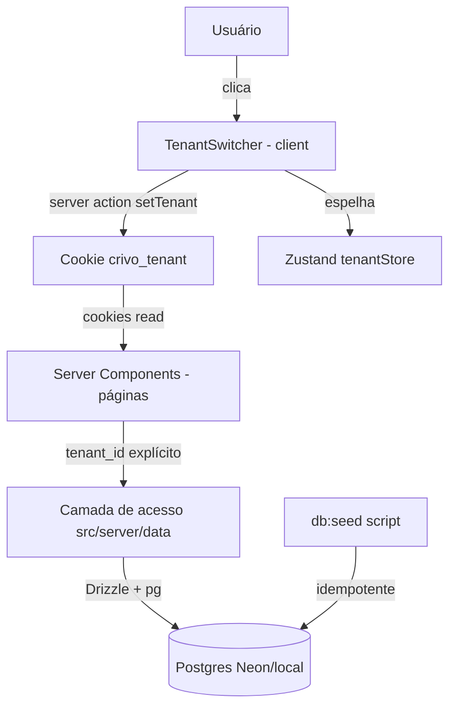

# Fase 1 — Fundação Técnica Design

**Spec**: `.specs/features/fase-1-fundacao/spec.md`
**Status**: Draft

---

## Architecture Overview

RSC-first (confirmado com o usuário): Server Components consultam a camada de acesso a dados diretamente no servidor via Drizzle; o tenant ativo vive num **cookie** (`crivo_tenant`) legível pelos Server Components; Zustand espelha o tenant no client apenas para UI (nome exibido, seletor). Troca de tenant = server action que grava o cookie + `router.refresh()`.

**Modelo de renderização**: Next 16.2.11 **sem** `cacheComponents` (config padrão) — rotas dinâmicas por request, sem exigência de `<Suspense>` em torno de `cookies()`. `fetch`/queries não são cacheados por padrão no Next 16, o que é o comportamento desejado (dado sempre fresco do banco).



---

## Code Reuse Analysis

### Existing Components to Leverage

| Component | Location | How to Use |
| --------- | -------- | ---------- |
| Layout raiz + globals.css | `app/layout.tsx`, `app/globals.css` | Estender: imports do tema Astryx entram no globals.css |
| Tailwind v4 já configurado | `postcss.config.mjs` | Manter — Astryx declara suporte a Tailwind |
| Astryx (`@astryxdesign/core`) | npm (a instalar) | Componentes de layout/navegação para o shell; catálogo verificado via `astryx component` no início do Execute |

### Integration Points

| System | Integration Method |
| ------ | ------------------ |
| Postgres (Neon ou local) | `DATABASE_URL` no `.env`; driver `pg` (node-postgres) — funciona idêntico em Neon (TCP+SSL) e localhost, permitindo o fallback local sem mudança de código |
| Vercel | Runtime Node.js padrão; `DATABASE_URL` como env var do projeto |

---

## Components

### Schema Drizzle (multi-tenant)

- **Purpose**: Definir todas as tabelas de negócio com `tenant_id` NOT NULL + enums de domínio.
- **Location**: `src/db/schema.ts`, `drizzle.config.ts`
- **Interfaces**: tabelas `tenants`, `brokers`, `leads`, `conversations`, `messages`, `documents`; enums pgEnum (`lead_status`, `modality`, `motivation`, `credit_status`, `property_type`, `sender`).
- **Dependencies**: `drizzle-orm`, `drizzle-kit`, `pg`.
- **Reuses**: n/a (greenfield).

### Cliente de banco

- **Purpose**: Instância única do Drizzle; falha explícita se `DATABASE_URL` ausente (edge case da spec).
- **Location**: `src/db/index.ts`
- **Interfaces**: `export const db` (Drizzle sobre Pool do `pg`).
- **Dependencies**: schema, `pg.Pool`.

### Seed idempotente

- **Purpose**: Popular 2 imobiliárias fictícias com corretores, ~20–30 leads/tenant nos 3 status (com invariantes da spec: qualificados com todos os campos + resumo; escalados com motivo), conversas com mensagens e documentos.
- **Location**: `src/db/seed.ts` (script `npm run db:seed` via `tsx`)
- **Interfaces**: CLI; idempotência por delete-and-insert transacional com IDs determinísticos (UUIDs fixos no código do seed).
- **Dependencies**: cliente de banco, `dotenv` (o script carrega o env por conta própria — necessário porque comandos shell não podem referenciar o arquivo de env, bloqueado por política).

### Camada de acesso a dados (DAL)

- **Purpose**: Único ponto de leitura de dados; toda função exige `tenant_id`; é a costura onde a Fase 9 troca mock→real.
- **Location**: `src/server/data/` (com `import 'server-only'` para impedir uso no client)
- **Interfaces** (retornos tipados pelo schema):
  - `getTenants(): Promise<Tenant[]>` — única função sem tenant_id (alimenta o switcher)
  - `getTenant(tenantId): Promise<Tenant | null>`
  - `getBrokers(tenantId)` / `getLeads(tenantId, { status? })` / `getLead(tenantId, leadId)`
  - `getConversations(tenantId)` / `getMessages(tenantId, conversationId)`
  - `getDocuments(tenantId)`
- **Dependencies**: cliente de banco.
- **Convenção**: nenhum import de `src/db` fora de `src/db/*` e `src/server/data/*` (verificável no review/Verifier).

### Contexto de tenant (cookie + server action)

- **Purpose**: Fonte de verdade do tenant ativo, legível no servidor e persistente entre reloads.
- **Location**: `src/server/tenant.ts`
- **Interfaces**:
  - `getActiveTenantId(): Promise<string>` — lê cookie `crivo_tenant`; default: primeiro tenant do seed
  - `setActiveTenant(tenantId)` — server action: valida tenant existente, grava cookie
- **Dependencies**: `next/headers` (`cookies()` — assíncrono no Next 16), DAL.

### Zustand tenantStore

- **Purpose**: Estado client do tenant ativo para a UI (nome no header, item selecionado no switcher). Cookie manda; store espelha via prop inicial do server.
- **Location**: `src/stores/tenant-store.ts`
- **Interfaces**: `useTenantStore` → `{ tenantId, tenantName, setTenant }`.
- **Dependencies**: `zustand`.

### App shell + rotas placeholder

- **Purpose**: Layout com sidebar Astryx (5 itens), header com TenantSwitcher, páginas placeholder por área exibindo nome da área + tenant ativo (dado real do banco).
- **Location**: `app/(crm)/layout.tsx`, `app/(crm)/{configuracoes,documentos,pipeline,chats,dashboard}/page.tsx`, `src/components/shell/`
- **Interfaces**: route group `(crm)`; `error.tsx` no grupo para falha de banco por área; `not-found` padrão do Next.
- **Dependencies**: Astryx, contexto de tenant, DAL.

### Teste de isolamento multi-tenant

- **Purpose**: Prova automatizada (FUND-06): para cada função da DAL, resultados do tenant A e do tenant B são disjuntos e completos vs. seed.
- **Location**: `src/server/data/__tests__/isolation.test.ts` (Vitest, `npm test`)
- **Dependencies**: banco seedado (o teste roda o seed antes ou assume seed executado; decisão na task).

---

## Data Models

```typescript
// enums
lead_status = 'em_qualificacao' | 'qualificado_agendado' | 'escalado_humano'
modality    = 'novo' | 'usado' | 'ambos'          // tenants.supported_modality e leads.modality ('ambos' = lead aberto aos dois)
property_type = 'casa' | 'apartamento'
motivation  = 'investidor' | 'morador'
credit_status = 'pre_aprovado' | 'recurso_proprio' | 'fgts'
sender      = 'agente' | 'lead'

interface Tenant   { id: uuid; name; agentName; supportedModality: modality; createdAt }
interface Broker   { id: uuid; tenantId; name; phone; email; createdAt }
interface Lead {
  id: uuid; tenantId; brokerId?: uuid
  name; phone
  status: lead_status
  // campos de qualificação (PRD §6.4) — nullable até qualificado
  modality?: modality; region?; budgetCents?: bigint; propertyType?: property_type
  purchaseHorizon?: string; motivation?: motivation; creditStatus?: credit_status
  chainedOperation?: boolean            // operação casada
  executiveSummary?: string             // obrigatório se qualificado_agendado (invariante de seed)
  escalationReason?: string             // obrigatório se escalado_humano (invariante de seed)
  meetingAt?: timestamp; meetingAttended?: boolean
  firstContactAt: timestamp; firstResponseAt?: timestamp   // base dos KPIs da Fase 5
  createdAt; updatedAt
}
interface Conversation { id: uuid; tenantId; leadId; createdAt }
interface Message      { id: uuid; tenantId; conversationId; sender: sender; content; sentAt }
interface Document     { id: uuid; tenantId; name; modality: modality; mimeType; sizeBytes; uploadedAt; expiresAt?: timestamp } // expiresAt = reserva TTL (LGPD, Fase 7)
```

**Relationships**: tudo N:1 para `tenants`; `messages` N:1 `conversations` N:1(1:1 no mock) `leads`; `leads` N:1 `brokers` (nullable). FKs com `tenant_id` redundante em `messages` para simplificar filtro de isolamento.

---

## Error Handling Strategy

| Error Scenario | Handling | User Impact |
| -------------- | -------- | ----------- |
| `DATABASE_URL` ausente | `src/db/index.ts` lança na inicialização com mensagem apontando `.env.example` | Erro claro no terminal/build, nunca erro críptico do driver |
| Banco indisponível em uma página | `error.tsx` no route group `(crm)` | Shell permanece; área afetada mostra erro amigável + retry |
| Cookie aponta tenant inexistente (seed recriado) | `getActiveTenantId` valida e cai no primeiro tenant | Troca silenciosa para tenant válido |
| Tenant sem dados | DAL retorna `[]`; placeholders mostram estado vazio | Estado vazio, nunca crash |
| Enum inválido no seed/escrita | Constraint pgEnum rejeita | Falha do seed com erro de constraint (comportamento da spec AC 1.6) |

---

## Risks & Concerns

| Concern | Location | Impact | Mitigation |
| ------- | -------- | ------ | ---------- |
| Astryx é lib nova/desconhecida — catálogo de componentes de navegação não verificado | dep npm | Shell pode não ter componente pronto de sidebar | Primeira ação do Execute: `npx astryx component` / `astryx template --list`; fallback: compor com primitivos de layout (VStack etc.) que as docs confirmam existir |
| APIs exatas de drizzle-kit/versões atuais não verificadas offline | `drizzle.config.ts` | Comando de push/migrate pode divergir | Verificar `drizzle-kit --help` pós-install na task de schema; docs oficiais se necessário |
| Política de bloqueio de `.env` impede comandos shell que mencionem o arquivo | `.claude/settings.json` | Scripts de seed/drizzle não podem receber env por CLI | Scripts carregam env internamente via `dotenv/config` (nenhum comando shell menciona o arquivo) |
| Next 16 tem breaking changes vs. conhecimento prévio (fetch sem cache, `cookies()` assíncrono, proxy em vez de middleware) | todo o app | Código escrito "de memória" pode quebrar | Docs locais (`node_modules/next/dist/docs`) consultadas nesta fase; páginas específicas re-consultadas por task quando tocarem API nova |

---

## Tech Decisions (only non-obvious ones)

| Decision | Choice | Rationale |
| -------- | ------ | --------- |
| Driver Postgres | `pg` (node-postgres) | Único driver que funciona idêntico em Neon (TCP+SSL) e Postgres local — troca de banco = troca de URL |
| Cache Components | NÃO habilitar na Fase 1 | Config padrão do Next 16 já rende tudo dinâmico por request — correto para CRM com dado fresco; habilitar traria exigências de Suspense sem benefício no mock |
| Fonte de verdade do tenant | Cookie `crivo_tenant` (não localStorage) | RSC precisa ler o tenant no servidor; localStorage é invisível ao servidor. Zustand espelha para UI. Satisfaz o AC de persistência da spec |
| Idempotência do seed | Delete-and-insert com UUIDs determinísticos | Estado canônico garantido, sem lógica de upsert complexa; IDs estáveis ajudam testes |
| Test runner | Vitest | Padrão de facto para Next+TS; necessário para o teste de isolamento (FUND-06) e para o gate da skill |
| Migrations | `drizzle-kit push` na Fase 1 (sem arquivos de migration) | Fase de fundação com schema volátil; migrations versionadas passam a valer quando houver dado real (Fase 7/9) |

---

## Estimativa de tasks (para o Tasks phase)

~7 tasks, 1 batch — execução inline, sem oferta de sub-agentes:
T1 deps+Astryx init → T2 schema+push → T3 seed → T4 DAL → T5 teste isolamento → T6 shell+rotas → T7 switcher+error states+build. Dependências lineares (T2←T1, T3←T2, T4←T2, T5←T3+T4, T6←T1+T4, T7←T6).
