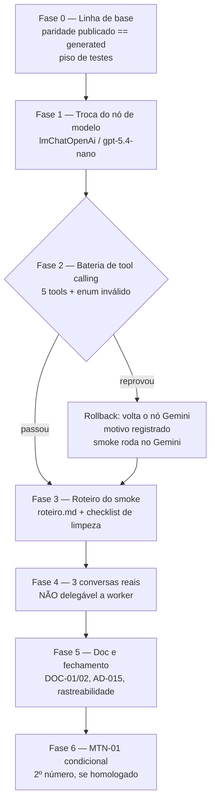

# Lote 10 — Modelo alvo e prova conversacional: Design

**Spec**: `.specs/features/lote-10-modelo-alvo-e-prova-conversacional/spec.md`
**Context**: `.specs/features/lote-10-modelo-alvo-e-prova-conversacional/context.md`
**Status**: Draft

---

## Pesquisa (Knowledge Verification Chain — feita antes de qualquer decisão)

Tudo abaixo foi confirmado contra a instância real e a conta OpenAI real do usuário, via MCP. Nada
foi inferido de memória.

| Pergunta | Resposta confirmada | Como |
| --- | --- | --- |
| O nó existe e em qual versão? | `@n8n/n8n-nodes-langchain.lmChatOpenAi` **v1.3** | `search_nodes` |
| `gpt-5-nano` existe na conta do usuário? | Sim: `gpt-5-nano`, `gpt-5-nano-2025-08-07`, e também `gpt-5.4-nano`, `gpt-5.4-nano-2026-03-17` | `explore_node_resources` (`searchModels`, credencial `bGnmNn5iFH4sBCoo`) |
| Como o modelo é declarado? | **Resource locator**, não string: `{ __rl: true, mode: "list"\|"id", value, cachedResultName? }` — diferente do nó Gemini, que usa `modelName` string | `get_node_types` |
| `temperature` é suportado? | O campo existe (`options.temperature`, default 0.7), mas `reasoningEffort` só aparece para `(^o1)\|(^o[3-9])\|(^gpt-5.*)` — sinal de que a família é de raciocínio | `get_node_types` |
| A Responses API é o caminho default? | Sim: `responsesApiEnabled` default `true` | `get_node_types` |
| Dá para apagar linha de Data Table por nó? | Sim: `n8n-nodes-base.dataTable` v1.1, `resource: "row"`, `operation: "deleteRows"` | `search_nodes` |
| Existe tool MCP para apagar linha de Data Table? | **Não.** O MCP só cria tabela/coluna e insere linhas — apagar linha exige um nó em workflow | inventário das ferramentas MCP disponíveis |
| A memória tem caminho de purga já pronto? | Sim: `memoryManager` com `mode: "delete", deleteMode: "all"` sobre `memoryPostgresChat` com `sessionKey = "<tenantSlug>:<waId>"` | `n8n/workflows/principal.ts:672-679, 723-728, 1507-1512` |
| Apagar um lead cascateia? | **Não.** `conversations.leadId` e `messages.conversationId` são FK sem `onDelete` — a ordem de remoção é manual | `src/db/schema.ts:206-232` |
| A divergência fonte × instância do roadmap ainda existe? | Não — `principal.ts:1269` já declara `models/gemini-3.5-flash-lite`, alinhado no lote-8 T30 | leitura do código |

**Decisão de modelo (usuário, 2026-09-05)**: `gpt-5.4-nano-2026-03-17` — geração atual em vez do
`gpt-5-nano` de agosto/2025 que o roadmap nomeava, e **snapshot datado em vez do alias flutuante**,
pela mesma razão que o comentário do nó Gemini já registra: alias que muda debaixo do workflow
destrói a reprodutibilidade da prova conversacional.

---

## Architecture Overview

O lote é uma **sequência de portões**, não um conjunto de mudanças paralelas. Cada fase só existe
porque a anterior passou, e duas delas podem abortar o resto:



**A propriedade que o desenho protege**: o smoke tem que rodar **depois** da troca e **depois** de o
tool calling estar provado, porque ele é a evidência de qualidade do modelo que vai ao piloto. Uma
bateria reprovada não cancela o lote — ela reverte o modelo e o smoke roda mesmo assim, no Gemini,
com o motivo escrito. O lote nunca termina sem prova conversacional.

### O achado que redesenha o smoke

`n8n/src/gate.mjs:67-72` é terminal em dois estados:

```js
if (optedOutAt) return "somente-registrar";
if (detectOptOut(text)) return "opt-out";
if (status === "escalado_humano") return "somente-registrar";
```

Como `externalId` do lead é o `waId` e `POST /leads` é idempotente, **um número de teste = um lead
por tenant**. Rodar "escalar" trava o lead; o cenário de opt-out seguinte nunca alcança o agente.
Por isso o smoke não é só um roteiro: ele exige uma **limpeza em duas pontas** (CRM e
n8n) entre um cenário e o próximo. Sem isso, dois dos três cenários da AD-015 são impossíveis de
executar em sequência — motivo pelo qual nunca rodaram.

---

## Code Reuse Analysis

### Componentes existentes a aproveitar

| Componente | Location | Como usar |
| --- | --- | --- |
| Nó de modelo isolado | `n8n/workflows/principal.ts:1250-1271` | Substituir **só** este bloco. O comentário já declara "trocar de modelo é trocar este 1 nó" — o desenho anterior previu exatamente isto |
| Purga de memória por sessão | `n8n/workflows/principal.ts:1507-1512` + `:672-679` (`memoryPostgresChat`, `sessionKey`) | Fonte da chave `"<tenantSlug>:<waId>"` que o checklist de limpeza precisa nomear |
| Reset das colunas de sessão | `n8n/workflows/principal.ts:735-770` (upsert que zera `perguntadosJson`/`aberturasJson`) | Referência do filtro `tenantSlug`+`waId` usado no checklist |
| Resource locator literal | `principal.ts:211, 1172` (`{ __rl: true, mode: "id", value }`) | Precedente para escrever o `model` do nó OpenAI, que também é RLC |
| Pipeline de publicação | `scripts/n8n-inline.mjs` + `n8n/generated/` | Inalterado. Toda edição passa por ele (AD-014) |
| Fixtures de saída de LLM | `n8n/fixtures/llm-invalid-enum.json` e vizinhas | Base da bateria de tool calling — o caso de enum inválido já tem fixture |
| Guard de banco em teste | `src/db/index.ts:9-11` (`process.env.VITEST` → `TEST_DATABASE_URL`) | É o fato que torna a dívida do `README` §4 obsoleta (DOC-02) |
| Formato de registro de evidência real | `n8n/README.md` §§10-12 | O registro do smoke segue esse padrão: o que foi provado, o que não foi, com id de execução |

### Integration Points

| Sistema | Integração |
| --- | --- |
| OpenAI | Credencial `OpenAI account` (`openAiApi`, `bGnmNn5iFH4sBCoo`), já criada pelo usuário. Nenhum segredo entra no repositório |
| Instância n8n | Publicação via MCP a partir de `n8n/generated/`; execução da bateria via `execute_workflow`/`test_workflow` |
| CRM (Postgres) | Só leitura pelo agente e pelas telas. A limpeza entre cenários é manual, fora do código deste lote |
| WhatsApp Cloud API | Só na Fase 4, por conversa humana real — nenhuma automação envia mensagem em nome do lead |

---

## Components

### 1. Nó de modelo (substituição)

- **Purpose**: fazer o AI Agent falar por `gpt-5.4-nano-2026-03-17` em vez de Gemini.
- **Location**: `n8n/workflows/principal.ts` (bloco `agentModel`, hoje linhas 1250-1271).
- **Forma**:
  ```ts
  const agentModel = languageModel({
    type: "@n8n/n8n-nodes-langchain.lmChatOpenAi",
    version: 1.3,
    config: {
      name: "OpenAI Chat Model",
      position: [7560, 1500],
      parameters: {
        model: { __rl: true, mode: "list", value: "gpt-5.4-nano-2026-03-17",
                 cachedResultName: "gpt-5.4-nano-2026-03-17" },
        options: { reasoningEffort: "low", timeout: 120000 },
      },
      credentials: { openAiApi: newCredential("OpenAI account") },
    },
  });
  ```
- **Dependencies**: credencial `OpenAI account`; nada mais.
- **Reuses**: a própria posição e o nome de subnode do nó anterior, para que o diff no workflow
  publicado seja de um nó só.
- **Invariante**: `subnodes.model` do `aiAgent` é a única referência; tools, memória e gate não são
  tocados (MOD-01 AC2).

**Parâmetros deliberadamente ausentes** — `temperature` (o nó Gemini usa `0.4`) fica **de fora**:
família GPT-5 é de raciocínio e a Responses API, default deste nó, não aceita temperatura arbitrária.
Herdar o `0.4` é inventar campo. `reasoningEffort: "low"` ocupa o lugar — latência conta numa
conversa de WhatsApp. `timeout: 120000` sobe do default de 60s porque um modelo de raciocínio com 5
tools e `maxIterations: 8` estourando o timeout produziria exatamente o silêncio que DOC-01 aceita —
e o smoke não pode confundir timeout com comportamento.

### 2. Bateria de tool calling

- **Purpose**: provar, antes do smoke, que o modelo novo chama as 5 tools e sobrevive a uma recusa
  do CRM. É o gate do rollback (MOD-02 AC5).
- **Location**: `n8n/smoke/bateria.md` (procedimento + resultados) — a execução em si é via MCP.
- **Alvo**: lead de descarte, `waId` fictício, tenant `triangulo`. Nunca o número do smoke.
- **Cobertura exigida**: `registrar_qualificacao`, `escalar_para_humano`, `consultar_documentos`,
  `responder_lead`, `agendar_reuniao` — uma chamada bem-sucedida cada, com id de execução anotado;
  mais o caso de enum inválido (`400 payload-invalido`) com o agente prosseguindo.
- **Nota de ordem**: `escalar_para_humano` trava o lead de descarte. As tools são exercitadas em
  ordem, com `escalar_para_humano` por último, ou o lead de descarte é resetado no meio — a mesma
  restrição do smoke, pelo mesmo motivo.
- **Reuses**: `n8n/fixtures/*.json`; `execute_workflow`/`test_workflow` via MCP, padrão já usado nos
  lotes 6c e 7.

### 3. Checklist de limpeza entre cenários (manual, do usuário)

**Decisão do usuário (2026-09-05)**: a limpeza é feita à mão por ele. O lote **não** entrega
`src/db/smoke-reset.ts` nem `n8n/workflows/smoke-reset.ts` — nem script no CRM, nem workflow de
reset. O que o lote entrega é o **checklist que nomeia os alvos**, dentro de `n8n/smoke/roteiro.md`.

Por que o checklist continua sendo requisito e não uma cortesia: os três alvos vivem em dois sistemas
e nenhum deles avisa quando é esquecido. Esquecer a memória faz o agente do cenário seguinte lembrar
de uma conversa que "nunca aconteceu"; esquecer a linha de `conversa_estado` faz uma sessão nova
herdar "já perguntei tudo" e pular para `agendando` com um lead frio (mesmo modo de falha que o
`design.md` do lote-6c já documentava para a purga parcial); esquecer o lead faz o `POST /leads`
idempotente devolver o lead velho, com o estado terminal intacto. Nos três casos o cenário roda e
produz um resultado que parece válido.

**Os três alvos, com o que cada um exige:**

| # | Alvo | Onde | Nota que o checklist precisa carregar |
| --- | --- | --- | --- |
| 1 | Sessão da memória | `n8n_chat_histories`, Postgres da instância n8n | Chave da sessão é `"<tenantSlug>:<waId>"` (`principal.ts:679`) |
| 2 | Linha de estado | Data Table `conversa_estado` (`ZsplBxJjXv3kwKZ8`) | Casada por `tenantSlug` + `waId`; o MCP não apaga linha, então é pela UI da Data Table |
| 3 | Lead e conversa | Postgres do CRM | Ordem obrigatória `messages` → `conversations` → `leads`: as FKs não têm `onDelete` (`schema.ts:206-232`), e a ordem inversa falha por integridade |

**Ordem entre sistemas**: n8n (1 e 2) antes do CRM (3). Na ordem inversa, uma mensagem que chegue no
intervalo recria o lead com o estado velho ainda apontando para ele.

**Confirmação**: o cenário seguinte não começa antes de os três estarem confirmados limpos — é o que
o Edge Case da spec exige, e o roteiro traz a linha de confirmação para marcar.

### 4. `n8n/smoke/roteiro.md`

- **Purpose**: descrever os três cenários de forma reexecutável.
- **Estrutura por cenário**: objetivo, tenant e número, turnos esperados do lead (intenção, não fala
  literal — o agente não é determinístico), **estado final exigido** no CRM, evidência a coletar, e o
  limpeza que fecha o cenário.
- **Cenário 1 — qualificar→agendar**: lead com interesse, responde as 3 obrigatórias, aceita horário
  → `status = reuniao_agendada` + evento com Meet no Calendar.
- **Cenário 2 — escalar**: lead pede algo que só humano resolve → `status = escalado_humano` com
  responsável atribuído (rede de segurança da AD-022); a mensagem seguinte é registrada **sem
  resposta**, provando a trava.
- **Cenário 3 — opt-out**: lead escreve a palavra-chave exata → `optedOutAt` preenchido, memória
  purgada, silêncio depois disso.
- **Barra**: estado final. Estilo entra numa seção de observações, nunca reprova (SMK-06).

### 5. Reconciliação documental

- `.specs/features/lote-6c-agente-ai-agent-memoria-tools/spec.md` — VOZ-03 AC4 e Edge Cases passam a
  declarar o silêncio como comportamento aceito.
- `.specs/features/lote-6c-agente-ai-agent-memoria-tools/validation.md` — Finding 1 marcado como
  resolvido por reconciliação documental, sem apagar o texto original.
- `n8n/README.md` §4 — registra que o guard `src/db/index.ts:9-11` já neutraliza a rotação por
  `vitest run`, preservando o histórico do incidente.

---

## Data Models

Nenhum modelo novo, nenhuma coluna, nenhuma migração. A única estrutura que o lote precisa
documentar é a cadeia que a limpeza manual percorre:

```
leads (tenant_id, external_id)
  └── conversations (lead_id)
        └── messages (conversation_id)
```

Nenhuma das duas FKs tem `onDelete` (`schema.ts:206-232`) — daí a ordem obrigatória de remoção, que
o checklist carrega.

---

## Error Handling Strategy

| Cenário de erro | Tratamento | Impacto |
| --- | --- | --- |
| Credencial OpenAI inválida ou sem quota na bateria | Aborta antes de publicar a troca; nada é revertido porque nada foi publicado | Lote para com estado consistente |
| Bateria reprova (tool não chamada, ou agente trava no enum inválido) | Rollback do nó para `models/gemini-3.5-flash-lite`, motivo registrado, smoke segue no Gemini | Lote fecha com prova conversacional e modelo antigo |
| Linha de `conversa_estado` já ausente na limpeza | Não é erro — o cenário anterior pode não ter criado estado | Nenhum |
| Limpeza parcial (n8n purgado, CRM não, ou vice-versa) | Cenário seguinte **não começa**; o usuário completa o alvo que faltou | Bloqueia até consistência |
| Agente estoura `maxIterations` num cenário | Turno em silêncio (comportamento aceito, DOC-01). Só reprova o cenário se o estado final não for atingido | Registrado como observação |
| Timeout do modelo | Coberto por `timeout: 120000`; se ainda assim estourar, é registrado como falha de infraestrutura, não como reprovação de conversa | Distinção explícita no registro |
| 2º número não homologado a tempo | MTN-01 vira pendência nomeada; AGT-04/05 e LGPD-03 fecham mesmo assim | Nenhum bloqueio |

---

## Risks & Concerns

| Concern | Location | Impact | Mitigation |
| --- | --- | --- | --- |
| **Responses API + tool calling do AI Agent não é caminho exercitado neste projeto.** `responsesApiEnabled` default `true` muda o protocolo em relação ao Chat Completions que o nó Gemini usava | `@n8n/n8n-nodes-langchain.lmChatOpenAi` v1.3 | Tool calling pode se comportar diferente do esperado — exatamente o risco que o roadmap nomeia | É o que a bateria da Fase 2 existe para descobrir, antes de qualquer conversa real. Se falhar, o rollback é 1 nó |
| **`vitest run` rotaciona as chaves do seed como efeito colateral** | `src/db/__tests__/seed.test.ts` (`runSeed()` em `beforeAll`) | Uma rodada de teste no meio do smoke invalida a autenticação do agente e o cenário morre com `401` sem relação com o modelo | Ordem fixa: todo gate de teste roda **antes** da Fase 4; nenhum `vitest run` entre o início do primeiro cenário e o fim do terceiro. Registrado como pré-condição da fase, não como recomendação |
| **A limpeza é manual e nada verifica se foi completa** | Checklist em `n8n/smoke/roteiro.md` | Um alvo esquecido produz um cenário que roda e parece válido — memória herdada, `perguntadosJson` cheio, ou lead com estado terminal | O checklist nomeia os três alvos e a chave de cada um; o roteiro exige confirmação explícita antes do cenário seguinte. Mitigação documental, não automática — limite conhecido e aceito (decisão do usuário) |
| **`n8n_chat_histories` divide Postgres com as tabelas operacionais do n8n** | `n8n/README.md` §2.4 | Uma limpeza manual por SQL ampla demais atingiria execuções, credenciais ou workflows da própria instância | O checklist dá a chave exata da sessão (`"<tenantSlug>:<waId>"`) e restringe o alvo à tabela `n8n_chat_histories` |
| **Fase 4 não é delegável a sub-agente** | — | Um worker não pode conversar pelo WhatsApp nem tirar screenshot do CRM do usuário | A fase é conduzida pelo orquestrador com o usuário presente, e o `tasks.md` a marca explicitamente. O batching de workers para no fim da Fase 3 |
| **`escalar_para_humano` trava o lead de descarte no meio da bateria** | Fase 2 | A bateria poderia não exercitar as 5 tools numa sequência só | Ordem definida: `escalar_para_humano` por último. Se ainda assim faltar tool, o lead de descarte é limpo à mão pelo mesmo checklist e a bateria continua |
| **`cachedResultName` do resource locator pode divergir do `value`** | Nó de modelo | Um `cachedResultName` errado confunde a leitura na UI sem quebrar execução — divergência silenciosa entre o que se lê e o que roda | Os dois campos recebem literalmente a mesma string; conferido na reconciliação publicado ↔ `generated/` |
| **Modelo pinado envelhece** | `principal.ts` | `gpt-5.4-nano-2026-03-17` vira legado em algum momento, sem aviso | Aceito conscientemente: reprodutibilidade da prova vale mais que frescor automático. A troca é 1 nó e a bateria é reexecutável |
| **Cobertura de teste do miolo do agente é estrutural, não conversacional** | `n8n/src/__tests__/` | Nenhum teste unitário pega uma regressão de tool calling | Herdado da AD-018, que encolheu essa cobertura de propósito. Este lote não a restaura — a bateria e o smoke são a compensação |
| **Sem a automação da limpeza, o lote não adiciona nenhum teste automatizado novo** | — | O piso de testes fica exatamente onde está (1015 em 81 arquivos) e o sensor de discriminação do Verifier tem pouca superfície de código nova para mutar | Consequência direta e aceita da decisão do usuário. A evidência deste lote é execução real (bateria + 3 cenários), não cobertura — o Verifier precisa saber disso para não ler piso plano como regressão |

---

## Tech Decisions

| Decisão | Escolha | Rationale |
| --- | --- | --- |
| Modelo | `gpt-5.4-nano-2026-03-17` (snapshot datado) | Geração atual, variante nano; snapshot em vez de alias preserva a reprodutibilidade da prova |
| `temperature` | Ausente | Família de raciocínio na Responses API não aceita temperatura arbitrária; herdar `0.4` do Gemini seria campo inventado |
| `reasoningEffort` | `low` | Latência de conversa de WhatsApp pesa mais que profundidade de raciocínio numa qualificação |
| `timeout` | `120000` (2× o default) | Impede que timeout se disfarce do silêncio aceito por DOC-01 durante o smoke |
| Limpeza entre cenários | Manual, feita pelo usuário; o lote entrega só o checklist | Decisão do usuário (2026-09-05). Tira código de manutenção do escopo em troca de um limite documental conhecido |
| Ordem da limpeza | n8n antes do CRM | Evita que uma mensagem no intervalo recrie o lead com estado velho apontando para ele |
| Limpeza do lado CRM | Deleção do lead, não atualização de status | Deleção dá cold start de verdade, incluindo o caminho idempotente de `POST /leads` — que é parte do que o cenário prova |

### Decisões de projeto propostas (a escrever em `STATE.md` **no fechamento**, não agora)

Duas convenções deste lote sobrevivem a ele e merecem AD própria. Elas são escritas **no fim do
Execute**, refletindo o que de fato aconteceu — porque a AD-026 depende do resultado da bateria: se o
rollback disparar, o modelo alvo registrado é outro, e uma AD escrita hoje estaria mentindo.

- **AD-026 — modelo alvo do agente**: OpenAI `gpt-5.4-nano-2026-03-17` pinado, `reasoningEffort` no
  lugar de `temperature`, troca confinada a um nó, alias flutuante proibido.
- **AD-027 — protocolo de prova conversacional**: roteiro versionado, checklist de limpeza dos três
  alvos entre cenários, barra de aprovação por desfecho. **Encerra a AD-015**, cujo `status` passa a
  `superseded by AD-027`.
