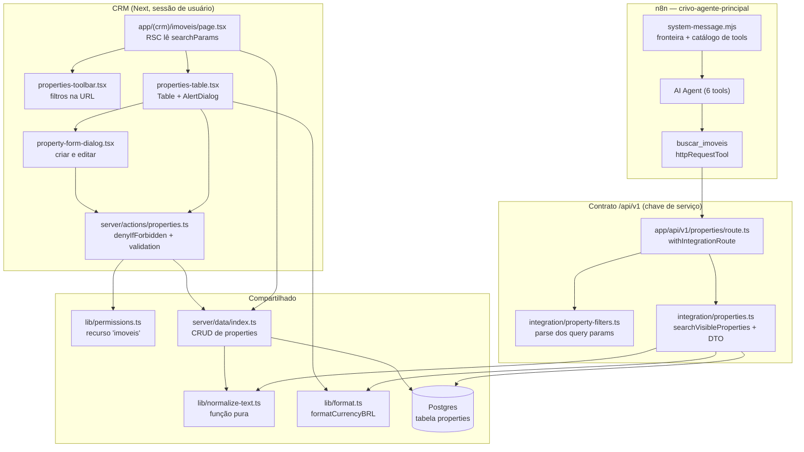

# Catálogo de imóveis — Design

**Spec**: `.specs/features/lote-11-catalogo-de-imoveis/spec.md`
**Context**: `.specs/features/lote-11-catalogo-de-imoveis/context.md`
**Status**: Approved

---

## Conformidade com as decisões ativas

Lidas as 28 entradas de `.specs/STATE.md § Decisions`. Este design **conforma** com todas as
`active`; **nenhuma é superseded**. As que efetivamente constrangem:

| Decisão | Como este design conforma |
| --- | --- |
| AD-002 (multi-tenant por `tenant_id`) | `properties.tenant_id` NOT NULL desde o schema; toda função da DAL recebe `tenantId` como primeiro parâmetro; o índice único da referência é composto com `tenant_id`. |
| AD-004 (mudança aditiva) | Nenhuma coluna existente muda. `propertyTypeEnum` não é tocada. As fotos nascem como URL, e o storage do L12 será aditivo. |
| AD-007 / AD-021 (DAL + `verifySession`) | Nenhuma leitura de imóvel fora da DAL; a permissão é resolvida por `requirePermission`/`denyIfForbidden`, nunca no componente. |
| AD-013 (`problem+json` RFC 9457) | A rota nova responde `problem()` com `code` estável; nenhum código novo é criado — `payload-invalido` cobre todo filtro inválido. |
| AD-018 (quem detém a regra decide) | `tenantSlug` da tool vem de expressão do fluxo. O modelo escolhe **critério de busca**, nunca identidade — mesma fronteira que `registrar_qualificacao` já publica. |
| AD-023 (recusa instrumentada) | A rota usa `withIntegrationRoute`; o teste de varredura `route-instrumentation.test.ts` já falha se o export não estiver marcado. |
| AD-025 (vitrine é projeto separado) | Este lote produz o par `disponivel` + `publicado` que a vitrine vai ler, e **nada mais**: nenhum `revalidateTag`, nenhuma rota pública, nenhum `GRANT`. |
| AD-026 (modelo confinado a um nó) | O nó `agentModel` não é tocado. A tool nova entra como subnode `tools` do AI Agent. |
| AD-027 (prova conversacional) | Cenário novo em `n8n/smoke/roteiro.md`, com checklist de limpeza e barra por desfecho, mais a regressão do cenário de agendamento. |
| AD-028 (revisão de lições no fechamento) | A T29 carrega o passo obrigatório de revisar as candidatas destiladas neste lote e apresentar ao usuário quais promover. Nenhuma lição é apagada sem confirmação humana. |

**Lições confirmadas: 22** (`lessons.py list --status confirmed`). Estavam todas `candidate` quando
este design foi escrito; a auditoria de 2026-09-10 promoveu 22 por revisão manual (AD-028), o que
**converte em autoridade** o que aqui já constava como raciocínio. As que efetivamente moldaram este
design, e que o Execute deve tratar como vinculantes:

| Lição | Onde ela decide algo neste lote |
| --- | --- |
| `L-005` campo ausente ≠ campo vazio | `IMOV-07 AC5`, e o `Done when` da T8 |
| `L-015` grepar todo consumidor antes de mexer em campo compartilhado | Decidiu a enum própria do catálogo em vez de ampliar `propertyTypeEnum` |
| `L-019` usar o identificador já gravado, nunca um suposto | `priceCents` como `bigint` em centavos, espelhando `leads.budgetCents` |
| `L-020` módulo irmão em vez de enfraquecer asserção existente | `property-filters.ts` ao lado de `parsers.ts`, não dentro dele |
| `L-021` action sem consumidor de produção não é feature entregue | Decidiu incluir a tool no mesmo lote que o CRUD |
| `L-012` asserção dedicada por subcláusula, citando o texto exato | T12: uma asserção por campo proibido, separadamente |
| `L-023` assertar na fronteira, não só ao redor dela | T12: fronteiras 3 e 4 do limite de resultados |
| `L-001` / `L-002` prova de "não tocado" e de escrita parcial | T21 (grep no diff do `gate.mjs`), T6 (colisão forçada) |
| `L-006` planejar o dado de seed junto com a AC | T10: as 4 combinações status × publicação |
| `L-003` / `L-004` lógica de apresentação e verificação manual | `formatCurrencyBRL` reusado em vez de formatação inline; T20 como artefato |
| `L-009` / `L-010` screenshot é o gate; lib de terceiro pode emitir string própria | T15–T20, e a adoção de `Table`/`Selector`/`Dialog` da Astryx |
| `L-011` conferir id de execução antes de citar | `Done when` de T26 e T27 |
| `L-013` degrade-to-silence substitui degrade-to-message sem avisar | O risco de `maxIterations` nomeado em Risks & Concerns |
| `L-016` registrar evidência antes de descartar o artefato de scratch | T24, e o scratch do sensor de discriminação |

As 3 não promovidas (`L-007`, `L-017`, `L-022`) seguem `candidate` e **não** são carregadas.

---

## Exploração de abordagens

As três entregam exatamente o mesmo escopo. **Recomendada: A.**

### A — Rota `/api/v1` + `httpRequestTool` (recomendada)

Espelha `consultar_documentos` (`n8n/workflows/principal.ts:1149-1180`): uma rota `GET` fina sob
`withIntegrationRoute`, e um nó `n8n-nodes-base.httpRequestTool` com os filtros como
`queryParameters`.

**A favor**: é o padrão que o produto já tem publicado e testado; a autenticação, o `problem+json`,
a instrumentação de recusa e a disciplina de tenant vêm de graça; a lógica de busca fica em
TypeScript testável no vitest, não em JavaScript dentro de um Code node.
**Contra**: um `$fromAI` por filtro deixa a definição do nó verbosa.

### B — Sub-workflow exposto como `toolWorkflow`

Como `agendar_reuniao` (`principal.ts:1229`).

**Rejeitada**: `toolWorkflow` existe para **compor múltiplos efeitos** (o agendamento fala com o
Google Calendar e com o CRM na mesma chamada). Uma busca é leitura pura de uma fonte — o
sub-workflow só acrescentaria um workflow a publicar, versionar e conferir hash, sem compor nada.

### C — Estender `GET /api/v1/context` com uma seção de imóveis

**Rejeitada por dois motivos independentes.** `consultar_documentos` **não tem nenhum parâmetro
`fromAI`** por decisão de desenho — o `modality` vem do lead já conhecido pelo fluxo. Uma busca
filtrada por critério que o lead acabou de falar não cabe nessa forma sem quebrar a própria
disciplina do nó. E devolver inventário junto com contexto empurraria o catálogo inteiro para dentro
de toda chamada de contexto, inflando a janela do turno.

---

## Architecture Overview



**A fronteira que define o lote**: `SEARCH` monta um DTO que **não tem** logradouro, número,
complemento, descrição, foto nem captador. Não é o prompt que impede o agente de dizer o endereço —
o campo não existe na resposta. É a AD-018 aplicada à forma do payload, e é a leitura direta do
achado do lote-10 (`evidencia.md` §15.4): quando a resposta errada é o campo mais visível, instrução
de prompt não vence.

---

## Code Reuse Analysis

### Componentes existentes a aproveitar

| Componente | Localização | Como usar |
| --- | --- | --- |
| `withIntegrationRoute` | `src/server/integration/route.ts:104` | Envolve o `GET` novo. Traz autenticação, resolução de tenant e registro de recusa (AD-023) sem uma linha nova. |
| `problem` / `methodNotAllowed` | `src/server/integration/problem.ts` | Recusa de filtro inválido e os 4 verbos não suportados. Nenhum `ProblemCode` novo. |
| `denyIfForbidden` | `src/server/actions/permission.ts:29` | Curto-circuito de permissão em toda action nova, no formato `{ ok: false, error }`. |
| `can` / `RESOURCES` / matriz | `src/lib/permissions.ts:16,45` | Recebe `"imoveis"`. A navegação e o servidor consomem a mesma função pura. |
| `ValidationResult` e as `validate*` | `src/server/validation.ts` | Padrão de retorno das validações novas; `validateModality` e `validateName` são reusados direto. |
| `formatCurrencyBRL` | `src/lib/format.ts:12` | Formata centavos em "R$ 450.000,00" — tanto na tabela do CRM quanto no DTO da rota. |
| Página de Documentos | `app/(crm)/documentos/page.tsx` | Molde do RSC: lê `searchParams`, consulta duas vezes (tudo × filtrado) para distinguir os dois vazios. |
| `DocumentsTable` / `DocumentsToolbar` | `src/components/documents/` | Molde de `Table` + `pixel`/`proportional`, `DropdownMenu` de linha, `AlertDialog` de exclusão, e filtro escrito na URL com debounce de 300 ms. |
| `consultarDocumentosTool` | `n8n/workflows/principal.ts:1153` | Molde do nó: `X-Crivo-Tenant` por expressão, `httpHeaderAuth`, `neverError`, `retryOnFail`. |
| `modalityEnum` | `src/db/schema.ts:22` | Reusado como está para a modalidade do imóvel. |
| Índice único parcial de `leads` | `src/db/schema.ts` (`leads_assigned_user_id_meeting_at_idx`) | Molde da disciplina "a trava é do banco, não da aplicação". |

### Pontos de integração

| Sistema | Método de integração |
| --- | --- |
| Contrato `/api/v1` | Rota nova sob o mesmo wrapper, mesma credencial de serviço, mesmo `X-Crivo-Tenant`. Nenhuma mudança nas 7 rotas existentes. |
| `crivo-agente-principal` | Uma tool a mais no array `subnodes.tools` do nó `AI Agent` (`principal.ts:1333`). Nenhum outro nó muda. |
| `n8n/src/system-message.mjs` | Duas edições cirúrgicas: a fronteira de capacidade e o catálogo de tools. |
| Schema | Tabela nova + 2 enums novas. Nenhuma tabela existente alterada. |
| Seed | Bloco novo ao final, depois de tenants e usuários existirem. |

---

## Data Models

### Enums novas

```typescript
export const propertyKindEnum = pgEnum("property_kind", [
  "casa", "apartamento", "sobrado", "cobertura",
  "terreno", "sala_comercial", "chacara",
]);

export const propertyStatusEnum = pgEnum("property_status", [
  "disponivel", "reservado", "vendido",
]);
```

`propertyKindEnum` é **superset** de `propertyTypeEnum` nos dois valores compartilhados
(`casa`, `apartamento`), o que faz o filtro vindo de um lead mapear 1:1 sem tabela de tradução.
`propertyTypeEnum` fica intocada — ela é campo obrigatório de qualificação (`n8n/src/phase.mjs:12`)
e seu rótulo está publicado dentro do workflow.

### Tabela `properties`

```typescript
export const properties = pgTable(
  "properties",
  {
    id: uuid("id").primaryKey().defaultRandom(),
    tenantId: uuid("tenant_id").notNull().references(() => tenants.id),
    // Captador (IMOV-02). NOT NULL: todo imóvel nasce com dono da captação.
    // `restrict` implícito — a FK impede excluir usuário que ainda capta.
    capturedByUserId: uuid("captured_by_user_id").notNull().references(() => users.id),

    // Referência legível (IMOV-03). `sequence` é o número por imobiliária;
    // `reference` é o rótulo derivado ("AP-0142"). Os dois são gravados
    // juntos e nunca mudam depois.
    sequence: integer("sequence").notNull(),
    reference: text("reference").notNull(),

    kind: propertyKindEnum("kind").notNull(),
    modality: modalityEnum("modality").notNull(),
    status: propertyStatusEnum("status").notNull().default("disponivel"),
    published: boolean("published").notNull().default(false),

    street: text("street"),            // só o CRM lê
    number: text("number"),            // só o CRM lê
    complement: text("complement"),    // só o CRM lê
    neighborhood: text("neighborhood").notNull(),
    neighborhoodNormalized: text("neighborhood_normalized").notNull(),
    city: text("city").notNull(),
    cityNormalized: text("city_normalized").notNull(),
    state: text("state").notNull(),    // UF, 2 chars por convenção (como tenants.state)

    priceCents: bigint("price_cents", { mode: "bigint" }).notNull(),
    areaSqm: integer("area_sqm").notNull(),
    bedrooms: integer("bedrooms").notNull(),
    bathrooms: integer("bathrooms").notNull(),
    parkingSpots: integer("parking_spots").notNull(),

    description: text("description"),
    photoUrls: text("photo_urls").array(),  // URLs externas; nenhum byte (IMOV-06)

    createdAt: timestamp("created_at", { withTimezone: true }).notNull().defaultNow(),
    updatedAt: timestamp("updated_at", { withTimezone: true }).notNull().defaultNow(),
  },
  (table) => [
    // IMOV-03 AC7: a trava da referência é do BANCO. Duas criações
    // concorrentes leem o mesmo `max(sequence)` e escolhem o mesmo número;
    // só o índice garante que exatamente uma confirma.
    uniqueIndex("properties_tenant_id_sequence_idx").on(table.tenantId, table.sequence),
    uniqueIndex("properties_tenant_id_reference_idx").on(table.tenantId, table.reference),
    // BUSCA-02: o corte de visibilidade é a consulta mais quente da rota.
    index("properties_tenant_visible_idx").on(table.tenantId, table.status, table.published),
    index("properties_captured_by_user_id_idx").on(table.capturedByUserId),
  ]
);
```

**Relacionamentos**: `tenant_id → tenants.id` e `captured_by_user_id → users.id`. **Nenhuma relação
com `leads`** — decisão de modelagem do usuário (2026-09-04), e é o que mantém `leads` sem uma linha
alterada neste lote.

**Colunas `*Normalized`**: `neighborhood` e `city` ganham gêmeas normalizadas (minúsculas, sem
acento) preenchidas na escrita. É o que faz o Edge Case "filtro com diferença de caixa ou de acento"
funcionar **sem depender da extensão `unaccent` do Postgres** — que exigiria `CREATE EXTENSION` no
Neon e uma migração privilegiada. A normalização é função pura, testável em vitest, e é a mesma dos
dois lados (escrita e filtro), o que é o que garante que casem.

### DTO do contrato

```typescript
/** O que a rota devolve por imóvel. Note o que NÃO está aqui — BUSCA-03. */
export interface SerializedProperty {
  referencia: string;
  tipo: PropertyKind;
  modalidade: Modality;
  bairro: string;
  cidade: string;
  uf: string;
  preco: string;      // "R$ 450.000,00" — já formatado (formatCurrencyBRL)
  areaM2: number;
  quartos: number;
  banheiros: number;
  vagas: number;
}

export interface PropertySearchResult {
  imoveis: SerializedProperty[];  // no máximo 3
  total: number;                  // quantos casaram com o filtro
}
```

Campos em português porque é o modelo que lê — a mesma escolha que `consultar_documentos` e
`registrar_qualificacao` já fazem nos argumentos.

`preco` sai **formatado**, não em centavos: centavos não são JSON-safe (`bigint`) e o precedente do
contrato é serializar como string (`src/server/integration/leads.ts:73`). Devolver "R$ 450.000,00"
tira do modelo a tarefa de formatar moeda, que é onde ele erra ordem de grandeza.

---

## Components

### `properties` na DAL

- **Purpose**: CRUD do catálogo para o CRM, sempre escopado por tenant.
- **Location**: `src/server/data/index.ts` (mesmo módulo de `getDocuments`).
- **Interfaces**:
  - `getProperties(tenantId: string, filters?: PropertyFilters): Promise<Property[]>`
  - `createProperty(tenantId: string, input: NewProperty): Promise<{ ok: true; id: string } | { ok: false; error: string }>` — calcula `sequence` como `max+1` do tenant, deriva `reference`, e tenta a inserção até 3 vezes em caso de violação do índice único.
  - `updateProperty(tenantId, propertyId, patch): Promise<boolean>` — nunca toca `sequence`/`reference` (IMOV-03 AC6, garantido pelo tipo do patch, não por checagem).
  - `deleteProperty(tenantId, propertyId): Promise<boolean>`
  - `isActiveMemberOf(tenantId: string, userId: string): Promise<boolean>` — `tenant_members` com `deactivatedAt IS NULL`.
- **Dependencies**: `db`, `schema`, `normalizeForSearch`.
- **Reuses**: assinatura e forma de `getDocuments` (`index.ts:544`) e o filtro condicional com `and(...)` + `undefined`.

### `src/lib/normalize-text.ts`

- **Purpose**: reduzir texto a uma forma comparável (minúsculas, sem acento, espaços colapsados).
- **Location**: `src/lib/normalize-text.ts`
- **Interfaces**: `normalizeForSearch(value: string): string`
- **Dependencies**: nenhuma — `String.prototype.normalize("NFD")` + remoção de diacríticos.
- **Reuses**: nada. Módulo novo, puro, no mesmo estilo de `broker-assignment.ts` e `permissions.ts`.

### `src/server/actions/properties.ts`

- **Purpose**: escrita do catálogo pelo CRM, com permissão e validação antes da DAL.
- **Location**: `src/server/actions/properties.ts`
- **Interfaces**: `createPropertyAction`, `updatePropertyAction`, `deletePropertyAction`, `setPropertyPublishedAction`, `setPropertyStatusAction` — todas `Promise<ActionResult>`.
- **Dependencies**: `denyIfForbidden("imoveis", "escrever")`, `getActiveTenantId()`, as `validate*` novas, a DAL.
- **Reuses**: `src/server/actions/documents.ts` na íntegra como molde, incluindo `revalidatePath`.
- **Nota**: o tenant vem sempre de `getActiveTenantId()`, nunca do `input` — regra já vigente no módulo de documentos.

### Validações novas em `src/server/validation.ts`

- **Purpose**: única autoridade de validação do catálogo.
- **Interfaces**: `validatePriceCents`, `validateAreaSqm`, `validateRoomCount(value, label)`, `validatePhotoUrls`, `validatePropertyKind`, `validatePropertyStatus`, `validateDescription`, `validateUf`.
- **Reuses**: `ValidationResult` e o formato de mensagem já usado por `validateFileSize`/`validateModality`.
- **Nota**: `validateRoomCount` é uma função com rótulo, não três — quartos, banheiros e vagas têm a mesma regra.

### `src/server/integration/property-filters.ts`

- **Purpose**: transformar `URLSearchParams` num filtro tipado, ou numa recusa.
- **Location**: `src/server/integration/property-filters.ts`
- **Interfaces**: `parsePropertyFilters(params: URLSearchParams): { ok: true; filters: PropertySearchFilters } | { ok: false; detail: string }`
- **Dependencies**: as enums do schema (para os valores aceitos).
- **Reuses**: a disciplina de `parsers.ts:202` (lista de valores permitidos vinda do próprio enum, nunca duplicada à mão).
- **Módulo irmão, não extensão de `parsers.ts`**: `parsers.ts` parseia **corpo JSON de escrita** de lead; isto parseia **query string de leitura** de imóvel. Juntar os dois faria um módulo com duas responsabilidades e dois formatos de retorno.
- **Regras**: `precoMin`/`precoMax` em **reais inteiros** (multiplicados por 100 aqui, uma vez); `quartosMin` inteiro ≥ 1; `precoMin > precoMax` é recusa; `bairro`/`cidade` passam por `normalizeForSearch`.

### `src/server/integration/properties.ts`

- **Purpose**: a consulta do contrato e a serialização para o agente.
- **Location**: `src/server/integration/properties.ts`
- **Interfaces**: `searchVisibleProperties(tenantId: string, filters: PropertySearchFilters): Promise<PropertySearchResult>`
- **Dependencies**: `db`, `schema`, `formatCurrencyBRL`.
- **Reuses**: `src/server/integration/context.ts` como molde de "serviço fino do contrato".
- **Detalhes**: o corte `status = 'disponivel' AND published = true` é aplicado **aqui e em nenhum outro lugar**; `total` vem de um `count()` sobre o mesmo `where`, e a página vem do mesmo `where` com `limit(3)` e `orderBy(desc(updatedAt), asc(id))`.

### `app/api/v1/properties/route.ts`

- **Purpose**: handler fino do contrato.
- **Interfaces**: `GET` (envolvido), `POST`/`PUT`/`PATCH`/`DELETE` via `methodNotAllowed(["GET"])`.
- **Reuses**: `app/api/v1/context/route.ts` linha a linha como molde.
- **Nota**: nenhuma regra de negócio no corpo — valida query → delega ao serviço → serializa.

### Tela `/imoveis`

- **Purpose**: CRUD visual do catálogo.
- **Location**: `app/(crm)/imoveis/page.tsx` + `src/components/properties/`
- **Componentes**: `properties-toolbar.tsx` (filtros na URL, busca com debounce), `properties-table.tsx` (`Table` da Astryx com `pixel`/`proportional`, `DropdownMenu` por linha, `AlertDialog` de exclusão, `Token` para status e `Badge` para publicação), `property-form-dialog.tsx` (um só `Dialog purpose="form"` para criar e editar).
- **Reuses**: `src/components/documents/*` como molde direto.
- **Decisão de layout**: **Table, não Card.** O `CLAUDE.md` é explícito — dado denso é linha edge-to-edge; `Card` é para widget de dashboard, galeria ou grupo de configuração. Um inventário é dado denso.
- **Nota**: o `astryx build` para "catálogo de imóveis" devolveu os templates `ide`/`ai-chat`, que não são o caso; a página de Documentos deste próprio projeto é a referência melhor, e é o passo 1 da cadeia de verificação (codebase antes da CLI).

### Permissões e navegação

- `src/lib/permissions.ts`: `"imoveis"` entra em `RESOURCES` e nas três linhas da matriz — administrador `["ler","escrever"]`, gestor `["ler","escrever"]`, corretor `["ler"]`.
- `src/components/shell/sidebar.tsx:59-72`: item novo em `NAV_ITEMS`, entre Documentos e Configurações. `visibleItems` (linha 154) já filtra por `can(roles, resource, "ler")` — nenhuma lógica nova de navegação.

### Fluxo n8n

- **`n8n/workflows/principal.ts`**: `buscarImoveisTool` (`n8n-nodes-base.httpRequestTool` v4.5), `retryOnFail: true`, `maxTries: 2`, `neverError`, `X-Crivo-Tenant` por expressão de `Code: gate`, credencial `Crivo - chave de servico`, e um `$fromAI` por filtro. Entra no array `subnodes.tools` do `AI Agent`.
- **`retryOnFail`/`maxTries` vão em `config`, não em `parameters`** — o commit `a80760c` corrigiu exatamente esse erro em `consultar_documentos`: aninhados dentro de `parameters`, o schema do nó não os aplica e o retry nunca é configurado.
- **`n8n/src/system-message.mjs`**: `CAPABILITY_BOUNDARY_INSTRUCTION` perde "NÃO busca imóveis" e "NÃO informa preços" e mantém a proibição de foto/arquivo; `TOOLS_CATALOG_INSTRUCTION` ganha a linha de `buscar_imoveis`, incluindo a regra de resultado vazio (declarar a ausência, nunca inventar).
- **`n8n/generated/principal.ts`**: regenerado. A publicação confere SHA-256 antes de ativar (AD-027 / disciplina do lote-10).

### Seed

- `src/db/seed.ts`: bloco novo após tenants e usuários. Por imobiliária, imóveis determinísticos com captador entre os usuários daquela imobiliária e as quatro combinações de `status` × `published` que exercitam o corte de visibilidade.

---

## Error Handling Strategy

| Cenário | Tratamento | Impacto |
| --- | --- | --- |
| Corretor tenta escrever | `denyIfForbidden` devolve `{ ok:false, error }` antes de qualquer validação | Mensagem de recusa na tela; nada grava |
| Campo inválido no formulário | `validate*` curto-circuita antes da DAL | Mensagem por campo; nada grava |
| Captador de outro tenant, ou desativado | `isActiveMemberOf` falso → recusa da action | Mensagem de recusa; nada grava |
| Referência colidiu (concorrência) | Índice único rejeita; a DAL recalcula `max+1` e tenta de novo, até 3 vezes | Invisível ao usuário |
| 3 tentativas esgotadas | `{ ok:false }` com mensagem genérica | Pede para tentar de novo; nada grava |
| Excluir usuário que ainda é captador | A FK rejeita | A action de usuários devolve recusa (comportamento novo a cobrir por teste) |
| Filtro inválido na rota | `problem(400, "payload-invalido", detail)` | Registrado em `integration_refusals`; a tool entrega o erro ao agente |
| Chave ou tenant inválidos | `withIntegrationRoute` recusa antes do handler | `401`/`403` já padronizados (SEC-01) |
| Método errado na rota | `methodNotAllowed(["GET"])` → `405` | `problem+json` |
| Rota fora do ar | `neverError` no nó; o agente recebe o erro como conteúdo | O turno continua e termina com `responder_lead` (BUSCA-05 AC5) |
| Busca sem resultado | `{ imoveis: [], total: 0 }`, `200` | O system message obriga o agente a declarar a ausência |

---

## Risks & Concerns

| Concern | Location | Impact | Mitigation |
| --- | --- | --- | --- |
| **A fronteira de capacidade contradiz o lote inteiro** | `n8n/src/system-message.mjs:118-119` | O agente é instruído em todo turno a não buscar imóveis nem informar preços; com a tool no ar ele obedeceria a instrução e ignoraria a tool | Achado no Design e promovido a requisito: `BUSCA-05 AC8/AC9`. `VOZ-02 AC5` do lote-6c fica **parcialmente superseded** — a rastreabilidade daquele lote recebe a nota, no molde do que a AD-022 fez com `ATRIB-01` |
| **`maxIterations: 8` com uma 6ª tool** | `n8n/workflows/principal.ts:1326` | Um turno que busca, registra qualificação e responde consome mais iterações; estourar o teto degrada para **silêncio** (o Finding 1 do lote-6c, reconciliado como comportamento aceito no lote-10) | Não mexer no teto preventivamente. O cenário de smoke mede iterações reais; `OBS-01` já registra turno sem `responder_lead`. Se o smoke observar estouro, subir o teto vira task de correção dentro do próprio lote |
| **Projeto não tem camada de teste de UI** | zero `.test.tsx` no repositório | `IMOV-04 AC2` ("corretor não encontra controle de escrita") não é provável por teste automatizado — foi a razão de `L4 Fix 2` ter sido aceito sem artefato | `AC3` (recusa no servidor) é provada por teste, que é a barreira real. `AC2` é cosmética e é provada por **captura de tela**, na disciplina que o usuário já exige para trabalho visual. Nada de montar camada de teste de UI dentro deste lote |
| **`bigint` não é JSON-safe** | `src/server/integration/leads.ts:73` mostra o precedente | `JSON.stringify` estoura com `priceCents` cru, e o erro aparece só na rota, não no teste de DAL | O DTO nunca carrega `bigint`: `preco` sai formatado por `formatCurrencyBRL`. Teste de rota assertando o tipo do campo |
| **`unaccent` não está disponível sem `CREATE EXTENSION`** | Postgres do Neon | O Edge Case de acento no filtro falharia silenciosamente, devolvendo lista vazia em vez de erro | Colunas `*Normalized` preenchidas na escrita + `normalizeForSearch` puro dos dois lados. Zero dependência de extensão |
| **Duas suítes concorrentes se corrompem** | `STATE.md § Handoff` (achado da T16 do lote-10) | Falha falsa convincente (`23503`, contagem de tenants divergente) interpretada como regressão do lote | Cada task roda o gate isolado, confirmando que nenhum outro processo `node` está vivo antes de aceitar uma falha como real |
| **Paridade fonte × instância já tem dívida** | `evidencia.md` §14.7 do lote-10 (`crivo-tool-agendar-reuniao` publicado é cópia minificada) | Publicar o principal sem conferir hash repetiria o problema no workflow que este lote toca | Conferência de SHA-256 antes de ativar, já exigida por `BUSCA-04` (Tool AC12). A dívida do `agendar_reuniao` **não** é tocada por este lote |
| **`openapi.yaml` já está desatualizado** | dívida herdada do lote-8, listada em `STATE.md § Handoff` | A rota nova aumentaria a divergência | Documentar a rota nova no `openapi.yaml` **é** task deste lote. O restante da dívida (`assignedBroker`, os 2 códigos do lote-8) continua no L14, não é adotado aqui |
| **Excluir usuário passa a poder falhar** | `src/server/actions/users.ts` / `deactivate.ts` | A FK `captured_by_user_id` rejeita a exclusão de quem ainda capta — comportamento novo numa tela que este lote não é dono | Task dedicada: traduzir a violação de FK numa mensagem de recusa legível na tela de Usuários, com teste. Desativação (que não apaga a linha, USER-02) continua funcionando |

---

## Tech Decisions

| Decision | Choice | Rationale |
| --- | --- | --- |
| Transporte da tool | Rota `/api/v1` + `httpRequestTool` | Abordagem A. `toolWorkflow` existe para compor efeitos; busca não compõe nada |
| Enum de tipo do imóvel | Enum própria, superset da de qualificação | Ampliar a compartilhada arrastaria `phase.mjs` e a republicação do workflow, mudando o que o agente pergunta ao lead |
| Referência legível | `sequence` inteiro por tenant + `reference` derivado, os dois com índice único | Legível para o L16 e determinístico; a corrida é resolvida pelo banco, não pela aplicação |
| Colisão de referência | Recalcular e tentar até 3 vezes | O índice **rejeita** a segunda (é o que `IMOV-03 AC7` exige); a repetição é recuperação, não substituição da trava |
| Acento e caixa no filtro | Colunas `*Normalized` + função pura | Não depende de `CREATE EXTENSION unaccent`; testável em vitest dos dois lados |
| Moeda na fronteira | Filtro em reais inteiros, resposta com o valor formatado | Pedir centavos ao modelo é convidar erro de ordem de grandeza; devolver formatado tira dele a tarefa de formatar |
| Foto no payload da tool | Não vai | Se o campo não está na resposta, o agente não promete imagem. As fotos servem o CRM e a vitrine do L16 |
| Layout da tela | `Table`, não `Card` | Regra do `CLAUDE.md`: dado denso é linha edge-to-edge |
| Módulo de parse dos filtros | Módulo irmão de `parsers.ts` | Corpo JSON de escrita e query string de leitura são responsabilidades e formatos de retorno distintos |
| Exclusão | Exclusão real | Nada referencia imóvel; despublicar já cobre "tirar do ar sem perder" |

> **Nada aqui vira `AD-NNN`.** Todas as decisões são locais ao lote: a enum própria, a estratégia de
> referência e a normalização de texto não estabelecem convenção que features futuras precisem
> seguir. A única decisão com alcance de projeto — a fronteira de capacidade do agente — **não é
> nova**: é a AD-018 aplicada, e o que muda é o texto de uma instrução, registrado como emenda à
> rastreabilidade do lote-6c, não como decisão arquitetural nova.

---

## Test Coverage Matrix

| Requisito | Como é provado | Onde |
| --- | --- | --- |
| IMOV-01 | Teste de DAL: cria em dois tenants e confirma isolamento; edita e confirma `updatedAt`; exclui | `src/server/data/__tests__/` |
| IMOV-02 | Teste de action: captador de outro tenant e captador desativado recusados, banco inalterado | `src/server/__tests__/` |
| IMOV-03 | Teste de DAL: referências sequenciais por tenant, imutáveis no update; colisão forçada resolvida pelo índice | `src/server/data/__tests__/` |
| IMOV-04 | Teste da matriz (`can`) para os 3 papéis × 2 ações; teste de action com sessão de corretor recusada. AC2 por **captura de tela** | `src/lib/__tests__/permissions.test.ts`, `src/server/__tests__/` |
| IMOV-05 | Teste de DAL/serviço: as 4 combinações status × publicado contra o corte de visibilidade | `src/server/integration/__tests__/` |
| IMOV-06 | Teste de validação: URL sem esquema recusada; 13ª URL recusada; lista vazia aceita | `src/server/__tests__/` |
| IMOV-07 | Teste de validação por campo, incluindo **campo ausente ≠ campo vazio** e descrição no limite | `src/server/__tests__/` |
| BUSCA-01 | Teste de rota: filtros combinados, sem filtro, tenant errado, chave inválida, 405, e a marca de instrumentação | `src/server/integration/__tests__/routes/` |
| BUSCA-02 | Teste de rota nas fronteiras **3 e 4** (lição `L-023`: assertar na fronteira, não só ao redor) e da ordenação | `src/server/integration/__tests__/routes/` |
| BUSCA-03 | Teste de rota assertando **ausência** de cada campo proibido, um por vez (lição `L-012`/`L-022`: uma asserção por cláusula) | `src/server/integration/__tests__/routes/` |
| BUSCA-04 | Teste estrutural do workflow: nome da tool, origem do header, contagem de nós e conexões | `n8n/workflows/__tests__/` |
| BUSCA-05 | Teste de `system-message`: as duas cláusulas removidas ausentes, a de foto presente, a linha da tool nova presente | `n8n/src/__tests__/system-message.test.ts` |
| PROVA-01 | Roteiro versionado com checklist de limpeza | `n8n/smoke/roteiro.md` |
| PROVA-02 | Execução real, id de execução e captura registrados | `n8n/smoke/` + `evidencia.md` do lote |
| SEEDIM-01 | Teste de seed: determinismo em duas execuções e presença das combinações | `src/db/__tests__/seed.test.ts` |

**Mutações que o sensor de discriminação deve matar** (nomeadas agora para o Verifier não as
inventar depois): trocar `AND` por `OR` no corte de visibilidade; subir o limite de 3 para 4;
inverter a ordenação; reintroduzir `street`/`capturedByUserId` no DTO; remover a checagem de membro
ativo do captador; tratar campo ausente como "manter valor atual"; devolver `total` igual ao número
de itens da página; reintroduzir "NÃO busca imóveis" na fronteira de capacidade.
