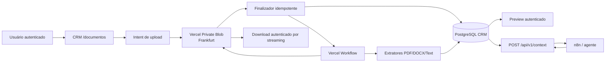
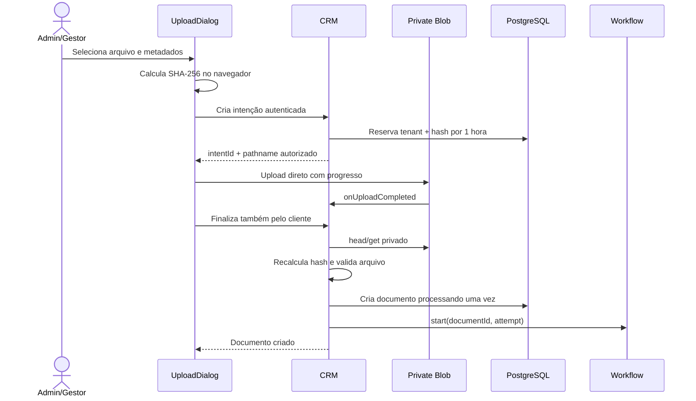
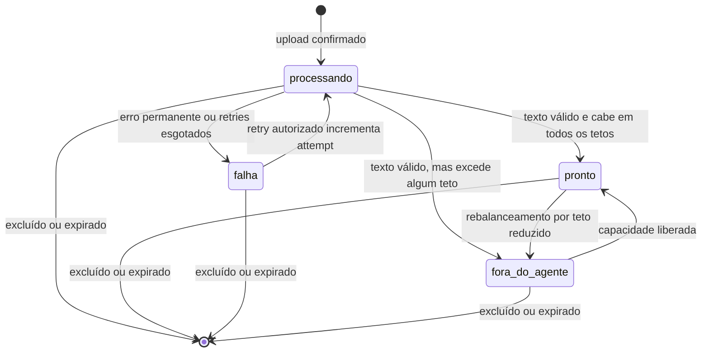

# Lote 12 — Conteúdo de documentos chega ao agente — Design

**Spec:** `.specs/features/lote-12-conteudo-de-documentos/spec.md`  
**Contexto:** `.specs/features/lote-12-conteudo-de-documentos/context.md`  
**Status:** Aprovado  
**Data:** 2026-09-15

---

## Resultado arquitetural

O lote separa quatro responsabilidades que hoje estão misturadas ou ausentes:

1. **Vercel Private Blob** guarda o arquivo original imutável.
2. **PostgreSQL do CRM** guarda metadados, estado, texto extraído e limites do corpus.
3. **Vercel Workflow** executa validação profunda e extração assíncrona com semântica de pelo menos uma vez.
4. **n8n** continua orquestrando a conversa e passa a consumir um contrato de contexto com conteúdo real.

O Hetzner CX23 não recebe arquivos nem processamento deste lote. Ele continua dedicado ao n8n e ao PostgreSQL usado pelo n8n. Uma futura busca vetorial complementará esta arquitetura: o Blob continuará sendo a fonte original, enquanto chunks e embeddings formarão um índice derivado consultado através da mesma interface de contexto.



### Fronteiras de segurança

- O tenant de uma operação vem da sessão autenticada ou da chave de serviço; nunca do modelo nem de campo confiado do navegador.
- Objetos usam chaves opacas e imutáveis. O nome fornecido pelo usuário não compõe a identidade do objeto.
- O navegador recebe apenas autorização curta para o pathname reservado pela intenção de upload.
- Nenhuma URL permanente do Blob é devolvida à interface ou ao n8n.
- Preview e contexto leem o texto do PostgreSQL; download busca o original do Private Blob por uma rota autenticada.
- Todas as consultas aplicam `tenantId`, `deletedAt IS NULL` e `expiresAt IS NULL OR expiresAt > now` antes de retornar metadado ou conteúdo.

---

## Fluxos principais

### 1. Upload direto e confirmação



O callback do Blob e a finalização solicitada pelo navegador chamam o mesmo serviço idempotente. Isso cobre tanto a entrega confiável do callback quanto uma atualização rápida da interface. A intenção é travada durante a finalização; chamadas repetidas devolvem o mesmo documento.

Ordem das validações:

1. autenticação, tenant e `documentos:escrever` antes da geração do token;
2. nome, modalidade, categoria, validade futura, extensão, MIME declarado e tamanho esperado;
3. preflight de duplicidade pelo SHA-256 calculado no navegador, sempre escopado pelo tenant;
4. após upload, existência, tamanho e ETag do objeto reservado;
5. SHA-256 recalculado no servidor por streaming, sem confiar no cliente;
6. assinatura real, coerência de formato e limites estruturais;
7. unicidade final `(tenantId, contentSha256)` dentro da transação que cria o documento.

Falha antes da criação do documento apaga o objeto ou deixa a intenção expirada para compensação. Apenas o documento confirmado aparece na listagem. A chave física seguirá o padrão opaco `documents/<tenant-id>/<intent-id>/<random>`; `allowOverwrite` permanece desativado.

### 2. Processamento e retry

O Workflow recebe somente `{ documentId, processingAttempt }`. Binário, texto e pergunta nunca fazem parte do input ou output durável.



Cada conclusão usa compare-and-set sobre:

- `documentId` e `tenantId`;
- `processingAttempt` vigente;
- `status = processando`;
- `deletedAt IS NULL`;
- documento ainda não expirado.

Um resultado atrasado vira no-op. Retry concorrente faz uma única transição atômica de `falha` para `processando` e incrementa a tentativa uma vez. Neste design, “uma execução” significa uma **tentativa lógica única**, identificada por `(documentId, processingAttempt)`. O transporte e o runtime podem repetir fisicamente uma entrega; repetições compartilham a tentativa e somente uma conclusão pode produzir efeito.

Se `start()` lançar erro após três tentativas imediatas, o documento volta condicionalmente para `falha` com código seguro `processamento_indisponivel`. Mesmo que uma resposta perdida esconda um run que chegou a ser criado, ele continua vinculado ao attempt anterior e sua conclusão será no-op depois do retry. Assim, nenhuma falha de despacho deixa o documento indefinidamente em `processando`.

### 3. Extração

| Formato | Extrator | Regras específicas |
| --- | --- | --- |
| PDF | `unpdf` | Texto nativo; máximo 500 páginas; imagens declaradas até 16 MP; sem OCR. |
| DOCX | `mammoth.extractRawText` | Máximo 2.000 entradas ZIP e 50 MiB descompactados. |
| TXT | decoder controlado | BOM, UTF-8 estrito e fallback Windows-1252. |
| Markdown | decoder controlado | Mesmo tratamento de TXT; nenhuma renderização Markdown. |
| CSV | decoder controlado | Delimitadores e quebras internas preservados como texto. |

Limites comuns:

- arquivo original entre 1 byte e 10 MB;
- no máximo 20 MiB de texto extraído em UTF-8;
- 45 segundos por tentativa de extração;
- três tentativas automáticas apenas para falhas transitórias;
- rejeição de conteúdo binário disfarçado por assinatura, estrutura ou caracteres de controle incompatíveis.

A normalização faz apenas:

1. remoção de BOM;
2. conversão de `CRLF` e `CR` para `LF`;
3. `trim` nas extremidades.

Não há reescrita de palavras, números, pontuação, delimitadores ou quebras internas. Resultado sem caractere visível produz `nenhum_texto_extraivel`.

### 4. Admissão no corpus

O PostgreSQL mantém um teto separado por tenant para cada consulta:

- `novo`: documentos `novo + ambos`;
- `usado`: documentos `usado + ambos`;
- `ambos`: documentos `novo + usado + ambos`, sem duplicação.

Um documento participa de todos os corpora que podem retorná-lo. Ele só fica `pronto` se seu conteúdo integral couber simultaneamente em todos eles. A unidade é o número exato de bytes UTF-8 da resposta JSON canônica, incluindo envelope, metadados e separação entre documentos.

Algoritmo de reconciliação:

1. preserve os demais documentos já `pronto` durante a admissão de um upload ou edição;
2. simule a inclusão integral do documento alterado em cada corpus aplicável;
3. admita-o somente se todos os limites continuarem satisfeitos;
4. depois, percorra documentos `fora_do_agente` por `uploadedAt ASC, id ASC`;
5. promova cada candidato que caiba em todos os seus corpora;
6. se um candidato não couber, mantenha-o fora e continue avaliando os posteriores.

Exclusão, expiração e mudança de modalidade executam a reconciliação. Uma redução explícita de teto executa um rebalanceamento completo por `uploadedAt ASC, id ASC`, mantendo os documentos mais antigos até o limite e marcando os demais como `fora_do_agente`. O texto nunca é truncado.

### 5. Contexto do agente

Contrato novo:

```http
POST /api/v1/context
Content-Type: application/json
Authorization: Bearer <service-key>
X-Crivo-Tenant: <tenant-slug>
```

```json
{
  "modality": "novo",
  "question": "Quais documentos preciso apresentar para financiar?"
}
```

`question` é obrigatória, recebe `trim` e tem no máximo 4.096 caracteres. Ela não entra em query string, logs ou resposta. No lote 12, perguntas diferentes sobre o mesmo corpus devolvem o mesmo conjunto; o parâmetro existe para estabilizar a interface de um futuro RAG.

```json
{
  "retrievalMode": "direct",
  "documents": [
    {
      "id": "uuid",
      "name": "Política de financiamento.pdf",
      "modality": "novo",
      "category": {
        "name": "Financiamento",
        "color": "blue"
      },
      "contentMode": "full",
      "content": "texto integral"
    }
  ]
}
```

Resposta vazia é `200` com `documents: []`. Erros seguem `application/problem+json`. Respostas levam `Cache-Control: no-store`. A ordenação é `uploadedAt ASC, id ASC`.

O serviço implementa a interface:

```typescript
interface DocumentContextSource {
  getContext(input: {
    tenantId: string
    modality: "novo" | "usado" | "ambos"
    question: string
  }): Promise<DocumentContextEnvelope>
}
```

`DirectDocumentContextSource` consulta o texto integral agora. Um futuro `RagDocumentContextSource` poderá consultar chunks e devolver `retrievalMode: "rag"` com `contentMode: "excerpt"`, sem mover os originais do Blob nem mudar o endpoint consumidor.

O workflow n8n altera `consultar_documentos` para `POST`. Modalidade, pergunta e tenant vêm de nós determinísticos do fluxo; nenhum deles usa `$fromAI`. O conteúdo retornado fica disponível ao modelo antes da resposta daquele turno.

### 6. Preview, download e atualização da interface

- A página continua RSC-first e reutiliza a tabela e os dialogs atuais.
- Um cliente mínimo chama `router.refresh()` aproximadamente a cada 3 segundos apenas enquanto houver linha `processando`; pausa com a página oculta e para quando não houver processamento.
- A tabela ganha `StatusDot` e texto para `Processando`, `Pronto`, `Falha`, `Fora do agente` e `Expirado` derivado.
- O upload ganha `DateTimeInput` opcional, progresso real do envio e fases “Validando”, “Enviando” e “Preparando processamento”. Falha preserva campos e arquivo selecionado quando o navegador permitir.
- Preview é carregado sob demanda em `Dialog` fullscreen e renderizado como texto inerte com `CodeBlock`/quebra de linha, nunca `dangerouslySetInnerHTML` nem parser Markdown.
- `GET /api/documents/{id}/download` autentica, autoriza `documentos:ler`, revalida tenant/estado/validade e então transmite `get(...).stream` do Private Blob.
- O download usa `Content-Disposition: attachment` com filename sanitizado, `X-Content-Type-Options: nosniff` e `Cache-Control: private, no-store`.
- Administrador e gestor veem criar, editar, reprocessar e excluir. Corretor vê listar, preview e download. A API repete a autorização independentemente da visibilidade do botão.

O bloqueio é imediato para novos acessos. Um download já concluído ou um stream autorizado antes da expiração não pode ser revogado retroativamente.

### 7. Exclusão e expiração

Exclusão manual e expiração usam o mesmo protocolo:

1. transação marca `deletedAt`, limpa `extractedText` e erros e mantém apenas a chave necessária à remoção;
2. todas as leituras deixam de encontrar a linha imediatamente;
3. `DocumentStorage.delete()` remove o Blob de forma idempotente;
4. `DocumentStorage.head()` confirma ausência; objeto ausente já é sucesso;
5. a linha tombstone é removida fisicamente;
6. falha externa incrementa a pendência e a rotina diária tenta novamente.

A eventual propagação de cache do Blob não reabre acesso: o objeto é privado e o único caminho de produto passa pela autorização no banco, que já bloqueia a linha tombstone ou expirada.

A rotina diária passa a executar grupos independentes, cada um com resultado e `catch` próprios:

- expirar documentos e remover Blobs;
- retentar tombstones;
- eliminar intenções de upload vencidas e seus objetos órfãos;
- purgar recusas de integração, preservando o comportamento existente.

Uma falha de storage não impede a purga de recusas, e uma falha da purga não impede a expiração.

---

## Componentes e interfaces

### Storage de documentos

- **Local:** `src/server/documents/storage.ts`
- **Responsabilidade:** esconder Vercel Blob do domínio e permitir migração futura.
- **Interface:**

```typescript
interface DocumentStorage {
  authorizeClientUpload(input: AuthorizedUpload): Promise<ClientUploadGrant>
  head(key: string): Promise<StoredObject | null>
  open(key: string): Promise<StoredObjectStream | null>
  delete(key: string): Promise<void>
}
```

- **Implementação inicial:** `src/server/documents/vercel-blob-storage.ts`.
- **Regra:** banco persiste provider, chave opaca, ETag, tamanho e content type; não usa URL como identidade.

### Intenções e finalização

- **Locais:** `src/server/documents/uploads.ts`, `app/api/documents/upload/route.ts` e server action fina em `src/server/actions/documents.ts`.
- **Responsabilidade:** reservar tenant/hash, autorizar pathname, validar callback e confirmar documento exatamente uma vez.
- **Reuso:** `getActiveTenantId`, `denyIfForbidden`, validações de documento e padrão de mensagens seguras.

```typescript
createUploadIntent(tenantId, userId, input): Promise<UploadIntentResult>
finalizeUpload(intentId, observedBlob): Promise<FinalizeUploadResult>
```

### Extração e Workflow

- **Locais:** `src/server/documents/extraction.ts`, `src/server/documents/processing.ts`, `workflows/process-document.ts`.
- **Responsabilidade:** abrir original, validar limites, extrair, normalizar e concluir por CAS.

```typescript
extractDocument(stream, descriptor): Promise<ExtractionResult>
retryDocument(tenantId, documentId): Promise<RetryResult>
completeProcessing(input: ProcessingCompletion): Promise<"applied" | "stale">
```

### Limites e reconciliação

- **Local:** `src/server/documents/context-budget.ts`.
- **Responsabilidade:** serialização canônica, contagem exata e promoção/demissão determinística.

```typescript
measureCanonicalContext(envelope): number
reconcileDocumentAdmission(tenantId, cause): Promise<AdmissionResult>
```

### Contexto de integração

- **Locais:** `src/server/integration/context.ts`, `app/api/v1/context/route.ts`.
- **Responsabilidade:** implementar `DocumentContextSource`, validar o POST e devolver somente corpus pronto.
- **Reuso:** `withIntegrationRoute`, autenticação de serviço, `problem()` e registro de recusas da AD-023.

### Leitura e ciclo de vida no CRM

- **Locais:** `app/api/documents/[id]/preview/route.ts`, `app/api/documents/[id]/download/route.ts`, `src/server/actions/documents.ts`, `src/server/integration/lgpd.ts`.
- **Responsabilidade:** preview, streaming, retry, edição, tombstone e manutenção diária.
- **Reuso:** matriz de permissões existente, tenant ativo, `revalidatePath` e cron autenticado por `CRON_SECRET`.

### Interface

- **Locais:** `app/(crm)/documentos/page.tsx` e `src/components/documents/*`.
- **Responsabilidade:** estados, upload real, preview, download e auto-refresh limitado.
- **Reuso Astryx:** `Table`, `Dialog`, `AlertDialog`, `StatusDot`, `ProgressBar`, `DateTimeInput`, `CodeBlock`, `Banner`, `Layout`, `HStack` e `VStack`.

---

## Modelo de dados

### `document_upload_intents`

| Campo | Tipo/Regra | Uso |
| --- | --- | --- |
| `id` | UUID PK | Identidade opaca da intenção. |
| `tenantId` | UUID FK, not null | Isolamento. |
| `requestedByUserId` | text/UUID, not null | Auditoria da autorização. |
| `clientSha256` | char(64), not null | Preflight; nunca autoridade final. |
| `name`, `mimeType`, `sizeBytes` | metadados esperados | Validação pós-upload. |
| `modality`, `categoryId`, `expiresAt` | metadados de domínio | Criação do documento. |
| `storageKey` | text unique | Único pathname autorizado. |
| `storageEtag` | text nullable | Preenchido após upload. |
| `state` | pending/finalizing/committed/failed | Idempotência. |
| `documentId` | UUID nullable | Resultado estável de finalizações repetidas. |
| `createdAt`, `expiresAtIntent` | timestamptz | TTL de 1 hora e limpeza. |

Uma restrição impede duas intenções ativas do mesmo hash no mesmo tenant. Intenções terminais ou vencidas não bloqueiam upload posterior.

### `documents`

Os campos atuais permanecem, exceto os registros metadata-only que serão removidos na migração.

| Novo campo | Tipo/Regra | Uso |
| --- | --- | --- |
| `storageProvider` | text not null | Inicialmente `vercel_blob`; seam de migração. |
| `storageKey` | text not null unique | Identidade privada do objeto. |
| `storageEtag` | text not null | Integridade/diagnóstico. |
| `contentSha256` | char(64) not null | Duplicidade por bytes. |
| `status` | enum not null | `processando`, `pronto`, `falha`, `fora_do_agente`. |
| `extractedText` | text nullable | Texto integral; apenas pronto/fora possuem conteúdo. |
| `extractedBytes` | integer nullable | Bytes UTF-8 normalizados. |
| `extractorVersion` | text nullable | Reprodutibilidade. |
| `failureCode` | text nullable | Código seguro e estável. |
| `failureMessage` | text nullable | Mensagem segura para UI. |
| `processingAttempt` | integer not null default 1 | Identidade da tentativa lógica. |
| `workflowRunId` | text nullable | Correlação operacional. |
| `processingStartedAt`, `processedAt` | timestamptz nullable | Observabilidade. |
| `deletedAt` | timestamptz nullable | Tombstone e bloqueio imediato. |
| `deletionAttempts` | integer not null default 0 | Retry físico. |
| `deletionLastErrorCode` | text nullable | Diagnóstico sanitizado. |

Índices e restrições:

- unicidade parcial de `(tenantId, contentSha256)` para linhas ativas;
- índice de listagem `(tenantId, deletedAt, uploadedAt DESC)`;
- índice de contexto `(tenantId, status, modality, expiresAt, uploadedAt)`;
- índice de manutenção sobre `expiresAt` e tombstones;
- `extractedText IS NULL` para `processando` e `falha`, validado pelo domínio e coberto por teste.

### `tenant_document_context_limits`

| Campo | Tipo/Regra | Uso |
| --- | --- | --- |
| `tenantId` | UUID FK | Dono do benchmark. |
| `queryModality` | novo/usado/ambos | PK composta. |
| `maxResponseBytes` | integer positivo | Teto de admissão. |
| `modelId` | text | Snapshot publicado. |
| `workflowVersion` | text | Versão publicada do n8n. |
| `systemMessageHash`, `toolsHash` | text | Detectar composição alterada. |
| `memoryWindow` | integer | Contexto usado na prova. |
| `benchmarkedAt` | timestamptz | Frescor. |
| `staleAt`, `staleReason` | nullable | Impede tratar prova antiga como atual. |
| `metrics` | jsonb | Faixas, tokens, latência e custo sem corpus. |

Não existe limite implícito. Sem benchmark válido, a interface mostra um `Banner` para administrador/gestor e não amplia automaticamente um valor anterior.

---

## Benchmark reproduzível

O benchmark usa o modelo e o workflow realmente publicados, hoje `gpt-5.4-nano-2026-03-17`, `reasoningEffort: low`, memória de 50 mensagens e catálogo completo de tools.

Cada modalidade é testada com corpora progressivos e fatos exclusivos posicionados no início, meio e fim dos documentos. A prova mede:

- recuperação correta dos fatos e ausência de contradição;
- tokens de entrada informados pelo provedor;
- latência total e da tool;
- custo estimado;
- bytes da resposta JSON canônica;
- comportamento com histórico cheio e uma segunda observação da tool no mesmo turno.

O teto persistido é o menor entre:

1. maior faixa aprovada por qualidade;
2. maior faixa aprovada por latência;
3. margem da janela do modelo após prompt, histórico, pergunta e tools;
4. margem segura do transporte da Vercel;
5. margem para repetição da observação da ferramenta.

Mudança de modelo, workflow publicado, system message, janela de memória ou catálogo de tools preenche `staleAt`; não promove documentos adicionais até nova medição. Corpus real acima do teto vira métrica explícita para planejar RAG.

---

## Falhas e mensagens

| Cenário | Classe | Estado/compensação | Mensagem ao usuário |
| --- | --- | --- | --- |
| Sem permissão | Permanente | Nenhum token/objeto/registro | “Você não tem permissão para enviar documentos.” |
| Arquivo vazio, grande ou tipo divergente | Permanente | Objeto recusado ou apagado; sem documento | Motivo de validação específico. |
| Duplicata no tenant | Permanente | Retorna documento existente; objeto novo removido | “Este arquivo já está cadastrado como …” |
| Hash do servidor diverge | Permanente | Intenção falha e objeto é apagado | “Não foi possível confirmar a integridade do arquivo.” |
| Estrutura perigosa/malformada | Permanente | Sem documento; objeto apagado | “O arquivo não pôde ser validado.” |
| Sem texto nativo | Permanente de extração | `falha`, original preservado | “Nenhum texto extraível foi encontrado.” |
| Texto acima de 20 MiB | Permanente de extração | `falha`, original preservado | “O conteúdo extraído excede o limite técnico.” |
| Blob/extrator indisponível ou timeout | Transitória | Até 3 tentativas; depois `falha` | “Não foi possível processar agora. Tente novamente.” |
| Resultado de attempt antigo | Obsoleto | No-op | Nenhum impacto visível. |
| Exclusão física falha | Transitória | Tombstone inacessível + retry diário | Exclusão permanece concluída para o usuário. |
| Documento de outro tenant | Segurança | 404 indistinguível | “Documento não encontrado.” |
| Benchmark desatualizado | Configuração | Mantém teto anterior sem expansão | Banner administrativo. |

Stack traces, credenciais, caminhos internos, nome, hash completo, pergunta, binário e texto não entram em logs.

---

## Observabilidade e retenção

Eventos estruturados:

- `document.upload.intent_created`;
- `document.upload.finalized`;
- `document.processing.started|completed|failed|stale_result`;
- `document.context.admitted|excluded|promoted`;
- `document.deletion.tombstoned|completed|retry`;
- `document.context.benchmark_stale`.

Campos permitidos: `documentId`, `tenantId`, `intentId`, attempt, etapa, duração, contagens, tamanhos, versão do extrator, run ID e código sanitizado. Nome do arquivo, conteúdo e pergunta são proibidos.

No n8n:

- não salvar execuções bem-sucedidas do workflow principal em produção;
- não salvar progresso intermediário;
- limitar dados de execuções com erro a 24 horas;
- desativar persistência de execuções manuais e usar somente fixtures sintéticas em depuração;
- verificar por teste/prova que observações completas da tool não entram na memória conversacional persistente.

Essas configurações serão aplicadas antes de qualquer documento real do piloto trafegar pelo workflow.

---

## Reuso e mudanças sobre o código atual

| Existente | Reuso/mudança |
| --- | --- |
| `app/(crm)/documentos/page.tsx` | Mantém RSC, filtros e consultas tenant-scoped; passa permissões e estados à tabela. |
| `src/components/documents/upload-dialog.tsx` | Evolui do fluxo metadata-only para intent + client upload + progresso. |
| `src/components/documents/documents-table.tsx` | Mantém tabela compacta e ações por linha; acrescenta status, preview, download e retry. |
| `src/server/actions/documents.ts` | Mantém guards e tenant ativo; separa actions finas dos serviços de upload/processamento/ciclo de vida. |
| `src/server/data/index.ts` | Mantém padrões Drizzle e isolamento; recebe operações CAS e projeções sem carregar texto na listagem. |
| `src/server/integration/context.ts` | Substitui `content: null` por `DocumentContextSource` e envelope direto. |
| `app/api/v1/context/route.ts` | Mantém `withIntegrationRoute`/problem+json; migra GET para POST com compatibilidade temporária. |
| `src/server/integration/lgpd.ts` | Mantém cron único, mas isola cada grupo de manutenção e adiciona Blob/tombstones/intents. |
| `n8n/workflows/principal.ts` | Mantém tool e tenant determinístico; altera método/body/modalidade `ambos`/pergunta. |
| `src/lib/permissions.ts` e actions de permission | Reutilizam `documentos:ler` e `documentos:escrever`. |

---

## Riscos e preocupações encontrados

| Preocupação | Evidência atual | Impacto | Mitigação |
| --- | --- | --- | --- |
| Upload atual descarta o binário. | `src/components/documents/upload-dialog.tsx:66`, `src/server/actions/documents.ts:31-64` | Conteúdo nunca chega ao agente. | Substituir por intent + upload direto + finalização verificada. |
| Schema não tem storage, hash, estado nem unicidade. | `src/db/schema.ts:299-316` | Duplicidade, falhas e lifecycle não são representáveis. | Migração aditiva, índices tenant-scoped e tombstone. |
| Exclusão atual apaga só a linha. | `src/server/data/index.ts:1940-1948`, `src/server/integration/lgpd.ts:47-57` | Blob órfão ou acesso inconsistente. | Protocolo tombstone → delete/head → hard delete. |
| Contexto atual aceita apenas novo/usado e devolve `content: null`. | `src/server/integration/context.ts:7-23` | `ambos` é incompleto e o agente recebe zero texto. | POST com três modalidades, envelope e texto integral. |
| Tool atual usa GET e fallback silencioso para `novo`. | `n8n/workflows/principal.ts:1149-1168` | Lead `ambos` recebe corpus incorreto e pergunta fica fora do contrato. | Body determinístico com modalidade real e pergunta. |
| Cron só isola a falha da purga depois que a expiração terminou. | `src/server/integration/lgpd.ts:78-86` | Falha de expiração pode impedir as demais manutenções. | Executores independentes com resultados parciais. |
| Listagem seleciona todas as colunas. | `src/server/data/index.ts:549-566` | Após adicionar `extractedText`, cada listagem pode carregar corpora inteiros. | Projeção explícita sem texto; preview sob demanda. |
| UI atual sempre oferece editar/excluir. | `src/components/documents/documents-table.tsx:181-199` | Corretor vê ações que o servidor recusará. | Composição de ações conforme permissão, mantendo guard server-side. |
| Workflow e SDKs de extração ainda não são dependências. | `package.json` | APIs podem variar e quebrar build. | Fixar versões, ler docs versionadas no `node_modules` e testar no deployment preview. |
| O runtime Workflow é at-least-once. | Contrato aprovado e documentação do Workflow | Entregas repetidas podem gastar compute ou chegar atrasadas. | Attempt lógico único + CAS; testes com duplicação e resultado tardio. |
| Private Blob pode manter cache interno por curto período após delete. | Comportamento documentado do Blob | Objeto físico pode existir por instantes. | Nenhuma URL é exposta; rota consulta DB antes de cada acesso e usa `no-store`. |
| n8n pode persistir conteúdo da tool em execução. | Configuração operacional atual precisa ser verificada | Cria cópia secundária desnecessária. | Retenção definida acima e prova antes do piloto. |

---

## Estratégia de testes

### Unitários

- assinatura/MIME/extensão e limites 0, 1 byte, 10 MB e 10 MB + 1;
- decodificação UTF-8, BOM, Windows-1252 e binário disfarçado;
- normalização que preserva conteúdo interno;
- serialização JSON canônica e contagem de bytes;
- compatibilidade das três modalidades e ordenação;
- algoritmo de admissão, promoção, candidato grande e rebalanceamento;
- sanitização de filename, mensagens e logs;
- cada subcláusula negativa dos ACs terá asserção dedicada, conforme L-012.

### Integração de domínio e dados

- concorrência de intent/finalização/duplicata/retry/delete;
- igualdade de hash entre tenants sem vazamento;
- fault injection entre Blob, banco e `start()`;
- CAS de attempt e resultado atrasado;
- expiração exatamente no boundary, conforme L-023;
- listagem sem carregar `extractedText`;
- lifecycle de tombstone com delete/head idempotente;
- falha de cada grupo do cron sem bloquear os demais;
- download comparado byte a byte e por SHA-256;
- varredura de logs para provar ausência de nome, pergunta, texto e binário.

### Contratos e UI

- POST válido e inválido, body ausente versus string vazia, conforme L-005;
- auth, método, problem+json, `no-store` e isolamento tenant;
- preview inerte contra HTML/Markdown/script;
- permissões e ações visíveis por papel;
- polling começa, pausa e termina corretamente;
- screenshots dos estados e dialogs, porque o gate visual é obrigatório conforme L-009;
- build e lint após componentes Astryx, sem `div`, estilo inline, CSS novo ou valor arbitrário.

### Ambiente conectado

- upload real em Private Blob num deployment preview;
- inspeção do Workflow e retries sem payload de conteúdo;
- benchmark publicado com métricas persistidas;
- prova conversacional versionada segundo AD-027, com limpeza entre cenários;
- um fato exclusivo por tenant e estados `pronto`, `processando`, `falha`, `fora_do_agente` e expirado;
- IDs de execução confirmados antes de virar evidência, conforme L-011.

---

## Migração, implantação e rollback

### Migração

1. criar enums/tabelas/colunas e índices de forma aditiva;
2. apagar somente linhas existentes de `documents`, pois são metadata-only e não possuem objeto recuperável;
3. preservar `document_categories`, tenants e configurações;
4. remover documentos fictícios do seed e usar fixtures somente em testes;
5. registrar apenas contagens da migração, nunca nomes de documentos.

### Ordem de implantação

1. criar o Private Blob em Frankfurt e conectá-lo ao projeto por credencial/OIDC suportado;
2. instalar e configurar Blob, Workflow e extratores, incluindo integração Next exigida pela versão instalada;
3. aplicar migração aditiva e a limpeza aprovada dos documentos metadata-only;
4. publicar CRM com upload/processamento/UI e POST, mantendo GET legado temporariamente;
5. configurar retenção do n8n antes de trafegar documento real;
6. executar fixtures sintéticas e benchmark; persistir tetos;
7. publicar `principal.ts` com a tool POST e confirmar versão/hash;
8. executar smoke e prova conversacional reais;
9. remover o GET legado somente após a prova do workflow;
10. exigir plano Vercel compatível com uso comercial antes da entrada de clientes pagantes.

### Rollback

- Enquanto o GET legado existir, o n8n pode voltar à versão anterior sem depender do conteúdo novo.
- Schema novo é aditivo; uma reversão de aplicação não precisa apagar Blob nem texto.
- Objetos são imutáveis e não são sobrescritos durante rollback.
- Registros metadata-only antigos não são recuperáveis por rollback, conforme descarte explicitamente aprovado; não havia binário ou texto associado.
- Deploy, criação do Blob, mudança de plano, publicação do n8n e migração em produção continuam exigindo autorização explícita na fase Execute.

---

## Decisões técnicas

| Decisão | Escolha | Motivo |
| --- | --- | --- |
| Original | Vercel Private Blob em Frankfurt | Menor carga operacional para duas imobiliárias e integração natural com Vercel. |
| Conteúdo extraído | PostgreSQL do CRM | Consulta determinística, auditoria e volume inicial pequeno. |
| Processamento | Vercel Workflow | Retry, durabilidade e observabilidade sem usar o n8n como processador de arquivos. |
| Semântica | Pelo menos uma vez + CAS por attempt | Compatível com retries sem corromper estado. |
| Upload | Direto do navegador | Evita body de 10 MB atravessando a Function e reduz transferência cobrada. |
| Download | Streaming autenticado pela aplicação | Bloqueio imediato, tenant e permissão reavaliados em cada acesso. |
| Contexto | Injeção direta integral com teto medido | Simples e suficiente no volume inicial; sem RAG prematuro. |
| Seam de RAG | `DocumentContextSource` | Troca de retrieval sem migrar originais nem quebrar consumidor. |
| Duplicidade | SHA-256 por tenant | Identifica os mesmos bytes sem usar nome e sem vazar outro tenant. |
| Exclusão | Tombstone antes do Blob | Acesso cessa imediatamente apesar da operação externa não transacional. |
| Interface | RSC-first + ilha de polling | Mantém o padrão vigente e limita JavaScript ao comportamento assíncrono. |

---

## Referências verificadas

- Código e decisões vigentes do projeto, especialmente AD-002, AD-004, AD-007, AD-010, AD-021, AD-023, AD-026 e AD-027 em `.specs/STATE.md`.
- Vercel Blob client uploads: `https://vercel.com/docs/vercel-blob/client-upload`.
- Vercel Private Blob e streaming autenticado: `https://vercel.com/docs/vercel-blob/private-storage`.
- Vercel Workflow `start()` e semântica de runs: `https://useworkflow.dev/docs/foundations/starting-workflows`.
- Retenção de execuções n8n: `https://docs.n8n.io/hosting/scaling/execution-data/`.

APIs concretas serão confirmadas novamente contra as versões instaladas no início da implementação. O projeto continuará seguindo as regras locais: documentação do Next 16 em `node_modules/next/dist/docs/` antes de código Next e descoberta Astryx antes de qualquer alteração visual.
