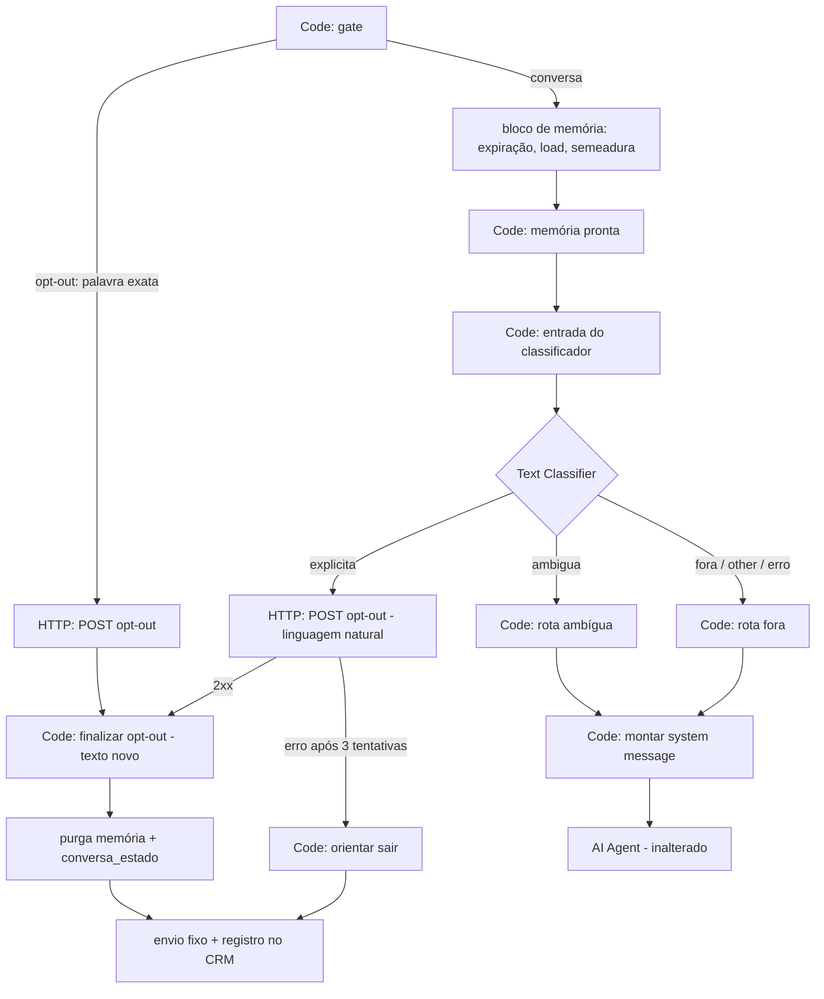

# Lote 13 — Opt-out por linguagem natural — Design

**Spec**: `.specs/features/lote-13-opt-out-linguagem-natural/spec.md`
**Context**: `.specs/features/lote-13-opt-out-linguagem-natural/context.md`
**Status**: Aprovado pelo usuário (2026-09-27)

---

## Architecture Overview

Um classificador de intenção entra na rota `conversa` de `crivo-agente-principal`, depois do bloco
de memória e antes do system message do agente. Ele decide a rota do turno. Nenhum efeito novo é
escrito:

- a faixa explícita **entra no ramo de opt-out que já existe**, o mesmo da palavra-chave, por um
  nó HTTP próprio;
- a ambígua liga uma instrução de pergunta no system message;
- a fora, o erro e a categoria não reconhecida seguem para o agente exatamente como hoje.

O gate (`n8n/src/gate.mjs`) não muda uma linha: a palavra exata continua roteando antes do
classificador e antes do modelo.



O nó "Code: finalizar opt-out" e toda a cauda (purga, envio fixo, registro, limpeza do buffer) são
**os mesmos nós** para os dois caminhos. É isso que torna OPTMSG-01 AC1 ("texto idêntico nos dois
caminhos") e OPTREG-01 AC3–AC5 (uma mensagem, memória vazia, `conversa_estado` purgado) garantias
de estrutura, não de comportamento do modelo.

---

## Code Reuse Analysis

### Existing Components to Leverage

| Component | Location | How to Use |
| --- | --- | --- |
| Ramo de opt-out (finalizar → purga memória → purga `conversa_estado` → restaurar payload → envio fixo) | `n8n/workflows/principal.ts:572-589`, `:1612-1694`, `:1850-1856` | Alvo do caminho natural; só o texto em `Code: finalizar opt-out` muda |
| Envio fixo + registro no CRM + limpeza do buffer (`fixedReplyWired`) | `principal.ts:1697-1797`, `:1844` | Envia a confirmação e a orientação de falha |
| `POST /api/v1/leads/{id}/opt-out` (idempotente) | `app/api/v1/leads/[id]/opt-out/route.ts` | Mesmo contrato; zero mudança no CRM |
| Carga e semeadura da sessão | `principal.ts:771-943` (`loadMemory` → `{ messages, messagesCount }`; `buildSeedMessages` → itens `{ type, message }`) | Fonte da "última mensagem enviada na sessão" |
| `OPT_OUT_GUIDANCE_INSTRUCTION` | `n8n/src/system-message.mjs:102` | Permanece como rede para pedido explícito que chega ao agente |
| Padrão do benchmark (mesma composição, stubs, `execute_workflow`) | `n8n/workflows/benchmark-contexto.ts` | Molde do workflow de medição |
| Inliner `__INLINE(x.mjs)__` | `scripts/n8n-inline.mjs` | Leva o módulo puro novo para os Code nodes |
| Teste de grafo por `toJSON()` | `n8n/workflows/__tests__/principal-modelo.test.ts` | Contagem de nós e conexões, modelo, e igualdade entre workflows |

### Integration Points

| System | Integration Method |
| --- | --- |
| CRM | Nenhuma rota nova. O caminho natural chama o mesmo `POST /leads/{id}/opt-out`, com a credencial de serviço e o `X-Crivo-Tenant` de `$('Code: gate')`. Recusas ≥ 400 já caem em `integration_refusals` (AD-023). |
| OpenAI | Um segundo nó `lmChatOpenAi`, dedicado ao classificador, com o mesmo snapshot da AD-026. |
| Benchmark de teto (AD-031) | O system message muda, então a identidade fica `stale`; reexecutar `check`/`persist` depois de publicar (README §13). |

---

## Components

### Módulo puro `n8n/src/opt-out-intent.mjs` (novo)

- **Purpose**: Tudo o que é determinístico no caminho natural: montar a entrada do classificador,
  achar a última mensagem do agente na sessão, os textos fixos e a pontuação da medição.
- **Location**: `n8n/src/opt-out-intent.mjs`, testado em `n8n/src/__tests__/opt-out-intent.test.ts`
- **Interfaces**:
  - `OPT_OUT_CONFIRMATION: string` — o texto exato de OPTMSG-01 AC2.
  - `OPT_OUT_REGISTRATION_FAILED: string` — a orientação de OPTREG-01 AC7: "Não consegui registrar seu pedido agora. Para encerrar, responda com a palavra sair, sozinha."
  - `lastAgentMessage({ loaded, seeded }): string | null` — a última mensagem de autoria do agente na sessão corrente. `loaded` é a saída de `Chat Memory Manager: carregar sessão`, e `seeded` são os itens de `Code: selecionar mensagens de semeadura`. Devolve `null` quando a sessão está vazia (conversa nova ou expirada, que é o caso de borda do "sim" depois de 12h).
  - `buildClassifierInput({ lastAgentMessage, userMessage }): string` — o texto que o classificador lê: `Última mensagem enviada ao lead: <x ou "(nenhuma)">\nMensagem do lead: <y>`.
  - (A pontuação da medição fica num módulo irmão, `n8n/src/opt-out-score.mjs` — ver abaixo —, para não entrar no código inlinado em produção nem no hash do classificador.)
- **Dependencies**: nenhuma (mesma regra dos módulos de `n8n/src/`: puro, sem import).
- **Reuses**: a convenção de `gate.mjs` e `session.mjs`.

### Módulo puro `n8n/src/opt-out-score.mjs` (novo)

- **Purpose**: Pontuar a medição pela barra de OPTMED-01 AC6.
- **Location**: `n8n/src/opt-out-score.mjs`, testado em `n8n/src/__tests__/opt-out-score.test.ts`
- **Interfaces**:
  - `scoreMeasurement(results, { minExplicitRate = 0.9 }): MeasurementReport` — recebe `{ id, faixa, categoria }[]` e devolve contagens por frase e por faixa, `falsosPositivos`, `taxaExplicita` e `veredito`. APROVADO exige `falsosPositivos === 0` e `taxaExplicita >= minExplicitRate`, com a fronteira exata testada (L-023). `other` e erro contam como `fora`.
- **Dependencies**: nenhuma. É inlined só em `medicao-opt-out.ts`.

### Nós novos em `principal.ts` (rota `conversa`)

| Nó | Tipo | Papel |
| --- | --- | --- |
| `Code: entrada do classificador` | code | `__INLINE(opt-out-intent.mjs)__`; chama `lastAgentMessage` e `buildClassifierInput` sobre o buffer do turno (o mesmo `userMessage` que o agente recebe) |
| `Classificador: opt-out` | `@n8n/n8n-nodes-langchain.textClassifier` v1.1 | Categorias `fora`, `ambigua`, `explicita`, nesta ordem, com `fallback: 'other'`, `multiClass: false` e `onError: 'continueErrorOutput'` |
| `OpenAI Chat Model (classificador)` | `lmChatOpenAi` v1.3 | Mesmo `gpt-5.4-nano-2026-03-17`, `reasoningEffort: "low"`, `timeout: 20000` e a mesma credencial |
| `Code: rota fora` | code | Emite `{ optOutAmbiguo: false }`. Recebe as saídas `fora`, `other` e erro |
| `Code: rota ambígua` | code | Emite `{ optOutAmbiguo: true }` |
| `HTTP: POST /leads/{id}/opt-out (linguagem natural)` | httpRequest v4.4 | Cópia dos parâmetros do nó da palavra-chave, com `retryOnFail` 3× e `onError: 'continueErrorOutput'` |
| `Code: orientar sair (falha do registro)` | code | Monta `mensagens: [OPT_OUT_REGISTRATION_FAILED]` para `fixedReplyWired` |

A saída `explicita` do classificador vai para o HTTP natural. O sucesso do HTTP natural vai para
`Code: finalizar opt-out`, o **mesmo** nó do caminho da palavra-chave; o erro vai para
`Code: orientar sair`. As rotas `fora` e `ambígua` convergem em
`Code: montar system message e marcar campo perguntado`, que passa a ler `$json.optOutAmbiguo`.

**Categorias e prompt** (parâmetros do nó; o texto final é fixado na task e congelado pela
medição):

- `fora`: a mensagem não pede para parar de receber mensagens. Inclui desinteresse num imóvel
  específico, e "parar"/"sair" referindo-se a outra coisa (fotos, áudios, o aluguel atual, o
  apartamento).
- `ambigua`: desinteresse geral sem pedido de parar ("não tenho interesse, obrigado"), ou número
  errado/pessoa errada. Também se aplica a uma resposta ambígua à pergunta de confirmação.
- `explicita`: o lead pede para parar de receber mensagens, para não ser mais contatado, para sair
  da lista ou para não mandarem mais nada. Também se aplica a uma resposta afirmativa quando a
  última mensagem enviada perguntou se ele quer parar de receber mensagens.
- `systemPromptTemplate` em pt-BR, com `{categories}`, com a regra de desempate **na dúvida entre
  explicita e ambigua, escolha ambigua; na dúvida entre ambigua e fora, escolha fora**. O falso
  positivo é permanente; o falso negativo tem `sair` como rede.
- `enableAutoFixing: true` (default explícito, para a medição e a produção serem iguais).

### Mudanças em nós existentes de `principal.ts`

- `Code: finalizar opt-out`: passa a fazer `__INLINE(opt-out-intent.mjs)__` e usar
  `OPT_OUT_CONFIRMATION`. Continua lendo só `$('Code: gate')`, por isso funciona igual com os dois
  predecessores.
- `Code: montar system message e marcar campo perguntado`: passa
  `optOutAmbiguo: $json.optOutAmbiguo === true` para `buildSystemMessage`.
- `Code: memória pronta` perde a aresta direta para o system message e passa a apontar para
  `Code: entrada do classificador`.

### `n8n/src/system-message.mjs`

- Nova constante `OPT_OUT_AMBIGUOUS_INSTRUCTION`: o lead demonstrou desinteresse ou disse que o
  número está errado; pergunte, em UMA frase, se ele quer parar de receber mensagens por este
  número; não insista, não prometa parar, não puxe assunto.
- `buildSystemMessage({ …, optOutAmbiguo = false })` inclui a instrução só quando `true`. O default
  `false` mantém `benchmark-contexto.ts`, que inlina o mesmo módulo, com o mesmo texto de hoje.
- `OPT_OUT_GUIDANCE_INSTRUCTION` fica como está.

### Workflow de medição `n8n/workflows/medicao-opt-out.ts` → `crivo-medicao-opt-out` (novo)

- **Purpose**: Medir o classificador isolado sobre o corpus (OPTMED-01), sem CRM, sem WhatsApp e
  sem memória.
- **Shape**: webhook (mesmo padrão do benchmark, disparado por `execute_workflow`) →
  `Code: expandir corpus` (itens × 3, `buildClassifierInput` inlined) → **o mesmo** classificador
  e o mesmo nó de modelo, com parâmetros byte a byte iguais aos de `principal.ts` → um `Code` por
  saída marcando a categoria → `Merge` (append) → `Code: pontuar` (`scoreMeasurement` inlined) →
  resposta com o relatório.
- **Corpus**: `n8n/fixtures/opt-out-corpus.json`, com itens
  `{ id, faixa, texto, ultimaMensagem? }`. Tem ≥ 20 explícitas, ≥ 15 ambíguas e ≥ 20 fora,
  incluindo as frases reais nomeadas em OPTMED-01 AC2/AC3 e os pares pergunta de confirmação +
  "sim" (explícita) e + "não" (fora).
- **Relatório**: `.specs/features/lote-13-opt-out-linguagem-natural/medicao-opt-out-<data>.json`,
  com contagens, veredito e `classifierHash`.

### Identidade do classificador (OPTMED-01 AC8)

- `classifierIdentity(workflowJson, intentSource)` em `scripts/opt-out-measurement.ts` (precisa de `node:crypto`, por isso fora de `n8n/src/`; o mesmo script tem o subcomando `identity`, que imprime o hash atual): calcula o sha256 do JSON
  canônico dos parâmetros do nó `Classificador: opt-out`, do `model`/`options` do seu nó de modelo
  e do fonte de `opt-out-intent.mjs`, com CRLF normalizado.
- `n8n/workflows/__tests__/principal-classificador.test.ts`:
  1. a identidade de `principal.toJSON()` é igual à de `medicaoOptOut.toJSON()`;
  2. a identidade de `principal` é igual ao `classifierHash` da medição **aprovada mais recente**
     registrada em disco, e o veredito dela é `APROVADO`.

  Mudou o prompt ou uma categoria, a suíte falha até uma nova medição aprovada. É o gate
  determinístico de AC8, no mesmo espírito da identidade do benchmark (AD-031).

---

## Data Models

Nenhuma mudança de schema no CRM nem nas Data Tables.

```typescript
// n8n/fixtures/opt-out-corpus.json
type CorpusItem = {
  id: string;                      // "exp-01", "amb-07", "fora-12"
  faixa: "explicita" | "ambigua" | "fora";
  texto: string;
  ultimaMensagem?: string;         // default: abertura fixa do corpus
};

// relatório da medição
type MeasurementReport = {
  date: string;
  modelId: string;
  classifierHash: string;
  workflowVersion: string;         // activeVersionId do crivo-medicao-opt-out
  repeticoes: 3;
  porFrase: { id: string; faixa: string; explicita: number; ambigua: number; fora: number }[];
  porFaixa: Record<"explicita" | "ambigua" | "fora", { explicita: number; ambigua: number; fora: number; total: number }>;
  falsosPositivos: number;         // execuções ambigua|fora classificadas como explicita
  taxaExplicita: number;           // execuções explicita classificadas explicita / total explicita
  veredito: "APROVADO" | "REPROVADO";
};
```

---

## Error Handling Strategy

| Error Scenario | Handling | User Impact |
| --- | --- | --- |
| OpenAI fora do ar ou timeout no classificador | Saída de erro → `Code: rota fora` → agente normal | Nenhum. Se era um pedido explícito, o agente orienta `sair` (rede) |
| Classificador devolve texto fora das categorias | Auto-fix (+1 chamada); persistindo, `fallback: other` → rota fora | Igual à linha acima |
| `POST opt-out` natural falha 3× | Saída de erro → `Code: orientar sair` → envio fixo | Uma mensagem pedindo para responder `sair`; `optedOutAt` nulo |
| `POST opt-out` da palavra-chave falha | Inalterado (erro da execução → `crivo-agente-erros`) | Inalterado |
| Resposta "sim" depois do corte de 12h | Sessão vazia → `lastAgentMessage = null` → o "sim" sozinho cai em fora | O agente responde normalmente |
| Medição reprova | O classificador não é publicado; o lote para para decisão do usuário | Nenhum; a orientação atual segue |

---

## Risks & Concerns

| Concern | Location (file:line) | Impact | Mitigation |
| --- | --- | --- | --- |
| `extractModelId` lê o **primeiro** `lmChatOpenAi` do arquivo; um segundo nó de modelo pode mudar a identidade do benchmark | `src/server/documents/benchmark-identity.ts:33-37` | O teto de contexto seria calculado sobre o modelo errado, ou a identidade oscilaria com a ordem dos nós | Ancorar a extração no nó `name: "OpenAI Chat Model"`, com teste que falha se houver dois `lmChatOpenAi` e a âncora sumir |
| Formato dos elementos de `messages` do `loadMemory` com `groupMessages: true` não está documentado (o comentário confirma só `{ messages, messagesCount }`) | `principal.ts:780-783` | `lastAgentMessage` leria o campo errado e o "sim" pós-pergunta nunca viraria explícita | Task de espinha: ler uma execução real via `get_execution`, registrar o shape com o id da execução (L-011) e só então escrever `lastAgentMessage` com fixture desse shape |
| ~~Comportamento de `onError: 'continueErrorOutput'` num nó com várias saídas por categoria não está confirmado~~ **Confirmado na T2** (execução 2636): o erro sai pela **saída 4, própria** (0 `fora`, 1 `ambigua`, 2 `explicita`, 3 `other`, 4 erro), com o JSON de entrada e um campo `error` | nó novo | — | Ordem `fora` primeiro mantida por segurança. Ver a linha seguinte sobre como ligar a saída 4 |
| **Novo (T2)**: `.onError(handler)` do SDK liga o handler à **saída 1** do nó. No classificador, isso põe o handler de erro em `ambigua` e deixa a saída 4 sem conexão (rascunho `hsYF9VXAbGKLCkIc`, `get_workflow_details`) | `principal.ts`, `medicao-opt-out.ts` | O erro pararia o turno sem resposta, e itens `ambigua` cairiam na rota `fora` | Ligar o erro do classificador **só com `.output(4)`**; teste de aresta afirma a conexão de índice 4 no `toJSON()` e a ausência de conexão extra no índice 1. Nos nós HTTP (duas saídas), `.onError()` segue válido, com teste de aresta próprio |
| ~~`systemPromptTemplate` customizado: não está confirmado se o nó acrescenta sozinho as instruções de formato quando o template é trocado~~ **Confirmado na T2** (execuções 2634 e 2635): o nó anexa as instruções de formato (JSON Schema) depois do template customizado; nenhum dos dois templates disparou auto-fix | nó novo | — | Template customizado adotado. A medição continua registrando as execuções com auto-fix |
| A mudança do system message torna o teto de contexto `stale` | `n8n/README.md` §13 | O banner avisa o gestor; o teto continua limitando com o valor antigo (fail-closed, AD-031) | Task pós-publicação: `check` → rerodar o benchmark → `persist`, como no lote-12 |
| Vazão compartilhada da OpenAI (AD-031) | `src/server/documents/context-ceiling.ts` | O classificador consome tokens por minuto fora da fórmula | Cerca de 1–2 mil tokens por turno contra a margem de 0,8 sobre 200 mil TPM (40 mil de folga). Registrar a conta no `n8n/README.md`; a fórmula não muda |
| Contagem de nós e conexões fixada em teste | `n8n/workflows/__tests__/principal-modelo.test.ts:29-30` | O teste quebra com os nós novos | Atualizar 62/76 para o valor medido por `principal.toJSON()` na própria task, com a origem da conta no comentário (padrão do lote-11) |
| O roteiro prevê um único número de teste | `n8n/smoke/roteiro.md` §1 | Três casos exigem três leads | Rodar os casos em sequência, com `npm run smoke:reset` + `crivo-smoke-reset` entre eles; cada reset apaga o lead, e o seguinte nasce novo |
| O primeiro turno de toda conversa paga +1 chamada de modelo | rota `conversa` | +1–2 s sobre o debounce de 10 s | Aceito na escolha da abordagem; a latência do classificador é registrada na medição |

---

## Tech Decisions

| Decision | Choice | Rationale |
| --- | --- | --- |
| Onde classificar | Depois do bloco de memória, antes do system message | Só ali a sessão corrente (pós-expiração, pós-semeadura) é conhecida, e é ela que dá contexto ao "sim" |
| Nó de modelo | Nó dedicado, mesmo snapshot | Não depende de sub-nó compartilhado entre dois nós raiz (não confirmado na instância); o teste garante o mesmo `model` nos dois |
| HTTP próprio no caminho natural | Cópia do nó da palavra-chave com saída de erro | O caminho da palavra-chave não muda de comportamento na falha (OPTKEY-01 AC2) |
| Ordem das categorias | `fora`, `ambigua`, `explicita` | Qualquer roteamento acidental pela saída 0 é o caminho seguro |
| Template do classificador (T2) | `systemPromptTemplate` customizado, texto congelado abaixo | Confirmado na T2: o nó anexa as instruções de formato ao template e nenhum auto-fix disparou (execuções 2634 e 2635). A regra de desempate só cabe no template |
| Ligação da saída de erro (T2) | `.output(4)` do classificador para `Code: rota fora` (e para o marcador de erro da medição), nunca `.onError()` | `.onError()` do SDK liga à saída 1 (`ambigua`) num nó de várias saídas; confirmado no rascunho `hsYF9VXAbGKLCkIc` |

**Parâmetros do classificador — versão 2 (T12a, 2026-09-29)**. A versão congelada na T2 reprovou na medição da T12 (7 falsos positivos, todos "parar de mandar <tipo de conteúdo>"; `medicao-opt-out-2026-09-29.json`). A v2 muda só as descrições de `fora` e `explicita` e uma frase do template; a de `ambigua` e o resto ficam iguais. Texto vigente (os mesmos em `principal.ts` e `medicao-opt-out.ts`; a T9 os copia byte a byte e o hash da T7 os trava):

- `inputText`: a saída de `buildClassifierInput` (`Última mensagem enviada ao lead: <x ou "(nenhuma)">\nMensagem do lead: <y>`).
- `categories.categories`:
  - `fora`: `A mensagem não pede para parar de receber mensagens nem para encerrar o contato. Inclui desinteresse num imóvel específico, pedido para parar de mandar só um tipo de conteúdo ou mudar o formato (fotos, áudios, links, um tipo de imóvel), e usos de "parar" ou "sair" que se referem a outra coisa (o aluguel atual, o apartamento, a enrolação). Também vale para uma resposta negativa quando a última mensagem enviada perguntou se o lead quer parar de receber mensagens.`
  - `ambigua`: `Desinteresse geral sem pedido de parar de receber mensagens (por exemplo, "não tenho interesse, obrigado"), ou aviso de número errado ou pessoa errada. Também vale para uma resposta ambígua quando a última mensagem enviada perguntou se o lead quer parar de receber mensagens.`
  - `explicita`: `O lead pede para parar de receber mensagens desta imobiliária como um todo: parar de receber mensagens, não ser mais contatado, sair da lista ou não mandarem mais nada. Também vale para uma resposta afirmativa quando a última mensagem enviada perguntou se ele quer parar de receber mensagens. Não vale quando o que deve parar é só um tipo de conteúdo ou formato.`
- `options`: `{ multiClass: false, fallback: "other", systemPromptTemplate: <abaixo>, enableAutoFixing: true }`.
- `systemPromptTemplate`: `Você classifica a mensagem de um lead de imobiliária no WhatsApp quanto a um pedido para parar de receber mensagens. Classifique o texto do usuário em uma destas categorias: {categories}. Use a última mensagem enviada ao lead só para entender respostas curtas, como "sim" ou "não". "Parar de mandar" seguido de um tipo de conteúdo ou formato é fora; só é explicita quando o lead quer parar de receber as mensagens ou o contato em si. Regra de desempate: na dúvida entre explicita e ambigua, escolha ambigua; na dúvida entre ambigua e fora, escolha fora. Não explique e responda somente o JSON, seguindo as instruções de formato abaixo.`
- Nó `onError: "continueErrorOutput"`. Modelo: `lmChatOpenAi` v1.3, `model: { __rl: true, mode: "list", value: "gpt-5.4-nano-2026-03-17", cachedResultName: "gpt-5.4-nano-2026-03-17" }`, `options: { reasoningEffort: "low", timeout: 20000 }`, credencial `OpenAI account`.
| Onde mora a pontuação | `scoreMeasurement` em `n8n/src/opt-out-score.mjs`, puro, inlined só no workflow de medição e testado em vitest | A barra do AC6, incluindo a fronteira exata de 90% (L-023), fica testada fora da instância |
| AD | AD-032 emenda a AD-018 (cláusula de opt-out) e a AD-026 (frase "não há outro" modelo) | O `CLAUDE.md` exige emenda explícita; registrada neste Design |
