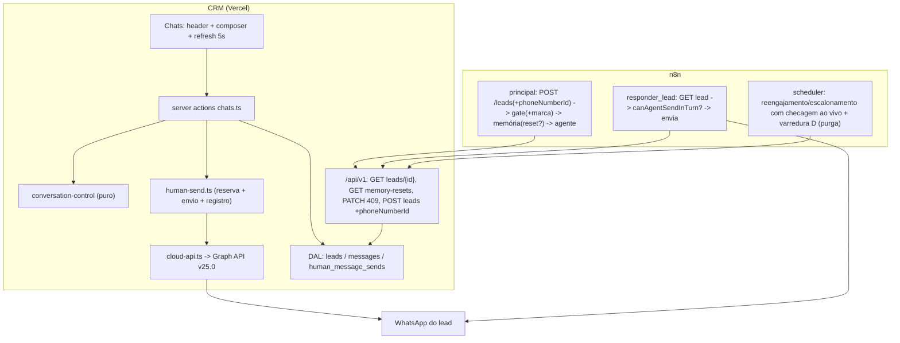
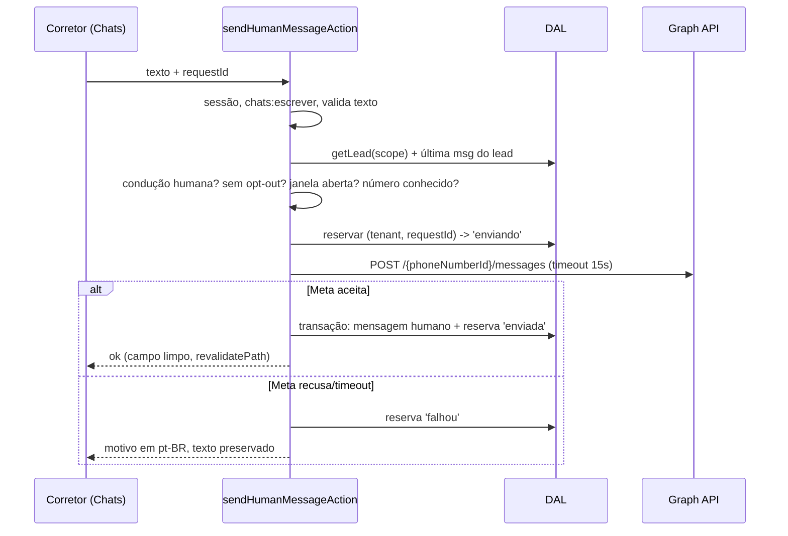

# Lote 14 — Humano no laço — Design

**Spec**: `.specs/features/lote-14-humano-no-laco/spec.md`
**Context**: `.specs/features/lote-14-humano-no-laco/context.md`
**Status**: Approved (2026-10-01). Emendas D1–D5 aplicadas na spec; AD-034 e AD-035 registradas em `STATE.md`, com AD-018 e AD-019 marcadas `amended by AD-034`.

---

## Architecture Overview

**Abordagem escolhida pelo usuário (2026-10-01): o CRM envia direto pela Cloud API.** A
alternativa era o CRM pedir ao n8n por webhook. Ela foi descartada porque deixaria o humano sem
voz quando o n8n cai, gastaria uma execução da cota por mensagem humana e entregaria o erro da Meta
filtrado pelo nó do n8n.

O lote tem três frentes, ligadas por dois campos novos no lead:

1. **CRM (Chats).** Assumir, responder, devolver e registrar opt-out são server actions com escopo de
   sessão. O envio chama a Graph API com o token de um usuário do sistema da Meta, guardado na
   Vercel. O `phoneNumberId` de resposta é o do número para o qual o lead escreveu, informado pelo
   n8n a cada `POST /leads`.
2. **Contrato.** A representação do lead ganha `humanTakeoverAt` (a marca) e `memoryResetRequestedAt`
   (o pedido de reconstrução da memória). Entram duas rotas de leitura: `GET /leads/{id}` e
   `GET /memory-resets`. A mensagem ganha `authorName`, e o `PATCH` recusa status e reunião de lead
   com a marca.
3. **n8n.** O gate cala o agente quando há marca. `responder_lead` e o envio de contingência relêem o
   lead antes de enviar. O bloco de memória reconstrói a memória quando há pedido de reset, e a
   semeadura apresenta a fala humana como nota da imobiliária. O scheduler confere a condução ao vivo
   e ganha uma quarta varredura, que purga a memória pedida pelo CRM.



### Fluxo de envio humano



### Reconstrução da memória (devolução e opt-out pelo CRM)

O CRM grava `memory_reset_requested_at` no lead. O n8n guarda em `conversa_estado.memoryResetAt` o
último pedido já atendido. O reset é devido quando o pedido é mais novo que o atendido
(`memoryResetDue`). Dois consumidores, ambos idempotentes, porque reconstruir a partir do CRM sempre
produz o mesmo conteúdo:

- **Fluxo principal**, na rota `conversa`: o turno seguinte à devolução purga e semeia antes do
  agente, reaproveitando os nós de purga por sessão expirada.
- **Varredura D do scheduler**, a cada 15 min: cobre o lead que não escreve mais (opt-out pelo CRM,
  devolução sem resposta) e a exigência de purga da LGPD (OPTHUM-01 AC6).

---

## Code Reuse Analysis

### Existing Components to Leverage

| Component | Location | How to Use |
| --- | --- | --- |
| Guarda de sessão e permissão | `src/server/auth/session.ts` (`verifySession`, `getLeadScope`), `src/server/actions/permission.ts` (`denyIfForbidden`) | Toda action nova: `denyIfForbidden("chats","escrever")` + `verifySession()` para usuário e escopo. |
| Filtro de escopo de lead | `src/server/data/index.ts` (`assignedTo(scope)`, `getLead`) | As novas escritas em `leads` usam `WHERE tenant AND id AND assignedTo(scope)`, como em `updateLeadStatus` (`:1265`). |
| Ingestão de mensagem | `ingestAgentMessage` (`src/server/data/index.ts:1843`) | Mesmo padrão de transação (garante conversa + insert idempotente por `externalId`); a variante humana grava autor e fecha a reserva na mesma transação. |
| Opt-out idempotente | `optOutLead` (`src/server/integration/lgpd.ts:27`) | A regra `COALESCE(opted_out_at, now())` é reaproveitada na versão com escopo de sessão. |
| Texto da confirmação de opt-out | `OPT_OUT_CONFIRMATION` (`n8n/src/opt-out-intent.mjs:11`) | O CRM importa a constante: o mesmo texto nos dois caminhos (OPTHUM-01 AC3). O arquivo não é alterado, então a identidade do classificador (AD-032) se mantém. |
| Nono dígito | `toWhatsAppMsisdn` (`n8n/src/phone.mjs`) | O CRM importa a função, para que destinatário humano e do agente sigam a mesma regra. |
| Atualização periódica visível | `src/components/documents/document-processing-refresh.tsx` + `processing-refresh-policy.ts` | Mesmo padrão (intervalo único, pausa com a aba oculta) para `ChatRefresh`. |
| Agrupamento da thread | `buildChatThread` (`src/lib/chat-thread.ts`) | Ganha o remetente `humano` e quebra de grupo por autor. |
| Família Chat da Astryx | `@astryxdesign/core/Chat` (`ChatComposer`, `useChatComposerContext`, `ChatMessage`, `ChatMessageBubble`) | Composer com `headerContext` (tempo da janela) e `status` (erro/aviso); botão de envio próprio com rótulo em pt-BR. |
| Wrapper de rota do contrato | `withIntegrationRoute` + `INSTRUMENTED` (`src/server/integration/route.ts`) | Rotas novas `GET /leads/{id}` e `GET /memory-resets` (AD-023, teste de varredura). |
| `problem()` / `ProblemCode` | `src/server/integration/problem.ts` | Código novo `lead-conduzido-por-humano` (409). |
| Purga de sessão expirada | `principal.ts` (`Chat Memory Manager: purgar sessão expirada`, `Data Table: purgar qualificação e persona (sessão expirada)`) | O reset por devolução entra pelo mesmo IF, ampliado para `expired || resetDue`. |
| Leitura ao vivo do lead no scheduler | `postLeadForReminder` (`scheduler.ts`) | As varreduras de reengajamento e escalonamento passam a ler o lead pela rota nova `GET /leads/{id}`. |
| Retenção diária | `/api/cron/expire-documents` (já purga `integration_refusals` em 30 dias) | Purga também as reservas `human_message_sends` com mais de 30 dias. |

### Integration Points

| System | Integration Method |
| --- | --- |
| Meta Graph API | `POST https://graph.facebook.com/v25.0/{phoneNumberId}/messages` com `Authorization: Bearer ${WHATSAPP_ACCESS_TOKEN}`; corpo `{messaging_product:"whatsapp", recipient_type:"individual", to, type:"text", text:{preview_url:false, body}}`; resposta `messages[0].id`. Erro em `error.code` (131047 = janela). |
| Postgres do CRM | Colunas novas em `leads` e `messages`, enum `sender` + `humano`, tabela `human_message_sends`. |
| Contrato `/api/v1` | Campos novos no lead e na mensagem, duas rotas GET, código 409 novo, campo opcional no `POST /leads`. |
| n8n | `gate.mjs`, `session.mjs` e o novo `conduction.mjs`; workflows `principal`, `tool-responder-lead` e `scheduler`; coluna `memoryResetAt` em `conversa_estado`. |

---

## Components

### C1. Esquema e DAL (`src/db/schema.ts`, `src/server/data/index.ts`)

- **Purpose**: Persistir a marca, o pedido de reset, o número do canal, a autoria humana e a reserva
  de envio.
- **Interfaces** (DAL, todas com `LeadScope` quando a origem é a sessão):
  - `takeOverConversation(scope, leadId, userId, now): Promise<TakeOverResult>`: grava a marca só se
    o lead estiver no escopo, sem opt-out, sem marca e fora de `escalado_humano`. Toca apenas
    `human_takeover_at`, `human_takeover_by` e `updated_at`. Resultado discriminado:
    `assumido | ja-humano | fora-do-escopo | opt-out`.
  - `returnConversationToAgent(scope, leadId, now): Promise<ReturnResult>`: limpa a marca;
    `escalado_humano` passa a `em_qualificacao`; grava `status_changed_by = null` e
    `memory_reset_requested_at = now`. Tudo numa única `UPDATE`.
  - `optOutLeadByHuman(scope, leadId, now): Promise<{ optedOutAt, newlyOptedOut } | null>`:
    `COALESCE` como `optOutLead`, mais `memory_reset_requested_at = now` quando o opt-out é novo.
  - `getLastLeadMessageAt(tenantId, leadId): Promise<Date | null>`: maior `sent_at` com
    `sender = 'lead'`.
  - `reserveHumanSend(tenantId, leadId, userId, requestId, now)`,
    `failHumanSend(...)`, `recordHumanMessage(...)`: a reserva idempotente e o registro final na
    mesma transação (ver C4).
  - `setLeadChannel(tenantId, leadId, phoneNumberId)`: usado por `deliverLead`; grava só quando o
    valor muda.
  - `listMemoryResets(tenantId, since): Promise<MemoryReset[]>` para a rota do contrato.
  - `getConversationSummaries` passa a devolver `humanConducted` e reescreve a "última mensagem" com
    `DISTINCT ON (conversation_id)`. A versão atual lê todas as mensagens do tenant a cada render, e
    a atualização de 5 s multiplica esse custo.
  - `getMessages` e `getLeadMessages` devolvem `authorName`.
- **Reuses**: `assignedTo`, padrão de transação de `ingestAgentMessage`, `optOutLead`.

### C2. Regra de condução (`n8n/src/conduction.mjs`, pura)

- **Purpose**: Fonte única da regra "quem conduz", lida pelo n8n (inline nos Code nodes) e pelo CRM
  (import direto).
- **Interfaces**:
  - `isHumanConducted({ status, humanTakeoverAt }): boolean`: marca **ou** `escalado_humano`.
  - `canAgentSendInTurn({ optedOutAt, humanTakeoverAt }): boolean`: usada antes de cada envio dentro
    do turno. **Não** olha `status`, porque o agente que acabou de escalar ainda precisa enviar a
    mensagem de passagem (`system-message.mjs:120`).
  - `canAgentContactProactively(lead): boolean`: `!optedOutAt && !isHumanConducted(lead)`. Usada pelo
    scheduler.
  - `memoryResetDue(requestedAt, honoredAt): boolean`.
- **Reuses**: convenção de módulo puro de `n8n/src/` (sem dependências, testado em vitest).

### C3. Controle da conversa no CRM (`src/lib/conversation-control.ts`, pura)

- **Purpose**: Calcular a janela e a visibilidade dos controles, fora do componente (L-003).
- **Interfaces**:
  - `whatsappWindow(lastLeadMessageAt: Date | null, now: Date): { open: boolean; closesAt: Date | null; remainingMinutes: number }`.
    Aberta se `now - last < 24h` (com 24h exatas, fechada).
  - `formatWindowRemaining(minutes): string` → `"3 h 20 min"`, `"0 h 1 min"`.
  - `conversationControls({ status, humanTakeoverAt, optedOutAt, canWrite, window }): { conductor: "agente" | "humano" | "escalado" | "opt-out"; canAssume; canReturn; canOptOut; composer: "oculto" | "bloqueado" | "ativo" }`.
- **Reuses**: `isHumanConducted` de C2.

### C4. Envio humano (`src/server/whatsapp/cloud-api.ts`, `src/server/chats/human-send.ts`)

- **Purpose**: Entregar texto ao WhatsApp e registrar com autoria, uma vez por `requestId`.
- **Interfaces**:
  - `sendWhatsAppText({ phoneNumberId, to, body, timeoutMs }, deps?): Promise<{ ok: true; wamid } | { ok: false; failure: CloudApiFailure; metaCode?: number }>`
    com `CloudApiFailure = "janela-fechada" | "destinatario-invalido" | "credencial-invalida" | "tempo-esgotado" | "falha-meta"`.
    Usa `fetch` + `AbortSignal.timeout(15000)`. `deps.fetch` permite injeção em teste. Mapeamento:
    131047 → `janela-fechada`; 131030/131026 → `destinatario-invalido`; 190, 401 e 403 →
    `credencial-invalida`.
  - `sendHumanMessage(context, { leadId, text, requestId }, now): Promise<HumanSendResult>`, na ordem
    da sequência acima. Para cada recusa, devolve um código de `HumanSendFailure`
    (`texto-invalido | fora-do-escopo | conversa-com-agente | lead-com-opt-out | janela-fechada | numero-desconhecido | envio-nao-configurado | envio-em-andamento | entregue-sem-registro | CloudApiFailure`).
  - `deliverHumanText(...)`: o núcleo de reserva → Meta → registro, compartilhado com a confirmação
    de opt-out (que tem guardas próprias).
  - `HUMAN_SEND_MESSAGES: Record<HumanSendFailure, string>`: texto pt-BR tipado pelo union (L-029).
- **Reserva**: `INSERT ... ON CONFLICT (tenant_id, request_id) DO NOTHING`. Em conflito:
  `enviada` → devolve a mensagem existente (sucesso idempotente); `enviando` com menos de 2 min →
  `envio-em-andamento`; `falhou` ou `enviando` velha → volta a `enviando` por `UPDATE ... WHERE state = <lido>`
  (compare-and-set) e segue.
- **Observabilidade**: falha da Meta e entrega sem registro emitem uma linha JSON
  (`event: "envio-humano-falhou" | "envio-humano-sem-registro"`, `tenantId`, `leadId`, `wamid`,
  `failure`, `metaCode`), sem o conteúdo da mensagem.

### C5. Server actions (`src/server/actions/chats.ts`)

- **Purpose**: Porta de entrada da tela.
- **Interfaces** (todas `"use server"`, `denyIfForbidden("chats","escrever")`, escopo da sessão,
  `revalidatePath("/chats")`):
  - `assumeConversationAction({ leadId })`
  - `returnConversationToAgentAction({ leadId })`
  - `sendHumanMessageAction({ leadId, text, requestId })`
  - `registerOptOutAction({ leadId, requestId })`: grava o opt-out e, com a janela aberta e o número
    conhecido, envia `OPT_OUT_CONFIRMATION` por `deliverHumanText`. Uma falha do envio devolve
    `ok: true` com `confirmationDelivered: false` (OPTHUM-01 AC5).
- **Reuses**: molde de `src/server/actions/pipeline.ts`.

### C6. Tela de Chats (`app/(crm)/chats/page.tsx`, `src/components/chats/*`)

- **Purpose**: Conversar, ver quem conduz e agir.
- **Peças**:
  - `page.tsx` (RSC): carrega resumos, mensagens, lead, última mensagem do lead e `can(roles, "chats", "escrever")`;
    calcula `whatsappWindow` e `conversationControls` **no servidor** (o texto da janela chega
    pronto, sem relógio no cliente: o `Timestamp` da Astryx quebra a hidratação, conforme o
    lote-12). O subtítulo passa a dizer "N conversas no WhatsApp".
  - `conversation-header.tsx` (client): nome, telefone, indicador de condução (`StatusDot` + texto) e
    botões "Assumir conversa", "Devolver ao agente" e "Registrar opt-out". O opt-out abre um
    `AlertDialog` com o texto do OPTHUM-01 AC2.
  - `human-composer.tsx` (client): `ChatComposer` com `placeholder="Escreva para o lead"`,
    `headerContext` = "Janela do WhatsApp fecha em 3 h 20 min", `status` = aviso de janela fechada
    ou erro de envio, `isDisabled` quando a janela fecha ou há envio em curso, e botão de envio
    próprio (`IconButton` rotulado "Enviar") ligado por `useChatComposerContext`. O `ChatSendButton`
    emite "Send" do catálogo da Astryx (L-010). O `requestId` (`crypto.randomUUID()`) nasce com o
    rascunho e só renova depois de um sucesso.
  - `chat-refresh.tsx` (client, sem UI): `router.refresh()` a cada 5 s com a conversa aberta e a aba
    visível. Mesmo desenho do refresh de documentos.
  - `message-thread.tsx`: o remetente `humano` fica à direita, com bolha `filled`, `Avatar` com as
    iniciais do autor e o nome na primeira bolha do grupo. O agente segue sem avatar nem nome, e isso
    é o que distingue as duas autorias (THREAD-01 AC1). `buildChatThread` quebra o grupo quando o
    autor muda.
  - `conversation-list.tsx`: as conversas com `humanConducted` ganham um `Token` "Humano" no
    `endContent`, junto do horário.
  - Conversa com opt-out: `Banner` "Opt-out em <data>", sem composer e sem controles.

### C7. Contrato (`app/api/v1/**`, `src/server/integration/*`, `docs/integration/*`)

- **Purpose**: Expor a condução ao n8n e recusar o que o agente não pode fazer.
- **Mudanças**:
  - `SerializedLead` ganha `humanTakeoverAt: string | null` e `memoryResetRequestedAt: string | null`.
  - `POST /leads` aceita `whatsappPhoneNumberId` opcional (só dígitos, até 32), gravado por
    `setLeadChannel`. Quem não manda o campo (como o lembrete do scheduler) nunca o apaga.
  - `GET /leads/{id}` (novo, antes 405): devolve `SerializedLead`. Usado na checagem antes do envio
    e pelo scheduler.
  - `GET /memory-resets?since=<ISO>` (novo): `{ resets: [{ leadId, waId, requestedAt }] }` do tenant,
    com `memory_reset_requested_at >= since`.
  - `PATCH /leads/{id}`: com a marca presente, um patch com `status` ou `meetingAt` responde
    `409 lead-conduzido-por-humano` antes de gravar qualquer coisa. Patch só de qualificação segue
    aceito.
  - `POST /leads/{id}/messages`: o parser passa a aceitar só `AGENT_WRITABLE_SENDERS = ["agente","lead"]`.
    Sem isso, adicionar `humano` ao enum liberaria a autoria humana à credencial de serviço
    (`parsers.ts:274` usa `senderEnum.enumValues`).
  - `SerializedMessage` ganha `authorName: string | null`.
  - `openapi.yaml`: tudo acima, mais `assignedBroker` e os códigos do lote-8. Dois testes de paridade
    (`ProblemCode` × enum do YAML; `senderEnum` × `Sender` do YAML).
  - L5 Fix 1: dois testes em `leads-post.test.ts`.

### C8. n8n — fluxo principal (`n8n/workflows/principal.ts`)

- **Mudanças**:
  1. `HTTP: POST /leads (idempotente)`: o corpo ganha `whatsappPhoneNumberId: phoneNumberId`.
  2. `Code: gate`: passa `humanTakeoverAt`; `gate.mjs` encaminha a marca para `somente-registrar`
     logo depois da palavra exata de opt-out (mesmo nível de `escalado_humano`).
  3. `Code: sessão expirada?`: devolve `expired || resetDue`, com
     `resetDue = memoryResetDue(lead.memoryResetRequestedAt, conversaEstado.memoryResetAt)`. O
     upsert `purgar qualificação e persona` grava `memoryResetAt = lead.memoryResetRequestedAt`
     quando ele existe.
  4. `Code: selecionar mensagens de semeadura`: passa a usar `toSeedMemoryItem` (`session.mjs`):
     `agente` → `ai`; `lead` → `user`; `humano` → `system` com o texto
     `"Mensagem enviada ao lead por <authorName>, da equipe da imobiliária: <conteúdo>"`. O tipo
     `system` impede o modelo de tratar a fala como sua ou do lead (DEVOLVER-01 AC6). O
     `system message` do agente não muda, então teto de contexto e benchmark não precisam ser
     remedidos (L-048).
  5. Envio de contingência: antes de `fixedReplyWired`, o ramo de contingência ganha
     `HTTP: GET /leads/{id} (antes do envio)` → `Code: pode enviar no turno?` → IF. Falha da leitura
     cai no ramo "não envia" (`onError: continueErrorOutput`).
- **Não muda**: o classificador e a identidade dele (AD-032), o modelo (AD-026), o `system message`.

### C9. n8n — `tool-responder-lead`

- **Mudança**: entre `Aceito pelas barreiras de persona?` e `Code: normalizar destinatario do envio`,
  entram `HTTP: GET /leads/{id} (antes do envio)` e `Code: pode enviar no turno?` (`canAgentSendInTurn`).
  O ramo falso, ou erro da leitura, vai para `Code: recusa` com
  `reason: "conversa-com-humano" | "conducao-indisponivel"`, sem enviar e sem gravar abertura.

### C10. n8n — scheduler

- **Mudanças**:
  - Reengajamento e escalonamento por silêncio: depois do filtro de `fase`, `HTTP: GET /leads/{id}`
    → `Filter: agente pode contatar` (`canAgentContactProactively`). O lead conduzido por humano não
    recebe template nem escalonamento (SILENCIO-01 AC6/AC7). O 409 do CRM no `PATCH` é a segunda
    proteção.
  - Lembretes: sem mudança (SILENCIO-01 AC8).
  - **Varredura D: purga pedida pelo CRM.** `tenant_config` (todas as linhas) →
    `HTTP: GET /memory-resets?since=now-24h` → `Split` → `Data Table: conversa_estado` (tenantSlug,
    waId) → `Code: reset devido?` (`memoryResetDue`) → IF → `Postgres: apagar sessão`
    (`DELETE FROM n8n_chat_histories WHERE session_id = $1`, com `$1 = tenantSlug:waId`, a mesma
    chave do `memoryPostgresChat`) → `Data Table: purgar qualificação e persona + memoryResetAt`.
    Roda no mesmo tick, sem execução a mais (R3).

### C11. Documentação e decisões

- `STATE.md`: AD-034 (modelo de condução) e AD-035 (envio humano direto pela Cloud API). AD-018 e
  AD-019 recebem `amended by`.
- `ROADMAP-POS-PILOTO.md`: L14b e o item 3 do L14 marcado como entregue.
- `n8n/README.md`: a marca no gate, a leitura antes do envio, o reset de memória, a varredura D, a
  coluna `memoryResetAt` e o runbook do token em dois cofres. `docs/integration/guia-integracao.md`:
  autoria humana e o 409 novo.
- `n8n/smoke/roteiro.md`: os cenários (a)–(d) da HUMPROVA-01.

---

## Data Models

```typescript
// leads — colunas novas (todas nullable, aditivas)
humanTakeoverAt: timestamp("human_takeover_at", { withTimezone: true }),
humanTakeoverBy: uuid("human_takeover_by").references(() => users.id, { onDelete: "set null" }),
memoryResetRequestedAt: timestamp("memory_reset_requested_at", { withTimezone: true }),
whatsappPhoneNumberId: text("whatsapp_phone_number_id"),

// enum sender
senderEnum = pgEnum("sender", ["agente", "lead", "humano"]);

// messages — colunas novas
authorUserId: uuid("author_user_id").references(() => users.id, { onDelete: "set null" }),
authorName: text("author_name"), // instantâneo do nome no envio (THREAD-01 AC7: sobrevive à perda de vínculo e à exclusão do usuário)
// CHECK: sender = 'humano' => author_name is not null

// nova tabela: reserva idempotente do envio humano
humanSendStateEnum = pgEnum("human_send_state", ["enviando", "enviada", "falhou"]);
humanMessageSends = pgTable("human_message_sends", {
  id: uuid("id").primaryKey().defaultRandom(),
  tenantId: uuid("tenant_id").notNull().references(() => tenants.id),
  leadId: uuid("lead_id").notNull().references(() => leads.id),
  requestId: uuid("request_id").notNull(),
  userId: uuid("user_id").references(() => users.id, { onDelete: "set null" }),
  state: humanSendStateEnum("state").notNull(),
  wamid: text("wamid"),
  messageId: uuid("message_id").references(() => messages.id),
  failure: text("failure"),
  createdAt, updatedAt,
}, (t) => [uniqueIndex("human_message_sends_tenant_request_idx").on(t.tenantId, t.requestId)]);

// índice para a última mensagem por conversa (resumos + janela)
index("messages_conversation_sent_at_idx").on(messages.conversationId, messages.sentAt)
```

**n8n — `conversa_estado`**: coluna nova `memoryResetAt` (string ISO), criada por
`add_data_table_column` via MCP. Os upserts existentes usam `defineBelow` com colunas explícitas e
não são afetados. A lição L-015 manda conferir com `grep` todos os workflows que leem a tabela.

**Retenção**: `human_message_sends` com mais de 30 dias é purgada pela rotina diária já existente.

---

## Error Handling Strategy

| Error Scenario | Handling | User Impact |
| --- | --- | --- |
| Texto vazio ou com mais de 4.096 caracteres | Recusa antes da Meta (`texto-invalido`) | "A mensagem precisa ter entre 1 e 4.096 caracteres." |
| Lead conduzido pelo agente (aba desatualizada) | Recusa antes da Meta; `revalidatePath` | "O agente voltou a conduzir esta conversa. Assuma de novo para responder." |
| Opt-out | Recusa antes da Meta | Composer oculto; banner de opt-out |
| Janela fechada (CRM) ou 131047 (Meta) | Recusa; reserva `falhou` | Aviso de janela do JANELA-01 AC3 |
| Número do canal desconhecido | Recusa antes da Meta | "Ainda não há número de WhatsApp registrado para este lead. Ele aparece quando o lead escreve." |
| Token ausente ou inválido (190, 401, 403) | Recusa ou `falhou`; log | "O envio pelo WhatsApp não está configurado. Avise o administrador." |
| Meta lenta (mais de 15 s) | `AbortSignal.timeout`; `falhou` | "O WhatsApp não respondeu a tempo. Tente de novo." Texto preservado. |
| Meta aceita e o registro falha | Log `envio-humano-sem-registro` com `wamid` | "A mensagem foi entregue ao lead, mas não ficou registrada aqui." Campo limpo. |
| Mesmo `requestId` em voo | `envio-em-andamento`, sem chamar a Meta | "Enviando…" A próxima atualização mostra a mensagem. |
| Assumir sobre lead já humano | Resultado `ja-humano`, marca original preservada | Tela atualiza para o estado atual |
| Agente com a marca gravada no meio do turno | `responder_lead` lê o lead e recusa (`conversa-com-humano`) | Nada chega ao lead |
| Leitura do lead falha antes do envio do agente | Recusa (`conducao-indisponivel`): falha fechada | O agente não responde naquele turno |
| `PATCH` de status ou reunião com a marca | `409 lead-conduzido-por-humano`, registrado em `integration_refusals` | Nenhum |
| Confirmação de opt-out pelo CRM falha | Opt-out mantido | "Opt-out registrado. A confirmação não foi entregue ao lead." |
| Varredura D com o CRM fora | `onError: continueRegularOutput`; a janela de 24h do `since` repete no próximo tick | Purga atrasada, nunca perdida dentro de 24h |

---

## Risks & Concerns

| Concern | Location (file:line) | Impact | Mitigation |
| --- | --- | --- | --- |
| Segurança: o parser de mensagem aceita qualquer valor do enum | `src/server/integration/parsers.ts:274` | Adicionar `humano` ao enum deixaria o agente fabricar autoria humana | `AGENT_WRITABLE_SENDERS` explícito + teste que envia `humano` e espera 400 sem gravar (CONTRATO-01 AC5) |
| Semeadura trata todo remetente que não é `agente` como `user` | `n8n/workflows/principal.ts:929` | Fala do corretor entraria como fala do lead | `toSeedMemoryItem` em `session.mjs`, com teste por remetente |
| Envio de contingência fora de `responder_lead` | `principal.ts:1693-1704` | A checagem só em `responder_lead` deixaria uma porta aberta (SILENCIO-01 AC4) | Checagem também no ramo de contingência + teste de topologia |
| O agente que escala precisa enviar a mensagem de passagem | `n8n/src/system-message.mjs:120` | Bloquear por `escalado_humano` dentro do turno calaria a passagem | `canAgentSendInTurn` olha só a marca e o opt-out; teste dedicado |
| 131047 pode chegar depois, pelo webhook de status, que o fluxo descarta | `principal.ts:135` (`Somente Mensagens`) | Mensagem enviada nos segundos finais da janela pode aparecer na thread sem entrega | A janela calculada no CRM barra quase tudo; o resíduo de segundos é aceito; os tiques estão fora de escopo (deferido) |
| Token em dois cofres (n8n e Vercel) | `n8n/README.md` §2.2 | Rotação esquecida num deles derruba um dos dois envios | Runbook de rotação no README; falha mapeada para `credencial-invalida` com log |
| `smoke-reset` apaga o lead | `src/db/smoke-reset.ts:95` | A FK de `human_message_sends` impediria a limpeza | `smoke-reset` apaga as reservas antes do lead; teste existente estendido |
| `getConversationSummaries` lê todas as mensagens do tenant | `src/server/data/index.ts:455-542` | Com atualização a cada 5 s, o custo cresce com o histórico | `DISTINCT ON (conversation_id)` + índice `(conversation_id, sent_at)`; o teste de ordenação existente continua valendo |
| Atualização a cada 5 s gera invocações na Vercel | `chat-refresh.tsx` (novo) | Custo por aba aberta | Só com a aba visível e a conversa aberta; intervalo em constante única |
| `ChatSendButton` e o input emitem textos em inglês do catálogo | `node_modules/@astryxdesign/core/dist/Chat/ChatSendButton.js:78` | Rótulo acessível "Send" | Botão próprio rotulado "Enviar"; `placeholder` e `label` passados por prop (L-010) |
| Mensagem `system` no meio da memória | `memoryManager` insert | Se o nó ou o modelo não aceitarem `system` fora do início, a semeadura falha | Verificar com `get_node_types` e numa execução real do `crivo-smoke-memoria` antes de publicar; alternativa registrada: tipo `ai` com o mesmo texto de atribuição |
| Nomes da tabela e da coluna da memória na varredura D | `n8n_chat_histories.session_id` | `DELETE` em coluna errada não purga | Conferir com uma consulta `SELECT` real via MCP antes de ligar a varredura |
| `GET /leads/{id}` hoje responde 405 por teste | `src/server/integration/__tests__/routes/leads-patch.test.ts:247` | O teste antigo falha com a rota nova | O teste é substituído por testes do GET (200, 404 de outro tenant, 401) e mantém 405 para POST/PUT/DELETE; não é enfraquecimento |
| Ordem de implantação | — | n8n publicado antes do CRM chamaria rotas inexistentes | Ordem fixa: `db:push` produção → deploy do CRM → coluna da Data Table → publicação do n8n → prova |
| Lead com a janela aberta no deploy e sem mensagem nova | — | Número do canal desconhecido por até 24h | Aceito: o piloto não começou; mensagem clara (`numero-desconhecido`) |

---

## Tech Decisions

| Decision | Choice | Rationale |
| --- | --- | --- |
| Caminho do envio humano | CRM → Graph API v25.0 direto, token em `WHATSAPP_ACCESS_TOKEN` | Escolha do usuário. O humano é o plano B quando o agente falha; o erro chega cru e testável. **AD-035.** |
| Número de resposta | Aprendido por lead (`whatsappPhoneNumberId` no `POST /leads`) | Responde pelo número para o qual o lead escreveu; nenhuma configuração manual nem cópia de `tenant_config` para manter em sincronia |
| Modelo de condução | Marca no lead; humano = marca ou `escalado_humano`; 409 server-side para status e reunião | Decisão do usuário + dupla proteção no padrão da AD-018. **AD-034.** |
| Reset da memória | Marcador durável no CRM + `memoryResetAt` no n8n, consumido pelo turno e pela varredura D | Sobrevive a falha de rede; reconstruir a partir do CRM é idempotente; sem webhook novo |
| Fala humana na memória | Mensagem `system` com atribuição | Não muda o `system message` (sem remedir teto nem benchmark) e não se confunde com a fala do agente nem com a do lead |
| Regra de condução | `n8n/src/conduction.mjs` importado pelo CRM | Uma fonte só da regra que decide quem fala |
| Idempotência do envio | Tabela de reserva `human_message_sends` | A thread nunca mostra mensagem não entregue, e a reserva trava o duplo envio antes da Meta |
| Atualização da tela | `router.refresh()` a cada 5 s com a aba visível | Padrão já usado nos documentos; RSC-first (AD-007) |
| Janela no cliente | Calculada no servidor e entregue como texto | Evita o problema de hidratação do `Timestamp` (lote-12) |

---

## Emendas propostas à spec (para aprovação junto com este design)

| # | Onde | Mudança | Motivo |
| --- | --- | --- | --- |
| D1 | ENVIO-01 AC8 | "IF o número de WhatsApp pelo qual o lead escreveu não é conhecido do CRM THEN the system SHALL recusar o envio sem chamar a Meta e exibir que o número ainda não foi registrado" | O número é aprendido por lead, não configurado por imobiliária (Tech Decisions). L-043: emendar o AC na mesma decisão. |
| D2 | OPTHUM-01 AC6 | "em até 15 minutos" → "em até 20 minutos" | A varredura roda a cada 15 min; o pior caso é 15 min + duração do tick. |
| D3 | SILENCIO-01, novo AC9 | "IF o contrato recebe `status` ou `meetingAt` para um lead com a marca THEN the system SHALL responder `409 lead-conduzido-por-humano` sem gravar nenhum campo do patch" | Segunda proteção, no padrão da AD-018. Precisa de AC para ter teste e rastreabilidade. |
| D4 | CONTRATO-01, novo AC7 | "The `openapi.yaml` SHALL documentar `GET /leads/{id}`, `GET /memory-resets` e o campo `whatsappPhoneNumberId` de `POST /leads`" | Rotas e campo novos deste design. |
| D5 | Assumptions | A linha "Caminho técnico do envio" passa a registrar a escolha (CRM direto, AD-035) | Fecha a decisão delegada ao Design. |
