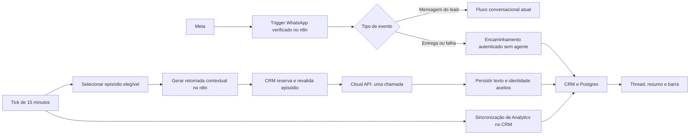

# L14b — Design de reengajamento contextual e consumo

**Spec:** [spec.md](spec.md), aprovada pelo usuário em 2026-10-02.

**Status:** Approved — Design detalhado aprovado pelo usuário em 2026-10-02.

**Escolha:** usuário em 2026-10-02: “Aprovo. Siga com a recomendação”.

**Aprovação do Design:** “Aprovo. Vá para as tarefas. Quanto ao id: capture o navegador com a extensão e pegue o id”. [Tasks](tasks.md) posteriormente aprovadas; Execute em outra janela conforme [EXECUTE-PROMPT.md](EXECUTE-PROMPT.md).

**Baseline:** `main` em `acde7b5`; somente documentos de planejamento alterados.

## Recomendação

Adotar **A: entrada pelo n8n e controle durável no CRM**. O n8n continua recebendo as mensagens
do lead e selecionando episódios no tick de 15min. A retomada usa o contexto e a memória do
agente, com efeitos limitados. O CRM autoriza e reserva uma única chamada de envio por episódio,
persiste o texto aceito e mantém a classificação de entrega e o snapshot mensal de consumo.

Essa abordagem reutiliza o recebimento já publicado e as fronteiras de autorização do CRM.
O custo operacional adicional são execuções curtas de status no n8n. Elas não chamam modelos
nem percorrem buffer, memória, classificação de opt-out ou agente. O envio humano continua
direto pela Cloud API e funciona independentemente dessas execuções.

## Restrições já decididas

| Decisão | Consequência para as duas opções |
| --- | --- |
| Spec A1–A6 | Retomar >=22h/<24h, dentro do horário configurado, só qualificação; uma chamada externa; escalar >=48h |
| Spec A7–A13 | Consumo estimado em superfícies existentes; snapshot mensal; status individuais; sem bloqueio financeiro |
| AD-002, AD-021 | Tenant obrigatório em armazenamento, integração, sessão e leitura por carteira |
| AD-007, AD-010, AD-012 | DAL dinâmica, RSC-first, recomposição das telas e componentes/tokens Astryx |
| AD-013, AD-023 | Contrato externo com códigos estáveis; recusas instrumentadas; retenção operacional de 30 dias |
| AD-014, AD-018 | Workflows como código; efeitos protegidos na fronteira; nenhum novo efeito decidido só por prompt |
| AD-019, AD-034, AD-036 | CRM é fonte do histórico; ponte restrita; purga e atribuição humana preservadas |
| AD-022 | CRM conserva a atribuição automática ao encaminhar para humano |
| AD-026, AD-031 | Modelo datado; qualquer mudança compartilhada de contexto exige paridade e remedição |
| AD-027, AD-033 | Prova conversacional por desfecho e concorrência real; isolamento das suítes de banco |
| AD-035 | Envio humano direto do CRM; falhas de consumo/n8n não bloqueiam esse canal |

## Alternativas com o mesmo escopo

| Aspecto | A — entrada pelo n8n; recomendada | B — entrada pelo CRM |
| --- | --- | --- |
| Recebimento da Meta | Mantém o WhatsApp Trigger publicado | Troca o callback para um endpoint do CRM |
| Autenticidade | Trigger verifica a origem; ramo envia evento normalizado ao CRM por integração autenticada | CRM verifica assinatura sobre corpo original e normaliza |
| Mensagens do lead | Seguem pelo caminho atual | CRM encaminha para uma entrada autenticada do n8n |
| Status de entrega | Ramo separado encaminha ao CRM; gera execução do n8n | CRM persiste diretamente; status não geram execução do n8n |
| Texto da retomada | Agente no n8n com contexto e memória derivados do CRM | Mesmo agente e mesma política |
| Envio único da retomada | CRM reserva episódio, revalida e faz a única chamada à Meta | Mesmo controle e mesmo envio |
| Consumo agregado | Serviço do CRM consulta Analytics; tick existente chama sincronização autenticada | Mesmo serviço e mesma cadência |
| Thread e barra | DAL do CRM lê estado normalizado e snapshot | Mesmo comportamento e mesmas permissões |
| Esforço principal | Novo ramo de status e fronteira de retomada protegida | Também exige novo transporte de inbound, recuperação de falhas e migração do callback |
| Risco de regressão | Concentrado em roteamento e estados novos | Inclui o caminho de entrada de toda conversa |
| Dependência do n8n | Status podem atrasar se a instância cair; saldo fica desatualizado se o tick parar | Status independem do n8n; conversa com agente e tick continuam dependentes |
| Operação | Um callback, credencial de integração existente, sem novo gateway | Callback e transporte novos, com autenticação e recuperação próprias |

A recomendação considera o piloto com dois tenants e o limite do lote. B é viável e entrega
a mesma experiência, mas acrescenta uma migração da entrada para reduzir execuções de status.
Não foi estimado valor em reais: depende do volume e do plano real do n8n.

Não há proposta de segundo WhatsApp Trigger no mesmo app Meta. A documentação do n8n informa
um único webhook por app; trocar para B requer uma migração coordenada, não uma assinatura
paralela que possa substituir silenciosamente o callback atual.
[Fonte oficial](https://docs.n8n.io/integrations/builtin/trigger-nodes/n8n-nodes-base.whatsapptrigger).

## Fluxo da opção A



O diagrama fixa responsabilidades da arquitetura aprovada. A reserva de preparação acontece
antes da geração; a autorização final de envio acontece depois, em transação no CRM.
A continuidade segue AD-036 e integra tanto expiração quanto semeadura da memória.

## Evidência pesquisada

- O schema nativo obtido por `get_node_types` em 2026-10-02 permite selecionar explicitamente
  `delivered` e `failed` em `messageStatusUpdates`. Esses eventos bastam para o caminho mínimo
  de classificação e falha; `sent`/`read` também precisam ser aceitos pelo normalizador quando
  aparecerem em lotes mistos, replay ou prova, sem regredir a evidência de entrega.
- O código primário atual do WhatsApp Trigger calcula HMAC SHA-256 usando o segredo da
  credencial e o corpo bruto, antes de liberar o evento. A assinatura autenticada no n8n
  permite encaminhamento interno verificado, conforme PRECO-02 AC1. A prova da versão
  efetivamente instalada permanece no gate de transporte.
  [Fonte do nó](https://raw.githubusercontent.com/n8n-io/n8n/master/packages/nodes-base/nodes/WhatsApp/WhatsAppTrigger.node.ts).
- A leitura MCP do principal publicado encontrou versão ativa
  `e3e25681-8cd1-4ea3-bc38-33d373cf6b80`, trigger v1 e `updates: [messages]`. O retorno
  sanitizado apresentou `options: {}`, enquanto o fonte e o gerado locais registram a lista
  vazia de status. Isso exige conferir a configuração efetiva e a serialização antes do deploy;
  não é evidência suficiente para afirmar o volume atual de execuções de status.
- O envio normal do agente já grava `messages[0].id` como `externalId` em
  `n8n/workflows/tool-responder-lead.ts:327`; o envio humano faz isso com o `wamid` no CRM.
  Há identidade para correlação sem inferir a mensagem pelo texto ou telefone do lead.
- A pesquisa documental da Meta sobre preços e Analytics está em [context.md](context.md).
  Ainda não houve consulta à conta nem mensagem de teste neste planejamento.

## Risks & Concerns

| Concern | Location (file:line) | Impact | Mitigation nas duas opções |
| --- | --- | --- | --- |
| Status atualmente descartados | `n8n/workflows/principal.ts:95`, `n8n/workflows/principal.ts:135` | Classificação fica pendente | Em A, rotear status antes do filtro; em B, processar na entrada do CRM; provar que não alcançam o agente |
| Diferença no parâmetro de status retornado pelo MCP | `n8n/generated/principal.ts:102`; leitura da versão ativa descrita acima | Publicação pode usar padrão all inadvertidamente | Conferir parâmetro efetivo e serializer; escolher delivered/failed explicitamente; testar configuração gerada |
| Expiração e semeadura cortam sessão separadamente | `n8n/src/session.mjs:35`, `n8n/src/session.mjs:63` | Alterar apenas uma etapa perde assunto em cold start | Aplicar a mesma ponte da AD-036 nas duas e provar paridade |
| Buffer registra tempo de processamento | `n8n/workflows/principal.ts:326` | Cache não é âncora autoritativa para enviar | Revalidar identidade e tempo do último inbound real no CRM antes da chamada |
| Pós-turno rearma reengajamento | `n8n/workflows/principal.ts:2121` | Retomada poderia rearmar a si própria | Distinguir turno proativo e estado durável do episódio; lastInboundAt só muda com inbound real |
| Seleção atual ampla e além da janela | `n8n/workflows/scheduler.ts:366`, `n8n/workflows/scheduler.ts:386` | Contato vencido ou com lead já agendado | Limitar >=22h/<24h e em_qualificacao; validar regras no CRM |
| Escalonamento depende de reengaged=true | `n8n/workflows/scheduler.ts:625` | Omissão/recusa impede desfecho | Desacoplar sucesso de envio do silêncio >=48h; manter trava humana e atribuição |
| Reserva humana permite retomar estado velho | `src/server/data/index.ts:1533` | Reutilização literal pode reenviar resultado incerto | Reusar padrão de unicidade/CAS, com estados próprios e proibição permanente de nova chamada após despacho do episódio |
| Cliente trata falhas por códigos gerais | `src/server/whatsapp/cloud-api.ts:19` | Timeout, resposta sem identidade e recusa podem ser confundidos | Distinguir pré-chamada, recusa comprovada, aceite e resultado incerto no serviço de retomada |
| Somente número por lead está modelado | `src/db/schema.ts:241`; AD-035 | Barra não conhece WABA/fuso/vínculo global confiável | Confirmar cadastro servidor do número/conta/tenant; dado desconhecido não publica saldo |
| Cron Vercel existente é diário | `vercel.json:5` | Nova cadência pode depender de plano não confirmado | Reutilizar tick n8n de 15min para chamar sincronização no CRM; cron diário conserva limpeza |
| Fontes de prompt compartilhadas e teto medido | `n8n/workflows/principal.ts:1236`; AD-031 | Mudança pode tornar medição antiga inválida | Reusar módulos compartilhados; acompanhar identidade do benchmark e remedir se necessário |
| Recibo pode anteceder persistência da mensagem | `n8n/workflows/tool-responder-lead.ts:311`, `src/server/chats/human-send.ts:143` | Evento ficaria perdido | Persistir evento órfão normalizado com prazo de 30 dias e correlacionar após o registro |
| Fase só no cache | `n8n/workflows/principal.ts:2120`, `src/db/schema.ts:184` | Gate CRM não é atômico | Projeção versionada; sincronizar todos os escritores; unknown bloqueia proativo |
| Ingestão não trava lead | `src/server/data/index.ts:2302` | TOCTOU com autorização | Lock + dedup/cancelamento/ponte na mesma transação |
| Atribuição não é transação única | `src/server/data/index.ts:2104` | Corrida em 48h | Executor transacional e update condicionado ao episódio/âncora |
| Canal só no lead atual | `src/db/schema.ts:241` | Correlaciona número errado após troca | Canal por mensagem; histórico sem backfill presumido |
| Metadata só na última bolha | `src/components/chats/message-thread.tsx:100` | Classificação some em grupos | Metadata por saída, preservando autor |
| Composer oculto para agente | `app/(crm)/chats/page.tsx:176` | Aviso invisível no automático | Resumo irmão no footer |
| Conta/WABA ainda não confirmada | `.specs/features/lote-14b-reengajamento-contextual/context.md:193` | Barra pode ser inviável na conta | Gate real, sem saldo presumido ou fallback local |

## Code Reuse Analysis

| Componente existente | Localização | Reutilização e limite |
| --- | --- | --- |
| Autenticação/parser/wrapper | `src/server/integration/auth.ts`, `parsers.ts`, `route-wrapper.ts` | Tenant resolvido pela chave, teto de corpo de 100 KiB, problem+json e instrumentação |
| Ingestão idempotente | `src/server/data/index.ts:2296` | Transação e unicidade; acrescentar lock do lead, canal e atualização do episódio |
| Condução e horário | `n8n/src/conduction.mjs`, `business-hours.mjs` | Mesmas funções puras no CRM e Code nodes, sem duplicar políticas |
| Sessão e autoria | `n8n/src/session.mjs` | Corte de 12h, teto de 50 e humano→system; extensão explícita para ponte |
| Persona/qualificação | `n8n/src/system-message.mjs`, `phase.mjs` | Builder atual, campos/perguntados e fatos da equipe; adapter proativo |
| Cloud API | `src/server/whatsapp/cloud-api.ts` | Transporte/timeout, acrescentando evidência do resultado e preservando códigos humanos |
| Reserva humana | `src/server/data/index.ts:1549` | Unicidade/CAS; não copiar recuperação de reserva `enviando` antiga |
| Atribuição | `src/server/data/index.ts:2104`, `src/lib/broker-assignment.ts`, `broker-availability.ts` | Seleção existente em executor transacional; não abrir transação aninhada |
| Scheduler | `n8n/workflows/scheduler.ts` | Tick de 15min; substituir B/C, conservar lembrete A e reset D |
| Thread/refresh | `src/components/chats/message-thread.tsx`, `chat-refresh.tsx` | Autoria/agrupamento e refresh de 5s; classificação por bolha |
| Configurações | `src/components/settings/settings-form.tsx` | Consumo somente leitura junto do WhatsApp, fora do estado editável |
| Manutenção | `app/api/cron/expire-documents/route.ts` | Limpeza na rotina diária autenticada existente; sem cron novo de 15min |

Sem dependências novas propostas. Guia instalado de Route Handlers do Next 16.2.11 lido em
`node_modules/next/dist/docs/01-app/01-getting-started/15-route-handlers.md`; handlers seguem
Request/Response e parâmetros dinâmicos assíncronos.

## Components and Interfaces

Localizações novas abaixo são propostas. Separar serviços de domínio do DAL geral para
não aumentar suas funções extensas. Dependências: Postgres/Drizzle, integração existente,
regras puras compartilhadas e Cloud API já usada pelo canal humano.

| Componente | Localização proposta | Interfaces |
| --- | --- | --- |
| Estado mínimo do agente | `src/server/reengagement/agent-state.ts` | `publishAgentState(tenantId, leadId, input)`; lock, âncora e revisão de reset |
| Episódios | `src/server/reengagement/repository.ts` | `listCandidates`, `claimPreparation`, `authorizeDispatch`, `reconcileAcceptance`, `escalateSilence` |
| Contexto e ponte | `src/server/reengagement/context.ts` | `prepareFrame`, `getSessionFrame`, `invalidateBridge`; mensagens/estado do agente e sessão compartilhada |
| Envio proativo | `src/server/reengagement/send.ts` | `sendPreparedEpisode(tenantId, leadId, episodeId, claimToken, text)`; repositório + transporte |
| Recibos | `src/server/whatsapp/statuses.ts` | `ingestStatusBatch`, `attachReceipt`, `classifyReceipt`; canal confiável e mensagens |
| Analytics | `src/server/whatsapp/analytics.ts` | `syncUsage(tenantId, phoneNumberId)` + normalizador mensal; token servidor e lease/CAS |
| Leituras autorizadas | `src/server/data/whatsapp.ts` | `getSettingsUsage(session)`, `getConversationUsage(scope, conversationId)`, `getMessageClassifications(scope, conversationId)` |
| Agente proativo | `n8n/workflows/reengagement-contextual.ts` | Trigger interno tipado; frame→texto; sem chamada Meta |
| Regras puras | `n8n/src/reengagement.mjs`, extensão de `session.mjs` | Limites/frame/ponte e adapter de prompt, importáveis no CRM/testes |
| Barra/resumo | `src/components/whatsapp/usage-summary.tsx` | `UsageView`; ProgressBar/Text/Banner; RSC-compatible |
| Rótulo da mensagem | `src/components/chats/message-pricing.tsx` | `MessagePricingView`; metadata de cada saída |

### Contrato em `/api/v1`

Todas as rotas usam `withIntegrationRoute`. Chave e configuração determinam tenant/canal;
corpo e modelo não escolhem credencial ou destinatário. Reutilizar parser, limite de 100 KiB,
validação de IDs/datas e erros estáveis. Controle de relógio só nas provas locais.

| Método/caminho | Entrada | Resultado |
| --- | --- | --- |
| `POST /leads/{id}/agent-state` | Âncora persistida, reset observado, expectedRevision, fase/perguntados/aberturas | 200 estado/replay; 409 revisão incompatível; nenhum efeito de pipeline |
| `GET /whatsapp/automation/candidates` | Cursor; limit<=100 | IDs/âncora e ação prepare/omit/escalate, sem conteúdo de conversa |
| `POST /leads/{id}/reengagement/prepare` | Âncora esperada | 201 claim nova ou 200 resultado existente; frame/episodeId/token/validade; disputa 409 |
| `POST /leads/{id}/reengagement/{episodeId}/preparation-failure` | Token + código limitado | Libera apenas preparação própria ainda sem autorização |
| `POST /leads/{id}/reengagement/{episodeId}/send` | Token + texto | Revalida/autoriza uma chamada; replay devolve estado sem reenviar |
| `POST /leads/{id}/reengagement/{episodeId}/acknowledgement` | wamid/aceite vindos da resposta do serviço de envio | Repete somente persistência idempotente, nunca Meta |
| `POST /leads/{id}/reengagement/expire` | Âncora esperada | Omissão >=24h sem despacho ou escalonamento protegido >=48h |
| `POST /leads/{id}/session-context` | Até 50 IDs de inbound do buffer corrente | Frame/revisão de ponte e reset/indicação de reconstrução; só leitura |
| `POST /whatsapp/statuses` | Número + até 100 status normalizados | 200 idempotente; rejeição de vínculo/validação não altera lote |
| `POST /whatsapp/usage/sync` | ID do número cadastrado no tenant | Snapshot/indisponível/skip por cadência; consulta montada no servidor |

Estender ingestão de mensagens com `whatsappPhoneNumberId` aditivo, capturado no evento/envio;
resposta fornece o ID interno da âncora. Contrato legado sem canal continua aceito, mas não
ganha correlação por inferência. Classificação pode ser campo aditivo na leitura de mensagens;
a tela usa DAL. Atualizar OpenAPI e documentação junto da implementação.

Leitura/ingestão fornecem também âncora corrente e revisão de estado para o principal publicar
agent-state depois do buffer. Não assumir que a última mensagem processada pelo n8n é a
última cronológica no CRM. Inbounds fora de ordem e publicação de turno antigo devem resultar
em 409 ou replay inofensivo, sem reabrir a fase de uma âncora mais nova.

Códigos novos: `episodio-em-preparacao`, `claim-expirada`, `contexto-alterado`,
`episodio-consumido`, `canal-nao-vinculado`, `estado-agente-desconhecido`,
`retomada-resultado-pendente`. Reutilizar códigos atuais de autorização/condução/status/corpo.
Incerteza é resultado persistido, não erro que autorize outro envio. Repetir o mesmo POST
após perder resposta HTTP é seguro por estado/token, nunca por presumir idempotência da Meta.

## Data Models

Migração aditiva; tenant em todas as tabelas. FKs/consultas conferem propriedade de
lead/conversa/mensagem, não apenas um UUID. Fase, despacho, entrega e saldo são eixos distintos.

### `whatsapp_channels`

`id`, `tenant_id`, `phone_number_id`, número comercial normalizado para Analytics,
`waba_id` nullable, fuso IANA da conta nullable, `ownership_verified_at`,
`analytics_verified_at`, `usage_enabled`, `configuration_revision`, timestamps e coordenação
por canal (`last_usage_attempt_at`, `usage_sync_token`, `usage_sync_deadline`).
`account_kind` (`unverified`, `test`, `production`, padrão `unverified`) guarda a
evidência operacional exigida pelo gate T7. Nome diferente de conta de teste não
comprova produção. Esse campo aditivo impede habilitar consumo de conta de teste
mesmo com outros metadados presentes; não cadastra nem verifica a conta remota.
Unicidade global de phoneNumberId: um número físico não pertence a dois tenants simultaneamente.
Sem token na tabela; resolver credencial no servidor, usando env atual no piloto.

Vínculo confiável de entrada é cadastrado operacionalmente a partir da configuração do tenant
e confirmado na integração. WABA/fuso/acesso a Analytics exigem prova adicional para barra
numérica. Não criar formulário de WABA ou token. Texto do número em Configurações não é
identidade suficiente para associar Analytics.

T7 `resolveChannel(context, { phoneNumberId, expectedRevision? })` recebe somente
contexto já autorizado por authenticate/verifySession, consulta tenant+número e
exige ownershipVerifiedAt. Revisão antiga falha antes de consumir a credencial.
WHATSAPP_ACCESS_TOKEN é lido apenas para presença no processo servidor; não é
retornado ou logado, e transportes continuam lendo-o diretamente no servidor.
O módulo usa server-only, conforme guia Next instalado de Server/Client Components.

Identidade/credencial e capacidade de Analytics são separadas. Canal confiável
continua resolvido com consumo indisponível quando accountKind é test/unverified,
WABA/fuso/Analytics não foram provados ou usageEnabled está desligado. Analytics
só habilita com produção explícita, todas as provas/campos, IANA válido e flag
ativa. Intl valida UTC ou nomes com barra, rejeitando abreviação/offset/fuso
desconhecido. Isso valida o cadastro, sem inventar prova externa da conta.

O retorno é configuração interna do servidor, com WABA somente na capacidade
Analytics habilitada. DTOs do cliente serão projetados na T14 sem WABA/segredo;
não serializar esse retorno para o navegador. O resolvedor não consulta Graph,
não cadastra canal e não infere identidade de agentWhatsapp/telefone da lead.
Não amplia carteira/permissão; futuras leituras/handlers usam as guardas existentes.

### `lead_agent_state`

Uma linha por `(tenant_id, lead_id)`: `anchor_message_id`, fase nullable
(`qualificando`, `agendando`, `encerrada`), nomes conhecidos de campos perguntados (até 8),
estados de aberturas da persona, `reset_observed_at`, `revision`, `updated_at`.
Reusar valores/limites da política existente, sem novos fatos do lead.

FKs compostas `(tenant_id, lead_id)` e `(tenant_id, anchor_message_id)` conferem
propriedade do tenant. Índices únicos aditivos em leads/messages tornam esses
pares alvos de FK. A verificação de que a âncora é o inbound corrente da mesma
lead é da escrita T16 sob lock, consultando a conversa; as FKs não afirmam esse
vínculo dentro do mesmo tenant. Fase nasce null; asked_fields reutiliza os oito
nomes de phase.mjs, opening_history preserva o estado da persona. Exclusão da
lead ou âncora remove sua projeção derivada, sem cópia paralela de histórico.

A fase hoje só existe em conversa_estado. O principal publica alterações/encerramentos no
CRM antes de gravar a projeção correspondente no cache. Escrita exige âncora corrente,
reset igual ao do lead e expectedRevision; replay idêntico é idempotente. Execução antiga
não reabre fase fechada nem sobrescreve outra âncora. Novo inbound invalida fase e incrementa
revisão na mesma transação; depois o principal publica o novo estado. Falha de sincronização
impede automação proativa, sem bloquear canal humano. Bootstrap de leads anteriores lê estado
real do n8n com as mesmas verificações; ausência nunca vira `qualificando` por suposição.

### `reengagement_episodes`

Chave única `(tenant_id, lead_id, phone_number_id, anchor_message_id)`. Campos:

- Âncora/horário, reset/revisão do agente observados, state e reasonCode.
- ClaimToken/validade/preparedAt; texto transitório efetivamente submetido.
- DispatchAuthorizedAt imutável, prazo de conclusão, acceptedAt, wamid e messageId.
- Referências da sessão de origem/retomada/primeiro inbound vinculado; revisão e invalidação
  da ponte, instante do último inbound da sessão retomada.
- Escalonamento como eixo separado: escalatedAt e resultado/motivo da transição.

Índices por lead/âncora, claims vencidas e aceite pendente. Reset não cria segunda tentativa
da mesma âncora. Marcador de despacho permanece consumido após timeout ou recusa.

T4 implementa o modelo: enum dos oito estados abaixo, claims e prazos pareados,
revisões positivas e identidade obrigatória nos resultados aceitos. A chave não
contém reset ou revisão. CHECKs validam a forma da linha; não substituem os locks,
CAS e a imutabilidade de dispatchAuthorizedAt nos serviços T20/T21.

Todas as referências têm FKs compostas com tenant. A relação corrente com a
mesma lead é revalidada pela conversa nos serviços; tenant/message não prova
essa relação. Âncora e canal usam NO ACTION: exclusão isolada não apaga proteção
nem permite recriar tentativa após recadastrar o número. Atualizar configuração
do canal usa sua revisão. A FK da lead usa cascade na exclusão integral da lead;
essa operação é diferente da limpeza temporária e deve respeitar o ciclo do CRM.

Saída, limites da sessão de origem e primeiro inbound são UUIDs nullable com
NO ACTION, sem cópia das conversas. T63/T64 devem limpar essas referências antes
de excluir suas mensagens, na mesma transação. Limpar saída não limpa wamid,
state, chave ou dispatchAuthorizedAt. accepted continua válido após essa limpeza;
messageId não é obrigatório permanentemente. T63 decide explicitamente quando
a proteção contra duplicação deixou de ser necessária antes de remover episódio
e âncora; o prazo de 30 dias não autoriza apagar essa proteção por cascade.
Texto submetido e metadados temporários seguem retenção, enquanto classificação
normalizada acompanha a mensagem (L14B-01 AC5/6). O CRM atual não purga mensagens
na rotina lgpd.ts; T4 não introduz uma purga automática.

### `messages`: canal por mensagem

Adicionar whatsappPhoneNumberId nullable. Humano, responder_lead, saída fixa/contingência e
retomada informam número realmente usado e wamid. Não preencher histórico com número atual
do lead, que pode ter mudado. Mensagem sem canal/identidade confiável recebe classificação
indisponível, nunca gratuidade inferida.

T5 não adiciona FK de whatsappPhoneNumberId ao cadastro do canal: a mensagem
histórica preserva o número efetivamente usado, e escrita humana/legado não
depende de ativar Analytics. Ausência de canal não gera associação por telefone.

### `whatsapp_message_receipts`

Uma linha por `(tenant_id, phone_number_id, wamid)`; messageId nullable. Evidências normalizadas
de sent/delivered/read/failed e instantes, pricingModel/category/type/billable observados,
conflito/classificação derivada, código limitado de falha, first/lastSeen, expiração se órfão.
Sem conteúdo, recipient_id, telefone pessoal ou payload bruto permanente.

Vincular só a mensagem de saída com mesmo tenant/canal/wamid. Status anterior à mensagem
fica órfão até ingestão/ack: não cria bolha sintética. Recibo vinculado acompanha retenção
da mensagem; excluí-la não cria um órfão permanente.

T5 usa PK tenant/canal/wamid e FK composta tenant/canal/wamid/messageId para
messages(tenant/whatsappPhoneNumberId/externalId/id), com índice unique aditivo
nessa identidade. Canal confiável também tem FK composta. A FK da mensagem usa
cascade: o recibo vinculado sai junto com a mensagem. A direção de saída é
validada pela consulta T10, sem afirmar que a FK distingue sender. Órfão tem
messageId null e orphanExpiresAt preenchido (padrão firstSeenAt+30 dias); vínculo
exige retirar a expiração temporária. A rotina T63 executa a purga pelo prazo.

Evidências sent/delivered/read/failed têm timestamps separados. Os nomes internos
da classificação são pending, paid_service, free_service, free_entry_point,
unavailable e not_delivered, correspondentes à tabela de classificações abaixo.
pricingModel/category/pricingType/billable são nullable; formato desconhecido
não é descartado nem inferido como gratuito. pricingConflict exige unavailable.
failureCode guarda apenas inteiro normalizado, sem mensagem/payload da falha.
firstSeenAt/lastSeenAt são distintos e ordenados. T8/T9 provarão a redução,
autenticidade, replay e classificação a partir da evidência; T5 prova o modelo.

### `whatsapp_usage`

Chave `(tenant_id, phone_number_id, month_start, configuration_revision)`: fuso confirmado,
início/fim civil do mês, queryEnd, freeServiceVolume, lastSuccessAt, lastAttemptAt, failureCode,
sequência de consulta e token da resposta. A lease/cadência ficam na linha do canal, sob lock,
protegendo também troca de mês/configuração sem reiniciar o intervalo de 15min.
Snapshot substitui anterior do mesmo período; histórico não é exibido no mês seguinte.
Guardar snapshot necessário e metadados operacionais até 30 dias, sem relatório histórico.
queryEnd e lastSuccessAt são distintos.

T6 modela freeServiceVolume nullable sem default; null significa desconhecido,
nunca volume zero. Um sucesso exige volume inteiro não negativo, queryEnd e
lastSuccessAt presentes juntos. queryEnd representa o corte da última resposta
mensal aceita, dentro do período; tentativa/falha subsequente preserva esse corte
e volume. lastAttemptAt/failureCode são campos independentes. Sequência não
negativa e UUID responseToken identificam a resposta; lease continua no canal.
T12/T13 validarão safe integer, proveniência da resposta e CAS da sequência.

O período tem accountTimezone sem default e fronteiras civis verificadas com
AT TIME ZONE no Postgres, inclusive DST; isso não comprova o fuso real da conta.
T7 resolverá a evidência registrada; T11 calculará as fronteiras do mês corrente.
FK tenant/canal e PK de período/revisão impedem mistura; revisão positiva não
afirma ser a configuração corrente, gate transacional que pertence à T13.

expiresAt é metadado operacional com índice, sem rotina automática nesta tarefa.
T63 decidirá a remoção por idade e necessidade: expirar uma linha não pode
apagar o snapshot corrente ainda necessário para apresentação. O modelo não
cria relatório histórico nem transporta volume ao novo mês; seleção corrente e
retenção efetiva serão provadas nos serviços T14/T63.

## Episódio: concorrência e resultados

### Preparação e autorização

Tick lista candidatos no CRM, paginados por ID com corte do tick, sem varrer histórico
ilimitado nem usar lastInboundAt do buffer como relógio autoritativo. Considera último inbound
real, fase conhecida, canal, status e condução. Fora de horário aguarda oportunidade <24h;
>=24h registra omissão, >=48h oferece escalonamento, sem depender de reengaged do cache.

Prepare trava lead, resolve âncora por sentAt/id e verifica silêncio >=22h/<24h e demais
condições. Claim de preparação de 5min, token novo a cada aquisição. Geração tem limite
TOTAL de 120s: timeout individual do modelo não limita múltiplas iterações. Worker antigo
não finaliza claim recuperada. Falha anterior ao despacho libera preparação para outro tick
elegível. Lease recupera apenas episódio sem dispatchAuthorizedAt. Texto vazio após trim ou
String.length>4096 encerra preparação sem mensagem fixa ou divisão de texto.

Antes do lock final, validar transporte/texto. Dentro da transação, travar lead e episódio
nesta ordem e revalidar token, âncora, canal, reset, revisão/fase, status, opt-out, condução,
janela e horário pelo relógio servidor. Persistir texto e dispatchAuthorizedAt antes do commit.
Somente o worker que realiza a transição pode fazer uma chamada à Cloud API. Sem retry de
envio, resgate de autorização velha ou retry automático do nó Meta.

Ingestão de inbound e mutações de opt-out/takeover/reset/fase usam a mesma ordem de locks
quando afetam episódios. Mudança persistida antes da autorização cancela ou é observada;
mudança posterior ao commit não recolhe chamada autorizada. Nenhuma extensão pode travar
episódio antes do lead, evitando deadlock com ingestão.

| Estado | Evidência | Recuperação permitida |
| --- | --- | --- |
| preparing | Claim válida, sem despacho | Só preparação/geração após falha ou lease vencida |
| cancelled | Contexto/condução alterados antes de autorizar | Nenhum envio desse episódio |
| omitted | Janela perdida sem despacho | Sem contato; ainda há desfecho de 48h |
| authorized | Marcador permanente, chamada em andamento | Consultar estado, nunca repetir chamada |
| accepted_pending_record | Resposta com wamid; gravação incompleta | Repetir só ack/ingestão |
| accepted | Identidade e mensagem persistidas | Recibos e ponte, sem reenvio |
| refused | Recusa comprovada da Meta | Registrar código, não reenviar |
| uncertain | Timeout/interrupção/resposta sem identidade/5xx ambíguo/crash após autorização | Não reenviar; somente anexar evidência verificável |

Cliente atual agrupa falhas gerais. Acrescentar evidência tipada para o proativo preservando
códigos humanos. Após invocar transporte, falha não volta a ser “anterior à chamada”. Crash
entre commit e fetch é incerto. Não presumir idempotência Meta por requestId local.

Aceite grava episódio/mensagem/correlação em transação, com texto real e autoria agente,
sem mudar lastInboundAt/perguntados/pipeline. Se falhar, devolver identidade e aceite pendente
ao caller n8n; caller repete só acknowledgement, com campos da resposta, nunca do modelo.
Se identidade se perder antes de registro durável ou resposta, conservar incerteza: não
inventar wamid/aceite por texto ou horário. Tick reconcilia identidades duráveis e marca
autorizações abandonadas após 2min como incertas, sem reenviar.

Não depender de biz_opaque_callback_data: contrato não confirmado em fonte primária nesta
consulta. Essa limitação fica coberta pelo resultado incerto aprovado, não por retry.

### Escalonamento >=48h

Expire relê âncora/elegibilidade no lock, independente de horário e resultado da retomada.
Sem episódio existente, cria tombstone de omissão e registra transição. Novo inbound,
opt-out, fase fechada, status agendado/humano e takeover cancelam. statusChangedBy=humano
preserva trava atual. Seleção de corretor usa executor transacional: responsável/status/
motivo/escalatedAt gravados juntos. Responsável existente é conservado; sem corretor ativo
pode escalar sem responsável, conforme AD-022. Motivo contém ausência de resposta e resultado
real aceita/recusada/incerta/omitida. Não envia mensagem ao lead. Espelhar fase encerrada no
n8n depois do commit; replay do espelhamento não repete a transição.

## Agente proativo e continuidade

### Geração sem efeitos laterais

Workflow interno com o mesmo modelo datado e persona, recebendo frame verificado do CRM:
fatos atuais, fase/perguntados, histórico da sessão de origem, autoria e horário. Conectar
somente consultar_documentos/buscar_imoveis quando necessário, com tenant/lead por expressão
fixa. Não conectar registrar_qualificacao, agendar_reuniao, escalar_para_humano ou responder_lead.
O caller determinístico envia o texto final pela rota protegida, uma única vez.

Adapter de prompt explicita tarefa proativa de sistema, histórico por papel e uma retomada
da pendência; não marca campo perguntado/abertura nem gera inbound sintético. Ferramentas de
escrita ausentes garantem efeitos limitados mesmo se o modelo pedir outro comportamento.
Saída sem texto válido é falha de preparação, sem contingência fixa.

Não conectar Postgres Chat Memory compartilhada: o agente nativo poderia gravar instrução
proativa como fala do usuário e disputar memória com inbound real. Contexto é enquadrado
explicitamente no prompt. Mensagem aceita entra no CRM e na futura reconstrução normal.
Aplicar admissão/teto atuais de documentos; medir overhead do frame proativo e reservar seu
orçamento antes de anexar documentos, sem ampliar teto por suposição. Se mudar system message
compartilhado, atualizar identidade/paridade do benchmark e remedir conforme AD-031.
O adapter não autoriza reescrever a política normal de qualificação.

### Ponte em warm start e cold start

1. Preparação seleciona segmento cronológico que contém a âncora e suas respostas,
   respeitando gaps consecutivos >12h. Ignora apenas intervalo da sessão até preparação,
   guarda referências e limita às últimas 50 mensagens. Não seleciona simplesmente as últimas
   50 do lead sem corte, que poderiam pertencer a outros atendimentos.
2. Aceite registra relação entre sessão de origem e retomada. Primeiro inbound real seguinte,
   persistido após autorização e com instante do evento > âncora e < âncora+48h, consome ponte na transação de ingestão se
   canal/reset/condução permitirem. 48h exatas não consome.
3. Ingestão nova cancela preparação anterior; replay não muda ponte/episódio. Inbound atrasado
   anterior à âncora não estende janela nem cria oportunidade extra. Durante despacho pendente,
   guardar candidato a primeiro inbound. session-context sinaliza resultado pendente; principal
   aguarda conclusão até o prazo de 2min antes de decidir reconstrução. Resultado incerto não
   presume ponte de aceite. Inbound persistido antes da autorização não é resposta à retomada.
   Ordem entre ingestão/autorização é determinada pelo lock; não comparar a precisão em
   segundos da Meta com milissegundos do commit para descartar uma resposta no mesmo segundo.
4. Primeiro inbound com ponte força reconstrução mesmo com memória aquecida. Expiração e
   semeadura recebem o mesmo frame/revisão: não basta desativar só expiração. Relacionar os dois
   gaps especiais por IDs (origem→retomada e retomada→primeira resposta), sem perdoar gaps
   de outros episódios nem entre mensagens posteriores.
5. Enquanto sessão retomada segue ativa pelo último inbound real e regra normal de 12h,
   cold start recompõe mesma ligação/ordem/teto de 50. Exatamente 12h permanece ativo;
   >12h encerra continuidade. Após primeira resposta, 48h não é TTL da sessão retomada.
6. Opt-out/reset invalidam ponte na mesma escrita CRM. Purga D e expiração do principal
   atendem reset atual, sem reaproveitar revisão anterior. Histórico apagado não reaparece:
   ponte tem referências, não cópia paralela de conteúdo.

Frame exclui IDs dos inbounds do buffer corrente da carga semeada: eles entram pelo user
message normal, sem duplicação. Preservar sentAt/id, lead→user, agente→ai e humano→system
atribuído à equipe. Não semear ponte presumida quando leitura falhar; instrumentar e recuperar
contexto antes da geração. O caminho normal sem ponte continua com corte de 12h.

## Status e classificação

Selecionar delivered/failed explicitamente no trigger e verificar HMAC na versão instalada.
Adicionar splitter antes do filtro atual: processar todos os itens, separar arrays messages
e statuses, agrupar por número e preservar ambos quando coexistirem. Status não alcançam
buffer/memória/opt-out classifier/agente. Filtro nativo pode liberar envelope misto quando
um status casar; normalizador aceita sent/read em replay/lotes mistos sem regressão.
Dividir batches pelo limite de quantidade e de bytes codificados; nenhum status válido
deve desaparecer porque seu envelope continha também inbound ou mais de um número.

Trigger entrega change.value e pode não conservar entry.id da WABA. Resolver WABA no cadastro
servidor pelo número autenticado; não inventar do envelope achatado. Encaminhar por integração
autenticada com tenant derivado da configuração, metadado de número e wamid. Sem vínculo,
rejeitar. Falha do ramo status não descarta inbound do mesmo lote; retry apenas do POST
idempotente de status. Nunca ligar saída de erro desse ramo ao agente.

| Evidência | Classificação |
| --- | --- |
| delivered + PMP + service + regular + billable=true | Tarifável — confirmado pela Meta |
| delivered + PMP + service + free_customer_service + billable=false | Gratuita — franquia de serviço |
| delivered + free_entry_point + billable=false em contrato compatível | Gratuita — janela de entrada gratuita |
| Aceite/sent sem entrega/classificação conclusiva | Cobrança pendente de confirmação |
| delivered sem pricing, formato desconhecido, categoria incompatível ou conflito | Classificação indisponível |
| failed sem entrega anterior | Não entregue, sem classificação de cobrança confirmada |

Read conserva evidência de entrega, sem fabricar pricing ausente. Delivered posterior com
pricing válido completa classificação. Sent atrasado não regride delivered/read; failed
posterior não apaga entrega comprovada. Classificações incompatíveis deixam conflito
persistente, sem regra não documentada de “último evento vence”. Replay não soma volume,
cria mensagem ou muda lastInboundAt. Categoria diversa não entra na franquia de serviço;
FEP é isenção separada. Classificação não afirma valor final de fatura.

T9 implementa o serviço com contexto de origem opaque registrado no servidor.
A factory recebe AuthResult da autenticação existente e prova de configuração
servidor do forwarder: workflow/versão ativa/versão do trigger, data da prova,
HMAC SHA256 sobre corpo bruto, rejeição de assinatura inválida e hash da
credencial autenticada correspondente. Nenhum campo verified do payload
concede esse contexto. Ausência de prova é recusa; T43/T49 só concedem a
capacidade após o gate factual instalado. Fixtures não são prova desse gate.
Lote é validado integralmente antes de escrever; canal é relido sob lock.
Bulk insert/select FOR UPDATE em ordem de wamid/bulk update conservam vínculo,
firstSeen/expiração e lastSeen monotônico. Replay sem nova evidência não muda
linha. Imports de persistência são tardios para manter o reducer puro testável.

## Consumo mensal

### Consulta e normalização

Só canal com tenant/número/WABA/fuso/acesso confirmados habilita usage_enabled. Tick sincroniza
números habilitados mesmo sem candidatos, uma chamada CRM por número. Páginas/polls só leem
estado persistido. Não criar cron Vercel15min ou pressupor plano que permita essa cadência.

CRM monta pricing_analytics do mês corrente completo até queryEnd, VOLUME, SERVICE e
FREE_CUSTOMER_SERVICE, com dimensão que identifica número. Não usar COST/TIER ou contagem
local como fallback. Adapter valida no gate real sintaxe versionada e se filtro usa ID ou
número normalizado; não inserir phoneNumberId em parâmetro não comprovado. Resposta pode
conter partições de países: selecionar número confirmado e somar só partições disjuntas,
sem somar total e detalhe juntos.
[Fonte primária](https://developers.facebook.com/documentation/business-messaging/whatsapp/analytics#pricing-analytics).

Validar integralidade dos filtros/período, volumes inteiros não negativos, datas e identidade.
Vazio sem prova de zero, agregado sem discriminação, sobreposição, paginação incompleta ou
contrato desconhecido não publicam saldo. Representação real de zero é gate de conta;
ausência de ponto não significa zero. Se contrato inviabilizar snapshot aprovado, registrar
evidência e revisar spec com usuário antes de substituir fonte.

Fronteiras civis no fuso IANA confirmado, usando AT TIME ZONE no Postgres ou equivalente
verificado; armazenar UTC. Não assumir o fuso SP do contato como fuso da conta. QueryEnd é
capturado no começo da consulta; fim civil é metadado, não consulta de período futuro.

Restante=max(0,1000−V); progresso visual=min(V,1000)/1000. Texto conserva V reportado mesmo
se >1000, sem mascarar discrepância. A mensagem 1.001 pode ser tarifável enquanto V continua
1000. Inbound, FEP, templates e tentativas falhas não entram; webhook nunca é adicionado.

### Cadência e falhas

CAS/lease por canal, token e deadline de 90s; transporte Graph com timeout de 15s e orçamento
total do handler inferior à lease. LastAttemptAt impede nova sincronização automática antes
de 15min, inclusive falha/replay. Processo interrompido e recuperação da lease devem ser
provados sem sobreposição de chamadas; worker atrasado confere token/prazo antes do transporte
e antes da persistência. Não manter conexão Graph aberta depois do orçamento do worker.
Persistência exige token/revisão/período atuais; consulta antiga não substitui snapshot mais
recente nem de outro mês/número.

429, timeout/permissão registram código e conservam último snapshot do período corrente.
Falha nunca publica zero. >60min sem sucesso mostra Dados desatualizados; exatamente 60min
ainda não. Falha recente aparece como Falha na atualização antes de ficar stale. Virada do
mês invalida apresentação do anterior; novo mês fica indisponível até primeira resposta
válida, respeitando cadência por número. Consulta recente continua estimada: HALF_HOUR não
é SLA de atualização da Meta.

### DTOs de leitura

```typescript
type UsageView =
  | { state: "unknown-number" | "unavailable"; label: string }
  | { state: "available"; phoneLabel: string; monthLabel: string;
      used: number; remaining: number; queriedAt: string;
      stale: boolean; updateFailed: boolean; estimated: true };

type MessagePricingView = {
  messageId: string;
  state: "paid-service" | "free-service" | "free-entry-point"
    | "pending" | "unavailable" | "not-delivered";
  label: string;
};
```

DTO não contém segredo/WABA ou payload bruto. Só saídas recebem MessagePricingView.
Saldo/classificação não bloqueiam o envio autorizado.

## UI e autorização

Discovery Astryx realizado: build da ideia, templates ChatComposerValidation/settings,
componentes ProgressBar/Banner/Token/Text e docs layout. Wrapper npx apontava para npm ausente;
usou-se npx-cli da instalação existente em C:/Program Files/nodejs, sem instalar/alterar pacotes.
Antes da implementação, conferir props de layout/Chat efetivamente usadas e reler o self-check
do AGENTS. Não há UI implementada neste artefato.

Frame: manter AppShell/Layout atuais. Chats tem lista de 320px, conteúdo flexível, cabeçalho fixo,
thread com rolagem própria e footer perto do composer. Orçamento de resumo/aviso ~56–80px,
crescendo com quebra de texto, sem altura rígida. Thread absorve redução da área. Em largura
estreita, texto quebra dentro da conversa, sem nova rolagem horizontal ou mudança de navegação.
Esses budgets são planejamento; implementação usa props e tokens, sem CSS/arbitrários.

Resumo é irmão do HumanComposer e aparece também quando composer humano está oculto na
condução agente. Não ocupar status do composer, reservado à janela/falha de envio, nem
remountá-lo no refresh. Configurações mantém seção de identidade/FormLayout, abaixo do
WhatsApp, com grupo de consumo somente leitura.

| Estado | Apresentação |
| --- | --- |
| Snapshot válido e saldo positivo | Franquia de serviço — estimativa; usadas/restantes/mês/consulta; sem prometer próxima entrega grátis |
| Saldo zero | Banner warning persistente: Mensagens de serviço podem gerar cobrança; continua durante envio/espera |
| Desatualizado | Último valor do mês + Dados desatualizados; explicitar que não prevê cobrança com esse dado |
| Falha recente | Valor válido do mês + Falha na atualização; saldo continua estimado |
| Sem snapshot válido do mês | Consumo indisponível; sem barra preenchida/saldo inicial presumido |
| Conversa sem canal | Número da conversa não identificado; não usar outro número do tenant |

ProgressBar: label acessível, value, max=1000 e formatter textual; valores/mês também em Text.
Não animar barra indeterminada permanente para unknown. Banner usa status/description/container,
sem confirmação/dismiss para saldo zero. Stack/FormLayout e tokens; nenhum CSS/estilo inline
ou div de layout novo. Aviso de custo não modifica draft/requestId/estado de envio.

Cada bolha de saída tem classificação própria em ChatMessageMetadata, inclusive primeira de
um grupo; preservar autoria/timestamp/agrupamento. Inbound não recebe rótulo de custo. Text
com frase completa e quebra; Token só para estado curto, sem truncar explicação. Sem Badge
decorativo. Configurações mostra barra por número acompanhado, sem confundir input editável
com contexto confirmado da conta.

RSC verifica sessão/carteira antes da leitura e carrega recibos/snapshots em lote, sem N+1.
Configurações exige permissão atual de admin/gestor. Chats exige conversa autorizada; corretor
recebe só agregado do número dessa conversa, sem endpoint genérico para listar números fora
da carteira. Troca de tenant/conversa invalida contexto anterior. Refresh atual reflete
classificação persistida, sem Graph por poll ou novo store global.

## Error Handling Strategy

| Falha | Tratamento | Efeito |
| --- | --- | --- |
| Elegibilidade/fase/contexto ilegível | Não autorizar; motivo operacional | Sem retomada inventada; humano independente |
| Geração/leitura falha ou texto inválido | Liberar só preparação não autorizada | Sem mensagem fixa; possível outro tick elegível |
| Estado muda durante geração | Cancelar no lock final | Sem chamada se mudança precede autorização |
| Recusa/timeout/crash após despacho | Recusada/incerta consumida | Não duplica nem fabrica aceite |
| Aceite conhecido sem gravação | Reconciliar exclusivamente persistência | Bolha posterior com texto/identidade corretos |
| Status inválido/sem vínculo | Rejeitar/instrumentar sem conteúdo | Não afeta outro tenant/canal |
| Órfão/conflito | Guardar normalizado/classificação indisponível | Sem bolha sintética/gratuidade inferida |
| Analytics falha/vazio não comprovado | Conservar snapshot do mês | Falha/stale/indisponível; envio continua |
| n8n/tick indisponível | Contato suspenso e status atrasados | Pendência de confirmação e saldo envelhecido explícitos |

## Retenção e operação

Rotina diária remove órfãos/metadados temporários com idade >=30 dias, leases concluídas e
snapshots históricos dispensáveis. Texto transitório é removido após gravado na mensagem,
ou quando tentativa sem aceite termina. Nunca armazenar frame/histórico no episódio.

Compactar episódio velho mantendo chave/resultado/marcador de despacho enquanto sua âncora
ainda puder ser encontrada: limpeza não rearma contato. Ponte mantém referências durante
sessão retomada ativa, mesmo se superar 30 dias por novos inbounds, e expira após reset,
apagamento ou encerramento da continuidade. Exclusão do lead/histórico segue CRM sem cópia
paralela para recuperação. Logs: IDs/códigos/versões/duração, sem token/conversa completa/
telefone pessoal. Manutenção não apaga classificação vinculada a mensagem ainda retida.

## Tech Decisions

| Decisão | Escolha | Motivo |
| --- | --- | --- |
| Propriedade durável | CRM/Postgres para episódio/recibo/snapshot | Reexecução n8n não apaga proteção; AD-037 |
| Estado da geração | Proativo sem shared memory e tools de escrita | Impede turno sintético e efeitos não autorizados |
| Fase no gate | Projeção mínima versionada no CRM | Revalidação junto das demais condições |
| Falha após autorização | Tentativa conservadoramente consumida | Idempotência externa não comprovada |
| Aceite vs entrega | Eixos separados | wamid não garante delivered ou gratuidade |
| Barra | Analytics exclusivamente | Inclui uso externo e não duplica webhook |
| UI | RSC/DAL e refresh existentes | Sem Graph por sessão/poll |
| Relógios | Contato SP; mês no fuso confirmado da conta | Regras distintas, sem equivalência presumida |

## Matriz de cobertura planejada

| Requisito | Componentes | Prova discriminante |
| --- | --- | --- |
| REEN-01 | candidates/prepare/expire/horário | Limites22h/24h/comercial, fase unknown, ausência de template |
| REEN-02 | frame/agente/send | Pendência/fato humano, tools de escrita ausentes, vazio/4096/4097, texto real após aceite |
| REEN-03 | episódio/lock/transporte | Dois workers em Postgres real; inbound/takeover/reset durante geração; crash e aceite sem registro |
| REEN-04 | ponte/ingestão/session-context/principal | Mesmo roteiro warm/cold, <48h/=48h, 12h/+1ms, teto50/reset/autoria |
| REEN-05 | expire/atribuição | >=48h aceita/recusada/incerta/omitida, corrida inbound, trava humana e responsável |
| PRECO-01 | reducer/rótulo | Regular/free/FEP, categoria diversa, sem pricing/failed/read fora de ordem |
| PRECO-02 | trigger/splitter/statuses/attach | Assinatura/vínculo/lote misto/replay/órfão/conflito/isolamento |
| USO-01 | Analytics/normalizador | V0/999/1000/1001, partições/vazio, inicialização no meio do mês, FEP excluído |
| USO-02 | lease/CAS/DTO | Cadência/simultaneidade, 60min/+1ms, 429, resposta antiga e troca mês/canal |
| USO-03 | DAL/Settings/Chats | Admin/gestor/corretor/carteira, dois números/unknown/tenant, acessibilidade/refresh |
| USO-04 | footer/metadata | Zero/positivo/unknown/stale durante envio, confirmação/FEP posterior; nenhum bloqueio/modal |
| L14B-01 | auth/channel/retention/logs | Tenant errado, segredo fora do DTO/log, 30 dias exatos, limpeza não rearma, humano sem Analytics |
| PROVA-01 | wiring/concorrência/conversa | Remover ligação scheduler→geração→send faz teste falhar; versão real/artefatos/benchmark aplicável |

Tasks mapearão os 95 ACs individualmente, com gates derivados da spec. Helper isolado não
substitui wiring, concorrência real ou resultado de UI. Verifier independente com sensor
obrigatório após implementação, conforme TLC; nenhuma prova do produto concluída neste Design.

## Gates factuais e implantação

1. **Conta de produção/Analytics — pendente.** A extensão identificou WABA
   `1000796702954808`; Graph v25.0 confirmou HTTP200, nome `Test WhatsApp Business Account`
   e `timezone_id=1`. Trata-se de conta de teste, sem prova de tarifação de produção.
   Nenhum token foi exposto nem configuração alterada. Confirmar WABA↔número↔tenant,
   fuso/permissão, sintaxe versionada/payload do mês/zero explícito. Guardar evidência sanitizada.
   Analytics não comprovado; não habilitar barra numérica antes desse gate. Impossibilidade
   factual exige revisar spec, sem trocar silenciosamente Analytics por contagem local.
2. **Transporte instalado — pendente.** Principal observado ativo em
   e3e25681-8cd1-4ea3-bc38-33d373cf6b80, trigger v1. MCP sanitizou options como {}; fonte/gerado
   têm lista vazia. Confirmar serializer, seleção delivered/failed, assinatura e lotes mistos
   na versão efetiva antes de publicar. Fonte atual do nó não prova instalação do piloto.
3. **Planejamento.** Design e Tasks aprovados; 68 tarefas em nove fases em
   `tasks.md`, com os 95 ACs mapeados. Aprovação de planejamento
   não publica workflow, aplica DB de produção, envia WhatsApp ou autoriza push.
4. **Execução local posterior.** Migrações aditivas/provas de contratos/limites/concorrência/
   wiring/UI/OpenAPI. Bootstrap sem fase/saldo fabricados. Gates factuais precedem ativação;
   se alterarem solução, revisar spec/design antes de executar parte afetada.
5. **Implantação autorizada depois.** Handlers/migração compatíveis antes dos novos callers;
   desativar templateB e drenar execuções antigas antes de ativar retomada nova. Habilitar só
   canais confirmados/estado sincronizado/snapshot válido. Rollback preserva tombstones e
   não restaura envio automático do template antigo.
6. **Prova real autorizada depois.** Conferir versão/filas e guardar entrada/resultado/capturas
   antes de limpar. Fixtures documentadas cobrem 999/1000/1001; não fabricar cobrança por 1.001 envios.
   Remedir benchmark se aplicável. Teste local/documentação não satisfaz sozinho PROVA-01.

Design e Tasks aprovados. Gates externos permanecem abertos, explicitamente;
não foram transformados em fatos presumidos.
