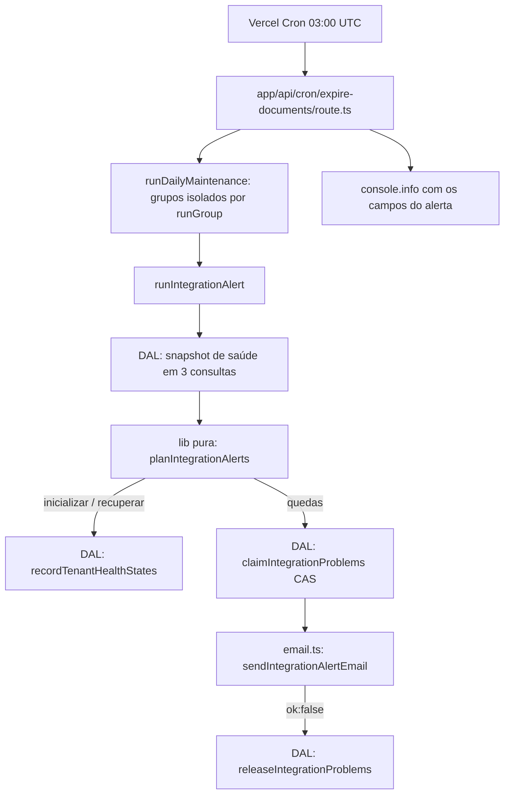

# Lote 15 — Design

**Spec**: `.specs/features/lote-15-prontidao-operacional/spec.md`
**Status**: Approved (usuário, 2026-10-07)

---

## Architecture Overview

O alerta é um grupo novo da manutenção diária que já existe (`/api/cron/expire-documents`, 03:00 UTC,
Vercel Cron). Ele lê a mesma regra de saúde do Dashboard em lote, compara com o último estado gravado
em `tenants`, reivindica as quedas por compare-and-set e manda um e-mail consolidado ao operador.
Nenhum workflow do n8n muda.



Complementa, sem substituir, o `crivo-agente-erros` do n8n (falha de execução → Gmail): o alerta
cobre silêncio e recusas do contrato, que não geram execução com erro.

---

## Code Reuse Analysis

### Existing Components to Leverage

| Component | Location | How to Use |
| --- | --- | --- |
| `resolveIntegrationHealth` | `src/lib/pilot-metrics.ts:89` | Regra única de saudável/problema, chamada pelo planner |
| `getLastAgentMessageAt`, `getIntegrationRefusalsSince` | `src/server/data/index.ts:1850`, `:3257` | Semântica de referência; o snapshot em lote reproduz os mesmos filtros (mensagens `sender = 'agente'`; recusas do tenant ou sem tenant, `occurredAt ≥ since`) |
| `runDailyMaintenance`, `runGroup` | `src/server/integration/lgpd.ts:209`, `:227` | Novo grupo isolado; falha vira `integrationAlertFailed` |
| Adaptador Resend (`send`, nunca lança) | `src/server/auth/email.ts` | Nova função exportada `sendIntegrationAlertEmail` reaproveita `send` e `RESEND_FROM` |
| Padrão de CLI | `src/db/mint-service-key.ts`, script `db:create-admin` | Mesmo formato para `db:revoke-service-key` e para o envio de teste (`tsx --conditions=react-server` por causa do `server-only`) |
| Teste da manutenção | `src/server/integration/__tests__/maintenance.integration.test.ts` | Padrão de fixture e de espião por grupo |

### Integration Points

| System | Integration Method |
| --- | --- |
| Neon | 2 colunas novas e nullable em `tenants`; `npm run db:push:test` no teste; `drizzle-kit push` em produção só na task autorizada |
| Vercel | Cron existente sem mudança de agenda; variável nova `CRIVO_OPERATOR_ALERT_EMAIL` criada pelo usuário; deploy pelo push do `main` |
| Resend | Mesmo adaptador e remetente dos convites |

---

## Components

### `planIntegrationAlerts` e `formatIntegrationAlertEmail` (lib pura)

- **Purpose**: Decidir, por tenant, entre inicializar, recuperar, alertar ou nada; montar assunto e corpo.
- **Location**: `src/lib/integration-alert.ts` (módulo novo, sem I/O, irmão de `pilot-metrics.ts`, L-020)
- **Interfaces**:
  - `planIntegrationAlerts(snapshots: TenantHealthSnapshot[], now: Date): AlertPlan`
  - `formatIntegrationAlertEmail(alerts: TenantHealthSnapshot[], options?: { test?: boolean }): { subject: string; text: string }`
- **Reuses**: `resolveIntegrationHealth`

### DAL de estado de saúde

- **Purpose**: Ler o snapshot de todos os tenants e gravar estado com compare-and-set.
- **Location**: `src/server/data/integration-health.ts` (módulo novo; `index.ts` já tem 3,3 mil linhas)
- **Interfaces**:
  - `getTenantHealthSnapshots(since: Date): Promise<TenantHealthSnapshot[]>` — 3 consultas, nunca uma por tenant: tenants; `max(sent_at)` de mensagens do agente agrupado por tenant; recusas com `occurred_at ≥ since` agrupadas por `(tenant_id, code, route)`, com as sem tenant somadas a todos
  - `recordTenantHealthStates(rows: { tenantId; state; at }[]): Promise<void>` — só para inicializar e recuperar
  - `claimIntegrationProblems(tenantIds: string[], at: Date): Promise<ClaimedProblem[]>` — `UPDATE ... SET state='problema', changed_at=at WHERE id = ANY($1) AND state = 'saudavel' RETURNING id, changed_at anterior`
  - `releaseIntegrationProblems(claimed: ClaimedProblem[]): Promise<void>` — devolve `saudavel` e o `changed_at` anterior, só onde o estado ainda é `problema` e `changed_at` é o da reivindicação

### `runIntegrationAlert` (orquestração)

- **Purpose**: Executar o plano com as regras de falha da spec.
- **Location**: `src/server/integration/integration-alert.ts`
- **Interfaces**: `runIntegrationAlert(now: Date, deps: { operatorEmail: string | undefined; send: (m) => Promise<EmailResult> }): Promise<IntegrationAlertResult>`
- **Ordem**: snapshot → plano → grava inicializações e recuperações → se não há destinatário, `skipped: "destinatario-ausente"` e para (sem reivindicar) → reivindica → sem reivindicadas, termina → envia → `ok:false` libera e marca `sendFailed`.

### Ligação na manutenção e na rota

- `runDailyMaintenance(now, { storage, integrationAlert? })`: com `integrationAlert` presente roda o grupo; ausente, reporta `integrationAlertSkipped: "sem-dependencia"` e não toca o banco. Os testes existentes não passam a dependência e ficam como estão.
- `createExpireDocumentsHandler` monta a dependência real (`process.env.CRIVO_OPERATOR_ALERT_EMAIL`, `sendIntegrationAlertEmail`), aceita override por `deps`, e escreve `console.info("[manutencao] alerta", {evaluated, sent, skipped, sendFailed, failed})` — sem nome de tenant, para o log de produção provar a execução (ALERTA-04 AC5).

### CLIs

- `src/db/revoke-service-key.ts` + `npm run db:revoke-service-key`: `revokeServiceKeysByLabel(label, executor = db)` numa transação: conta ativas totais e ativas com o rótulo, recusa os casos da REVOGA-01, senão `UPDATE ... SET revoked_at = now() WHERE label = $1 AND revoked_at IS NULL`. O executor injetável permite o teste rodar dentro de transação revertida.
- `scripts/send-test-integration-alert.ts` + `npm run alert:send-test`: monta um alerta de exemplo com tenant fictício via `formatIntegrationAlertEmail(..., { test: true })` e envia a `CRIVO_OPERATOR_ALERT_EMAIL`; sem destinatário, sai com 1.

---

## Data Models

```typescript
// tenants (colunas novas, nullable, aditivas — AD-004)
integrationHealthState: "saudavel" | "problema" | null   // check constraint
integrationHealthChangedAt: Date | null

interface TenantHealthSnapshot {
  tenantId: string; name: string; slug: string;
  storedState: "saudavel" | "problema" | null;
  storedChangedAt: Date | null;
  lastAgentMessageAt: Date | null;
  refusals: { code: string | null; route: string; count: number }[];
}

interface AlertPlan {
  initialize: { tenantId: string; state: "saudavel" | "problema" }[];
  recover: string[];
  alert: TenantHealthSnapshot[];
}

interface IntegrationAlertResult {
  evaluated: number; sent: number;
  skipped: "destinatario-ausente" | null; sendFailed: boolean;
}
```

`DailyMaintenanceResult` ganha `integrationAlertEvaluated`, `integrationAlertSent`,
`integrationAlertSkipped`, `integrationAlertSendFailed`, `integrationAlertFailed`.

---

## Error Handling Strategy

| Error Scenario | Handling | User Impact |
| --- | --- | --- |
| Destinatário ausente | Não reivindica; inicializações e recuperações seguem | Alerta sai na primeira execução com a variável |
| Resend devolve `ok:false` | Libera as reivindicadas | Nova tentativa no dia seguinte |
| Erro de banco no grupo | `runGroup` → `integrationAlertFailed: true` | Demais grupos da manutenção intactos |
| Cron e chamada manual simultâneos | Só uma reivindicação devolve linhas | No máximo um e-mail |
| Cron da Vercel atrasa ou pula um dia | Estado gravado não muda; a próxima execução vê a transição | Alerta atrasa, não se perde |

---

## Risks & Concerns

| Concern | Location (file:line) | Impact | Mitigation |
| --- | --- | --- | --- |
| Testes carregam `.env` (`import "dotenv/config"`); com `CRIVO_OPERATOR_ALERT_EMAIL` e `RESEND_API_KEY` locais, um teste da rota mandaria e-mail real | `vitest.config.ts` (bloco `test.env`) | E-mail real a cada suíte | `test.env` define `CRIVO_OPERATOR_ALERT_EMAIL: ""` (dotenv não sobrescreve variável já definida); teste afirma o valor efetivo (L-037) |
| Banco de teste por worker acumula centenas de tenants de fixture | `src/server/integration/lgpd.ts:227` | Uma consulta por tenant a us-east-1 deixaria a manutenção lenta, o mesmo custo de suíte apontado na auditoria do L14b | Snapshot em 3 consultas agrupadas; testes afirmam só sobre os próprios tenants |
| A manutenção roda em todos os tenants, inclusive os de outros arquivos de teste | `maintenance.integration.test.ts` | Asserção sobre o e-mail inteiro ficaria instável | Testes filtram o e-mail e o resultado pelos tenants da fixture |
| Hobby: cron diário com precisão de ±59 min; o cron só roda em deploy de produção | `vercel.json` | Detecção no pior caso em ~48h; sem execução, nunca alerta | Fora de escopo mudar; T0 confirma nos logs que o cron roda em produção |
| `send` do Resend sem domínio verificado só entrega ao dono da conta | `src/server/auth/email.ts:27` | Alerta não chega a outro endereço | T0 confirma domínio e `RESEND_FROM`; T11 prova a entrega |
| `n8n/README.md` §12.3 passo 1 ainda manda usar `db:seed` (que apaga usuários) | `n8n/README.md:410` | Rotação derruba logins | T9 corrige junto do passo 4 |

---

## Tech Decisions

| Decision | Choice | Rationale |
| --- | --- | --- |
| Onde guardar o último estado | 2 colunas em `tenants` | Alternativas: tabela própria (mais DDL, sem ganho com um estado por tenant) e transição sem estado comparando com "24h atrás" (sem DDL, mas um cron pulado perde a queda para sempre) |
| Idempotência | Compare-and-set antes do envio, liberação na falha | Garante no máximo um e-mail por queda sem lock nem tabela de envio |
| Snapshot em lote | 3 consultas agrupadas | Custo constante da manutenção e da suíte |
| Grupo sem dependência | `sem-dependencia`, sem tocar o banco | Testes existentes continuam iguais e nunca enviam e-mail; o teste da rota prova a ligação (L-026) |

**Decisão de projeto:** registrada como AD-039 em `.specs/STATE.md` (alerta ativo diário, na transição, só
ao operador, mesma regra da AD-023). Não muda a AD-023: a saúde continua inferida e o caminho de
sucesso continua sem registro.

---

## Fatos operacionais a comprovar (gate T0)

| Fato | Como comprovar | Se falhar |
| --- | --- | --- |
| F1 — Hobby limita o cron a 1×/dia, ±59 min | Docs Vercel "Usage & Pricing for Cron Jobs", consultadas em 2026-10-07 | Já comprovado no planejamento |
| F2 — `/api/cron/expire-documents` executou em produção nos últimos 3 dias | Logs da Vercel (leitura autorizada pelo usuário) ou o usuário confere no painel | Parar: sem cron não há alerta |
| F3 — domínio de `RESEND_FROM` verificado no Resend | MCP Resend `list-domains` (leitura autorizada) ou o usuário confere | Parar antes das tasks de produção |
| F4 — `RESEND_FROM` existe no ambiente Production da Vercel | Usuário confere no painel (o executor não lê valores) | Parar antes das tasks de produção |

## Ordem de implantação

`drizzle-kit push` em produção (T12) → `CRIVO_OPERATOR_ALERT_EMAIL` no Production pelo usuário (T13) →
push do `main` = deploy (T14) → primeira manutenção registrada (T15). Colunas antes do código porque o
código as lê; a variável antes do deploy para a primeira queda não ficar presa. Rollback do schema:
`ALTER TABLE tenants DROP COLUMN integration_health_state, DROP COLUMN integration_health_changed_at`
(o código anterior não as lê).
