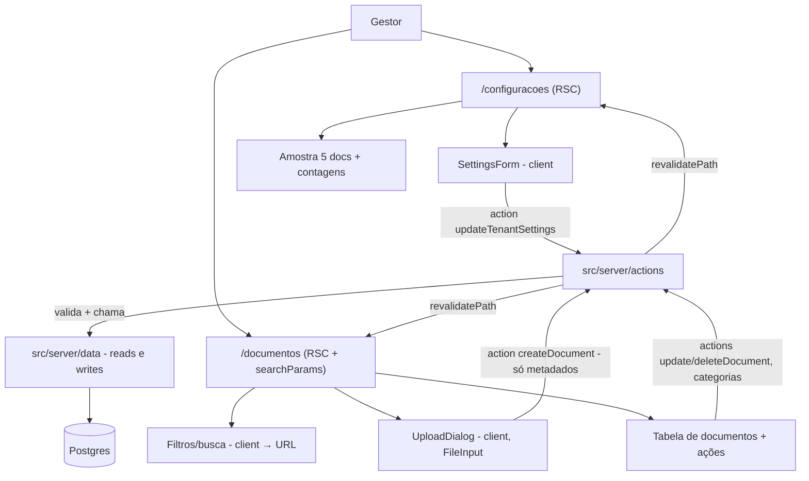

# Lote 2 — Configurações + Documentos · Design

**Spec**: `.specs/features/lote-2-configuracoes-documentos/spec.md`
**Context**: `context.md` (decisões travadas: metadata-only, categorias planas, sem preview, modalidade não afeta documentos)
**Status**: Draft

---

## Architecture Overview

A arquitetura é essencialmente dada pelas decisões ativas do projeto — RSC-first (AD-007) com mutações via server actions; não há alternativa arquitetural real a explorar. O que este design fixa é o corte de componentes, o modelo de dados das categorias e o fluxo de upload metadata-only.

- **Leitura**: páginas `/configuracoes` e `/documentos` são Server Components que chamam a DAL (`src/server/data`) com o tenant do cookie (`getActiveTenantId`). Filtros e busca de `/documentos` vivem em **URL searchParams** — a página relê a DAL a cada mudança (dado sempre fresco, estado compartilhável, zero fetch client).
- **Escrita**: server actions em `src/server/actions/` validam entrada, chamam funções de escrita da DAL e `revalidatePath` das rotas afetadas. A convenção da Fase 1 (nenhum `import` de `src/db` fora de `src/db/*` e `src/server/data/*`) permanece — **toda escrita entra na DAL**, actions nunca tocam o Drizzle direto.
- **Upload metadata-only**: o binário **nunca sai do browser**. O client component lê `File.name/type/size`, o usuário escolhe modalidade/categoria, e a action recebe só os metadados. Validação client é cortesia de UX; a action revalida tudo (autoridade no servidor).



---

## Code Reuse Analysis

### Existing Components to Leverage

| Component | Location | How to Use |
| --------- | -------- | ---------- |
| Schema + enums (`modality`) | `src/db/schema.ts` | Estender: tabela `document_categories`, coluna `documents.category_id`; enum `modality` reutilizado como está |
| Seed idempotente | `src/db/seed.ts` | Estender com categorias + atribuição em parte dos documentos do seed; mesmo padrão delete-and-insert com UUIDs fixos |
| DAL | `src/server/data/index.ts` | Estender `getDocuments` com filtros; adicionar leituras/escritas novas (mesmo arquivo/pasta, `server-only`) |
| Tenant context | `src/server/tenant.ts` | `getActiveTenantId()` em ambas as páginas e em toda action (tenant nunca vem do client) |
| Shell + rotas placeholder | `app/(crm)/{configuracoes,documentos}/page.tsx` | Substituir o conteúdo placeholder pelas telas reais; `error.tsx` do grupo já cobre falha de banco |
| Teste de isolamento | `src/server/data/__tests__/isolation.test.ts` | Ampliar para as novas funções de leitura E escrita (DOC-07) |
| Astryx: template `settings` | `npx astryx template settings` | Referência de layout do form de Configurações |
| Astryx: blocos `Table` (inline/popover filters), `PowerSearch — Search with Table`, template `file-explorer` | `npx astryx template <nome>` | Referência para a listagem de documentos (linhas edge-to-edge, nunca cards) |
| Astryx: `FileInput`, `Dialog — Form` | `npx astryx component FileInput` etc. | Upload com validação de tipo/tamanho; diálogos de edição/criação |

### Integration Points

| System | Integration Method |
| ------ | ------------------ |
| Postgres | `drizzle-kit push` para o incremento de schema (padrão da Fase 1 — sem arquivos de migration até a Fase 7/9) |
| Shell (header/switcher) | Já lê o tenant do banco por request; `revalidatePath` após salvar settings faz o novo nome aparecer (CONF-03) |

---

## Components

### Incremento de schema

- **Purpose**: Categorias planas por tenant + vínculo opcional do documento.
- **Location**: `src/db/schema.ts`
- **Interfaces**: tabela `document_categories` (`id` uuid, `tenant_id` NOT NULL → tenants, `name`, `created_at`); unicidade **case-insensitive por tenant** via unique index em (`tenant_id`, `lower(name)`); `documents.category_id` uuid NULL, FK → `document_categories.id` **ON DELETE SET NULL** (DOC-06.3).
- **Reuses**: enum `modality`, padrão de FKs da Fase 1.

### Seed (incremento)

- **Purpose**: 2–3 categorias por tenant (nomes distintos entre tenants para o teste de isolamento; um nome repetido entre tenants para provar DOC-06.4), parte dos documentos categorizada, parte sem categoria.
- **Location**: `src/db/seed.ts` (+ ajuste em `src/db/__tests__/seed.test.ts`)
- **Interfaces**: mesmo CLI `npm run db:seed`, idempotente.

### DAL — leituras novas/estendidas

- **Purpose**: Único ponto de leitura, filtros no SQL (não em JS).
- **Location**: `src/server/data/index.ts`
- **Interfaces**:
  - `getDocuments(tenantId, { modality?, categoryId?, search? })` — estende a existente; `search` = `ILIKE %termo%`; ordena `uploadedAt DESC` (DOC-01)
  - `getDocumentCategories(tenantId)`
  - `getDocumentSample(tenantId)` — 5 mais recentes + contagem total por modalidade (CONF-04)

### DAL — escritas (novo neste lote)

- **Purpose**: Toda mutação atrás da mesma costura mock→real; actions nunca importam `src/db`.
- **Location**: `src/server/data/index.ts` (ou `mutations.ts` na mesma pasta, a critério do Execute)
- **Interfaces** (todas exigem `tenantId` e filtram por ele no `WHERE` — nunca só pelo id do registro):
  - `updateTenantSettings(tenantId, { name, agentName, supportedModality })`
  - `createDocument(tenantId, { name, mimeType, sizeBytes, modality, categoryId? })`
  - `updateDocument(tenantId, documentId, { name, modality, categoryId? })` — retorna indicador de "não encontrado" para o edge case de exclusão concorrente
  - `deleteDocument(tenantId, documentId)`
  - `createDocumentCategory(tenantId, name)` — traduz violação do unique index em erro de domínio "duplicada"
  - `deleteDocumentCategory(tenantId, categoryId)`

### Validação compartilhada

- **Purpose**: Regras da spec num único módulo puro e testável: nome não-vazio/≤120 após trim; MIME aceito (PDF/DOCX/TXT/MD/CSV); tamanho ≤10 MB; modalidade obrigatória.
- **Location**: `src/server/validation.ts`
- **Interfaces**: funções puras retornando `{ ok } | { error }`; usadas pelas actions (autoridade) e reutilizáveis no client (cortesia).
- **Dependencies**: nenhuma — sem lib de schema por ora (dois forms simples; zod entraria como dependência nova sem AD que a exija).

### Server actions

- **Purpose**: Fronteira client→server das mutações; valida, resolve tenant do cookie, chama DAL, `revalidatePath('/configuracoes')` e/ou `('/documentos')`.
- **Location**: `src/server/actions/settings.ts`, `src/server/actions/documents.ts`
- **Interfaces**: `updateTenantSettingsAction`, `createDocumentAction`, `updateDocumentAction`, `deleteDocumentAction`, `createCategoryAction`, `deleteCategoryAction` — todas retornam `{ ok } | { error: string }` para a UI exibir (CONF-02, DOC-03).
- **Dependencies**: `getActiveTenantId` (tenant **nunca** vem de input do client — isolamento DOC-07), validação, DAL.

### Tela Configurações

- **Purpose**: CONF-01..04.
- **Location**: `app/(crm)/configuracoes/page.tsx` (RSC) + `src/components/settings/settings-form.tsx` (client)
- **Interfaces**: RSC carrega `getTenant` + `getDocumentSample` e passa como props; form client com estado de erro por campo, submit → action, confirmação de sucesso; seção de documentos com 5 recentes, contagens por modalidade, link "Ver todos" → `/documentos`, estado vazio próprio.
- **Reuses**: template Astryx `settings` como referência de layout; select de modalidade com o enum existente.

### Tela Documentos

- **Purpose**: DOC-01..06.
- **Location**: `app/(crm)/documentos/page.tsx` (RSC, lê `searchParams`) + `src/components/documents/` (toolbar, upload-dialog, document-row/actions, category-manager — client)
- **Interfaces**:
  - RSC: parseia `searchParams` (`modalidade`, `categoria`, `q`), chama `getDocuments`/`getDocumentCategories`, renderiza tabela edge-to-edge.
  - Toolbar (client): filtros + busca gravam na URL via `router.replace` (busca com debounce); dois estados vazios distintos (sem documentos × sem resultados — DOC-01.5).
  - Upload (client): `FileInput` Astryx extrai `name/type/size`; validação de cortesia; action recebe metadados; binário descartado no browser.
  - Ações por linha: editar (Dialog — Form: nome/modalidade/categoria) e excluir (confirmação Astryx antes da action — DOC-04.1).
  - Categorias: criar (no próprio fluxo de upload/edição) e excluir (lista simples no toolbar/dialog), com erro de duplicidade exibido.
- **Reuses**: blocos Astryx `Table — Inline/Popover Filters`, `PowerSearch — Search with Table` (avaliar no Execute qual encaixa; regra "dense data = rows").

---

## Data Models

```typescript
interface DocumentCategory { id: uuid; tenantId: uuid; name: string; createdAt: Date }
// documents (existente) ganha:
interface Document { /* campos da Fase 1 */ categoryId?: uuid | null }
```

**Relationships**: `document_categories` N:1 `tenants`; `documents` N:1 `document_categories` (nullable, `ON DELETE SET NULL`). Unique index `(tenant_id, lower(name))` em categorias.

---

## Error Handling Strategy

| Error Scenario | Handling | User Impact |
| -------------- | -------- | ----------- |
| Nome vazio/>120 (settings, rename, categoria) | Validação na action (autoridade) + client (cortesia); nada persiste | Erro no campo, form mantém valores digitados |
| MIME/tamanho inválido no upload | Rejeição client imediata + action revalida | Mensagem com o motivo (tipo × tamanho), sem registro criado |
| Categoria duplicada | Unique index viola → DAL traduz em erro de domínio | Mensagem "categoria já existe", nada persiste |
| Editar documento excluído em outra aba | `updateDocument` não encontra linha do tenant → action retorna erro | "Documento não existe mais"; nenhum registro novo criado |
| Falha de insert no upload | Action retorna `{ error }`; sem registro parcial (insert único, atômico) | Erro exibido; listagem inalterada (DOC-02.4) |
| Banco indisponível | `error.tsx` do grupo `(crm)` (Fase 1) | Shell permanece, área mostra erro + retry |
| Cookie de tenant inválido | `getActiveTenantId` já cai no primeiro tenant (Fase 1) | Transparente |

---

## Risks & Concerns

| Concern | Location | Impact | Mitigation |
| ------- | -------- | ------ | ---------- |
| DAL da Fase 1 é só leitura — escritas são padrão novo | `src/server/data/index.ts` | Risco de action importar `src/db` direto e furar a convenção | Escritas declaradas como parte da DAL neste design; Verifier checa a convenção de imports (já verificável desde a Fase 1) |
| Unique case-insensitive via `lower(name)` em index requer sintaxe específica do drizzle (`uniqueIndex().on(sql\`lower(...)\`)`) | `src/db/schema.ts` | Sintaxe errada → push falha | Verificar docs do drizzle-kit instalado na task de schema (mesmo protocolo da Fase 1) |
| `revalidatePath` vs. router cache do Next 16 para refletir nome no header (CONF-03) | actions | Nome do tenant pode não atualizar no shell | Consultar docs locais do Next (`node_modules/next/dist/docs`) na task; fallback: `router.refresh()` no client após action OK |
| Filtro por URL + debounce da busca (client → `router.replace`) pode disparar renders em cascata | toolbar | UX de busca ruim | Debounce ~300ms e `replace` (sem poluir histórico); é o mesmo padrão RSC já validado no switcher |
| Testes de escrita mexem no estado do banco seedado | `__tests__` | Testes de isolamento podem ficar dependentes de ordem | Escritas de teste usam registros próprios criados no teste e re-seed no setup (padrão da Fase 1) |

---

## Tech Decisions (only non-obvious ones)

| Decision | Choice | Rationale |
| -------- | ------ | --------- |
| Onde vivem as escritas | Na DAL (`src/server/data`), actions só orquestram | Preserva a convenção de imports da Fase 1 e a costura única mock→real (AD-004) |
| Upload | Client envia **só metadados**; binário nunca sai do browser | Expressão mais fiel do "metadata-only" do context.md; evita trafegar 10 MB para descartar |
| Filtros/busca | URL searchParams + re-render RSC | Coerente com AD-007; estado compartilhável; DAL filtra em SQL |
| Validação | Módulo puro próprio, sem zod | Dois forms simples; nova dependência exigiria justificativa que o escopo não dá |
| Unicidade de categoria | Unique index no banco + tradução de erro na DAL | Banco é a autoridade (concorrência); mensagem amigável vem da DAL |
| Tenant nas actions | Sempre do cookie no servidor, nunca do payload | Isolamento DOC-07 não pode depender de input do client |

> Nenhuma decisão nova de nível projeto — tudo deriva de AD-002/004/005/007. Nada a acrescentar ao STATE.md.

---

## Estimativa de tasks (para a fase Tasks)

~8 tasks, 1 batch — sem oferta de sub-agentes:
T1 schema+push+seed → T2 DAL leituras+testes → T3 validação+DAL escritas+testes → T4 actions+testes → T5 tela Configurações → T6 Documentos: listagem+filtros+busca → T7 Documentos: upload+editar+excluir+categorias → T8 estados vazios+isolamento ampliado+build+traceability.
