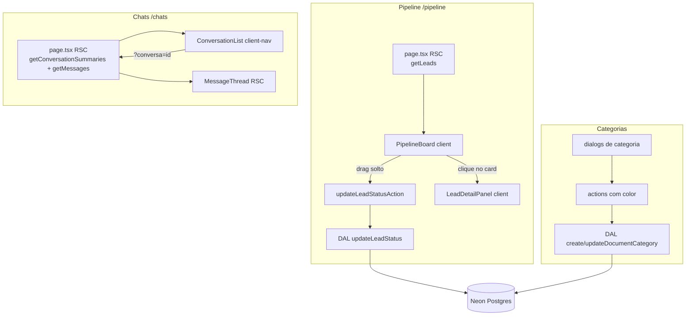

# Lote 3 — Pipeline + Chats + Refinamentos · Design

**Spec**: `.specs/features/lote-3-pipeline-chats/spec.md`
**Status**: Approved (2026-08-02)

Conforma com AD-001..AD-007 (lidos em 2026-08-02). Nenhuma decisão ativa é violada; AD-008 (lib de ícones) é adicionada ao STATE.md como decisão de projeto deste lote.

---

## Architecture Overview

Mesmo padrão RSC-first do projeto (AD-007): páginas RSC carregam dados pela DAL com `getActiveTenantId()`; interatividade (drag, painel, seleção) vive em client components que recebem os dados iniciais como props e mutam via server actions.



- **Pipeline**: o board inteiro é um client component (drag + seleção são estado de UI transitório — não vai para URL). Dados iniciais vêm do RSC. Após action OK, `router.refresh()`/revalidate mantém RSC como fonte de verdade; em erro, revert local + mensagem.
- **Chats**: seleção via searchParam `?conversa=<id>` (RSC-first puro — o thread carrega no servidor; lista vira navegação por links). Sem estado client além do visual.
- **Detalhe do lead**: painel lateral in-page (`Layout`/`LayoutPanel`, padrão do template `ai-chat` de painel à direita). A Astryx **não tem componente Drawer overlay** (verificado no catálogo em 2026-08-02) — se `LayoutPanel` não comportar bem, fallback aprovado: `Dialog` (já usado no Lote 2). A decisão do usuário ("não perder o contexto do quadro") é o critério.

## Code Reuse Analysis

### Existing Components to Leverage

| Component | Location | How to Use |
| --------- | -------- | ---------- |
| DAL + padrão tenant-scoped | `src/server/data/index.ts` | Estender: novas leituras/escritas seguem `and(eq(tenantId), ...)` |
| `getLeads`/`getLead`/`getConversations`/`getMessages` | `src/server/data/index.ts:47-96` | Base das novas telas; **adicionar ORDER BY determinístico** (lesson do Verifier L2) |
| Server actions pattern (`{ ok } | { error }`, tenant do cookie) | `src/server/actions/*` | `updateLeadStatusAction`, actions de categoria com cor |
| Validação pura | `src/server/validation.ts` | + `validateCategoryColor` (paleta fixa) |
| `NavLink` | `src/components/shared/nav-link.tsx` | Lista de conversas (navegação por searchParam) e link P3 |
| Dialogs de categoria (manager/upload/edit) | `src/components/documents/*` | Ganham picker de cor e exibição via `Token color` |
| Seed idempotente | `src/db/seed.ts` | Incremento: cores nas categorias |
| Templates Astryx `kanban-board` / `ai-chat` | CLI `npx astryx template ...` | Referência obrigatória antes das telas (AD-005) |

### Integration Points

| System | Integration Method |
| ------ | ------------------ |
| Neon Postgres (drizzle) | `drizzle-kit push` para enum+coluna de cor; nenhuma tabela nova |
| Astryx Board/Chat | Componentes `Board*`, `Chat*` conforme templates; `Token color` para categorias |
| Lucide-Animated | shadcn CLI (`npx shadcn@latest add "https://lucide-animated.com/r/<icon>.json"`) gera componentes locais; requer `components.json` mínimo criado à mão + dep `motion` |

## Components

### PipelineBoard (client)

- **Purpose**: Kanban de 3 colunas com drag-and-drop e seleção de lead.
- **Location**: `src/components/pipeline/pipeline-board.tsx`
- **Interfaces**: `({ leads: Lead[] }) → JSX`; estado local: lead selecionado, override otimista de coluna durante drag em voo.
- **Dependencies**: componentes `Board`/`BoardCard` da Astryx (conferir `npx astryx component Board`), `updateLeadStatusAction`.
- **Reuses**: template `kanban-board`; padrão "client recebe dados do RSC" do Lote 2.
- **Regras**: soltar na mesma coluna = no-op (PIPE-02.3); status desconhecido → lead ignorado no agrupamento; após action OK → `router.refresh()`; erro → revert + `Toast`/mensagem.

### LeadDetailPanel (client)

- **Purpose**: Painel lateral com resumo executivo, escalonamento e campos de qualificação.
- **Location**: `src/components/pipeline/lead-detail-panel.tsx`
- **Interfaces**: `({ lead: Lead, onClose }) → JSX`.
- **Reuses**: `Timestamp`, `Token`, formatação BRL nova em `src/lib/format.ts` (`formatCurrencyBRL(bigint | null)` — nunca "R$ NaN").
- **Regras**: seção de escalonamento só quando `status = escalado_humano` (fallback "Motivo não informado"); campos nulos → "—" (convenção única).

### ConversationList + MessageThread

- **Purpose**: Lista de conversas (navegação) + thread somente leitura.
- **Location**: `src/components/chats/` + `app/(crm)/chats/page.tsx`
- **Interfaces**: page RSC lê `searchParams.conversa`; `getConversationSummaries(tenantId)` alimenta a lista; `getMessages(tenantId, conversaId)` + `getLead` alimentam o thread.
- **Reuses**: template `ai-chat` (`ChatLayout`, `ChatMessageList`, `ChatMessage*`), `NavLink`.
- **Regras**: sem composer (CHAT-01.6); conversa inexistente/de outro tenant → estado neutro; bolhas `sender: agente` vs `lead` visualmente distintas.

### Ícones (infra)

- **Purpose**: Componentes locais Lucide-Animated como única fonte de ícones.
- **Location**: `src/components/icons/*` + `components.json` (raiz) + dep `motion`.
- **Setup**: criar `components.json` mínimo à mão (aliases apontando `@/src/components`, estilo default, tailwind config vazio — projeto já usa Tailwind v4); depois `npx shadcn@latest add "https://lucide-animated.com/r/<nome>.json"` por ícone. **Verificar** que o arquivo gerado tem `"use client"` (ícones usam `motion`); adicionar se faltar. Se o shadcn CLI travar com a config do projeto, fallback: copiar o fonte do ícone do site (vendor manual) — mesmo resultado, componente local.
- **Mapa indicativo** (worker verifica disponibilidade no registry; usa o mais próximo se faltar): Pipeline `square-kanban`, Chats `message-circle`, Documentos `file-text`, Configurações `settings`, Dashboard `chart-line`; ações: `upload`, `plus`, `pencil`, `trash-2`, `x`, `search`, `tag`.

### Cor de categoria (modelo + superfícies)

- **Purpose**: Paleta fixa 1:1 com `Token color` da Astryx.
- **Modelo**: `pgEnum("category_color", ["red","orange","yellow","green","teal","cyan","blue","purple","pink","gray"])`; coluna `document_categories.color` NOT NULL DEFAULT `'gray'`.
- **Escrita**: `createDocumentCategory` ganha `color` opcional (default gray); nova `updateDocumentCategory(tenantId, id, { color })` tenant-scoped; actions correspondentes validam pela paleta (`validation.ts`).
- **UI**: picker = grid de swatches da paleta (token-backed, sem hex) nos dialogs de categoria; exibição via `<Token color={category.color}>` na tabela, manager, selects e filtro.

### Refinamentos Lote 2

- **UI-01**: respiro à direita da coluna Ações em `src/components/documents/documents-table.tsx` (padding/margem token-backed na própria Table/coluna — sem px cru).
- **UI-02**: `app/(crm)/configuracoes/page.tsx` — cada seção num `Card` (Astryx confirma: Card para settings groups é uso legítimo); grid responsivo 2 colunas (conferir `npx astryx docs layout` + `component Grid`/`Columns` — o que existir) com empilhamento em viewport estreita.

## Data Models

Sem tabelas novas. Alterações:

```ts
// schema.ts
export const categoryColorEnum = pgEnum("category_color", [
  "red","orange","yellow","green","teal","cyan","blue","purple","pink","gray",
]);
// document_categories: + color: categoryColorEnum("color").notNull().default("gray")
```

Nova leitura (DAL):

```ts
interface ConversationSummary {
  id: string;
  leadId: string;
  leadName: string;
  lastMessage: { content: string; sentAt: Date; sender: "agente" | "lead" } | null;
}
// getConversationSummaries(tenantId): ConversationSummary[] — ordenado por lastMessage.sentAt DESC (conversas sem mensagem por último), desempate por conversations.createdAt DESC, id
```

Nova escrita (DAL): `updateLeadStatus(tenantId, leadId, status: LeadStatus)` — `WHERE tenant_id AND id`, seta `updatedAt = now()`, retorna "não encontrado" quando 0 rows.

Ordenação adicionada (determinismo — lesson L2): `getLeads` → `updatedAt DESC, id`; `getMessages` → `sentAt ASC, id`; `getConversations` mantém e ganha `createdAt DESC, id` (usada só como base interna).

## Error Handling Strategy

| Error Scenario | Handling | User Impact |
| -------------- | -------- | ----------- |
| Action de drag falha (rede/validação/lead inexistente) | Revert do override otimista + mensagem de erro | Card volta; aviso visível |
| Lead movido não pertence ao tenant | DAL retorna 0 rows → `{ error: "Lead não encontrado" }` | Erro + revert |
| Cor fora da paleta | `validation.ts` rejeita na action; enum do banco é a segunda barreira | Erro no dialog, nada persiste |
| `?conversa=` inválida/cross-tenant | `getMessages` vazio + lead não resolvido → estado neutro | Nenhum erro fatal |
| `budgetCents` nulo | `formatCurrencyBRL` retorna null → campo exibe "—" | Nunca "R$ NaN" |
| Status desconhecido no board | Lead filtrado do agrupamento | Board não quebra |

## Risks & Concerns

| Concern | Location | Impact | Mitigation |
| ------- | -------- | ------ | ---------- |
| shadcn CLI pode exigir/alterar config inesperada num projeto Tailwind v4 sem shadcn prévio | raiz do projeto | Bloqueio ou lixo de config no T de infra de ícones | `components.json` mínimo manual primeiro; se o CLI falhar, vendor manual do fonte do ícone (fallback documentado); nunca aceitar reescrita de `globals.css`/tailwind pelo CLI |
| Ícones animados são client components com `motion` | `src/components/icons/*` | Import direto num RSC quebraria o build se faltar `"use client"` | Checar/adicionar `"use client"` em cada ícone gerado; ícones sempre folha |
| Board da Astryx: API de drag desconhecida em detalhe | `src/components/pipeline/*` | Retrabalho se assumir props erradas | `npx astryx component Board` + template `kanban-board` ANTES de codar (AD-005); se Board não suportar DnD controlado, avaliar `swizzle Board` antes de hand-roll |
| `getLeads`/`getConversations` sem ORDER BY hoje | `src/server/data/index.ts:47-81` | Ordem não-determinística (mesmo gap que o Verifier L2 achou em `getTenants`) | Este lote adiciona ordenação + testes de ordenação |
| Flakiness Vitest em paralelo contra Neon real | `vitest.config.ts` | Falsos vermelhos nos gates | Herdado do L2 (pendência conhecida); gates rodam `npx vitest run --no-file-parallelism`; correção definitiva segue fora deste lote |
| Painel lateral: sem Drawer na Astryx | `src/components/pipeline/` | UX do detalhe pode degradar | Plano A `Layout`/`LayoutPanel` in-page; fallback aprovado no discuss: `Dialog` |

## Tech Decisions (only non-obvious ones)

| Decision | Choice | Rationale |
| -------- | ------ | --------- |
| Estado do board | Client component com dados do RSC + override otimista local; `router.refresh()` pós-OK | Trade-off já previsto no AD-007 para telas interativas |
| Seleção de conversa | searchParam `?conversa=` (não estado client) | RSC-first puro; thread carrega no servidor; URL compartilhável |
| Seleção de lead no board | Estado client local (não URL) | Board já é client por causa do drag; painel é UI transitória |
| Paleta de cor | Enum Postgres 1:1 com `Token color` da Astryx | Banco garante integridade; UI mapeia direto sem tradução |
| Lib de ícones | Lucide-Animated via shadcn CLI como componentes locais | Decisão do usuário → **AD-008 no STATE.md** |
| E2E | Não neste lote (assumption no spec, pendente de confirmação) | Regras testáveis em action/DAL; drag é do componente da lib |
