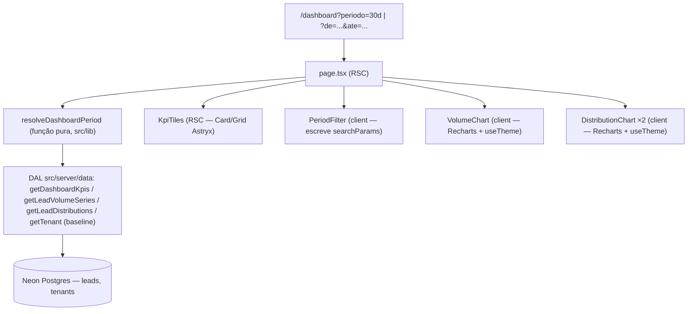

# Lote 4 — Dashboard · Design

**Spec**: `.specs/features/lote-4-dashboard/spec.md`
**Context**: `.specs/features/lote-4-dashboard/context.md`
**Status**: Draft (aguardando aprovação do usuário)

---

## Architecture Overview

RSC-first (AD-007), mesmo padrão de `/chats`: a página `/dashboard` é um Server Component que lê o período dos `searchParams`, resolve o range com uma função pura, chama a DAL e passa dados já serializados para componentes client apenas onde há interatividade (filtro de período) ou canvas (gráficos Recharts). Nenhuma server action — a tela é 100% leitura; mudar período é navegação (URL), não mutação.

**Gráficos — decisão de pesquisa (AD-005, "checar Astryx primeiro"):** a Astryx **não tem componentes de gráfico na lib** (confirmado: `astryx search "chart"` não retorna componente; `MetricCard`/`ChartTooltip` do template não existem como componentes da lib). Porém o template oficial `dashboard` (Analytics Dashboard) da própria Astryx constrói gráficos com **Recharts** (`BarChart`, `LineChart`, `XAxis`, `ResponsiveContainer`...) tematizado via hook `useTheme` (acesso a tokens em JS). Ou seja: o caminho sancionado pela Astryx é Recharts + tokens — não precisamos do fallback Shadcn autorizado no PRD §7.8. O template `dashboard` é a referência obrigatória de layout e de código dos charts.



**Definição única de P:** todas as funções da DAL recebem o mesmo `{ from: Date; to: Date }` resolvido uma única vez na página — tiles, bases, série e distribuições nunca podem divergir sobre quais leads entram no período (spec, Success Criteria).

---

## Code Reuse Analysis

### Existing Components to Leverage

| Component | Location | How to Use |
| --------- | -------- | ---------- |
| Padrão RSC + searchParams | `app/(crm)/chats/page.tsx` | Mesmo padrão para ler `searchParams` (Next 16 — consultar `node_modules/next/dist/docs/`) |
| DAL tenant-scoped | `src/server/data/index.ts` | Novas funções seguem o padrão `eq(leads.tenantId, tenantId)` + ordenação determinística |
| `getTenant` | `src/server/data/index.ts` | Baseline vem junto do tenant após as novas colunas (sem função nova) |
| Cookie de tenant | `src/server/tenant.ts` | `getActiveTenantId()` — inalterado |
| Helpers de formatação | `src/lib/format.ts` (+ testes em `src/lib/__tests__/format.test.ts`) | Estender com formato de duração (min → "Xh Ymin") e percentual inteiro |
| Placeholder atual | `app/(crm)/dashboard/page.tsx` | Substituído; `EmptyState` existente reaproveitado no estado sem leads |
| Ícones Lucide-Animated | `src/components/icons/` (AD-008) | Ícones dos tiles; instalar novos apenas se necessário via infra existente |
| Card, Grid, Heading, Text, EmptyState, SegmentedControl/Tabs, Divider | `@astryxdesign/core` | Estrutura dos tiles e seções; descobrir props via `npx astryx component <Name>` |
| Padrão de teste de integração | `src/server/data/__tests__/*.test.ts` | Testes criam tenant/leads próprios com dados controlados; nunca dependem de ordem |

### Integration Points

| System | Integration Method |
| ------ | ------------------ |
| Neon Postgres | Novas colunas nullable em `tenants` via Drizzle (migração aditiva, não-destrutiva) |
| Seed (`src/db/seed.ts`) | Ganha baselines por tenant + redistribuição determinística de datas de leads pelos últimos ~90 dias |
| Recharts | Nova dependência `recharts` (usada só em client components de `src/components/dashboard/`) |

---

## Components

### `resolveDashboardPeriod`

- **Purpose**: Converter `searchParams` num range validado com granularidade — única fonte da definição de período.
- **Location**: `src/lib/dashboard-period.ts`
- **Interfaces**:
  - `resolveDashboardPeriod(params: { periodo?: string; de?: string; ate?: string }): DashboardPeriod`
  - `type DashboardPeriod = { from: Date; to: Date; granularity: "day" | "week"; preset: "7d" | "30d" | "90d" | "custom" }`
- **Dependencies**: nenhuma (função pura; datas em UTC via `Date.UTC` — sem lib de timezone).
- **Reuses**: —. Regras exatas na spec (DASH-02 + assumptions: precedência, fallback 30d, limites inclusivos, teto 366 dias).

### DAL — agregações do Dashboard

- **Purpose**: Calcular KPIs, série e distribuições sobre P, tenant-scoped.
- **Location**: `src/server/data/index.ts`
- **Interfaces**:
  - `getDashboardKpis(tenantId: string, range: { from: Date; to: Date }): Promise<DashboardKpis>` — `{ avgFirstResponseMinutes: number | null; respondedCount: number; leadCount: number; qualificationRate: number | null; escalationRate: number | null; attendanceRate: number | null; confirmedMeetingCount: number }` (taxas como fração 0–1; `null` quando denominador 0 — DASH-07)
  - `getLeadVolumeSeries(tenantId: string, range, granularity): Promise<Array<{ bucketStart: Date; count: number }>>` — buckets contínuos incluindo zeros
  - `getLeadDistributions(tenantId: string, range): Promise<{ modality: Array<{ bucket: string; count: number }>; motivation: Array<...> }>` — buckets fixos incluindo "nao_informado"
- **Dependencies**: Drizzle, schema.
- **Reuses**: padrão tenant-scoped da DAL. **Implementação**: uma única query por função — `SELECT` dos leads com `tenantId` + `firstContactAt BETWEEN from AND to` (Drizzle `gte`/`lte` — limites inclusivos) — e agregação em TS. Volume do piloto é pequeno; TS puro é determinístico e testável. (Alternativa SQL `GROUP BY` rejeitada: mais código Drizzle para zero ganho neste volume.)

### Schema — baseline em `tenants`

- **Purpose**: Snapshot pré-piloto por tenant (DASH-05).
- **Location**: `src/db/schema.ts`
- **Interfaces**: 3 colunas nullable — `baselineLeadsPerMonth: integer`, `baselineFirstResponseMinutes: integer`, `baselineLeadToMeetingPct: integer` (0–100).
- **Reuses**: migração via drizzle-kit, aditiva (mesmo padrão da coluna de cor no L3).

### `PeriodFilter`

- **Purpose**: Presets 7/30/90 + range customizado; escreve na URL.
- **Location**: `src/components/dashboard/period-filter.tsx` (`"use client"`)
- **Interfaces**: `PeriodFilter({ period }: { period: DashboardPeriod })` — destaca o preset ativo; inputs de data para o custom.
- **Dependencies**: `useRouter`/`usePathname` do Next (navegação por query string — sem estado Zustand: URL é a fonte de verdade), componentes Astryx (SegmentedControl/Tabs/Button + inputs de data — descobrir o disponível via CLI; fallback: `<input type="date">` estilizado por token é aceitável se a Astryx não tiver DatePicker).
- **Reuses**: padrão de searchParams de `/chats`.

### `KpiTiles`

- **Purpose**: Linha de 5 tiles com valor, base considerada e linha de baseline (DASH-01, DASH-05, DASH-07).
- **Location**: `src/components/dashboard/kpi-tiles.tsx` (Server Component — só apresentação)
- **Interfaces**: recebe `DashboardKpis` + baseline do tenant + labels prontos.
- **Reuses**: `Card`/`Grid` Astryx no padrão MetricCard do template `dashboard`; formatadores de `src/lib/format.ts`.

### `VolumeChart` / `DistributionChart`

- **Purpose**: Série de volume (barras/linha) e distribuições (barras) — DASH-03/04.
- **Location**: `src/components/dashboard/volume-chart.tsx`, `distribution-chart.tsx` (`"use client"`)
- **Interfaces**: recebem arrays serializáveis (datas como ISO string — RSC → client não passa `Date` cru sem cuidado; serializar na página).
- **Dependencies**: `recharts`, hook `useTheme` da Astryx para cores/tokens (nunca hex cru).
- **Reuses**: código de chart do template `dashboard` da Astryx como referência direta (scaffold consultivo).

### Página `/dashboard`

- **Purpose**: Orquestrar tudo (RSC).
- **Location**: `app/(crm)/dashboard/page.tsx` (substitui o placeholder)
- **Interfaces**: `searchParams` (Next 16 — Promise; consultar docs locais), monta layout tiles + gráficos no frame do template `dashboard`.
- **Reuses**: layout `(crm)` existente (AppShell/sidebar já têm a entrada Dashboard).

---

## Data Models

```typescript
// tenants (colunas novas, todas nullable — baseline pré-piloto, DASH-05)
baselineLeadsPerMonth: number | null;        // volume de leads/mês antes do agente
baselineFirstResponseMinutes: number | null; // tempo médio de resposta hoje
baselineLeadToMeetingPct: number | null;     // % lead→reunião hoje (0–100)
```

Nenhuma tabela nova. Leads/conversas inalterados — o Dashboard só lê.

**Seed:** além dos baselines (valores distintos por tenant), redistribuir `firstContactAt` (e coerentemente `firstResponseAt`, `meetingAt`, `createdAt`/`updatedAt` quando fizer sentido) dos leads existentes pelos últimos ~90 dias **relativos ao momento do seed** (`now − N dias`, N fixo por lead — determinístico em estrutura, relativo em âncora), garantindo leads em cada janela de 7/30/90 dias para os dois tenants.

---

## Error Handling Strategy

| Error Scenario | Handling | User Impact |
| -------------- | -------- | ----------- |
| Params de período inválidos | `resolveDashboardPeriod` devolve default 30d | Página abre normal no default (spec DASH-02.4) |
| Denominador zero em taxa/média | DAL devolve `null`; tile renderiza "—" + base zerada | Nunca NaN/Infinity (DASH-07) |
| Tenant sem leads | Tiles "—"/0 + EmptyState nos gráficos | Página íntegra (edge case da spec) |
| Tenant sem baseline | Campos nulos → "Baseline não disponível" | Sem erro (DASH-05.3) |
| Falha de DB no render | `error.tsx` existente do grupo `(crm)` captura | Tela de erro padrão já existente |

---

## Risks & Concerns

| Concern | Location | Impact | Mitigation |
| ------- | -------- | ------ | ---------- |
| `seed.test.ts` afere estado canônico do seed | `src/db/__tests__/seed.test.ts` | Redistribuir datas/baselines pode quebrar asserções existentes | Task do seed inclui atualizar os testes do seed para as novas invariantes (nunca enfraquecer: substituir asserções por outras igualmente fortes — ex.: "todos os tenants têm baseline preenchido", "existem leads nas janelas 7/30/90d") |
| Flakiness Vitest × Neon com paralelismo de arquivos | `vitest.config.ts` | Gates deste lote adicionam mais arquivos de teste de DAL → mais exposição | INFRA-01 (T1): `fileParallelism: false` na config; gates passam a usar `npx vitest run` sem flag |
| Compat Recharts × React 19 / Next 16 | `package.json` | Versão antiga do Recharts quebra com React 19 | Instalar Recharts atual (v3+, suporta React 19); charts sempre `"use client"`; validar no build gate |
| Serialização RSC → client | página → charts | Passar `Date` cru pode virar armadilha de hidratação | Página serializa datas como ISO string; client formata para exibição |
| Scaffold do template pode sobrescrever arquivos | CLI astryx | `npx astryx template dashboard <path>` escreve arquivo | Scaffoldar SEMPRE em diretório de referência fora do app (ex.: `scratch/astryx-dashboard/`, git-ignored) e copiar padrões manualmente |
| Duas fontes de "agora" (page vs. seed) | presets relativos a hoje | Testes de KPI que dependessem do seed seriam frágeis | Testes de DAL criam leads próprios com datas absolutas controladas e range explícito — nunca dependem do seed nem de `new Date()` |

---

## Tech Decisions (only non-obvious ones)

| Decision | Choice | Rationale |
| -------- | ------ | --------- |
| Lib de gráficos | Recharts, tematizado via `useTheme` da Astryx | É o padrão do template oficial `dashboard` da Astryx (AD-005 cumprido: checado primeiro; lib não tem chart próprio); dispensa o fallback Shadcn do PRD §7.8 → **vira AD-009 no STATE.md** (Fase 10 reutiliza) |
| Agregação em TS sobre 1 query por função | TS puro pós-`SELECT ... WHERE período` | Volume do piloto é pequeno; determinístico e testável; menos Drizzle exótico |
| Baseline nas colunas de `tenants` | 3 colunas nullable | Snapshot único por tenant; tabela própria seria over-engineering (assumption da spec) |
| Período na URL, não em Zustand | searchParams como fonte de verdade | Compartilhável/recarregável; RSC lê direto (AD-007); Zustand só guarda espelho de tenant, sem novo estado global |
| Taxas como fração 0–1 + `null` na DAL | Formatação (%, "—") é responsabilidade da UI | DAL devolve dado, não string; `null` explícito evita NaN (DASH-07) |
