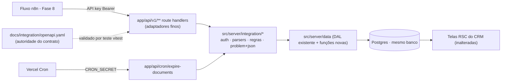

# Lote 5 — Contrato de Integração CRM ↔ Agente Design

**Spec**: `.specs/features/lote-5-contrato-integracao/spec.md`
**Context**: `.specs/features/lote-5-contrato-integracao/context.md`
**Status**: Approved (2026-08-03)

---

## Approach (explorado; usuário delegou a escolha)

Três abordagens avaliadas — todas com o mesmo escopo:

1. **Service layer portável + handlers finos** ← **escolhida**. Regras/validação/persistência em `src/server/integration/*` (funções puras + DAL existente); route handlers de `/api/v1` são adaptadores de ~10 linhas. Contrato = `openapi.yaml` como autoridade, validado por teste. Zero dependência de runtime nova; troca futura por microserviço Python = honrar o mesmo OpenAPI sobre o mesmo banco.
2. Router portável (Hono) montado no Next — lift-and-shift só dentro do mundo JS; framework novo; não ajuda na troca para Python. Descartada.
3. Outbox de eventos + processador — auditoria/replay de graça, mas duas camadas a mais que o piloto não precisa. Descartada (a ideia fica disponível se a tela de sugestões deferida um dia exigir histórico de tentativas).

**Por que a 1 satisfaz o requisito de desacoplamento do usuário:** o acoplamento CRM↔API é só o banco (o CRM lê; a API escreve). O contrato público é o OpenAPI — implementation-agnostic por construção. Um substituto Python precisa de: (a) honrar o OpenAPI, (b) escrever no mesmo schema Postgres. O guia de integração documenta exatamente esses dois pontos como "procedimento de substituição" (INT-07 AC2).

## Architecture Overview



Fluxo de uma request: `Request` → handler extrai body/params → `authenticate()` resolve tenant pela API key → parser puro valida e produz DTO → serviço aplica regras (transições, trava humana, idempotência) → DAL persiste → handler serializa resposta ou `problem()`.

---

## Code Reuse Analysis

### Existing Components to Leverage

| Component | Location | How to Use |
| --------- | -------- | ---------- |
| DAL tenant-scoped completa | `src/server/data/index.ts` | Estender com as funções novas (mesmo padrão: toda query filtra `tenantId`) |
| Padrão `ValidationResult` (funções puras, sem I/O) | `src/server/validation.ts` | Mesmo padrão para os parsers de payload da API (sem zod — repo não usa) |
| `updateLeadStatus` (Kanban) | `src/server/data/index.ts` | Ganha parâmetro de ator (`humano`/`agente`) — Kanban passa `humano` |
| Padrão de teste DAL contra banco real | `src/server/data/__tests__/*` | API tests seguem o mesmo padrão; handlers são funções → testáveis com `new Request(...)` sem servidor |
| Enums de domínio (`leadStatusEnum`, `modalityEnum`, `senderEnum`, …) | `src/db/schema.ts` | Domínio dos parsers e do OpenAPI vem 1:1 deles |
| Seed com 2 tenants | `src/db/seed.ts` | Estender: API keys, doc expirado por tenant, `externalId` retroativo nos leads/mensagens? **Não** — retroativo desnecessário; só dados novos |
| `getMockManager`/telas RSC | várias | **Intocadas** — a prova fim-a-fim é justamente telas inalteradas refletindo escrita via API |

### Integration Points

| System | Integration Method |
| ------ | ------------------ |
| Kanban (server action `updateLeadStatusAction`) | Passa a registrar ator `humano` na mudança de status (única mudança em código existente de telas) |
| Detalhe do lead (pipeline) | Indicador de opt-out (Token/StatusDot da Astryx) quando `optedOutAt` presente |
| Vercel | `vercel.json` com entrada `crons` diária apontando para `/api/cron/expire-documents` |

---

## Components

### Schema & seed (extensões aditivas)

- **Purpose**: Colunas/tabela que o contrato exige; seed ganha API keys e material de teste LGPD.
- **Location**: `src/db/schema.ts`, `src/db/seed.ts` (via `drizzle-kit push`, padrão do repo)
- **Interfaces**: ver Data Models.
- **Reuses**: enums existentes; padrão de unique index por expressão já usado em `document_categories`.

### `src/server/integration/problem.ts`

- **Purpose**: Fábrica de respostas `application/problem+json` (RFC 9457) com códigos estáveis.
- **Interfaces**:
  - `problem(status: number, code: ProblemCode, detail?: string): Response`
  - `ProblemCode` — união literal: `"nao-autenticado" | "recurso-nao-encontrado" | "payload-invalido" | "transicao-invalida" | "lead-travado-por-humano" | "motivo-escalonamento-obrigatorio" | "corpo-grande-demais" | "rota-inexistente" | "metodo-nao-suportado"`
  - `methodNotAllowed(allowed: string[]): () => Response` — para exportar como verbo não suportado nos route files.
- **Dependencies**: nenhuma.

### `src/server/integration/auth.ts`

- **Purpose**: Resolver tenant a partir do header `Authorization: Bearer <key>`; nunca aceitar `tenant_id` de payload (INT-01).
- **Interfaces**:
  - `authenticate(request: Request): Promise<{ tenantId: string } | Response>` — `Response` já é o 401 problem+json pronto.
  - Hash: `sha256(key)` via `node:crypto` (sem dependência nova); lookup por hash na tabela `tenant_api_keys`, ignorando chaves com `revokedAt`.
- **Reuses**: DAL nova `resolveTenantIdByApiKeyHash`.

### `src/server/integration/parsers.ts`

- **Purpose**: Parsers puros payload→DTO no padrão `ValidationResult` do repo (sem I/O, sem deps).
- **Interfaces**:
  - `parseLeadCreate(json: unknown): { ok: true; dto: LeadCreateDto } | { ok: false; detail: string }`
  - `parseLeadPatch(json: unknown): … | …` — distingue chave ausente (não toca) de `null` explícito (limpa) — padrão SPG-1.
  - `parseMessageCreate(json: unknown): … | …`
  - Regras: enums 1:1 com o schema; datas ISO-8601 obrigatórias onde exigidas; `budgetCents` inteiro ≥ 0 (aceito como number ou string, gravado bigint); strings trimmed; limite de corpo 100 KB (checado no handler via `Content-Length`/tamanho do texto lido).
- **Reuses**: constantes e estilo de `src/server/validation.ts`.

### `src/server/integration/leads.ts`

- **Purpose**: Regras de negócio de leads do agente (INT-02/03/04).
- **Interfaces**:
  - `deliverLead(tenantId, dto): Promise<{ created: boolean; lead: Lead }>` — idempotente por `externalId` (unique no banco; `onConflictDoNothing` + fetch → `created:false`).
  - `patchLead(tenantId, leadId, dto): Promise<{ ok: true; lead: Lead } | { ok: false; code: ProblemCode }>` — valida em ordem: lead existe no tenant (senão 404) → se `status` presente: transição ∈ `TRANSITIONS` e lead não travado por humano → escalar exige `escalationReason` → aplica tudo numa única `UPDATE` (atomicidade INT-04.5 por construção).
  - `TRANSITIONS: Record<LeadStatus, LeadStatus[]> = { em_qualificacao: ["qualificado_agendado", "escalado_humano"], qualificado_agendado: [], escalado_humano: [] }` — exportada para teste e citada no guia.
  - Trava humana: `lead.statusChangedBy === "humano"` bloqueia mudança de **status** via API (campos continuam aceitos).
- **Reuses**: DAL novas (`createAgentLead`, `updateLeadFromAgent`), `getLead` existente.

### `src/server/integration/messages.ts`

- **Purpose**: Ingestão idempotente de mensagens (INT-05).
- **Interfaces**:
  - `ingestMessage(tenantId, leadId, dto): Promise<{ created: boolean; message: Message } | { ok: false; code: "recurso-nao-encontrado" }>` — transação: garante conversa do lead (cria na primeira mensagem) + insere mensagem com `onConflictDoNothing` por (`tenantId`, `externalId`); duplicata → fetch e `created:false`.
- **Reuses**: `db.transaction` (drizzle node-postgres), `getConversations` como referência de padrão.

### `src/server/integration/context.ts`

- **Purpose**: Leitura de contexto (INT-06) — a interface `getContext` do PRD §7.3.
- **Interfaces**:
  - `getContext(tenantId, modality: "novo" | "usado"): Promise<ContextDocument[]>` — docs com `modality ∈ {pedida, "ambos"}` e **não expirados** (`expiresAt IS NULL OR expiresAt > now()`); shape: `{ id, name, modality, category: { name, color } | null, content: string | null }`; `content` sempre `null` no v1 (mock-first), campo já no contrato.
- **Reuses**: padrão de join de `getDocuments`.

### `src/server/integration/lgpd.ts`

- **Purpose**: Opt-out e expiração (LGPD-01/02).
- **Interfaces**:
  - `optOutLead(tenantId, leadId): Promise<{ optedOutAt: Date } | null>` — idempotente: `SET opted_out_at = COALESCE(opted_out_at, now())` e retorna o valor persistido.
  - `expireDocuments(now: Date): Promise<{ deletedByTenant: Record<string, number>; total: number }>` — deleta `expiresAt <= now` (job de plataforma, atravessa tenants por definição; o retorno reporta por tenant — LGPD-02 AC1).

### Route handlers (adaptadores finos)

- **Location / verbos**:
  - `app/api/v1/leads/route.ts` — `POST` (201/200/400/401)
  - `app/api/v1/leads/[id]/route.ts` — `PATCH` (200/400/401/404/409)
  - `app/api/v1/leads/[id]/messages/route.ts` — `POST` (201/200/400/401/404)
  - `app/api/v1/leads/[id]/opt-out/route.ts` — `POST` (200/401/404)
  - `app/api/v1/context/route.ts` — `GET` (200/400/401)
  - `app/api/v1/[...unmatched]/route.ts` — todos os verbos → 404 `rota-inexistente` (Edge Case "nunca HTML")
  - `app/api/cron/expire-documents/route.ts` — `POST` com `Authorization: Bearer ${CRON_SECRET}` (200/401); **fora** de `/api/v1` porque não faz parte do contrato do agente
  - Verbos não suportados em cada route file: exportados via `methodNotAllowed([...])` → 405 problem+json.
- **Padrão interno**: handler ≤ ~15 linhas: `authenticate` → parse body (com try de JSON inválido → 400) → chamar serviço → mapear para `Response.json`/`problem`. Nenhuma regra de negócio no handler.
- **Serialização**: representação de lead na API inclui `id`, `externalId`, `status`, campos de qualificação, `optedOutAt` (LGPD-01 AC3) — `budgetCents` como string (bigint JSON-safe).

### Kanban — registro de ator

- **Purpose**: Tornar a trava humana verificável (INT-04.4).
- **Location**: `src/server/actions/pipeline.ts` + `updateLeadStatus` na DAL.
- **Change**: `updateLeadStatus(tenantId, leadId, status, actor: "humano" | "agente")` — action do Kanban chama com `"humano"`; API com `"agente"`. Seed deixa `null` (nunca tocado).

### Indicador de opt-out no detalhe do lead

- **Purpose**: LGPD-01 AC3 (única mudança visual do lote).
- **Location**: componente de detalhe do lead em `src/components/pipeline/` (localizar no Execute).
- **Change**: quando `optedOutAt` presente, exibir `Token`/`StatusDot` "Opt-out" (cor vermelha da paleta Astryx) + data. Screenshot obrigatório (memória do usuário: trabalho visual exige captura real).

### Contrato documentado

- **Location**: `docs/integration/openapi.yaml` + `docs/integration/guia-integracao.md`
- **openapi.yaml**: OpenAPI 3.1; securityScheme `http bearer`; todos os paths/schemas/erros; enums 1:1 com o schema Postgres; respostas de erro referenciam um schema `Problem` único.
- **guia-integracao.md**: auth e revogação; idempotência (`externalId` de lead e de mensagem); tabela de transições + códigos 409; semântica de opt-out (dever do consumidor de parar disparos — LGPD-01 AC4); TTL; limites (100 KB, rate limit declarado como fora do v1); **procedimento de substituição** (o que um microserviço substituto honra: OpenAPI + schema do banco).
- **Validação**: teste vitest com `@apidevtools/swagger-parser` (devDependency única nova) fazendo `SwaggerParser.validate()` do yaml — INT-07 AC1 vira gate de teste.

---

## Data Models

```typescript
// Tabela nova
tenant_api_keys {
  id: uuid PK default random
  tenant_id: uuid NOT NULL → tenants.id
  label: text NOT NULL              // ex.: "n8n-producao"
  key_hash: text NOT NULL           // sha256 hex da chave; UNIQUE
  created_at: timestamptz NOT NULL default now()
  revoked_at: timestamptz NULL      // revogação por tenant (INT-01)
}

// Colunas novas (todas aditivas/nullable — AD-004: Fase 9 troca fonte, não colunas)
leads.external_id: text NULL        // UNIQUE (tenant_id, external_id) parcial WHERE external_id IS NOT NULL
leads.opted_out_at: timestamptz NULL
leads.status_changed_by: status_actor NULL   // pgEnum("status_actor", ["humano", "agente"])
messages.external_id: text NULL     // UNIQUE (tenant_id, external_id) parcial WHERE external_id IS NOT NULL
```

**Relationships**: `tenant_api_keys.tenant_id` N:1 `tenants`. Unicidade de `external_id` é **por tenant** (dois tenants podem receber o mesmo wa_id). Índices parciais para não afetar linhas do seed antigo.

**Seed**: gera 1 chave por tenant (valor em claro impresso uma única vez no output do `db:seed`, hash no banco); 1 documento expirado por tenant (para LGPD-02 ser demonstrável); nenhum backfill de `external_id`.

---

## Error Handling Strategy

| Error Scenario | Handling | User Impact (consumidor n8n) |
| -------------- | -------- | ---------------------------- |
| Sem/má API key | 401 `nao-autenticado`, banco intocado | Corrigir credencial |
| Recurso de outro tenant ou inexistente | 404 `recurso-nao-encontrado` (nunca 403 — não vaza existência) | Tratar como inexistente |
| JSON inválido / campo inválido / modality ausente | 400 `payload-invalido` + `detail` apontando o campo | Corrigir payload |
| Transição proibida | 409 `transicao-invalida` + detail com de→para | Fluxo decide (re-ler, desistir) |
| Lead travado por humano (status) | 409 `lead-travado-por-humano` | Estruturado p/ futura tela de sugestões |
| Escalar sem motivo | 409 `motivo-escalonamento-obrigatorio` | Reenviar com motivo |
| Corpo > 100 KB | 413 `corpo-grande-demais` | Reduzir payload |
| Rota/verbo errado sob /api/v1 | 404/405 problem+json (catch-all + `methodNotAllowed`) | Nunca HTML |
| Reentrega (lead/mensagem) | 200 com recurso existente — **não é erro** | Retry seguro |
| Cron sem secret | 401, nada deletado | — |

---

## Risks & Concerns

| Concern | Location | Impact | Mitigation |
| ------- | -------- | ------ | ---------- |
| Testes existentes mutam banco a partir de snapshot (pendência conhecida do STATE) | `src/server/data/__tests__/mutations.test.ts`, `actions.test.ts` | API tests que dependam do estado semeado ficariam frágeis | Testes novos criam seus próprios dados via API/DAL com `externalId` únicos por execução (`crypto.randomUUID()`), sem depender do snapshot do seed |
| `updateLeadStatus` ganha parâmetro de ator | `src/server/data/index.ts` | Chamadas/testes existentes quebram se a assinatura for incompatível | Parâmetro com default `"humano"` — call sites existentes seguem válidos; testes existentes intocados (baseline 261 verde é gate) |
| Chaves de API impressas no output do seed | `src/db/seed.ts` | Chave em claro no terminal — aceitável em piloto, perigoso se copiado para produção | Guia de integração documenta rotação/revogação via `revoked_at`; STATE.md handoff registra o procedimento; nunca commitar chave em arquivo |
| Reseed rotaciona as chaves | `src/db/seed.ts` | n8n dev quebraria a cada `db:seed` | Documentado no guia; aceitável até a Fase 8 (não há consumidor ainda) |
| Catch-all `[...unmatched]` sob `/api/v1` | `app/api/v1/[...unmatched]/route.ts` | Se o Next 16 resolver rotas estáticas depois do catch-all, rotas legítimas seriam engolidas | Rotas estáticas/dinâmicas específicas têm precedência sobre catch-all no App Router (doc bundlada `dynamic-routes.md`); smoke test cobre todas as rotas legítimas |
| `tsc --noEmit` já falha por literal BigInt pré-existente | `src/lib/__tests__/format.test.ts:17` | Ruído em verificação de tipos | Pendência herdada, fora do caminho do `npm run build`; não é gate deste lote |

---

## Tech Decisions (only non-obvious ones)

| Decision | Choice | Rationale |
| -------- | ------ | --------- |
| Arquitetura | Service layer portável + handlers finos (aprovada por delegação) | Desacoplamento exigido pelo usuário sem dependência nova; contrato = OpenAPI |
| Validação de payload | Funções puras padrão `ValidationResult` (sem zod) | Consistência com `src/server/validation.ts`; portável; zero dep |
| Hash de API key | `sha256` via `node:crypto`, lookup por hash com unique index | Sem dep nova; suficiente para chave opaca de alta entropia (não é senha humana) |
| `budgetCents` na API | Aceita number/string, serializa string | bigint não é JSON-safe; contrato explícito no OpenAPI |
| Cron fora de `/api/v1` | `/api/cron/expire-documents` com `CRON_SECRET` | Não é parte do contrato do agente; auth distinta |
| Idempotência concorrente | Unique index parcial + `onConflictDoNothing` + fetch | Unicidade garantida no banco (Edge Case), não na aplicação |
| Lint do OpenAPI | `@apidevtools/swagger-parser` em teste vitest (única devDep nova) | INT-07 AC1 vira gate automático do runner, não checagem manual |

> Decisão candidata a AD-NNN no fim do Execute: o padrão problem+json + códigos estáveis como formato de erro de toda API externa do produto.

---

## Test Strategy (matriz derivada das ACs)

- Handlers testados como funções (`POST(new Request(...))`) contra o banco de dev — mesmo padrão dos testes DAL existentes; sem servidor HTTP.
- Por requirement: INT-01 (401/escopo/404 cross-tenant), INT-02 (201→200 idempotente, 400 sem gravar), INT-03 (parcial vs null explícito vs ausente — SPG-1), INT-04 (tabela de transições completa: cada par de→para permitido/proibido; trava humana; atomicidade da rejeição), INT-05 (dedup, fora de ordem, conversa criada na 1ª mensagem), INT-06 (filtro modalidade+ambos, exclusão de expirado, 400), INT-07 (SwaggerParser.validate), LGPD-01 (idempotência do timestamp, campo na serialização), LGPD-02 (job deleta e conta, 401 sem secret).
- Parsers e `TRANSITIONS` têm testes unitários puros (sem banco).
- Smoke fim-a-fim (Success Criteria): criar lead → qualificar → mensagens → escalar via API; conferir Kanban e Chats por fetch das rotas RSC (10/10 como nos lotes anteriores) + screenshot do indicador de opt-out.
