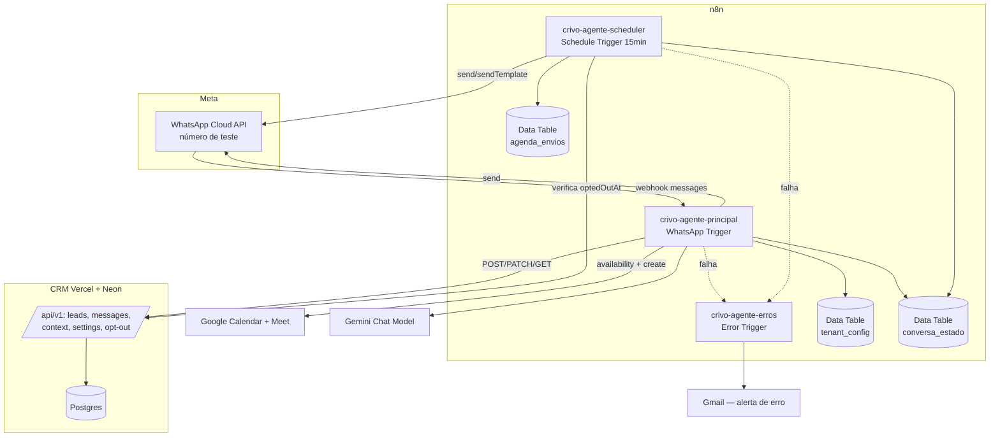

# Lote 6 — Agente n8n + WhatsApp · Design

**Spec**: `.specs/features/lote-6-agente-n8n-whatsapp/spec.md`
**Status**: Approved (2026-08-05)
**Abordagem**: A — máquina de estados determinística + LLM estruturado (escolha delegada pelo usuário em 2026-08-05; recomendação do agente). Código puro decide fase/efeitos; o Gemini extrai campos e redige respostas com saída estruturada, sempre validada antes de qualquer efeito colateral. Opt-out, trava humana e transições são invariantes de código, não instruções de prompt.

---

## Architecture Overview

Quatro workflows n8n (instância pessoal do usuário) + camada de decisão pura versionada no repo + extensão pequena do CRM (INT-09/CONF-05). O CRM de produção (`https://crivo-arthur1050s-projects.vercel.app`) é a fonte de verdade; Data Tables do n8n guardam só estado operacional leve.



### Pipeline do workflow principal (visão de nós)

1. **WhatsApp Trigger** (`whatsAppTrigger`; credencial = App ID + App Secret do app Meta — o nó registra e verifica o webhook sozinho na ativação; nenhum verify-token manual).
2. **Filter**: só eventos `messages`; `statuses` descartados (spec, assumption).
3. **Code `normalizeEvent`**: extrai `wa_id`, `phone_number_id`, `messageId`, texto, `timestamp`, flag de mídia.
4. **Data Table `tenant_config` lookup**: `phone_number_id` → tenant (slug, API key, calendarId). Sem match → fim silencioso (AGT-01 AC4).
5. **Debounce**: insere em `conversa_estado.buffer`; **Wait 10s**; se chegou mensagem mais nova no buffer → fim (a execução mais recente responde) [AGT-02 AC6].
6. **Sync CRM**: `POST /leads` (idempotente, `externalId=wa_id`) → devolve lead com `id`, `status`, `optedOutAt`, campos; `POST /leads/{id}/messages` para cada msg do buffer (`externalId=messageId`, `sender=lead`, `sentAt` do timestamp Meta) [AGT-01].
7. **Code `gate`** (máquina de estados — decide UMA rota):
   - texto normalizado é opt-out → rota opt-out [LGPD-03 AC1]
   - `optedOutAt` já preenchido → só registra, fim [LGPD-03 AC3]
   - `status = escalado_humano` → só registra, fim [AGT-05 AC3]
   - mídia sem texto → resposta fixa "sigo por texto", sem LLM [edge case]
   - senão → rota conversa
8. **Rota conversa**: `GET /settings` + `GET /context?modality=...` → **Code `buildPrompt`** (persona, modalidade, campos faltantes do lead retornado no passo 6, horário comercial, instrução de transparência-IA) → **Gemini Chat Model** com saída JSON estruturada → **Code `validateLlmOutput`** (parse estrito; inválido → 1 retry; ainda inválido → pergunta de esclarecimento, nada é gravado) [edge case anti-alucinação].
9. **Efeitos (deterministicamente, conforme `acao` validada)**:
   - `atualizar_campos` → `PATCH /leads/{id}` só com chaves extraídas [AGT-02 AC3]
   - `agendar` → **Google Calendar `availability`** (slot dentro do horário comercial do tenant) → livre? **`event.create`** com Meet (`conferenceData`) e convidado opcional (e-mail do lead, se ele quis) → `PATCH` com `meetingAt` + `executiveSummary` + `status=qualificado_agendado` numa requisição → grava lembrete em `agenda_envios` [AGT-04]
   - `escalar` → `PATCH` com `status=escalado_humano` + `escalationReason` + `executiveSummary` [AGT-05 AC1]
   - `409` em qualquer PATCH de status → loga, segue a conversa sem repetir a transição [AGT-07 AC1]
10. **Responder**: WhatsApp `message.send` → `POST /leads/{id}/messages` (`sender=agente`) [AGT-01 AC5] → atualiza `conversa_estado` (campos coletados, `lastInboundAt`, fase).

### Scheduler (workflow 2, um só para poupar quota de execuções)

Schedule Trigger a cada 15 min (cadência configurável) roda três varreduras em sequência:
- **Lembretes**: `agenda_envios` com `meetingAt` ≤ now+60min e `sentAt` null → reconsulta lead via `POST /leads` idempotente → `optedOutAt` null? → dentro da janela 24h (`lastInboundAt`)? texto livre : template `lembrete_reuniao` → registra mensagem no CRM → marca enviado [AGT-06, LGPD-03 AC2].
- **Reengajamento**: `conversa_estado` com `lastInboundAt` < now−24h, qualificação incompleta, `reengaged=false`, sem opt-out → template `reengajamento` (janela sempre fechada por definição) → marca [AGT-05 AC2].
- **Escalonamento por silêncio**: `reengaged=true` e `lastInboundAt` < now−48h → `PATCH status=escalado_humano`, motivo "ausência de resposta" [AGT-05 AC2].

---

## Code Reuse Analysis

### Existing Components to Leverage

| Component | Location | How to Use |
| --------- | -------- | ---------- |
| `problem()` + `ProblemCode` | `src/server/integration/problem.ts` | Reusar na rota `/settings` (AD-013) |
| Auth por API key (sha256 + DAL) | `src/server/integration/auth.ts` | Reusar sem mudança na rota `/settings` |
| Parsers puros do contrato | `src/server/integration/parsers.ts` | Padrão para validação de `meetingDays`/horas no CONF-05 |
| `updateTenantSettings` + action + form | `src/server/data/index.ts`, `settings-form.tsx` | Estender com os 3 campos novos (padrão SPG-1: chave ausente não toca) |
| Teste `SwaggerParser.validate()` | teste existente do openapi | Cobre o novo path `/settings` automaticamente |
| Padrão Error Trigger → e-mail | workflow `tosta.log — Workflow de erro` (instância n8n) | Mesmo desenho para `crivo-agente-erros` (credencial Gmail existente) |
| Guia de integração | `docs/integration/guia-integracao.md` | Fonte da semântica de idempotência/409/opt-out que a camada de decisão implementa |

### Integration Points

| System | Integration Method |
| ------ | ------------------ |
| CRM API v1 | HTTP Request nodes com `Authorization: Bearer <api key do tenant>` (da `tenant_config`); base URL como variável do workflow |
| Meta WhatsApp | `whatsAppTrigger` (App ID/Secret) para entrada; `whatsApp` message.send/sendTemplate (access token + phone number ID) para saída |
| Google Calendar | Nó nativo, credencial Google do usuário (conta única na Fase 8), `calendarId` por tenant na `tenant_config` |
| Gemini | `lmChatGoogleGemini`/nó Gemini com credencial `googlePalmApi` existente; nó isolado (troca de modelo = trocar 1 nó) |
| Postgres do CRM | NUNCA acessado direto pelo n8n — só via contrato (princípio do guia §7) |

---

## Components

### 1. Camada de decisão (repo, código puro)

- **Purpose**: Toda regra determinística do fluxo, testável sem n8n.
- **Location**: `n8n/src/*.mjs` (sem dependências, sem I/O) + `n8n/src/__tests__/*.test.ts` (vitest, incluído na suíte) + `n8n/fixtures/*.json` (payloads reais da Meta: mensagem, duplicado, statuses, mídia, opt-out).
- **Interfaces** (funções puras):
  - `normalizeEvent(metaPayload) → {waId, phoneNumberId, messageId, text, sentAt, hasMedia} | null` (null p/ statuses)
  - `detectOptOut(text) → boolean` (SAIR/PARAR, case/acento-insensível)
  - `gate({optedOutAt, status, hasMedia, text}) → 'opt-out'|'somente-registrar'|'midia'|'conversa'`
  - `buildPrompt({settings, context, lead, buffer, businessHours}) → string` (inclui instrução de não negar ser IA)
  - `validateLlmOutput(raw) → {ok, acao, campos, resposta, motivo?} | {ok:false}` (whitelist de campos/enums do contrato; rejeita qualquer valor fora)
  - `resolveBusinessHours(settings) → {days, start, end}` (fallback seg–sex 9–18)
  - `isWithin24h(lastInboundAt, now) → boolean`
- **Reuses**: enums/nomes de campos espelhados do `openapi.yaml` (fonte de verdade).

### 2. Workflows n8n como código

- **Purpose**: Artefato versionado que gera os workflows publicados.
- **Location**: `n8n/workflows/*.ts` (código SDK n8n com marcadores `__INLINE(<arquivo>)__` para os Code nodes) + `n8n/generated/*.ts` (código final com as funções inlined — o que vai à instância) + `scripts/n8n-inline.mjs` (gera `generated/` a partir de `workflows/` + `src/`).
- **Interfaces**: `node scripts/n8n-inline.mjs` (determinístico; rodar duas vezes = mesmo output); publicação na instância via MCP n8n (`create_workflow_from_code`/`update_workflow`) usando o conteúdo de `generated/`.
- **Dependencies**: MCP n8n na sessão de Execute; SDK reference (`get_sdk_reference`) obrigatória antes de escrever os `.ts`.
- **Workflows**: `crivo-agente-principal`, `crivo-agente-scheduler`, `crivo-agente-erros` (Error Trigger → Gmail, workflow de erro dos dois primeiros).

### 3. Data Tables (n8n)

- **Purpose**: Estado operacional leve; nunca fonte de verdade de negócio.
- **Location**: instância n8n (criadas via MCP `create_data_table`; schema documentado no repo em `n8n/README.md`).
- **Modelos**: ver Data Models.

### 4. INT-09 — `GET /api/v1/settings` (CRM)

- **Purpose**: Expor ao consumidor persona, modalidade e horário comercial do tenant da chave.
- **Location**: `app/api/v1/settings/route.ts` (handler fino) + `src/server/integration/settings.ts` (serviço) + `docs/integration/openapi.yaml` (path novo) + testes de integração espelhando o padrão das rotas existentes.
- **Interfaces**: `GET` → `200 {realEstateName, agentName, supportedModality, agentPresentationMessage, meetingDays, meetingHoursStart, meetingHoursEnd}` (nulls quando não configurado); `401` sem chave; `405` outros verbos.
- **Reuses**: `auth.ts`, `problem.ts`, padrão de teste das rotas do lote-5.

### 5. CONF-05 — Horário comercial em Configurações (CRM)

- **Purpose**: Imobiliária define dias de atendimento + janela de horário; fluxo consome via INT-09.
- **Location**: `src/db/schema.ts` (3 colunas novas nullable em `tenants`: `meetingDays integer[]` ISO 1–7, `meetingHoursStart text 'HH:MM'`, `meetingHoursEnd text 'HH:MM'`), DAL `updateTenantSettings`, `settings-form.tsx` (seção nova com componentes Astryx — checar `astryx component` antes de compor), action com validação (início < fim; ≥1 dia quando janela preenchida).
- **Reuses**: padrão SPG-1 (chave ausente não toca), `drizzle-kit push` aditivo (colunas nullable, sem perda).

---

## Data Models

### Data Table `tenant_config` (n8n)

| coluna | tipo | nota |
| ------ | ---- | ---- |
| `phoneNumberId` | string | chave de lookup (evento Meta) |
| `tenantSlug` | string | identificação humana |
| `apiKey` | string | API key do CRM (piloto; ver Risks R1) |
| `calendarId` | string | agenda Google do tenant |

Fase 8: 2 linhas apontando para os 2 tenants do seed do banco de produção (o número de teste é um só; um segundo `phoneNumberId` fictício cobre o teste de isolamento via fixture).

### Data Table `conversa_estado` (n8n)

| coluna | tipo | nota |
| ------ | ---- | ---- |
| `tenantSlug` + `waId` | string | chave composta da conversa |
| `leadId` | string | id do lead no CRM |
| `bufferJson` | string | mensagens aguardando debounce `[{messageId,text,sentAt}]` |
| `camposJson` | string | snapshot dos campos já coletados (cache do CRM) |
| `fase` | string | `qualificando` \| `agendando` \| `encerrada` |
| `lastInboundAt` | dateTime | janela 24h |
| `reengaged` | boolean | 1 reengajamento no máximo |

Perda desta tabela ≠ perda de dado: cold start reconstrói de `POST /leads` (spec edge case).

### Data Table `agenda_envios` (n8n)

| coluna | tipo | nota |
| ------ | ---- | ---- |
| `leadId`, `tenantSlug`, `waId` | string | destino |
| `meetingAt` | dateTime | horário da reunião |
| `meetLink` | string | link do Meet do evento |
| `sentAt` | dateTime nullable | lembrete enviado |

### Saída estruturada do Gemini (contrato do prompt)

```typescript
interface LlmTurnOutput {
  acao: "responder" | "atualizar_campos" | "agendar" | "escalar";
  campos: Partial<{
    modality: "novo" | "usado" | "ambos";
    region: string; budgetCents: number;
    propertyType: "casa" | "apartamento";
    purchaseHorizon: string;
    motivation: "investidor" | "morador";
    creditStatus: "pre_aprovado" | "recurso_proprio_fgts";
    chainedOperation: boolean;
    leadEmail: string | null;   // só se o lead quis convite (nunca vai ao CRM — só ao Calendar)
    meetingAtProposto: string;  // ISO, validado contra businessHours antes de qualquer efeito
  }>;
  resposta: string;             // texto enviado ao lead
  motivoEscalonamento?: string; // obrigatório quando acao=escalar
}
```

`validateLlmOutput` rejeita enums fora do contrato, datas não-ISO e `meetingAtProposto` fora do horário comercial — saída inválida jamais vira PATCH/evento/envio. Enums espelham `openapi.yaml` (valores exatos conferidos no Execute).

### `GET /api/v1/settings` — response

```typescript
interface SettingsResponse {
  realEstateName: string; agentName: string;
  supportedModality: "novos" | "usados" | "ambos"; // valor exato do enum do schema
  agentPresentationMessage: string | null;
  meetingDays: number[] | null;        // ISO 1(seg)–7(dom)
  meetingHoursStart: string | null;    // "HH:MM"
  meetingHoursEnd: string | null;
}
```

---

## Error Handling Strategy

| Error Scenario | Handling | User Impact |
| -------------- | -------- | ----------- |
| CRM 5xx/timeout | Retry ≥2 com backoff nos HTTP nodes; esgotou → Error Trigger → e-mail | Lead não recebe resposta neste turno; mensagem não se perde (Meta reentrega + idempotência) |
| CRM 409 em PATCH de status | Rota de conversa continua sem repetir transição; campos/mensagens seguem sincronizando | Conversa flui; humano mantém controle (trava) |
| Saída do Gemini inválida | 1 retry; depois pergunta de esclarecimento sem gravar nada | Lead recebe pedido de esclarecimento; zero dado alucinado no CRM |
| `phone_number_id` desconhecido | Descarte silencioso (sem CRM, sem erro) | Nenhum |
| Falha ao criar evento no Calendar | Não faz PATCH de status (efeitos são sequenciais: evento primeiro); informa lead que confirmará em seguida; Error Trigger notifica | Lead segue `em_qualificacao`; humano avisado |
| Template não aprovada / envio proativo falha | Marca tentativa, Error Trigger notifica; nunca bloqueia o fluxo principal | Lembrete/reengajamento perdido, conversa reativa intacta |
| Meta reentrega evento | Idempotência do contrato (`externalId`) + debounce | Nenhum (nunca duplica) |

---

## Risks & Concerns

| Concern | Location | Impact | Mitigation |
| ------- | -------- | ------ | ---------- |
| **R1**: API keys de tenant em Data Table do n8n (texto claro) | `tenant_config` | Vazamento de chave se instância comprometida | Aceito para piloto (2 consumidores, chaves revogáveis via `revoked_at` — guia §1); antes de números reais: migrar para credenciais HTTP Header Auth por tenant ou secrets do n8n. Registrado como follow-up |
| **R2**: Token de acesso Meta do usuário pode ser o temporário (23h) do painel | credencial WhatsApp no n8n | Envio para de funcionar em <1 dia | Execute usa **token permanente de System User** (Meta Business Settings); passo documentado no runbook de setup |
| **R3**: Quota de execuções do n8n Cloud com scheduler de 15 min (~2.9k exec/mês só dele) | `crivo-agente-scheduler` | Estouro de plano | Um único workflow scheduler para as 3 varreduras; cadência é 1 parâmetro; verificar plano na Execute e ajustar (30 min ainda satisfaz "≈1h antes") |
| **R4**: Gemini pode devolver JSON malformado/campos inventados | rota conversa | Dado alucinado no CRM | `validateLlmOutput` com whitelist de enums do contrato + retry + fallback de esclarecimento; teste discriminante com fixture de saída inválida |
| **R5**: `tsc --noEmit` já falha no repo (BigInt em `format.test.ts:17`, pendência herdada) | `src/lib/__tests__/format.test.ts:17` | Ruído ao adicionar código TS novo | Fora do gate (build/lint/vitest); não piorar: código novo do lote não usa literais BigInt; pendência segue aberta |
| **R6**: Testes de integração existentes mutam o snapshot do seed (higiene herdada) | `mutations.test.ts` etc. | Smoke exige `npm run db:seed` antes | Mesmo procedimento já documentado no STATE; smoke do lote roda seed antes — **e coordena rotação de chave** (seed do banco de produção regenera a API key que a `tenant_config` usa; runbook cobre a ordem) |
| **R7**: Webhook único por app Meta — o WhatsApp Trigger assume a assinatura do app | app Meta | Outro consumidor do mesmo app quebraria | Aceito: o app Meta é dedicado ao Crivo |

---

## Tech Decisions (only non-obvious ones)

| Decision | Choice | Rationale |
| -------- | ------ | --------- |
| Timezone de negócio | `America/Sao_Paulo` fixo no fluxo (horário comercial, `meetingAt`, lembretes) | Piloto 100% Uberaba/MG; TZ por tenant é productização futura |
| Templates Meta | 2 utility: `lembrete_reuniao` (variáveis: horário, link Meet) e `reengajamento` (nome do agente) — criadas no app na Execute | Todo envio proativo do produto acontece fora da janela de 24h |
| E-mail do lead | Vai só ao Calendar (convidado); **não** é persistido no CRM | Contrato v1 não tem campo de e-mail; minimização LGPD |
| 1 scheduler para 3 varreduras | Workflow único com 3 ramos sequenciais | Quota de execuções (R3) e menos superfície de sync |
| Ordem dos efeitos no agendamento | Calendar `event.create` ANTES do `PATCH status` | Se o evento falha, lead não fica `qualificado_agendado` sem reunião real; o inverso (evento órfão) é detectável e mais barato |
| Fonte de verdade dos workflows | `n8n/workflows/*.ts` (SDK) + inline determinístico → `n8n/generated/` → instância | Verifier compara `generated/` com o export da instância; UI do n8n nunca é editada à mão |
| Categoria de IDs | `AGT-*` (fluxo), `INT-09` (contrato), `CONF-05` (tela lote-2), `LGPD-03` (compliance) | Continuidade da rastreabilidade entre lotes |

> **Proposta de decisão de projeto (AD-014, a registrar no STATE.md na aprovação deste design):** Trabalho em n8n deste produto é sempre *workflow-as-code*: fonte no repo (`n8n/workflows/` + camada de decisão pura em `n8n/src/` com testes), publicação gerada e reproduzível, UI do n8n nunca editada à mão. Efeitos colaterais (CRM/calendário/envios) nunca são decididos autonomamente por LLM — passam por validação determinística. Vale para Fases 9–10.

---

## Verificação (como o Verifier obtém evidência)

- **Camada de decisão**: vitest sobre `n8n/src/` com fixtures reais (payload Meta, saída LLM válida/inválida, gates de opt-out/trava/mídia) — mesmos comandos de gate do repo (`npx vitest run`).
- **CRM (INT-09/CONF-05)**: testes de integração no padrão do lote-5 + `SwaggerParser.validate()`.
- **Workflows**: `n8n/generated/` == workflow na instância (export via MCP `get_workflow_details`); execuções de teste via MCP (`test_workflow`/`execute_workflow`) com payloads de fixture.
- **Fim-a-fim (smoke)**: conversa real no número de teste cobrindo os 3 desfechos (agendado com evento+Meet verificado no Calendar; escalado com motivo; opt-out com indicador no CRM), conferida nas telas do CRM de produção.
