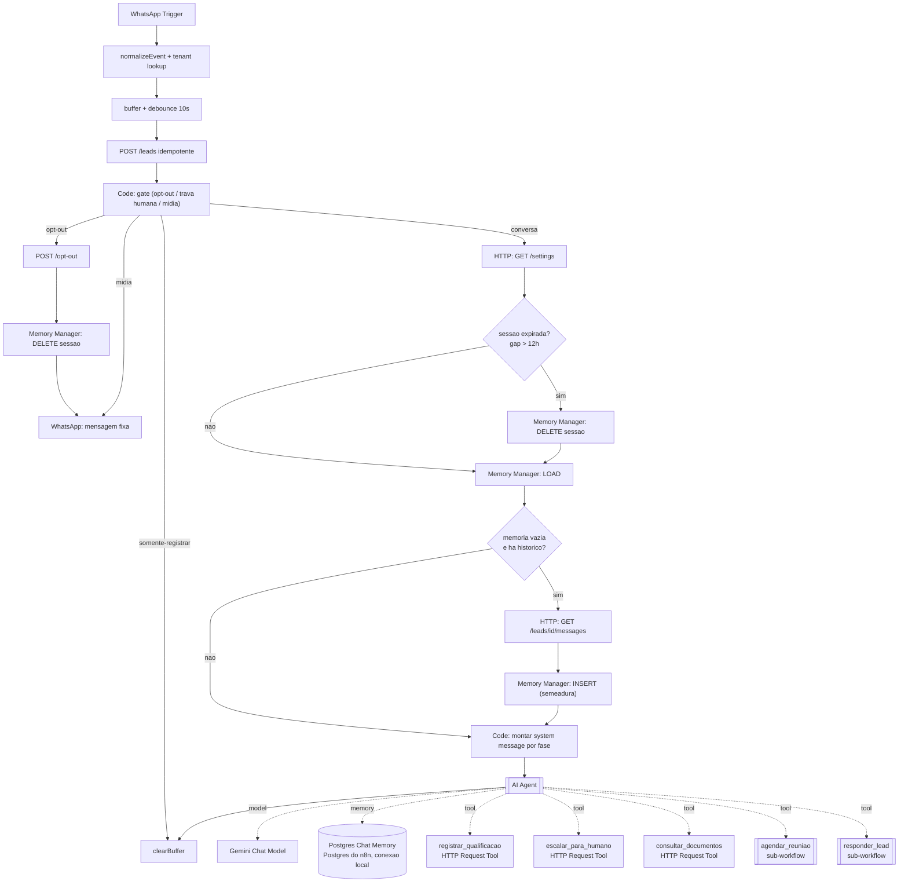

# Lote 6c — AI Agent, memória persistente e tools determinísticas · Design

**Spec**: `.specs/features/lote-6c-agente-ai-agent-memoria-tools/spec.md`
**Context**: `.specs/features/lote-6c-agente-ai-agent-memoria-tools/context.md`
**Status**: Draft

---

## Decisões de projeto ativas que este design toca

Lidas em `.specs/STATE.md` `## Decisions` antes de qualquer escolha arquitetural.

| AD | Situação neste design |
| -- | --------------------- |
| **AD-014 (workflow-as-code)** | **Superseded por AD-018.** A metade *workflow-as-code* é preservada literalmente (fonte no repo, camada pura testada em vitest, `n8n/generated/` reproduzível, UI nunca editada à mão). A metade *"efeitos colaterais nunca decididos autonomamente por LLM"* é substituída — ver AD-018 abaixo |
| **AD-016 (persona invertida, sem emoji, 1-3 mensagens)** | Conforma. Inalterada; muda só **onde** o teto de 3 é imposto (contador na tool `responder_lead`, não no output parser) |
| **AD-017 (histórico pelo contrato, janela 20/12h)** | **Emendada por AD-019.** Cai o teto de 20 mensagens. `GET /api/v1/leads/{id}/messages` continua, agora como regra de **semeadura** da memória em cold start |
| **AD-013 (problem+json com `code`)** | Conforma, e passa a ser **load-bearing**: o `code` estável do erro é o que o agente lê para se corrigir |
| **AD-006 (roadmap em lotes)** | Conforma. Este é um lote interstitial antes de L7/Fase 9, na mesma linhagem do lote-6b |

### AD-018 (proposta) — Tool boundary substitui validação pré-efeito

O LLM decide **quando** chamar uma tool. O que é permitido é decidido por quem detém a regra — preferencialmente o **contrato do CRM**, que já a implementa. Restam exatamente **dois invariantes duros**, ambos por obrigação legal/contratual e não por preferência arquitetural:

1. **Opt-out / LGPD** — detectado em `n8n/src/gate.mjs` antes do agente. Nenhuma tool de opt-out é exposta ao modelo. Um lead que escreveu "sair" não pode receber mensagem porque o agente achou uma boa ideia.
2. **Trava humana** (`status = escalado_humano`) — dupla proteção: o gate roteia para `somente-registrar` antes do agente, e o CRM recusa server-side com `409 lead-travado-por-humano`.

Todo o resto passa a ser validação de engenharia comum, que **degrada ou regenera em vez de bloquear**.

### AD-019 (proposta) — Memória como cache derivado

O CRM é fonte de verdade da thread (tela Chats, LGPD, corretor). `n8n_chat_histories` é cache conversacional derivado, no Postgres da própria instância n8n (conexão local). Duas obrigações que caem disso: purga no opt-out e semeadura em cold start.

---

## Architecture Overview

O entorno permanece intocado. A reescrita ocupa exatamente o trecho entre a rota `conversa` do gate e o `clearBuffer`.



### Por que 3 tools nativas e 2 sub-workflows

Diretriz do usuário: nativo primeiro, sub-workflow só em último caso. As três nativas são possíveis porque **a regra já está no CRM** — replicá-la no n8n seria redundância, não segurança.

| Tool | Forma | Justificativa |
| ---- | ----- | ------------- |
| `registrar_qualificacao` | **Nativa** — `@n8n/n8n-nodes-langchain.toolHttpRequest` v1.1, `PATCH /api/v1/leads/{id}` | Enum inválido já volta `400` do contrato. O agente lê o erro e corrige |
| `escalar_para_humano` | **Nativa** — mesma, `PATCH` de status | `TRANSITIONS` e trava humana já são server-side (`src/server/integration/leads.ts:87-124`), com `409` + `code` estável |
| `consultar_documentos` | **Nativa** — mesma, `GET /api/v1/context` | Somente leitura. Falha degrada para lista vazia |
| `agendar_reuniao` | **Sub-workflow** | Compõe 3 efeitos que precisam acontecer juntos: disponibilidade no Calendar → criar evento → `PATCH` status/`meetingAt`/`meetLink` → enfileirar lembrete em `agenda_envios`. Se fossem tools nativas encadeadas, uma falha no meio deixaria **evento no Calendar sem lead atualizado no CRM** — o corretor não enxerga a reunião que o lead marcou |
| `responder_lead` | **Sub-workflow** | Compõe envio + registro no CRM + as barreiras de persona **antes** do envio. Nativo puro perderia três coisas: a mensagem não apareceria na tela Chats, as checagens VOZ-01/02 não teriam onde rodar antes do envio, e o teto de 3 não teria contador |

O ponto decisivo de `responder_lead`: validar depois do envio não serve para nada — a queixa do usuário é sobre o que **chega ao lead**.

---

## Code Reuse Analysis

### Componentes existentes a aproveitar

| Componente | Localização | Como usar |
| ---------- | ----------- | --------- |
| `gate()` / `detectOptOut()` | `n8n/src/gate.mjs` | Inalterado. Continua sendo a barreira de opt-out e trava humana antes do agente |
| `isSlotWithinBusinessHours()` / `resolveBusinessHours()` | `n8n/src/business-hours.mjs` | Reusado dentro do sub-workflow `agendar_reuniao`, agora devolvendo *sugestão* em vez de recusa |
| `selectHistoryWindow()` | `n8n/src/history.mjs` | **Reduzido** ao corte de sessão. O teto de mensagens sai (AD-019); a função vira a base de `isSessionExpired()` e da seleção de semeadura |
| `buildPrompt()` | `n8n/src/prompt.mjs` | **Reescrito** como `buildSystemMessage()`. Preserva as seções de identidade, tom do tenant e transparência (AD-016); perde histórico (vira memória), documentos (vira tool) e instrução de formato (vira tool calling) |
| `normalizePhone()` | `n8n/src/phone.mjs` | Inalterado. Usado por `responder_lead` para o nono dígito |
| `TRANSITIONS` / `patchLead` | `src/server/integration/leads.ts` | Não modificado. Passa a ser a barreira de fato de `escalar_para_humano` |
| `problem()` / `ProblemCode` | `src/server/integration/problem.ts` | Não modificado. O `code` estável vira o canal de feedback ao agente |
| Data Table `conversa_estado` | `ZsplBxJjXv3kwKZ8` | Estendida com 2 colunas (abaixo). Chave composta já existente |
| Entorno de `principal.ts` | `n8n/workflows/principal.ts:76-614` | Trigger, normalização, tenant lookup, buffer/debounce, gate e rotas não-LLM permanecem |

### O que é removido de `principal.ts`

`getMessagesHistory`, `getContext`, `buildPromptCode`, `geminiModelAttempt1/2`, `outputParserAttempt1/2`, `askGeminiAttempt1/2`, `validateLlmAttempt1/2`, `isValidAttempt1/2`, `actionSwitch`, `validatedFieldsCheckpoint`, `patchFields`, `finalizeFields`, `validatedAgendarCheckpoint`, `checkAvailability`, `isAvailable`, `createCalendarEvent`, `patchScheduled`, `insertAgendaEnvio`, `finalizeScheduled`, `finalizeUnavailable`, `validatedEscalarCheckpoint`, `patchEscalated`, `finalizeEscalated`, `finalizeResponder`, `normalizeRecipient`, `sendReply1/2/3`, `registerAgentReply1/2/3`, `hasMessage2/3`, `waitMessage2/3`.

**Atenção ao remover:** as rotas `opt-out` e `midia` hoje reaproveitam `sendReplyWired` para enviar sua mensagem fixa. Com a cadeia removida, elas precisam de um nó `WhatsApp: enviar mensagem fixa` próprio — não passam pelo agente.

### Integration Points

| Sistema | Método de integração |
| ------- | -------------------- |
| CRM (contrato v1) | HTTP com `Authorization: Bearer {apiKey}`, inalterado. Nenhuma rota nova neste lote |
| Google Calendar | `n8n-nodes-base.googleCalendarTool` v1.3 dentro do sub-workflow `agendar_reuniao` (`calendar:availability` + `event:create`) |
| WhatsApp | `n8n-nodes-base.whatsApp` v1.1 dentro do sub-workflow `responder_lead` |
| Postgres do n8n (memória) | Credencial Postgres apontando para o banco da própria instância, por conexão local (mesmo servidor). Sem relação nenhuma com o banco do CRM |

---

## Components

### `n8n/src/phase.mjs` (novo)

- **Purpose**: decidir a fase da conversa a partir do que já foi perguntado — determinística, sem depender de o modelo perceber que terminou.
- **Interfaces**:
  - `REQUIRED_FIELDS: readonly string[]` — `["modality", "region", "propertyType"]`
  - `OPPORTUNISTIC_FIELDS: readonly string[]` — os outros 5
  - `resolveConversationPhase(perguntados: string[]): "qualificando" | "agendando"` — `agendando` quando os 3 obrigatórios constam como perguntados
  - `nextFieldToAsk(perguntados: string[]): string | null` — `null` quando não há mais nada a perguntar
- **Dependencies**: nenhuma (função pura)
- **Reuses**: os rótulos pt-BR de `prompt.mjs`

### `n8n/src/voice.mjs` (novo)

- **Purpose**: barreiras determinísticas de persona, aplicadas antes do envio.
- **Interfaces**:
  - `checkOpening(mensagens: string[], aberturasAnteriores: string[]): {ok: true} | {ok: false, reason: "abertura-proibida" | "abertura-repetida"}`
  - `checkCapabilityPromise(mensagens: string[]): {ok: true} | {ok: false, reason: "promessa-fora-de-capacidade"}`
  - `extractOpening(mensagem: string): string` — normaliza (minúsculas, sem acento, sem pontuação) a primeira palavra ou locução
  - `BANNED_OPENINGS: Set<string>` — `show`, `boa`, `perfeito`, `entendido`, `otimo`, `legal`
- **Dependencies**: nenhuma (função pura)
- **Reuses**: a normalização NFD de `gate.mjs` (`foldAccentsAndCase`) — extraída para uso compartilhado

### `n8n/src/session.mjs` (novo, absorve parte de `history.mjs`)

- **Purpose**: decidir purga e semeadura da memória.
- **Interfaces**:
  - `isSessionExpired(lastInboundAt: string | null, now: string, gapHours?: number): boolean` — `true` também quando `lastInboundAt` é nulo? **Não**: nulo significa conversa nova, sem sessão a purgar
  - `selectSeedMessages(messages: HistoryMessage[], now: string, options?): HistoryMessage[]` — mensagens da sessão corrente, teto de salvaguarda 50
- **Dependencies**: nenhuma (função pura)
- **Reuses**: o corte de sessão de `history.mjs` (o teto de 20 é removido)

### `n8n/src/system-message.mjs` (reescreve `prompt.mjs`)

- **Purpose**: montar o system message do AI Agent, variando por fase.
- **Interfaces**:
  - `buildSystemMessage({settings, lead, phase, perguntados, businessHours}): string`
- **Seções**, nesta ordem: identidade → tom do tenant (delimitado + reafirmação) → persona consultiva → fronteira de capacidade → transparência (AD-016) → instrução por fase → horário comercial → catálogo de tools.
- **Não contém mais**: histórico (memória), documentos (tool), formato de saída (tool calling).
- **Dependencies**: `phase.mjs`
- **Reuses**: `AI_TRANSPARENCY_INSTRUCTION` e o bloco de tom do tenant de `prompt.mjs`, literalmente

### Sub-workflow `crivo-tool-responder-lead`

- **Purpose**: única porta de saída de mensagem do agente para o lead.
- **Location**: `n8n/workflows/tool-responder-lead.ts`
- **Fluxo**: `executeWorkflowTrigger` → Code (carrega `conversa_estado`, aplica `checkOpening` + `checkCapabilityPromise` + contador) → IF rejeitado → devolve erro nomeado ao agente | aceito → normaliza telefone → WhatsApp send → `POST /leads/{id}/messages` → grava contador e abertura em `conversa_estado`
- **Reuses**: `voice.mjs`, `phone.mjs`

### Sub-workflow `crivo-tool-agendar-reuniao`

- **Purpose**: transação de agendamento entre Calendar e CRM.
- **Location**: `n8n/workflows/tool-agendar-reuniao.ts`
- **Fluxo**: `executeWorkflowTrigger` → Code (`isSlotWithinBusinessHours`) → fora do expediente? devolve sugestão ao agente, sem efeito | dentro → Calendar `availability` → ocupado? devolve ao agente | livre → Calendar `event:create` → `PATCH /leads/{id}` (status + `meetingAt` + `meetLink`) → insert em `agenda_envios`
- **Reuses**: `business-hours.mjs`

---

## Data Models

### `conversa_estado` (Data Table `ZsplBxJjXv3kwKZ8`) — 2 colunas novas

```typescript
interface ConversaEstado {
  tenantSlug: string            // existente (chave)
  waId: string                  // existente (chave)
  bufferJson: string            // existente
  lastInboundAt: string         // existente — passa a alimentar isSessionExpired()
  leadId: string                // existente
  camposJson: string            // existente
  fase: "qualificando" | "agendando"  // existente — agora escrita por resolveConversationPhase()
  reengaged: boolean            // existente
  perguntadosJson: string       // NOVO — JSON array dos campos já perguntados
  aberturasJson: string         // NOVO — JSON array das aberturas já usadas pelo agente na sessão
}
```

**Relacionamento**: chaveada por `tenantSlug` + `waId`, a mesma chave da `sessionKey` da memória. Purga de sessão (12h ou opt-out) limpa `perguntadosJson` e `aberturasJson` junto com a memória — senão o agente entra numa sessão nova achando que já perguntou tudo.

### Memória (Postgres do n8n, conexão local)

```typescript
// tabela criada e gerenciada pelo próprio nó memoryPostgresChat
interface N8nChatHistories {
  id: number
  session_id: string   // `${tenantSlug}:${waId}`
  message: object      // formato LangChain — não é a forma de `messages` do CRM
}
```

**Relacionamento**: derivada de `messages` do CRM, nunca o contrário. Semeada por `GET /api/v1/leads/{id}/messages`.

---

## Error Handling Strategy

| Cenário | Tratamento | Impacto no lead |
| ------- | ---------- | --------------- |
| Enum inválido em `registrar_qualificacao` | CRM devolve `400`; o agente lê e corrige na mesma iteração | Nenhum — invisível |
| Transição de status inválida | CRM devolve `409 transicao-invalida`; o agente segue a conversa | Nenhum |
| Lead travado por humano | Gate roteia antes do agente; se escapar, CRM devolve `409 lead-travado-por-humano` | Nenhum — humano assume |
| Horário fora do expediente | `agendar_reuniao` devolve sugestão de janela válida, sem criar evento | Agente propõe outro horário |
| Horário ocupado no Calendar | Tool devolve "ocupado" ao agente | Agente propõe outro horário |
| Abertura proibida ou repetida | `responder_lead` recusa com `abertura-proibida` / `abertura-repetida`; o agente reescreve | Nenhum — não chega a sair |
| Promessa fora de capacidade | Idem, `promessa-fora-de-capacidade` | Nenhum |
| 4ª chamada de `responder_lead` no turno | Tool recusa; nada é enviado | Recebe no máximo 3 balões |
| `GET /context` falha | Tool devolve lista vazia com aviso | Nenhum |
| Semeadura da memória falha | Segue com memória vazia | Agente pode repetir algo |
| Banco de memória indisponível | Turno roda sem memória | Agente pode repetir algo |
| `maxIterations` atingido | Fallback de esclarecimento | Recebe uma mensagem pedindo para reformular |
| Agente termina sem chamar `responder_lead` | Registra na execução e encerra sem enviar | Silêncio — aceito, melhor que mensagem errada |

---

## Risks & Concerns

| Concern | Localização | Impacto | Mitigação |
| ------- | ----------- | ------- | ---------- |
| **`leadId` vindo do modelo permitiria escrita cross-lead** | tools nativas `registrar_qualificacao` / `escalar_para_humano` | Agente alucina um `leadId` e escreve no lead errado — vazamento entre leads e possivelmente entre tenants | **A URL da tool é montada por expressão do fluxo, nunca por `$fromAI`.** Só o corpo aceita campos do modelo. Vira teste de discriminação obrigatório no Verifier |
| **`validate-llm.mjs` vira código morto** | `n8n/src/validate-llm.mjs` (9 KB, ~40 testes) | Código testado que ninguém chama passa uma falsa sensação de cobertura | Remover o que morre junto com o output parser; preservar apenas o que as tools usarem. Contagem de testes vai **cair** neste lote — é redução legítima, não enfraquecimento, e precisa ser declarada assim ao Verifier |
| **ID duplicado no log de decisões** | `.specs/STATE.md:110` e `:117` — duas entradas `AD-014` (trailer de commit / workflow-as-code) | Referência ambígua em qualquer supersede futuro | AD-018 nomeia explicitamente "AD-014 (workflow-as-code)". Renumerar o histórico fica como follow-up, fora deste lote |
| **`apiKey` em texto claro na Data Table** | `n8n/README.md` §3, Risco R1 (herdado) | Agora circula por mais nós de tool | Escopo inalterado, sem piora relativa. Segue como pendência conhecida antes de números reais de imobiliária |
| **Thread em dois lugares** | memória vs `messages` do CRM | Opt-out apaga no CRM e deixa conversa viva no n8n | MEM-04: purga da memória no opt-out, no mesmo ramo do gate |
| **Memória convive com o banco operacional do n8n** | `n8n_chat_histories` no mesmo Postgres das tabelas de execução/workflow do n8n | Crescimento sem limite compete por disco com os dados operacionais da instância; um restore do n8n restaura conversas junto | Tabela distinta (`n8n_chat_histories`), sem colisão com o schema do n8n. O corte de sessão de 12h já limita o crescimento por conversa. Política de retenção da tabela fica documentada em `n8n/README.md` (T5) como operação, não como código |
| **`maxIterations` alto com tool recusando** | nó AI Agent | Loop de rejeição queima tokens e latência | `maxIterations: 8`; recusas contam como iteração; fallback ao estourar |
| **Cobertura vitest encolhe com nós nativos** | tools nativas | Menos superfície testável do que o desenho anterior | Aceito conscientemente (diretriz do usuário). As funções puras que sobram (`phase`, `voice`, `session`, `system-message`) continuam em `n8n/src/` com teste; o comportamento dos nós nativos é coberto por execução MCP com fixtures |
| **Purga de sessão sem limpar `conversa_estado`** | `perguntadosJson` / `aberturasJson` | Sessão nova herda "já perguntei tudo" e pula direto para agendamento com lead frio | Purga é atômica: memória + as duas colunas, no mesmo nó |

---

## Tech Decisions

| Decisão | Escolha | Racional |
| ------- | ------- | -------- |
| Tools nativas vs sub-workflow | 3 nativas, 2 sub-workflows | Diretriz do usuário (nativo primeiro). Os 2 sub-workflows compõem múltiplos efeitos que precisam acontecer juntos — encadear tools nativas deixaria Calendar e CRM inconsistentes, e enviaria ao lead sem validar |
| Onde a memória é persistida | Postgres da própria instância n8n, conexão local | Decisão do usuário. A memória é lida e escrita a cada turno — conexão local tira o salto de rede desse caminho quente. O desacoplamento de INT-08 é preservado do mesmo jeito: o que ele proíbe é o n8n ter credencial do banco do **CRM**, não ter um banco próprio |
| Onde mora a barreira | No CRM, não no n8n | `TRANSITIONS`, trava humana e enums já são server-side com `code` estável (AD-013). Duplicar no n8n era redundância |
| Retry de saída inválida | Loop de tool-error do próprio agente | O agente já reage a erro de tool. Elimina o par de modelo replicado (`attempt1`/`attempt2`) do desenho atual |
| Fonte das aberturas anteriores | `conversa_estado.aberturasJson` | A checagem é determinística e precisa de dado estruturado; ler da memória exigiria parsear texto |
| Modelo | Gemini, inalterado | Trocar modelo no mesmo lote impediria saber se a melhora veio da arquitetura. A/B fica para depois, medido isolado |
| `contextWindowLength` | 50 | Salvaguarda, não política. A regra é o corte de 12h (AD-019) |
| `maxIterations` | 8 | Cabe ~3 respostas + registro de campos + agendamento com folga, sem permitir loop longo de rejeição |

> **Decisões de nível de projeto**: AD-018 (tool boundary) e AD-019 (memória como cache derivado) devem ser gravadas em `.specs/STATE.md` `## Decisions` durante o Execute, com `AD-014 (workflow-as-code)` marcada `superseded by AD-018` e `AD-017` marcada `amended by AD-019`.
