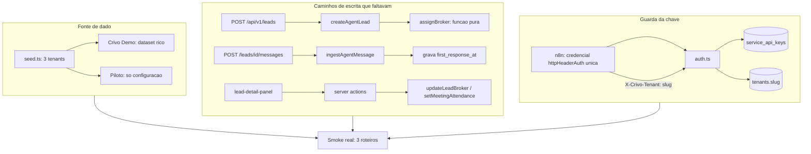

# Lote 7 — Dado real ponta a ponta: Design

**Spec**: `.specs/features/lote-7-dado-real-ponta-a-ponta/spec.md`
**Context**: `.specs/features/lote-7-dado-real-ponta-a-ponta/context.md`
**Status**: Draft

---

## Conformidade com as decisões ativas (`.specs/STATE.md`)

| AD | Como este design conforma |
| -- | ------------------------- |
| AD-002 (multi-tenant desde o schema) | O modo de auth de serviço **não** enfraquece o escopo por tenant: toda query da DAL continua filtrando por `tenant_id`; o que muda é só como o tenant chega à rota. `tenants.slug` nasce único por tenant. |
| AD-004 (mock-first, troca de fonte nunca redesenha tela) | Nenhuma tela é redesenhada. Kanban, Chats e Dashboard são os mesmos; o que muda é a origem do dado e três campos que passam a ter caminho de escrita. |
| AD-007 (RSC-first, tenant em cookie) | Os controles novos (corretor, comparecimento) seguem o padrão do Kanban: RSC carrega, client component muta por server action. |
| AD-010 / AD-012 (Astryx, sem hex/px cru) | Controles novos são componentes da Astryx, verificados por `npx astryx component <Nome>` antes do uso. Nenhum `style={{}}`, nenhum `<div>` de layout. |
| AD-013 (problem+json com `code` estável) | Os erros novos do modo de serviço (`tenant-nao-identificado`) usam `problem()`, com `code` novo registrado no openapi. |
| AD-014 (workflow-as-code; UI do n8n nunca editada à mão) | A troca do header de autorização é feita em `n8n/workflows/principal.ts` e nos 2 sub-workflows, regenerada por `scripts/n8n-inline.mjs` e republicada via MCP. Exceção já prevista pela própria AD: a **credencial** é criada à mão (credencial sempre foi trabalho humano). |
| AD-018 (tool boundary; dois invariantes duros) | Opt-out e trava humana continuam sendo os dois invariantes; nada neste lote os move. PRIV-01 os exercita, não os redesenha. |
| AD-019 (memória é cache derivado; purga no opt-out) | PRIV-01 AC3 é a primeira verificação real dessa obrigação. |
| AD-006 (sequenciamento em 8 lotes) | **Precisa ser emendada** — ver Tech Decisions. |

---

## Architecture Overview

Três frentes independentes que só se encontram na prova final:



---

## Pesquisa (Knowledge Verification Chain)

**Seleção dinâmica de credencial no n8n — não existe.** Verificado por busca na comunidade oficial: é feature request aberta, sem implementação ([dynamic credential selection](https://community.n8n.io/t/dynamic-credential-selection-via-expressions-for-multi-tenant-workflows/236158), [expressions for header auth credential](https://community.n8n.io/t/allow-using-expressions-for-header-auth-credential-selection-in-http-request-node/88070)). Credenciais são resolvidas em tempo de design. Isso elimina "uma credencial por tenant escolhida em runtime" como caminho e é o motivo de SEC-01 virar credencial de serviço única + tenant no header.

**Consequência que a pesquisa expôs e que a spec não conhecia:** como hoje a chave é montada por expressão dentro de `headerParameters` (`n8n/workflows/principal.ts:418,474,547,638,799,999,1040,1074`), ela é **material de parâmetro**, não de credencial — ou seja, aparece resolvida no log de cada execução do nó HTTP, não só na Data Table. Só o cofre nativo de credenciais mascara isso. O escopo real de SEC-01 é maior do que "tirar da Data Table".

---

## Code Reuse Analysis

### Existing Components to Leverage

| Component | Location | How to Use |
| --------- | -------- | ---------- |
| `TENANT_DEFS` + loop do seed | `src/db/seed.ts:158-600` | Estender a interface do def com um marcador de dataset; adicionar o terceiro def. O loop já monta tudo por tenant — nenhum caminho novo. |
| `id()` determinístico do seed | `src/db/seed.ts` | Gera os ids do tenant novo pelo mesmo mecanismo; reseed continua reprodutível. |
| `ingestAgentMessage` (transacional) | `src/server/data/index.ts:873` | A escrita de `first_response_at` entra **dentro** da transação existente, junto do insert da mensagem. |
| `createAgentLead` + `onConflictDoNothing` | `src/server/data/index.ts:807` | A atribuição de corretor entra no mesmo insert; o caminho de conflito já devolve a linha existente sem tocá-la (ATRIB-01 AC4 sai de graça). |
| `updateLeadStatusAction` | `src/server/actions/pipeline.ts:25` | Padrão de server action tenant-scoped com revalidação — as duas actions novas o copiam. |
| `pipeline-board.tsx` (client, optimistic) | `src/components/pipeline/pipeline-board.tsx:162` | Já é client component e já chama action com rollback; o painel de detalhe passa a receber os controles pela mesma via. |
| `EmptyState` da Astryx | já usado em Pipeline, Chats e Dashboard | REAL-01 AC4/AC5 é majoritariamente **verificação**, não construção — os estados vazios existem. |
| `formatRelativeTimePtBR` / `RelativeTime` | `src/lib` | SHELL-01 usa o formatador pt-BR já escrito; nada de `Timestamp` relativo da Astryx (inglês cravado). |
| `problem()` / `ProblemCode` | `src/server/integration/problem.ts` | Erros do modo de serviço. |
| `tenant_api_keys` + `createHash` sha256 | `src/db/schema.ts:256`, `src/server/integration/auth.ts` | `service_api_keys` copia o formato (hash persistido, claro só uma vez no seed). |
| `expireDocuments` + `/api/cron/expire-documents` | `src/server/integration/lgpd.ts`, `vercel.json` | PRIV-01 AC4/AC5 é execução e observação em produção, não código novo. |

### Integration Points

| System | Integration Method |
| ------ | ------------------ |
| Contrato `/api/v1/*` | Mudança **aditiva** em `authenticate()`: o modo por chave de tenant continua funcionando; o modo de serviço é um segundo caminho. Nenhuma rota muda de assinatura. |
| Fluxo n8n | 8 pontos onde o header `Authorization` é montado por expressão passam a usar a credencial `httpHeaderAuth` do nó + header `X-Crivo-Tenant`. A coluna `apiKey` some da Data Table `tenant_config`. |
| Google Calendar | Só leitura de evidência no smoke; nenhuma mudança de fluxo. |

---

## Components

### `assignBroker` — política de atribuição (pura)

- **Purpose**: escolher deterministicamente o corretor de um lead novo, sem I/O.
- **Location**: `src/lib/broker-assignment.ts`
- **Interfaces**:
  - `assignBroker(candidates: BrokerLoad[]): string | null` — devolve o `brokerId` de menor `activeLeads`; empate por `createdAt` ascendente, depois `id` ascendente; lista vazia devolve `null`.
  - `interface BrokerLoad { id: string; createdAt: Date; activeLeads: number }`
- **Dependencies**: nenhuma.
- **Reuses**: nada — é o ponto de extensão do lote futuro (agenda + preferência do lead trocam o corpo desta função, não seus chamadores).

### DAL — extensões em `src/server/data/index.ts`

- **Purpose**: dar caminho de escrita ao que só o seed escrevia, e dar leitura ao que a sidebar precisa.
- **Interfaces**:
  - `getBrokerLoads(tenantId: string): Promise<BrokerLoad[]>` — corretores do tenant com contagem de leads em `em_qualificacao` + `escalado_humano` (left join agregado, uma query, nunca N+1).
  - `createAgentLead(...)` — passa a atribuir `brokerId` no insert, via `getBrokerLoads` + `assignBroker`. Caminho de conflito inalterado.
  - `ingestAgentMessage(...)` — dentro da transação existente: se `sender === "agente"` e o lead tem `first_response_at` nulo **e** a mensagem foi de fato inserida (`created === true`), grava `first_response_at = sentAt`.
  - `updateLeadBroker(tenantId, leadId, brokerId): Promise<Lead | null>` — valida que o corretor pertence ao tenant **na mesma query** (`WHERE brokerId IN (SELECT id FROM brokers WHERE tenant_id = ...)`); devolve `null` se lead ou corretor não pertencerem ao tenant.
  - `setMeetingAttendance(tenantId, leadId, value: boolean | null): Promise<Lead | null>`.
  - `getLastAgentMessageAt(tenantId): Promise<Date | null>` — `MAX(sent_at)` das mensagens `sender = 'agente'` do tenant.
- **Reuses**: padrões de escopo por tenant e `.returning()` já usados em `updateLeadStatus`/`updateLeadFromAgent`.

### Server actions — `src/server/actions/pipeline.ts`

- **Purpose**: mutação a partir da tela, tenant-scoped, com revalidação.
- **Interfaces**:
  - `updateLeadBrokerAction({ leadId, brokerId })` — resolve tenant pelo cookie (AD-007), delega à DAL, `revalidatePath("/pipeline")`; devolve falha explícita quando a DAL retorna `null` (nunca sucesso silencioso — mesmo contrato de `updateLeadStatusAction`).
  - `setMeetingAttendanceAction({ leadId, attended })`.

### `lead-detail-panel.tsx` — controles novos

- **Purpose**: expor corretor e comparecimento como campos editáveis.
- **Location**: `src/components/pipeline/lead-detail-panel.tsx` (hoje puramente apresentacional; passa a receber `brokers` e a delegar a mutação a um client component filho, mantendo o painel o mais servidor possível).
- **Regras de renderização**:
  - Corretor: seletor com os corretores do tenant, atual selecionado. Sem corretor no tenant ⇒ campo indisponível em vez de seletor vazio.
  - Comparecimento: controle de três estados **só** quando `meetingAt != null && meetingAt < agora`; caso contrário, o texto atual em modo leitura.
- **Componentes**: candidatos a verificar por `npx astryx component <Nome>` antes de usar — `Select` (corretor) e `SegmentedControl` / `RadioGroup` (comparecimento). **Não presuma a existência nem os props: rode o CLI.**

### Sidebar — atividade real do agente

- **Purpose**: substituir o subtítulo literal `sidebar.tsx:47` por estado derivado.
- **Interfaces**: o layout RSC passa `lastAgentMessageAt: string | null` (serializado) para `Sidebar`; a sidebar renderiza `formatRelativeTimePtBR` quando presente, e um texto de ociosidade quando nulo.
- **Restrição**: nenhuma chamada à instância n8n (INT-08).

### Auth de serviço — `src/server/integration/auth.ts`

- **Purpose**: permitir que o agente autentique com uma credencial única e nomeie o tenant por header, sem quebrar o modo por chave de tenant.
- **Algoritmo**:
  1. Extrai o bearer (código atual, inalterado).
  2. Hash sha256 → procura em `service_api_keys` (não revogada). **Achou** ⇒ modo de serviço: exige `X-Crivo-Tenant`; resolve `tenants.slug` → `tenantId`; ausente ou desconhecido ⇒ `401 tenant-nao-identificado`.
  3. **Não achou** ⇒ caminho atual (`resolveTenantIdByApiKeyHash`), inalterado.
  4. Nenhum dos dois ⇒ `401 nao-autenticado`, como hoje.
- **Invariante preservado**: `authenticate()` continua **nunca** lendo o corpo da requisição. O tenant vem de header ou de chave — jamais de payload.

### Fluxo n8n

- **Purpose**: parar de transportar a chave como parâmetro.
- **Mudanças**: nos 8 pontos com `headerParameters` de `Authorization`, remover o parâmetro e ligar a credencial `httpHeaderAuth` do nó (`Authorization: Bearer <chave de serviço>`, valor no cofre); adicionar `X-Crivo-Tenant` com o `tenantSlug` que o gate já carrega. Remover `apiKey` do `tenant_config` e de todo o encadeamento de contexto (`Code: combinar evento e tenant`, `Code: gate`, checkpoints).
- **Publicação**: `n8n/workflows/*.ts` → `node scripts/n8n-inline.mjs` → `update_workflow`/`publish_workflow` via MCP → `get_workflow_details` para conferir publicado == `generated/` (AD-014).

---

## Data Models

### `tenants` (alteração aditiva)

```typescript
slug: text("slug"),  // nullable + uniqueIndex parcial (WHERE NOT NULL)
```

**Por que nullable**: `drizzle-kit push` de coluna `NOT NULL` sem default numa tabela com linhas falha. Nullable + índice único parcial é o padrão já usado no projeto (`leads.external_id`, `messages.external_id`). O seed preenche os três; a auth só resolve match não-nulo.

**Valores**: `triangulo`, `vale-uberaba`, `crivo-demo` — os mesmos `key` de `TENANT_DEFS`, que é também o que a Data Table `tenant_config` já guarda em `tenantSlug`. **Risco de divergência: conferir os valores reais na instância antes de trocar o header** (ver Risks).

### `service_api_keys` (tabela nova)

```typescript
{
  id: uuid().primaryKey().defaultRandom(),
  label: text().notNull(),          // ex.: "Agente n8n — producao"
  keyHash: text().notNull(),        // sha256 hex, mesmo formato de tenant_api_keys
  createdAt: timestamp().notNull().defaultNow(),
  revokedAt: timestamp(),           // null = ativa
}
```

**Relationships**: nenhuma FK — é deliberadamente cross-tenant. O escopo por tenant vem do header, não da chave.

### `TenantDef` do seed (alteração)

```typescript
interface TenantDef {
  // ... campos atuais
  slug: string;          // = key, agora persistido
  seedLeadData: boolean; // true so no Crivo Demo
}
```

---

## Error Handling Strategy

| Error Scenario | Handling | User Impact |
| -------------- | -------- | ----------- |
| Chave de serviço válida sem `X-Crivo-Tenant` | `401` problem+json, `code: tenant-nao-identificado` | O fluxo n8n falha alto e `crivo-agente-erros` dispara e-mail; nenhuma escrita silenciosa no tenant errado. |
| `X-Crivo-Tenant` com slug desconhecido | Mesmo `401 tenant-nao-identificado` | Idem. Nunca cai num tenant default. |
| Tenant sem corretor no momento da criação do lead | `assignBroker` devolve `null`; lead criado com `broker_id` nulo | Card do Kanban degrada sem linha de corretor (comportamento já existente). |
| Corretor de outro tenant enviado à action | DAL devolve `null`; action devolve falha explícita | Seletor volta ao valor anterior; nenhuma escrita. |
| Reentrega de mensagem já ingerida | `created === false` ⇒ `first_response_at` não é tocado | Nenhum. KPI estável sob reentrega. |
| Instância n8n fora do ar durante o smoke | Desfecho registrado como **não provado** em `validation.md` | Transparência: o lote não pode fechar afirmando o que não observou. |
| `drizzle-kit push` recusa a coluna nova | Aplicar como nullable (já é o desenho) e falhar alto se ainda assim recusar | Bloqueia a task; nunca contornar com dado inventado. |

---

## Risks & Concerns

| Concern | Location | Impact | Mitigation |
| ------- | -------- | ------ | ---------- |
| **A suíte reseeda o banco** — `seed.test.ts` chama `runSeed()` no `beforeAll` | `src/db/__tests__/seed.test.ts` | Com dado real no piloto, um reseed acidental destrói lead real | O guard de `TEST_DATABASE_URL` (`src/db/index.ts:10-21`) já isola isso. **Pré-requisito do Execute: confirmar que `npx vitest run` roda verde contra o banco de teste antes da primeira task** — o `STATE.md` registra que `drizzle-kit push` nunca rodou com sucesso contra um banco de teste realmente vazio. |
| **Slug do CRM ≠ `tenantSlug` da Data Table** | `tenant_config` na instância vs `TENANT_DEFS` | Header `X-Crivo-Tenant` com valor que a auth não resolve ⇒ 401 em toda chamada do agente | Task de SEC-01 **lê os valores reais da Data Table via MCP** antes de trocar o header, e reconcilia; nunca assume. |
| **Chave de serviço tem blast radius maior** | `service_api_keys` | Vazamento alcança todos os tenants | Aceito conscientemente: hoje todas as chaves já estão expostas juntas em texto claro na mesma Data Table, e ainda vazam no log de execução. A chave de serviço vive no cofre criptografado e é mascarada. Procedimento de rotação documentado no `n8n/README.md` (SEC-01 AC4). |
| **`lead-detail-panel.tsx` é puramente apresentacional hoje** | `src/components/pipeline/lead-detail-panel.tsx` | Adicionar interatividade pode transformar o painel inteiro em client component e arrastar a árvore | Extrair só os dois controles para um client component filho; o painel segue servidor. |
| **`getDashboardKpis` carrega todos os leads do período em memória** | `src/server/data/index.ts:409-418` (`select()` sem projeção) | Com volume real cresce linearmente; hoje inofensivo (dezenas de linhas) | Fora do escopo deste lote. Registrado como dívida para a Fase 10, que é quem instrumenta métricas. |
| **`meeting_attended` não tem autoria** | schema | Não se sabe quem marcou o comparecimento | Aceito e registrado na spec: autoria depende da tabela de usuários (lote futuro). |
| **2 linhas de teste inertes em `conversa_estado`** | Data Table na instância | Ruído em inspeção manual | Limpeza oportunista na task de n8n, se houver tool de delete-row; caso contrário, permanece registrado. |
| **O smoke depende de humano no WhatsApp** | — | Não é automatizável nem delegável a um worker de background | A Phase 4 é conduzida pelo **orquestrador com o usuário presente**, nunca por sub-agente. |

---

## Tech Decisions

| Decision | Choice | Rationale |
| -------- | ------ | --------- |
| Separação demo × real | Terceiro tenant `Crivo Demo` | Zero mudança de schema, zero filtro novo em toda query da DAL, e preserva a demo comercial. Uma flag `is_demo` contaminaria cada query e adicionaria estado de UI a testar em cinco telas. |
| Identificador do tenant no header | `tenants.slug` (texto legível), não UUID nem `phone_number_id` | O n8n já carrega `tenantSlug` em todo o encadeamento; o UUID não existe do lado do n8n e o `phone_number_id` faria o header mentir sobre o que carrega. |
| Modo de serviço aditivo, não substitutivo | `authenticate()` tenta serviço, depois tenant | Não quebra o contrato provado pelo Verifier do lote-5 nem invalida as chaves por tenant já emitidas. |
| Política de atribuição isolada em função pura | `src/lib/broker-assignment.ts` | É a costura explícita para o lote de usuários/papéis trocar a política sem tocar os chamadores. |
| `first_response_at` gravado na ingestão, não numa rota própria | Dentro da transação de `ingestAgentMessage` | Uma escrita a mais na transação que já existe é mais barato e mais correto que um segundo round-trip que poderia falhar sozinho. |

> **Decisão de nível de projeto a registrar como AD no Execute (T de fechamento):** **AD-020 — emenda ao sequenciamento da AD-006.** O roadmap ganha um lote entre a Fase 9 e a Fase 10: L7 = Fase 9 (este lote), **L8 = usuários, perfis, papéis e atribuição por disponibilidade de agenda** (novo, decidido no discuss de 2026-08-15), L9 = Fase 10. Razão: a Fase 10 instrumenta métricas do piloto e quem opera o piloto são os usuários reais da imobiliária, que só existem depois desse lote. Trade-off: o piloto ganha um lote de prazo; a AD-006 deixa de descrever o roadmap real se não for emendada.
