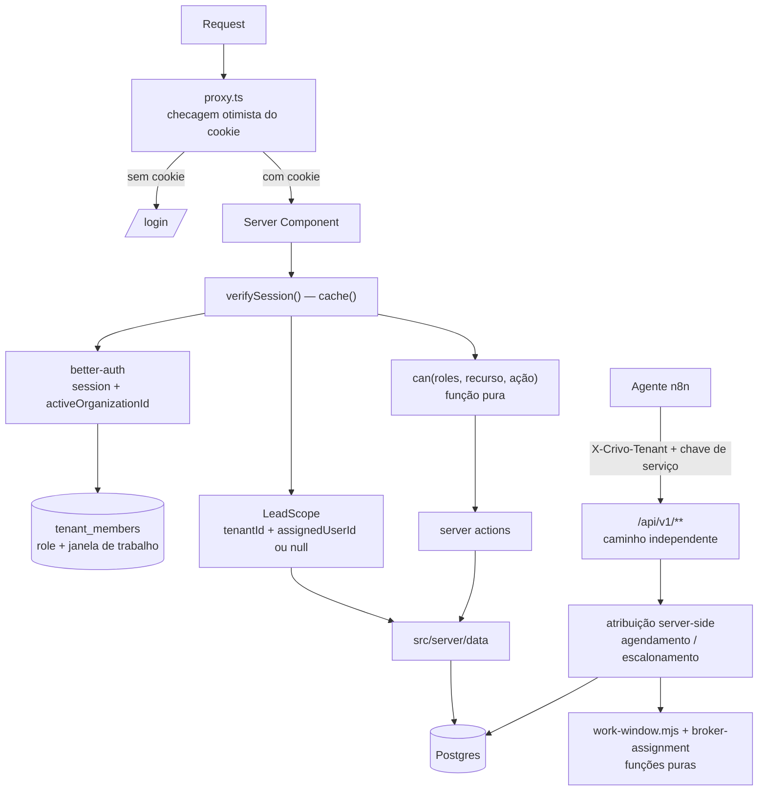

# Lote 8 — Usuários, papéis e atribuição por agenda Design

**Spec**: `.specs/features/lote-8-usuarios-papeis-atribuicao/spec.md`
**Context**: `.specs/features/lote-8-usuarios-papeis-atribuicao/context.md`
**Status**: Approved

---

## Architecture Overview

Abordagem aprovada pelo usuário: **better-auth com o plugin `organization` mapeado sobre a tabela `tenants` existente**. A imobiliária continua sendo uma identidade só; o plugin passa a governar quem pertence a ela, com que papéis, e qual é a imobiliária ativa da sessão.

Três camadas novas, nenhuma delas opcional:

1. **Porta** — `proxy.ts` na raiz (Next 16 renomeou `middleware.ts` → `proxy.ts`; o convention antigo está deprecado). Faz **apenas checagem otimista lendo o cookie de sessão** e redireciona para `/login`. Nunca consulta banco: o próprio guia de auth do Next avisa que o proxy roda em toda rota, inclusive prefetch.
2. **Guarda** — `verifySession()` na camada de acesso a dados, memoizada com `cache()` do React por render pass. É aqui que mora a autorização de verdade, e é ela que resolve o **escopo de leitura** (imobiliária + responsável) uma única vez por request.
3. **Escopo** — as funções de leitura de lead deixam de receber `tenantId: string` e passam a receber um `LeadScope`. A mudança de tipo é deliberada: um call site esquecido **não compila**, em vez de vazar lead de outro corretor silenciosamente.



O contrato de integração (`/api/v1/**`) **não passa pelo proxy nem pela sessão** — segue na credencial de serviço com `X-Crivo-Tenant` (SEC-01 do lote-7). Os dois caminhos de autenticação permanecem independentes por desenho.

---

## Code Reuse Analysis

### Existing Components to Leverage

| Component | Location | How to Use |
| --------- | -------- | ---------- |
| `assignBroker(candidates)` | `src/lib/broker-assignment.ts` | **Estender, não substituir.** O desempate determinístico (`activeLeads` → `createdAt` → `id`) já é testado e continua sendo o núcleo; o que entra na frente é um filtro de disponibilidade. O arquivo foi escrito no lote-7 declarando-se ponto de extensão exatamente deste lote. |
| `getBrokerLoads(tenantId)` | `src/server/data/index.ts:909` | Mesma query agregada (LEFT JOIN preservando corretor com zero leads), reescrita sobre `tenant_members` — `brokers` deixa de existir — e devolvendo também a janela de trabalho. |
| `problem()` + `ProblemCode` | `src/server/integration/problem.ts` | AD-013: todo erro novo do contrato (`sem-corretor-disponivel`, `conflito-de-agenda`) é `application/problem+json` com `code` estável. Nenhum formato de erro novo. |
| `patchLead()` | `src/server/integration/leads.ts:105` | Ponto único onde agendamento e escalonamento chegam pelo contrato. A atribuição entra aqui, depois das validações de transição e da trava humana já existentes. |
| `resolveTenantIdBySlug()` | `src/server/data/index.ts:110` | Inalterada — o agente continua resolvendo tenant por slug. Reforça a decisão de tornar `tenants.slug` NOT NULL. |
| Convenção `meetingDays` / `meetingHoursStart` / `meetingHoursEnd` | `src/db/schema.ts:88-90` | A janela de trabalho do corretor usa **exatamente** o mesmo formato (dias ISO 1-7 em `integer[]`, horas `HH:MM` em texto, America/Sao_Paulo). Zero convenção nova, e `n8n/src/business-hours.mjs` já sabe interpretá-la. |
| `business-hours.mjs` | `n8n/src/business-hours.mjs` | Lógica de "instante cai dentro da janela" já existe e é testada em vitest. A função pura de cobertura de intervalo do corretor é irmã dela, não uma reinvenção. |
| `resolveActiveTenant()` | `src/server/tenant.ts:14` | Função pura, já testada. Sobrevive com a lista de candidatos mudando de "todos os tenants" para "os vínculos do usuário" — é literalmente a AC4 de `TENANT-01`. |
| `TenantSwitcherMenu` | `src/components/shell/tenant-switcher.tsx` | Recomposto, não reescrito: mesma UI, alimentada pelos vínculos do usuário e chamando `organization.setActive` em vez de gravar o cookie direto. |

### Integration Points

| System | Integration Method |
| ------ | ------------------ |
| Drizzle / Postgres (Neon) | Tabelas do better-auth geradas pelo CLI (`npx @better-auth/cli generate`) para dentro de `src/db/schema.ts`, com `drizzleAdapter`. As tabelas do plugin ganham `modelName` apontando para os nomes do projeto. |
| `tenants` (existente) | Vira a tabela `organization` do plugin via `schema.organization.modelName`. `slug` passa a NOT NULL — sem backfill, porque o seed já escreve slug para todo tenant que cria. Entram `logo` e `metadata` (ambas opcionais). |
| `leads.brokerId` (existente) | Renomeada para `assignedUserId`, referenciando `users.id`. Sem migração de dado: o seed recria tudo. |
| n8n `tool-agendar-reuniao` | Inverte a ordem: hoje cria o evento no Calendar e depois faz `PATCH`; passa a fazer `PATCH` primeiro (que reserva o slot e devolve o corretor) e só então cria o evento, já com o corretor como convidado. Workflow-as-code (AD-014): fonte no repo, `n8n/generated/` regenerado, UI nunca editada à mão. |
| Resend | Único serviço externo novo. Adaptador isolado em um módulo só, consumido pelo `sendInvitationEmail` do plugin e pelo reset de senha. |

---

## Components

### Configuração de autenticação

- **Purpose**: instância única do better-auth, com adaptador Drizzle, plugin `organization` mapeado e access control do produto.
- **Location**: `src/server/auth/config.ts`
- **Interfaces**:
  - `auth` — instância `betterAuth({...})` usada por rotas, server actions e DAL
  - `auth.api.getSession({ headers })` — leitura de sessão no servidor
- **Dependencies**: `better-auth`, `drizzle-adapter`, `src/db/schema.ts`, adaptador de e-mail
- **Reuses**: `db` de `src/db/index.ts` (mesma pool `pg`, nenhuma conexão nova)

Mapeamento de schema (é o coração da abordagem aprovada):

| Modelo do plugin | `modelName` no projeto | Situação |
| ---------------- | ---------------------- | -------- |
| `organization` | `tenants` | **Tabela existente.** `id`, `name`, `slug`, `createdAt` já batem; entram `logo` e `metadata` (ambas opcionais) |
| `member` | `tenant_members` | Nova. Recebe a janela de trabalho como `additionalFields` |
| `invitation` | `tenant_invitations` | Nova |
| `user` / `session` / `account` / `verification` | `users` / `sessions` / `accounts` / `verifications` | Novas. `sessions` carrega `activeOrganizationId` |

### Porta de entrada

- **Purpose**: barrar requisição sem sessão antes de renderizar qualquer rota do CRM.
- **Location**: `proxy.ts` (raiz do projeto, mesmo nível de `app/`)
- **Interfaces**:
  - `export default async function proxy(req: NextRequest)`
  - `export const config = { matcher: [...] }` — exclui `/api/v1`, `/api/cron`, `_next/static`, `_next/image` e `public/`
- **Dependencies**: apenas `next/server` e o nome do cookie de sessão
- **Reuses**: nada — é código novo por definição
- **Nota**: lê **somente o cookie**. Sem consulta a banco, sem import da DAL. O `matcher` precisa da negativa explícita, senão o proxy roda até em CSS e imagem.

### Guarda de sessão e escopo

- **Purpose**: resolver, uma vez por request, quem é o usuário, qual a imobiliária ativa, quais papéis ele tem nela e qual o escopo de leitura de lead.
- **Location**: `src/server/auth/session.ts`
- **Interfaces**:
  - `verifySession(): Promise<AuthContext>` — memoizada com `cache()`; redireciona para `/login` se não houver sessão válida
  - `requirePermission(resource, action): Promise<AuthContext>` — lança/recusa quando o vínculo ativo não tem a permissão
  - `getLeadScope(): Promise<LeadScope>` — `{ tenantId, assignedUserId: string | null }`; `assignedUserId` preenchido quando o vínculo ativo tem **apenas** o papel corretor
- **Dependencies**: `auth`, `tenant_members`
- **Reuses**: `resolveActiveTenant()` (`src/server/tenant.ts`) para o fallback da AC4 de `TENANT-01`

### Matriz de permissões

- **Purpose**: decidir se um conjunto de papéis pode executar uma ação sobre um recurso.
- **Location**: `src/lib/permissions.ts`
- **Interfaces**:
  - `can(roles: Role[], resource: Resource, action: Action): boolean`
  - `ROLES` / `RESOURCES` — enums do produto (`administrador` | `gestor` | `corretor`)
  - `parseRoles(raw: string): Role[]` — o plugin grava papéis como string separada por vírgula
- **Dependencies**: nenhuma — **função pura, sem I/O**
- **Reuses**: mesmo padrão de `broker-assignment.ts` e `n8n/src/*.mjs` — a regra vive numa função pura testada em vitest, e a camada que faz I/O só a consome
- **Nota**: papéis acumuláveis são união (`some`), nunca interseção.

### Janela de trabalho

- **Purpose**: dizer se a janela declarada de um corretor cobre um instante ou um intervalo.
- **Location**: `src/lib/work-window.ts`
- **Interfaces**:
  - `coversInstant(window: WorkWindow, at: Date): boolean`
  - `coversInterval(window: WorkWindow, start: Date, end: Date): boolean` — exige contenção **integral** (Edge Case da spec)
  - `validateWorkWindow(input): { ok: true } | { ok: false; field: string }`
- **Dependencies**: nenhuma — função pura
- **Reuses**: convenção e lógica de `n8n/src/business-hours.mjs`

### Política de atribuição

- **Purpose**: escolher o corretor responsável nos dois momentos em que isso acontece.
- **Location**: `src/lib/broker-assignment.ts` (estendido)
- **Interfaces**:
  - `assignBroker(candidates: BrokerLoad[]): string | null` — **inalterada**, continua sendo o desempate
  - `selectForMeeting(candidates: BrokerCandidate[], start, end): BrokerLoad[]` — filtra por janela cobrindo o intervalo e por ausência de reunião sobreposta
  - `selectForEscalation(candidates: BrokerCandidate[], at): BrokerLoad[]` — filtra por janela cobrindo o instante; **devolve todos** quando o filtro esvazia (degradação da spec)
- **Dependencies**: `work-window.ts`
- **Reuses**: o próprio `assignBroker` e seus testes já existentes

### Acesso a dados de atribuição

- **Purpose**: montar os candidatos e persistir a escolha, atomicamente.
- **Location**: `src/server/data/index.ts` (funções novas, arquivo existente)
- **Interfaces**:
  - `getBrokerCandidates(tenantId): Promise<BrokerCandidate[]>` — carga ativa + janela de trabalho, numa query agregada
  - `assignBrokerForMeeting(tenantId, leadId, start): Promise<AssignResult>`
  - `assignBrokerForEscalation(tenantId, leadId, at): Promise<AssignResult>`
- **Dependencies**: `broker-assignment.ts`, `work-window.ts`
- **Reuses**: a query de `getBrokerLoads`, com `tenant_members` no lugar de `brokers`

### Gestão de usuários

- **Purpose**: telas e ações de convite, papéis e desativação.
- **Location**: `app/(crm)/usuarios/page.tsx`, `src/components/usuarios/`, `src/server/actions/users.ts`
- **Interfaces**: server actions `inviteUser`, `resendInvite`, `updateMemberRoles`, `deactivateMember(destinoDaCarteira)`
- **Dependencies**: `auth.api` (convites e papéis do plugin), `requirePermission("usuarios", …)`
- **Reuses**: padrão de server action de `src/server/actions/documents.ts` — tenant sempre resolvido no servidor, nunca vindo do `input`

### Adaptador de e-mail

- **Purpose**: enviar convite e redefinição de senha.
- **Location**: `src/server/auth/email.ts`
- **Interfaces**: `sendInvitationEmail(...)`, `sendResetPasswordEmail(...)` — ambas devolvem sucesso/falha, **nunca lançam**
- **Dependencies**: Resend
- **Nota**: falha de envio não desfaz a criação do usuário (AC4 de `USER-01`) — o convite fica pendente e reenviável.

---

## Data Models

### `tenant_members` (nova — `member` do plugin)

```typescript
interface TenantMember {
  id: string
  userId: string          // → users.id
  organizationId: string  // → tenants.id (nome do campo é do plugin)
  role: string            // "administrador" | "gestor" | "corretor", acumulável por vírgula
  createdAt: Date
  // additionalFields do produto — a janela de trabalho é por vínculo,
  // não por usuário: a mesma pessoa pode atender em horários
  // diferentes em duas imobiliárias.
  workDays: number[] | null        // ISO 1(segunda)-7(domingo)
  workHoursStart: string | null    // "HH:MM", America/Sao_Paulo
  workHoursEnd: string | null      // "HH:MM"
  deactivatedAt: Date | null
}
```

**Relationships**: N:1 com `users`, N:1 com `tenants`. Único por `(userId, organizationId)`.

### `tenants` (existente — alterada)

```typescript
// Colunas novas, ambas exigidas pelo plugin e ambas opcionais:
logo: string | null
metadata: string | null
// Coluna existente que muda de forma:
slug: string  // era `text` nullable com índice único parcial;
              // passa a NOT NULL com índice único total (o seed já preenche)
```

### `leads` (existente — coluna renomeada)

```typescript
assignedUserId: string | null  // era brokerId -> brokers.id;
                               // agora referencia users.id
```

`brokers` sai do schema. Não há migração de dado: `seed.ts` já apaga e recria leads, corretores e tenants com UUID determinístico, e nenhum lead do banco é real.

### `WorkWindow` / `BrokerCandidate` (tipos de domínio)

```typescript
interface WorkWindow {
  days: number[]
  start: string
  end: string
}

interface BrokerCandidate {
  id: string          // users.id
  createdAt: Date     // do vínculo — preserva o desempate do lote-7
  activeLeads: number
  window: WorkWindow | null   // null = indisponível sempre (AC5 de AGENDA-01)
  meetings: { start: Date; end: Date }[]
}
```

---

## Error Handling Strategy

| Error Scenario | Handling | User Impact |
| -------------- | -------- | ---------- |
| Requisição sem sessão em rota do CRM | `proxy.ts` redireciona para `/login` | Tela de login, nada da imobiliária renderizado |
| Sessão válida, permissão ausente | `requirePermission` recusa no servidor + log estruturado | Mensagem de acesso negado; o item já não estava na navegação |
| Lead de outro corretor pedido pela URL | `LeadScope` não casa nenhuma linha → tratado como inexistente | 404, sem revelar que o lead existe |
| Cookie de imobiliária fora dos vínculos | Ignorado; `resolveActiveTenant` cai no primeiro vínculo | Usuário entra na primeira imobiliária dele, sem erro |
| Usuário autenticado sem nenhum vínculo | Tela dedicada de ausência de acesso | Mensagem explicando que falta vínculo; nada renderizado |
| Envio de e-mail de convite falha | Usuário permanece criado em convite pendente | Aviso na tela com ação de reenviar |
| Convite expirado ou já usado | Recusa na ativação | Instrução para pedir novo convite ao administrador |
| Alteração deixaria a imobiliária sem administrador | Recusada antes de escrever | Mensagem explicando a regra |
| Nenhum corretor cobre o horário pedido | `problem()` com `code: "sem-corretor-disponivel"` (AD-013) | Agente não confirma e oferece outro horário ao lead |
| Dois agendamentos disputam o mesmo corretor e intervalo | Índice único no banco absorve; o perdedor recebe `code: "conflito-de-agenda"` | Só uma reunião existe; a outra é reoferecida |
| Imobiliária sem nenhum corretor ativo no escalonamento | Escalonamento gravado; lead sinalizado como pendente de atribuição | Gestor vê o lead sinalizado no Pipeline |
| Sessão expira no meio de um formulário | Server action recusa e redireciona | Login novamente, sem gravação parcial |

---

## Risks & Concerns

| Concern | Location (file:line) | Impact | Mitigation |
| ------- | -------------------- | ------ | ---------- |
| `tenants.slug` é nullable com índice único **parcial**; o plugin exige `slug` obrigatório | `src/db/schema.ts:104`, `src/db/schema.ts:110-112` | Push do schema falha contra as linhas existentes | O seed passa a escrever slug para todo tenant; a coluna vira NOT NULL com índice total e o banco é resemeado. Sem script de backfill |
| better-auth gera ids próprios; nossas PKs são `uuid` com `defaultRandom()` | `src/db/schema.ts:65` e todas as tabelas | Se o plugin insistir em id próprio, `tenants.id` do plugin diverge do `tenants.id` do domínio — o pior desfecho possível para o isolamento da AD-002 | Task de espinha antes de qualquer tela: provar `advanced.database.generateId` contra o schema real. Sem dado a preservar, o plano B é barato (adotar o formato de id do plugin e resemear), mas a escolha volta ao usuário antes de virar código |
| O reseed apaga as 3 conversas reais de teste do lote-7, e a memória do agente sobrevive a ele | `n8n/workflows/principal.ts:679` (`sessionKey` = `tenantSlug:waId`) | O agente segue lembrando de uma conversa que o CRM não tem mais; como a memória não está vazia, a semeadura de cold start da AD-019 não corrige | Purgar `n8n_chat_histories` nas chaves de teste no mesmo passo do reseed, e verificar que a primeira mensagem seguinte abre conversa nova. AD-019 já trata a memória como cache derivável — purgar é operação prevista, não exceção |
| Renomear `leads.brokerId` → `assignedUserId` toca ~10 consumidores | `src/server/data/index.ts` (137, 182, 784, 791, 920), `src/db/seed.ts`, componentes de pipeline e dashboard | É o cenário da lição L-015 do lote-7 (mexer em coluna compartilhada sem grepar consumidores) — foi assim que o scheduler ficou com 401 em produção por dias | Grep completo dos consumidores registrado na própria task, antes de qualquer alteração de schema. A favor: o rename é quebra de compilação, não falha silenciosa, e a coluna nunca sai do CRM (ausente do contrato v1 e do n8n — verificado) |
| Trocar `getLeads(tenantId)` por `getLeads(scope)` toca todo caminho de leitura | `app/(crm)/*/page.tsx` (5 páginas), `src/server/data/index.ts` (11 funções) | Um call site esquecido vaza lead de outro corretor — a falha mais grave que este lote pode produzir | O parâmetro é um **tipo novo obrigatório**, não um campo opcional: o call site esquecido não compila. Reforçado por teste de vazamento com dois corretores, exigido pelo Verifier |
| `npx tsc --noEmit` já falha antes deste lote | `src/lib/__tests__/format.test.ts:17` | A rede de segurança acima (erro de compilação) fica cega se o comando já está vermelho | Corrigir esse erro pré-existente numa task inicial do lote; sem isso a mitigação anterior é decorativa |
| Publicar o `principal` no n8n reverte o modelo trocado à mão | Handoff do lote-7; `n8n/workflows/principal.ts` declara `gemini-3.5-flash`, instância roda `gemini-3.5-flash-lite` | Publicação silenciosa devolve o agente ao modelo ~30x mais caro por conversa | Antes de qualquer publish, alinhar a fonte ao que a instância roda (ou aplicar a migração para `gpt-5-nano` já decidida). Conferir `get_workflow_history` depois de publicar — a armadilha do autosave apareceu 2x no lote-7 |
| Inverter a ordem do `tool-agendar-reuniao` (PATCH antes do Calendar) | `n8n/workflows/tool-agendar-reuniao.ts:144-208` | Se o PATCH reserva o slot e a criação do evento falha, existe reunião no CRM sem evento no Calendar | O nó de tratamento já existente devolve `aviso` ao agente quando o CRM e o Calendar divergem; o mesmo padrão cobre a direção inversa. Estado inconsistente é reportado ao lead, nunca silencioso |
| Zustand espelha o cookie de tenant (AD-007) | `src/stores/tenant-store.ts` | Espelho de uma fonte de verdade que deixou de existir | O store passa a espelhar o `activeOrganizationId` da sessão; AD-007 é emendada por AD-021 |
| Testes de atribuição inserem direto em `brokers` | `src/server/data/__tests__/broker-assignment.test.ts:30` | Quebram junto com a remoção da tabela | Reescritos sobre `tenant_members` na mesma task que remove `brokers`, nunca depois — e nenhum é removido ou enfraquecido para passar |
| Nenhuma lição `confirmed` no store | `lessons.json` | L-015 e L-016 do lote-7 seguem como candidatas e não entram pelo caminho automático | Aplicadas explicitamente neste design (grep de consumidores antes do rename; registrar evidência de execução antes de arquivar workflow scratch), sem depender do `lessons.py list --status confirmed` |
| Resend é dependência externa nova, sem conta configurada | — | Convite não sai; sem convite não há usuário novo | O caminho de falha é requisito (`USER-01` AC4). Além disso, o bootstrap por linha de comando cria administrador sem depender de e-mail nenhum |

---

## Tech Decisions (only non-obvious ones)

| Decision | Choice | Rationale |
| -------- | ------ | --------- |
| Arquivo da porta de entrada | `proxy.ts`, não `middleware.ts` | Next 16 deprecou o convention `middleware` e renomeou para `proxy`. Escrever `middleware.ts` aqui é escrever contra a versão que o projeto usa |
| Onde mora a autorização | Data Access Layer com `verifySession()` memoizada, proxy só otimista | Recomendação explícita da doc do Next: proxy roda em toda rota, inclusive prefetch; checagem de verdade vai o mais perto possível do dado |
| Forma do escopo de leitura | Parâmetro `LeadScope` obrigatório substituindo `tenantId: string` | Transforma "esqueci de filtrar" de vazamento silencioso em erro de compilação. É a única mitigação que não depende de disciplina humana |
| Nome da coluna `leads.brokerId` | **Renomeada** para `assignedUserId`, referenciando `users.id` | Sem dado a preservar, manter o nome antigo apontando para `users` seria resíduo puro de uma migração que não vai acontecer. A coluna nunca sai do CRM — verificado: ausente do payload do contrato v1 e de todo o `n8n/` |
| Como o estado novo chega ao banco | Reseed determinístico (`npm run db:seed`), sem script de migração | Confirmado pelo usuário: nenhum lead do banco é real. `seed.ts` já faz delete-and-insert de tudo com UUID determinístico, então ele **é** o caminho de convergência — e não deixa código de migração para manter depois |
| Onde mora a janela de trabalho | Em `tenant_members` (por vínculo), não em `users` | A mesma pessoa pode atender de manhã numa imobiliária e à tarde na outra. Colocar em `users` tornaria o modelo multi-tenant mentira na prática |
| Isolamento por corretor | No código (DAL), não via Row-Level Security do Postgres | RLS exigiria variável de sessão por request numa pool `pg` compartilhada — acoplamento novo e classe de bug nova. O ganho não compensa num piloto de duas imobiliárias |
| Concorrência de agendamento | Índice único no banco, não trava na aplicação | Mesma disciplina de `leads_tenant_id_external_id_idx` (INT-02): a garantia mora no banco e a aplicação traduz o conflito para `code` estável |
| Papéis | Três fixos, em `member.role` separados por vírgula (formato do plugin) | É o formato nativo do plugin para papéis acumuláveis; inventar tabela de papéis seria abandonar o motivo de ter escolhido o plugin |

> **Project-level decisions:** duas decisões deste design são convenção para os lotes seguintes e foram registradas em `.specs/STATE.md`: **AD-021** (autenticação, modelo multi-tenant e unificação corretor↔usuário; emenda a AD-007 na parte do cookie como fonte de verdade do tenant) e **AD-022** (atribuição de corretor no agendamento e no escalonamento, nunca na criação do lead; substitui a política ATRIB-01 do lote-7).

---

## Phase Sketch (insumo para Tasks)

Ordem ditada por dependência, não por conforto. A primeira fase existe para que as demais possam falhar cedo e barato.

1. **Espinha e pré-condições** — corrigir o `tsc --noEmit` pré-existente; provar a geração de id `uuid` do better-auth contra o schema real; grep completo dos consumidores de `leads.brokerId`.
2. **Autenticação e vínculo** — tabelas do better-auth e do plugin (`tenants.slug` NOT NULL junto), `proxy.ts`, tela de login, `verifySession()`, seletor de imobiliária pelos vínculos, bootstrap por linha de comando.
3. **Corretor vira usuário** — remover `brokers` do schema, renomear `leads.brokerId` → `assignedUserId`, reescrever os consumidores e os testes de atribuição sobre `tenant_members`, seed criando usuários com papéis e janelas.
4. **Papéis, permissões e escopo** — `permissions.ts` puro, `requirePermission`, `LeadScope` em toda leitura, navegação por permissão, teste de vazamento entre corretores.
5. **Gestão de usuários** — tela de usuários, convite e reenvio, alteração de papéis, desativação com destino da carteira, e-mail via Resend.
6. **Agenda e atribuição** — janela de trabalho (tela + validação pura), `selectForMeeting` / `selectForEscalation`, fiação em `patchLead`, índice de conflito, `createAgentLead` deixa de atribuir.
7. **Fluxo n8n e ambiente** — inverter a ordem do `tool-agendar-reuniao`, corretor como convidado do evento, regenerar `n8n/generated/`, publicar com a conferência de `get_workflow_history`, reseed do banco e purga da memória de teste.
8. **P2** — recuperação de senha.
