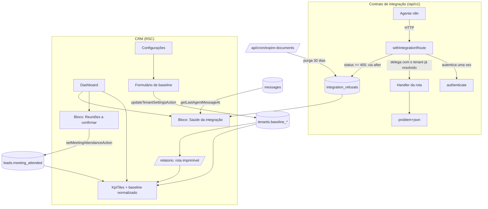

# Lote 9 — Instrumentação de Métricas do Piloto Design

**Spec**: `.specs/features/lote-9-metricas-piloto/spec.md`
**Context**: `.specs/features/lote-9-metricas-piloto/context.md`
**Status**: Draft

---

## Architecture Overview

Nenhuma das quatro frentes cria uma camada nova. Todas se encaixam nas camadas que já existem — schema → DAL → lib pura → server action / RSC → componente Astryx — e a única peça de infraestrutura inédita é um **wrapper de rota** no contrato de integração, que passa a ser o ponto único onde uma recusa vira linha no banco.

O desenho segue as decisões ativas do `STATE.md`: RSC-first com DAL direta (AD-007, emendada pela AD-021), `LeadScope` obrigatório em toda leitura de lead (AD-021), colunas aditivas e nullable (AD-004), `problem+json` com `code` estável (AD-013), Recharts só onde já havia gráfico (AD-009), componentes Astryx e utilities token-backed (AD-010, AD-012), `lucide-react` para ícones (AD-011).



**Fluxo de leitura do Dashboard**: um único `resolveDashboardPeriod` continua governando tiles, gráficos e agora também o baseline normalizado e o relatório — a regra de "definição única de P" do lote-4 não é quebrada.

---

## Code Reuse Analysis

### Existing Components to Leverage

| Component | Location | How to Use |
| --------- | -------- | ---------- |
| `problem()` / `ProblemCode` | `src/server/integration/problem.ts` | Inalterado. O wrapper lê o `code` do corpo já produzido — a fábrica continua pura e nenhum call site muda (AD-013 preservada) |
| `authenticate()` | `src/server/integration/auth.ts` | Passa a ser chamado **pelo wrapper**, uma vez por requisição, em vez de na primeira linha de cada handler |
| `methodNotAllowed()` | `src/server/integration/problem.ts` | Ganha o registro por dentro: continua sendo a fábrica de 405, agora instrumentada |
| `after()` | `next/server` (Next 16.2.11) | Agenda a gravação depois da resposta; em serverless usa o `waitUntil` da Vercel |
| `LeadScope` / `assignedTo()` | `src/server/data/index.ts:42-70` | Escopa a lista de reuniões pendentes e passa a escopar a escrita de comparecimento |
| `getLeadScope()` | `src/server/auth/session.ts:149` | Já memoizado com `cache()`; o Dashboard já o chama |
| `MEETING_DURATION_MS` | `src/server/data/index.ts:1146` | Define o instante de encerramento da reunião — mesma constante do agendamento (AD-022) |
| `setMeetingAttendance()` | `src/server/data/index.ts:1003` | Reaproveitado; ganha `LeadScope` no lugar de `tenantId` cru (ver Risks) |
| `getLastAgentMessageAt()` | `src/server/data/index.ts:1022` | Já usado pelo shell (`app/(crm)/layout.tsx`) — vira a metade "última atividade" da saúde |
| `expireDocuments()` + rota de cron | `src/server/integration/lgpd.ts:46`, `app/api/cron/expire-documents/route.ts` | Mesma execução diária passa a purgar recusas; nenhum agendamento novo |
| `updateTenantSettings()` (padrão SPG-1) | `src/server/data/index.ts:881` | Chave ausente = coluna intocada; `null` = limpa. Os 5 baselines entram nesse mesmo molde |
| `denyIfForbidden()` | `src/server/actions/permission.ts` | Recusa server-side de escrita de baseline, sem inventar guarda nova |
| `can()` / matriz de permissões | `src/lib/permissions.ts` | Decide exibição do convite de baseline e do bloco de saúde — sem recurso novo na matriz |
| `resolveDashboardPeriod()` | `src/lib/dashboard-period.ts` | Fonte única do período; o relatório usa a mesma função |
| `formatDurationMinutes` / `formatPercentInt` / `format*Delta` | `src/lib/format.ts` | Formatação dos tiles e do relatório |
| `KpiTiles` | `src/components/dashboard/kpi-tiles.tsx` | Estendido, não substituído |
| `lead-controls.tsx` (controle de presença) | `src/components/pipeline/lead-controls.tsx` | Referência de interação; o bloco novo usa a mesma action |

### Integration Points

| System | Integration Method |
| ------ | ------------------ |
| Contrato `/api/v1` | Wrapper nos 6 route files; corpo, status e headers das respostas ficam byte-a-byte iguais (SAUDE-01 AC7) |
| Vercel Cron | Rota existente `/api/cron/expire-documents` passa a devolver também a contagem de recusas purgadas |
| Postgres (Neon) | 2 colunas em `tenants` + 1 tabela nova; convergência por push de schema + reseed, como no lote-8 (não há dado real a preservar) |
| n8n / agente | Nenhuma mudança de contrato: nenhuma rota nova, nenhum campo novo de request/response, nenhum código de erro novo |

---

## Components

### `integration_refusals` (schema)

- **Purpose**: Guardar o metadado de toda resposta ≥ 400 do contrato, para que uma recusa deixe de ser invisível.
- **Location**: `src/db/schema.ts`
- **Interfaces**: tabela Drizzle `integrationRefusals`
- **Dependencies**: `tenants` (FK nullable)
- **Reuses**: convenções de todo o schema — `uuid` PK `defaultRandom()`, `timestamp withTimezone`, índices nomeados

### `withIntegrationRoute` (wrapper)

- **Purpose**: Ponto único de autenticação e de registro de recusa do `/api/v1`.
- **Location**: `src/server/integration/route.ts` (novo)
- **Interfaces**:
  - `withIntegrationRoute(handler: (request: Request, auth: AuthResult, ctx: RouteContext) => Promise<Response>): RouteHandler` — autentica; se `authenticate` devolve `Response`, registra e retorna; senão chama `handler` e, se a resposta for ≥ 400, registra
  - `recordRefusalFor(request, response, tenantId | null): void` — agenda a gravação com `after()`
  - marca cada handler devolvido com um símbolo (`INSTRUMENTED`) para que um teste possa exigir a instrumentação de todo export
- **Dependencies**: `authenticate`, `after` de `next/server`, `recordIntegrationRefusal`
- **Reuses**: `AuthResult` e todo o comportamento de `authenticate` — o wrapper não reimplementa autenticação
- **Detalhes**:
  - `RouteContext` é o segundo argumento que o Next passa às rotas dinâmicas (`{ params: Promise<{ id: string }> }`); repassado intacto
  - o `code` sai de `response.clone().json()` quando o `Content-Type` é `application/problem+json`; qualquer outro corpo grava `code = null`. Clonar é o que garante que o corpo original chega intacto ao agente
  - a rota é registrada como `new URL(request.url).pathname` — nunca a URL completa, para não gravar query string
  - **`after()` é chamado dentro de `try/catch`, com fallback para `await` direto da gravação.** `next/dist/server/after/after.js:12-19` mostra que `after` **lança** (`E468`, "called outside a request scope") quando não há `workAsyncStorage`. Todos os testes de rota do projeto chamam os handlers exportados direto no vitest, sem request scope do Next: um `after()` cru derrubaria a suíte de rotas inteira. Com o fallback, produção grava fora do caminho da resposta e o teste grava de forma síncrona — o que, de quebra, deixa a asserção do teste determinística, sem espera

### `methodNotAllowed` instrumentado e catch-all

- **Purpose**: 405 e 404 acontecem antes/independentemente da autenticação e também precisam deixar rastro (SAUDE-01 AC1, edge case `rota-inexistente`).
- **Location**: `src/server/integration/problem.ts` (405) e `app/api/v1/[...unmatched]/route.ts` (404)
- **Interfaces**: assinatura pública inalterada
- **Reuses**: `recordRefusalFor` do wrapper, com `tenantId = null`

### DAL — leituras e escritas novas

- **Location**: `src/server/data/index.ts`
- **Interfaces**:
  - `recordIntegrationRefusal(input: { tenantId: string | null; route: string; method: string; status: number; code: string | null; occurredAt: Date }): Promise<void>`
  - `getIntegrationRefusalsSince(tenantId: string, since: Date): Promise<RefusalSummary[]>` — recusas do tenant **mais** as sem tenant, agrupadas por `code` + `route`
  - `purgeIntegrationRefusals(now: Date): Promise<{ deleted: number }>`
  - `getPendingAttendanceMeetings(scope: LeadScope, now: Date): Promise<PendingMeeting[]>`
  - `setMeetingAttendance(scope: LeadScope, leadId: string, value: boolean | null)` — assinatura muda de `tenantId` para `LeadScope`
  - `updateLeadStatus(scope: LeadScope, ...)` e `updateLeadBroker(scope: LeadScope, ...)` — mesma troca (SCOPE-02). As três escritas do Pipeline passam a levar `assignedTo(scope)` no WHERE, junto do filtro de tenant que já existia
  - `getDashboardKpis` — mesma assinatura, projeção explícita de colunas (PERF-01)
  - `TenantSettingsUpdate` ganha os 5 campos de baseline no padrão SPG-1
- **Reuses**: `assignedTo(scope)`, `eq/and/gte/lte` do Drizzle, o molde de escrita "sempre filtrar por tenant no WHERE"

### `src/lib/pilot-metrics.ts` (lib pura, nova)

- **Purpose**: As três regras deste lote que não precisam de banco, testáveis em vitest sem I/O — mesma disciplina de `broker-assignment.ts` e `permissions.ts`.
- **Location**: `src/lib/pilot-metrics.ts`
- **Interfaces**:
  - `periodDays(from: Date, to: Date): number` — dias corridos do período (inclusivo, fração preservada quando < 1 dia)
  - `normalizeMonthlyBaseline(monthly: number, days: number): number` — `monthly / 30 * days`
  - `attendanceWindow(meetingAt: Date): { pendingFrom: Date; expiresAt: Date }` — `+30 min` e `+30 min +14 dias`
  - `isPendingAttendance(meetingAt: Date, attended: boolean | null, now: Date): boolean`
  - `resolveIntegrationHealth(input: { lastSuccessAt: Date | null; refusalCount: number }, now: Date): "saudavel" | "problema"`
- **Dependencies**: nenhuma
- **Reuses**: nada — é folha da árvore, por desenho

### Formulário de baseline (Configurações)

- **Purpose**: BASE-01 — os cinco baselines editáveis por quem já pode escrever em Configurações.
- **Location**: `src/components/settings/baseline-form.tsx` + composição em `app/(crm)/configuracoes/page.tsx`
- **Interfaces**: consome `updateTenantSettingsAction` estendida
- **Dependencies**: componentes Astryx de formulário já usados na tela
- **Reuses**: molde do formulário de configurações existente; validação em `src/server/validation.ts` (`validateBaselineCount`, `validateBaselinePercent`)

### `KpiTiles` estendido

- **Purpose**: BASE-02 — comparação normalizada nos cinco tiles + convite condicionado à permissão.
- **Location**: `src/components/dashboard/kpi-tiles.tsx`
- **Interfaces**: `KpiTilesBaseline` ganha os 2 campos novos; props ganham `periodDays: number` e `canEditSettings: boolean`
- **Reuses**: `normalizeMonthlyBaseline`, `format*Delta`, `Card`/`Grid`/`Text` da Astryx

### `PendingMeetingsCard`

- **Purpose**: PRES-01 — cobrar a confirmação de comparecimento.
- **Location**: `src/components/dashboard/pending-meetings.tsx` (client, para o clique) alimentado por RSC
- **Interfaces**: recebe linhas serializadas (`leadId`, `leadName`, `meetingAt` ISO, `brokerName`); chama `setMeetingAttendanceAction`
- **Reuses**: interação de `lead-controls.tsx`, `revalidatePath` já usado nas actions

### `IntegrationHealthCard`

- **Purpose**: SAUDE-02 — estado da integração no rodapé do Dashboard, só para quem tem `configuracoes:ler`.
- **Location**: `src/components/dashboard/integration-health.tsx` (server component de apresentação)
- **Interfaces**: recebe `{ state, lastSuccessAt, refusals: RefusalSummary[] }` já resolvidos
- **Reuses**: `StatusDot`/`Token` da Astryx para estado (regra do CLAUDE.md: status é `StatusDot`/`Token`, nunca `Badge` decorativo)

### Rota de relatório

- **Purpose**: REL-01 — artefato imprimível da reunião de piloto.
- **Location**: `app/(relatorio)/relatorio/page.tsx` + `app/(relatorio)/layout.tsx`
- **Interfaces**: mesmos `searchParams` do Dashboard (`periodo`, `de`, `ate`)
- **Dependencies**: `verifySession`, `requirePermission("configuracoes", "ler")`, `getDashboardKpis`, `getTenant`
- **Reuses**: `resolveDashboardPeriod` e as mesmas funções de KPI do Dashboard — nenhum recálculo paralelo (REL-01 AC2)
- **Detalhe**: grupo de rotas próprio para nascer **sem o `AppShell`**, em vez de esconder o shell com CSS de impressão. A proteção continua de pé: `proxy.ts` cobre tudo fora de `/api`, e a guarda real é `verifySession()` na página

### Purga no cron

- **Purpose**: SAUDE-03.
- **Location**: `src/server/integration/lgpd.ts` + `app/api/cron/expire-documents/route.ts`
- **Interfaces**: o resultado da rota passa a incluir `refusalsDeleted: number`; falha na purga não impede a expiração de documentos (AC3)
- **Reuses**: autenticação por `CRON_SECRET` e o handler GET/POST existentes

---

## Data Models

### `integration_refusals`

```typescript
interface IntegrationRefusal {
  id: string                  // uuid, PK
  tenantId: string | null     // FK -> tenants.id; null quando a recusa é anterior à identificação
  route: string               // pathname, ex.: "/api/v1/leads/{id}/messages" — nunca query string
  method: string              // "POST" | "GET" | ...
  status: number              // 401 | 404 | 405 | 409 | 413 | 422 | 5xx
  code: string | null         // ProblemCode do corpo problem+json; null se o corpo não for problem+json
  occurredAt: Date            // timestamptz, defaultNow
}
```

**Índices**: `(tenant_id, occurred_at)` para a leitura de saúde; `(occurred_at)` para a purga.
**Relationships**: `tenantId` referencia `tenants.id` e é **nullable de propósito** — a recusa por credencial inválida acontece antes de existir tenant, e é justamente a que precisa aparecer.
**Nunca guarda**: corpo da requisição, cabeçalhos, telefone, nome ou qualquer conteúdo de mensagem (SAUDE-01 AC4).

### `tenants` (aditivo)

```typescript
baselineEscalationPct: number | null   // integer 0-100
baselineAttendancePct: number | null   // integer 0-100
```

Somam-se aos três já existentes (`baselineLeadsPerMonth`, `baselineFirstResponseMinutes`, `baselineLeadToMeetingPct`). Nullable e aditivas, pela AD-004.

### `PendingMeeting` (view da DAL, não tabela)

```typescript
interface PendingMeeting {
  leadId: string
  leadName: string
  meetingAt: Date
  assignedUserId: string | null
  brokerName: string | null
}
```

Derivada de `leads`: `meeting_at IS NOT NULL AND meeting_attended IS NULL AND meeting_at + 30min <= now AND meeting_at + 30min + 14d > now`, filtrada por `tenantId` + `assignedTo(scope)`.

---

## Error Handling Strategy

| Error Scenario | Handling | User Impact |
| -------------- | -------- | ----------- |
| Gravação da recusa falha (banco indisponível) | `after()` já roda fora do caminho da resposta; o callback captura o erro e o registra em `console.warn` | Nenhum — o agente recebe exatamente a mesma resposta de erro (SAUDE-01 AC5) |
| Corpo da resposta ≥400 não é `problem+json` | `code = null`, demais campos preservados | A recusa aparece no painel identificada só por rota e status |
| Baseline inválido no formulário | `validateBaseline*` recusa na action antes de qualquer escrita; nenhum dos cinco valores é gravado | Mensagem no campo, valores anteriores intactos (BASE-01 AC3/AC4) |
| Escrita de baseline sem permissão | `denyIfForbidden("configuracoes", "escrever")` | `{ ok: false, error }`, nada gravado (BASE-01 AC6) |
| Confirmação de presença fora do `LeadScope` | `setMeetingAttendance` com `assignedTo(scope)` no WHERE devolve `null` | "Lead não encontrado" — nunca sucesso silencioso (PRES-01 AC5) |
| Dois usuários confirmam a mesma reunião | Última escrita vence; sem erro | Ambos veem a lista sem a reunião (PRES-01 AC6) |
| Purga de recusas falha durante o cron | Erro capturado; a expiração de documentos conclui e o resultado reporta a falha | Cron responde 200 com o detalhe da falha (SAUDE-03 AC3) |
| Relatório acessado sem `configuracoes:ler` | `requirePermission` lança; a rota recusa | Tela de acesso negado (REL-01 AC4) |
| Período sem nenhum lead | KPIs `null`, baselines exibidos | Relatório e tiles renderizam sem erro |

---

## Risks & Concerns

| Concern | Location (file:line) | Impact | Mitigation |
| ------- | -------------------- | ------ | ---------- |
| **`setMeetingAttendanceAction` escopa só por tenant, não por `LeadScope`** — um corretor com o id de um lead fora da carteira consegue gravar comparecimento | `src/server/actions/pipeline.ts:92-96`, `src/server/data/index.ts:1003` | Escrita cruzando a fronteira de carteira que a SCOPE-01 do lote-8 fechou só na leitura | Task própria neste lote: `setMeetingAttendance` passa a receber `LeadScope`; PRES-01 AC5 é o teste que prova a recusa |
| **`updateLeadStatusAction` e `updateLeadBrokerAction` têm exatamente a mesma lacuna** | `src/server/actions/pipeline.ts:31-49`, `:69-77` | Mesma classe de problema: corretor altera status ou responsável de lead alheio sabendo o id | **Corrigido neste lote** por decisão explícita do usuário (2026-08-29): a spec ganhou `SCOPE-02`, que fecha as três escritas do Pipeline de uma vez. Alargamento de escopo consciente, registrado na própria spec em vez de silencioso |
| Route file novo sob `/api/v1` pode esquecer o wrapper e ficar sem instrumentação | `app/api/v1/**/route.ts` | Lacuna silenciosa: recusa que não aparece no painel | Teste que importa todo `route.ts` sob `app/api/v1` e exige a marca `INSTRUMENTED` em cada export de verbo HTTP |
| **`after()` lança fora de request scope** — os 9 arquivos de teste de rota chamam os handlers direto no vitest | `node_modules/next/dist/server/after/after.js:12-19` | Um `after()` cru quebraria toda a suíte de rotas assim que o wrapper fosse aplicado (T11–T16) | `after()` dentro de `try/catch` com fallback para `await` da gravação. Verificado nesta fase de planejamento, antes de virar bug de execução |
| `response.clone().json()` no caminho de erro consome o corpo duas vezes | wrapper novo | Custo desprezível (corpo problem+json é pequeno) mas o corpo original **não pode** ser tocado | Clonar sempre antes de ler; teste que compara byte-a-byte a resposta de erro antes e depois da instrumentação (SAUDE-01 AC7) |
| Recusa sem tenant aparece para todas as imobiliárias | desenho, assumption confirmada pelo usuário | Único ponto do lote que cruza a fronteira de tenant | Só metadado de transporte atravessa: rota, status, código. Nenhum dado de lead, e a spec o registra explicitamente |
| `getDashboardKpis` carrega todos os leads do período com `select()` sem projeção | `src/server/data/index.ts:634-645` | Dívida nomeada para esta fase no `design.md` do lote-7 | PERF-01, com teste de invariância dos valores apurados |
| Seed escreve baseline mockado num tenant | `src/db/seed.ts:216` e adjacências | Baseline de demonstração pode ser confundido com número real do cliente | O seed passa a deixar os cinco baselines nulos nos tenants-piloto; preenchê-los vira ato do usuário (Success Criteria da spec) |
| No primeiro deploy, a lista de pendências pode nascer cheia de reuniões retroativas | comportamento, assumption confirmada | Primeira impressão ruim do bloco novo | Janela de 14 dias limita naturalmente; o estado vazio e a prescrição resolvem em duas semanas sem intervenção |
| Sem migração versionada no projeto (`drizzle/` não existe; só push de schema) | `drizzle.config.ts` | Convergência depende de push + reseed | Mesmo caminho já usado no lote-8, com dado descartável (confirmado pelo usuário em 2026-08-23). Nenhum script de backfill |

---

## Tech Decisions

| Decision | Choice | Rationale |
| -------- | ------ | --------- |
| Ponto de instrumentação da recusa | Wrapper de rota que também autentica | Tenant sempre exato (é o mesmo que o handler usou), nenhuma máquina global nova, e remove o `if (auth instanceof Response) return auth` repetido em 6 arquivos. Escolhido pelo usuário entre três opções |
| Agendamento da gravação | `after()` de `next/server` | Estável desde o Next 15.1, indicado nominalmente pela doc para logging/analytics, e usa `waitUntil` da Vercel em serverless — uma promise solta seria morta pelo fim da invocação |
| O que é persistido | Só respostas ≥ 400 | Decisão do usuário. Gravar o caminho de sucesso exigiria política de retenção própria e não responde nenhuma pergunta do piloto |
| `code` como `text`, não enum | `text` nullable | Nem toda resposta ≥400 é `problem+json` (um 500 não tratado, por exemplo); um enum obrigaria a mentir sobre o corpo real |
| Relatório em grupo de rotas próprio | `app/(relatorio)/` sem `AppShell` | Nascer sem shell é mais honesto que esconder o shell com CSS de impressão, e mantém `print:` fora do layout compartilhado |
| Regras puras em `src/lib/pilot-metrics.ts` | Módulo folha sem I/O | Mesma disciplina de `broker-assignment.ts`/`permissions.ts`, e é o que dá ao sensor de discriminação um alvo de mutação real |
| Baseline como snapshot em `tenants` | Sem tabela nova | Decisão do usuário; baseline pré-piloto é um número só |

> **Decisões de nível de projeto a registrar como AD na task de fechamento do Execute:**
>
> - **AD-023 — Instrumentação do contrato de integração.** Toda resposta ≥ 400 de `/api/v1` é registrada em `integration_refusals` por um wrapper único de rota, com `after()` fora do caminho da resposta; grava-se exclusivamente metadado de transporte (rota, método, status, `code`, instante, tenant quando conhecido), nunca corpo nem dado pessoal; retenção de 30 dias na rotina de cron já existente. O caminho de sucesso **não** é registrado. Scope: contrato de integração, a partir do lote-9.
> - **AD-024 — Baseline do piloto.** O baseline pré-piloto é snapshot único por imobiliária nas colunas `baseline_*` de `tenants`, preenchido por quem tem `configuracoes:escrever`, e toda comparação no produto normaliza o baseline mensal para a duração do período exibido, mostrando o valor normalizado. Scope: métricas do piloto, a partir do lote-9.
