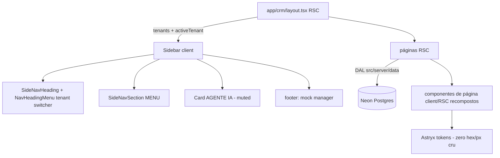

# Redesign CRM com Astryx — Design

**Spec**: `.specs/features/redesign-crm-astryx/spec.md`
**Status**: Approved

---

## Referência Visual (fonte de verdade — transcrição das 5 imagens de referência)

> As imagens de referência existem só na conversa de planejamento. Esta seção é a transcrição fiel e AUTORITATIVA para a execução. Fidelidade exigida é de **composição e hierarquia**, não de pixel: cores/spacing vêm SEMPRE dos tokens Astryx.

### R0 — Sidebar (comum a todas as páginas)

Coluna escura fixa (~240–260px), três regiões verticais:

1. **Header de marca**: NavIcon quadrado-arredondado com fundo accent (ícone de prédio) + nome do tenant em bold + subtítulo secundário "{city}, {state}". É também o gatilho do seletor de tenant (NavHeadingMenu).
2. **Corpo scrollável**: seção com heading uppercase pequeno "MENU" contendo os itens Pipeline, Dashboard, Documentos, Configurações (no Crivo: os 5 atuais — Dashboard, Pipeline, Chats, Documentos, Configurações); item ativo com fundo suave + chevron à direita. Abaixo, seção "AGENTE IA" com um card sutil (variante muted): dot verde + "{agentName} — Online" em linha 1, "Qualificando leads via WhatsApp" em texto secundário na linha 2.
3. **Footer fixo**: avatar circular accent + nome do usuário ("Gestor Demo") + email em texto secundário.

Sem TopNav em nenhuma página — a identidade mora toda na sidebar.

### R1 — Pipeline

- Header da página: h1 "Pipeline de Leads" + subtítulo "{N} leads ativos — gerados pelo agente {agentName} via WhatsApp". À direita, chip/badge "Agente online" com dot verde.
- 3 colunas de kanban, cada uma com header próprio: dot de status colorido (amarelo = Em Qualificação, verde = Qualificado e Agendado, vermelho = Escalado para Humano) + ícone pequeno temático + título + badge de contagem na mesma cor, alinhado à direita.
- Cards de lead (empilhados com gap, dentro de área de coluna com fundo levemente distinto):
  - Linha 1: nome em bold à esquerda + badge de modalidade à direita (Novo = azul, Usado = laranja/amarelo, Ambos = roxo).
  - Linha 2: ícone de telefone + número.
  - Linha 3: ícone de pin + bairro/região.
  - Linha 4: preço em bold à esquerda ("R$ 420.000") + tipo de imóvel em texto secundário à direita ("Apartamento 3 quartos" — no Crivo: `propertyType`).
  - Divider sutil.
  - Rodapé: ícone de calendário + data à esquerda; avatar circular pequeno com iniciais do corretor à direita.

### R2 — Dashboard

- Header: h1 "Dashboard" + subtítulo "Visão geral do desempenho do agente SDR e do pipeline de leads". (No Crivo, o filtro de período atual permanece nesta região.)
- Linha de 4 KPI cards: cada um com label pequeno no topo-esquerda, chip de ícone colorido (NavIcon) no topo-direita, valor grande (colorido semanticamente quando é taxa: verde positivo, vermelho alerta), sublabel em texto secundário ("4 leads", "últimos 7 dias"). (No Crivo são 5 KPIs — manter os 5 em Grid.)
- Linha assimétrica: card ~2/3 com heading "Leads por Status — Últimos 7 Dias" + descrição + gráfico de barras agrupadas com legenda embaixo; card ~1/3 com heading "Distribuição por Modalidade" + descrição + donut com legenda vertical ao lado (label, valor, %).
- Card full-width "Leads Recentes" + descrição "Últimos 5 leads gerados pelo agente": Table com colunas Lead (bold), Orçamento, Modalidade (badge), Status (badge colorido), Corretor (avatar iniciais + nome), Data.

### R3 — Documentos

- Header: h1 "Documentos de Contexto" + subtítulo "Arquivos usados pelo agente {agentName} para responder com precisão nas conversas". Botão primário "+ Novo documento" à direita. (No Crivo, "Gerenciar categorias" permanece ao lado.)
- Card único com tabela densa edge-to-edge: colunas Nome (ícone de arquivo + nome), Modalidade (badge outline colorido: Novos = azul, Usados = laranja, Ambas = roxo), Enviado em, Validade (data ou "Sem validade" em texto atenuado), Tamanho, Ação (ícone de lixeira). (No Crivo: manter coluna Categoria com badge colorido atual e o menu de ações atual em vez de só lixeira; busca e filtros atuais acima da tabela.)

### R4 — Configurações

- Header: h1 "Configurações" + subtítulo "Gerencie os dados da imobiliária e do agente SDR".
- Card seccionado "Dados da Imobiliária": header do card com ícone + título + descrição "Informações institucionais usadas pelo agente e exibidas no painel", divider, corpo com formulário em 2 colunas: Nome da Imobiliária / Modalidade Suportada; Cidade / Estado (UF); Número WhatsApp do Agente / Website. Labels com ícone pequeno onde couber.
- Card seccionado "Persona do Agente SDR": header com ícone + título + descrição "Define como o agente se apresenta e se comporta nas conversas do WhatsApp", divider, corpo: Nome do Agente (input + helper "Este nome aparece nas saudações e nas mensagens do agente.") e Mensagem de Apresentação (TextArea multi-linha).
- (No Crivo: card "Documentos" resumido atual permanece, recomposto com List/Item.)

### R5 — Chats (referência de anatomia de conversa)

Conversa escura estilo agente IA: divisor de data centralizado ("Today"); mensagem do usuário em bubble filled alinhada à direita com timestamp abaixo; resposta do agente em variante ghost (sem bubble) com avatar + conteúdo rico; grupos de mensagens consecutivas visualmente conectados. **Adaptação Crivo**: a thread é lead↔agente de WhatsApp — usar ChatMessageList + ChatMessageBubble (lead = filled, agente = ghost com avatar/nome) + ChatMessageMetadata (timestamps) + ChatSystemMessage divider para datas. NÃO inventar tool calls/markdown que não existem nos dados. Lista de conversas à esquerda no padrão "List — Message List" da Astryx: Avatar de iniciais, nome, preview, timestamp relativo, item selecionado destacado.

---

## Architecture Overview

**Abordagens consideradas (Large):**

1. **Recomposição in-place (RECOMENDADA / escolhida)** — manter rotas, DAL, server actions e contratos; reescrever apenas a camada de composição visual (shell + componentes de página), com extensões aditivas pontuais (colunas de tenant, 1 função de DAL nova, join de broker). Prós: risco mínimo, testes existentes seguem válidos, alinhada a AD-004/AD-007 e à paridade funcional do discuss. Contras: convive com decisões de estrutura de arquivo atuais.
2. Rebuild por template — scaffoldar `kanban-board`/`dashboard`/`settings` da Astryx em `scratch/` e portar página a página por cima. Prós: máxima fidelidade ao idioma da lib. Contras: alto risco de regressão funcional e de contrato; joga fora composições já verificadas (charts do L4).
3. Tema custom + recomposição — igual à 1, mais `defineTheme` para aproximar cores da referência. Contras: theming está explicitamente fora de escopo (spec) e adiciona uma dimensão de risco desnecessária.

Escolhida: **1**. Templates da Astryx são usados como REFERÊNCIA DE CÓDIGO (scaffold em `scratch/`, git-ignored), nunca sobrescrevendo o app — mesmo protocolo do Lote 4.



O fluxo de dados não muda: RSC-first (AD-007), tenant do cookie, componentes client só onde há interação (charts, forms, kanban interativo, chat).

---

## Code Reuse Analysis

### Existing Components to Leverage

| Component | Location | How to Use |
| --- | --- | --- |
| `Sidebar` | `src/components/shell/sidebar.tsx` | Reescrever composição interna; manter LinkProvider + NAV_ITEMS + lógica de `isSelected` |
| `TenantSwitcher` | `src/components/shell/tenant-switcher.tsx` | Reaproveitar a lógica (server action `setActiveTenant`); re-hospedar como NavHeadingMenu no header da sidebar |
| `PipelineBoard` / `LeadDetailPanel` | `src/components/pipeline/*` | Manter interação e painel; recompor colunas/cards |
| `KpiTiles`, `VolumeChart`, `DistributionChart`, `PeriodFilter` | `src/components/dashboard/*` | Manter charts Recharts+useTheme (AD-009) e o filtro; recompor tiles e envolver charts em Cards |
| `DocumentsTable` + dialogs + toolbar | `src/components/documents/*` | Manter dialogs/ações; recompor colunas da tabela e header |
| `ConversationList` / `MessageThread` | `src/components/chats/*` | Recompor com a família Chat da Astryx; manter navegação/seleção |
| `SettingsForm` | `src/components/settings/settings-form.tsx` | Estender com campos novos; recompor em cards seccionados |
| Formatadores | `src/lib/format.ts` | `formatCurrencyBRL`, `formatFileSize`, deltas — reusar em cards/tabelas |
| Ícones Lucide-Animated | `src/components/icons/*` | Únicos ícones permitidos (AD-008); instalar os novos necessários (ex.: building, phone, map-pin, calendar, user, bot) via shadcn CLI |
| DAL | `src/server/data/index.ts` | `getLeads`, `getBrokers`, `getConversationSummaries`, `getMessages`, `getDocuments`, `getDashboard*`, `updateTenantSettings` — base de tudo |

### Integration Points

| System | Integration Method |
| --- | --- |
| Postgres (Neon) | Migração aditiva via `drizzle-kit push` (padrão real dos lotes 3–4; sem pasta de migrations) |
| Seed | `src/db/seed.ts` (ou equivalente atual) ganha os campos novos com invariantes testadas |
| Cookie `crivo_tenant` | Inalterado (AD-007); switcher só muda de lugar |

---

## Components

### Sidebar (recomposta) — RD-01

- **Purpose**: Shell de navegação com identidade completa do tenant.
- **Location**: `src/components/shell/sidebar.tsx` (+ `app/(crm)/layout.tsx` sem TopNav)
- **Interfaces**: recebe do layout RSC `{ tenants, activeTenant, manager }` (serializáveis); `SideNav` com `header={<SideNavHeading heading={tenant.name} subheading={cidadeUf} menu={<NavHeadingMenu …tenants/>} icon={<NavIcon…/>}/>}`, corpo com `SideNavSection title="Menu"` + card do agente (Card muted com StatusDot), `footer` com bloco de usuário (Item/HStack + Avatar).
- **Dependencies**: SideNav*, NavIcon, NavHeadingMenu, Card, StatusDot, Avatar, Text; `setActiveTenant`.
- **Reuses**: NAV_ITEMS, LinkProvider, lógica do TenantSwitcher. Consultar `npx astryx component SideNavHeading` e o block `SideNavWithHeaderMenu` antes de codar.

### mockManager — RD-01/RD-02

- **Purpose**: Usuário mock determinístico por tenant (sem schema).
- **Location**: `src/lib/mock-manager.ts`
- **Interfaces**: `getMockManager(tenant: Pick<Tenant,"id"|"name">): { name: string; email: string }` — puro, determinístico (mesmo tenant → mesmo resultado), email derivado de slug do nome.
- **Reuses**: nada; testado 1:1 com ACs.

### Extensões da DAL — RD-02/RD-03/RD-04/RD-07

- **Purpose**: Dados novos exigidos pela referência.
- **Location**: `src/server/data/index.ts`
- **Interfaces**:
  - `getRecentLeads(limit = 5): Promise<RecentLead[]>` — leads do tenant por `firstContactAt` desc com `brokerName` (left join), campos para a tabela do dashboard.
  - `getLeads` estendido (ou variante) para incluir `brokerName` nos cards do pipeline (left join em `brokers`).
  - `updateTenantSettings` estendido com `city`, `state`, `agentWhatsapp`, `website`, `agentPresentationMessage` (opcionais → null).
- **Dependencies**: schema estendido (colunas nullable em `tenants`).
- **Reuses**: padrão de filtro por tenant + testes de integração 1:1 dos lotes anteriores.

### Páginas recompostas — RD-03..RD-07

- **Purpose**: Aplicar a Referência Visual R1–R5 sobre os componentes existentes.
- **Location**: `src/components/{pipeline,dashboard,documents,chats,settings}/*` + `app/(crm)/*/page.tsx` (headers de página com título+subtítulo padronizados — usar Layout/Section/Stack, nunca div).
- **Dependencies**: por página, conforme Referência Visual. Antes de cada página, rodar `npx astryx component <X>` dos componentes usados e `npx astryx template <t> --skeleton` do template análogo (`kanban-board`, `dashboard`, `table-page`, `settings`, `ai-chat`).
- **Reuses**: tudo da tabela de reuse acima.

---

## Data Models

### tenants (colunas aditivas, todas nullable)

```typescript
city: text("city"),
state: text("state"),                       // UF, 2 chars por convenção do seed (sem constraint)
agentWhatsapp: text("agent_whatsapp"),
website: text("website"),
agentPresentationMessage: text("agent_presentation_message"),
```

**Relationships**: nenhuma nova. Aplicação via `drizzle-kit push` (SPEC_DEVIATION pré-autorizada: repo sem pasta de migrations, mesmo padrão L3/L4). Seed preenche os 2 tenants com valores distintos e realistas (Uberaba/MG etc.).

### RecentLead (tipo de leitura, DAL)

```typescript
interface RecentLead {
  id: string;
  name: string;
  budgetCents: bigint | null;
  modality: Modality | null;
  status: LeadStatus;
  brokerName: string | null;
  firstContactAt: Date;
}
```

---

## Error Handling Strategy

| Error Scenario | Handling | User Impact |
| --- | --- | --- |
| Campos opcionais de tenant null | Render condicional (omitir linha/subtítulo) | Layout degrada graciosamente |
| Lead sem broker/budget/região | Linha omitida no card; "—" em tabelas | Sem células vazias quebradas |
| Save de settings falha | Mesmo caminho de erro atual do form (FieldStatus/Toast existente) | Paridade |
| Tenant sem leads/conversas/documentos | EmptyState (padrão já usado) | Paridade |

---

## Risks & Concerns

| Concern | Location | Impact | Mitigation |
| --- | --- | --- | --- |
| `NavHeadingMenu` — API exata não verificada no planejamento (existe como block `NavHeadingMenuShowcase` e prop `menu` de `SideNavHeading`) | `src/components/shell/sidebar.tsx` | Switcher pode exigir adaptação | Task do shell começa com `npx astryx component SideNavHeading` + `npx astryx template NavHeadingMenuShowcase`; fallback aprovado: DropdownMenu envolvendo o heading |
| Sidebar hoje é client (`usePathname`); dados de tenant vêm do RSC | `app/(crm)/layout.tsx` | Serialização RSC→client | Layout passa props serializáveis (datas/bigint não cruzam); manter padrão do L4 |
| `getLeads` é consumido pelo pipeline atual e tem testes | `src/server/data/index.ts` | Mudar retorno pode quebrar testes | Estender de forma aditiva (novo campo) e ATUALIZAR asserções por outras iguais/mais fortes — nunca deletar |
| Página de chats usa família Chat pela primeira vez em profundidade (density, grouping, divider) | `src/components/chats/*` | Curva de API | `npx astryx template ai-chat --skeleton` + blocks `ChatMessageList*` antes de codar |
| Ícones novos precisam existir no registry Lucide-Animated | `src/components/icons/` | Ícone pode não existir no registry | Se um nome faltar, escolher o equivalente mais próximo do registry — nunca SVG ad-hoc (AD-008) |
| Volume de arquivos tocados (~15) num lote visual | todo o app | Regressão silenciosa | Paridade coberta pelos 200 testes + smoke 5 rotas × 2 tenants + self-check Astryx por task |

---

## Tech Decisions (only non-obvious ones)

| Decision | Choice | Rationale |
| --- | --- | --- |
| Shell | SideNav-only (sem TopNav), identidade no header da sidebar | Referência R0 + best practice da própria Astryx ("Don't include a SideNavHeading when a TopNav is already providing app identity") |
| Usuário mock | Helper puro `getMockManager`, sem tabela | Discuss #2; zero schema para dado descartável pós-auth |
| Status do agente | Literal "Online" fixo no shell | Discuss #3; agente real é Fase 9 |
| Lista "Leads Recentes" | Independente do filtro de período | Assumption da spec; referência diz "últimos 5 gerados" |
| Migração | `drizzle-kit push` | Padrão real do repo (L3/L4), documentado como desvio aceito |
| Chat | Composição R5 sem tool calls | Dados reais não têm tool calls; fidelidade de anatomia, não de conteúdo |

> **Project-level**: AD-010 (manter Astryx; redesign por composição; shell SideNav-only como padrão do produto) registrado no STATE.md.
